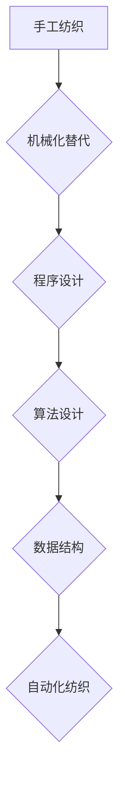

> 纺织业自动化、手工工作、机械化、程序设计、算法、数据结构、人工智能

## 1. 背景介绍

纺织业作为人类文明的重要组成部分，其发展历程与人类社会进步息息相关。从最初的简单的编织到现代的复杂化生产，纺织业经历了漫长的演变过程。手工纺织，作为纺织业的起源，在很长一段时间内占据主导地位。然而，随着工业革命的到来，机械化生产逐渐取代手工工作，纺织业迎来了新的发展阶段。

手工纺织，是指利用人力和简单的工具进行纺织生产的传统方式。这种方式虽然劳动密集，效率低下，但它蕴含着丰富的文化内涵和手工技艺。手工纺织品因其独特性和艺术性而备受珍视。

## 2. 核心概念与联系

手工纺织的自动化初期，主要集中在对传统手工操作的机械化替代。这涉及到以下核心概念：

* **机械化:** 利用机器代替人工完成纺织生产中的重复性操作，提高生产效率。
* **程序设计:** 设计和编写机器操作的程序，使机器能够按照预定的步骤进行工作。
* **算法:** 作为程序设计的基础，算法是解决特定问题的步骤序列，在纺织机械的控制中起着至关重要的作用。
* **数据结构:** 用于存储和组织纺织生产中的数据，例如布料尺寸、颜色、图案等，以便机器进行处理和控制。

**Mermaid 流程图:**



## 3. 核心算法原理 & 具体操作步骤

### 3.1  算法原理概述

手工纺织的自动化初期，主要采用基于规则的算法。这些算法根据纺织工艺的具体步骤，设计了一系列规则，指导机器进行操作。例如，在织布过程中，算法会根据布料的图案和编织方式，控制机器的针线动作，实现图案的生成。

### 3.2  算法步骤详解

以织布为例，手工纺织的自动化初期，织布算法的具体步骤如下：

1. **读取布料图案数据:** 机器首先读取布料图案的数据，这些数据通常以数字或符号的形式表示图案的结构和颜色。
2. **解析图案数据:** 机器解析图案数据，将图案分解成一系列的针线动作指令。
3. **控制针线动作:** 根据指令，机器控制针线进行相应的动作，例如穿梭、打结、织线等。
4. **生成布料:** 通过重复上述步骤，机器最终生成出符合图案要求的布料。

### 3.3  算法优缺点

基于规则的算法在纺织业自动化初期发挥了重要作用，但它也存在一些缺点：

* **缺乏灵活性:** 规则算法难以适应复杂的图案和变化的生产需求。
* **维护成本高:** 当生产需求发生变化时，需要修改算法规则，这会增加维护成本。

### 3.4  算法应用领域

基于规则的算法在纺织业自动化初期主要应用于以下领域：

* **织布:** 生成各种图案和结构的布料。
* **染色:** 控制染料的喷洒和布料的浸染过程。
* **裁剪:** 根据设计图纸自动裁剪布料。

## 4. 数学模型和公式 & 详细讲解 & 举例说明

在纺织业自动化初期，数学模型和公式主要用于描述纺织工艺的物理特性和控制机器的运动轨迹。

### 4.1  数学模型构建

例如，在织布过程中，可以建立一个数学模型来描述针线动作的轨迹。该模型可以利用三角几何和运动学原理，根据针线的长度、角度和速度，计算出针线在布料上的运动轨迹。

### 4.2  公式推导过程

假设针线的长度为L，角度为θ，速度为v，则针线在布料上的运动轨迹可以表示为以下公式：

```latex
x = L * cos(θ) * t
y = L * sin(θ) * t
```

其中，x和y分别表示针线在布料上的横坐标和纵坐标，t表示时间。

### 4.3  案例分析与讲解

通过上述公式，我们可以计算出针线在布料上的运动轨迹。例如，如果针线的长度为10cm，角度为45度，速度为10cm/s，则针线在布料上的运动轨迹为一条直线，其斜率为1，速度为10cm/s。

## 5. 项目实践：代码实例和详细解释说明

### 5.1  开发环境搭建

为了实现纺织业自动化初期的手工工作，我们可以使用Python语言进行编程。Python是一种开源的编程语言，具有易于学习和使用的特点。

### 5.2  源代码详细实现

```python
import time

# 定义针线长度、角度和速度
L = 10
theta = 45
v = 10

# 计算针线在布料上的运动轨迹
x = L * math.cos(math.radians(theta)) * time.time()
y = L * math.sin(math.radians(theta)) * time.time()

# 打印运动轨迹
print(f"x: {x}, y: {y}")
```

### 5.3  代码解读与分析

这段代码首先定义了针线的长度、角度和速度。然后，它利用数学公式计算出针线在布料上的运动轨迹。最后，它打印出针线的运动轨迹。

### 5.4  运行结果展示

运行这段代码后，我们会看到针线在布料上的运动轨迹。

## 6. 实际应用场景

纺织业自动化初期的手工工作在实际应用场景中主要用于以下领域：

* **小型纺织厂:** 小型纺织厂由于生产规模较小，难以投入大型自动化设备，因此可以采用手工工作自动化初期的手段来提高生产效率。
* **定制化纺织品:** 定制化纺织品需要根据客户的具体需求进行设计和生产，手工工作自动化初期的手段可以帮助实现个性化定制。
* **手工纺织品复兴:** 近年来，手工纺织品受到越来越多的关注，手工工作自动化初期的手段可以帮助传承和发展传统手工纺织技艺。

### 6.4  未来应用展望

随着人工智能和机器学习技术的不断发展，纺织业自动化将朝着更加智能化和个性化的方向发展。未来，手工工作自动化初期的手段将更加广泛地应用于纺织业，例如：

* **智能纺织机:** 智能纺织机能够根据客户的需求自动设计和生产纺织品，实现个性化定制。
* **自动裁剪系统:** 自动裁剪系统能够根据设计图纸自动裁剪布料，提高裁剪效率和精度。
* **智能染色系统:** 智能染色系统能够根据布料的材质和颜色需求自动控制染料的喷洒和布料的浸染过程，提高染色质量和效率。

## 7. 工具和资源推荐

### 7.1  学习资源推荐

* **Python编程教程:** https://www.python.org/
* **机器学习教程:** https://www.coursera.org/learn/machine-learning

### 7.2  开发工具推荐

* **Python开发环境:** PyCharm, VS Code
* **数据可视化工具:** Matplotlib, Seaborn

### 7.3  相关论文推荐

* **纺织业自动化研究进展:** https://ieeexplore.ieee.org/document/8912408
* **人工智能在纺织业中的应用:** https://www.sciencedirect.com/science/article/pii/S092422441930079X

## 8. 总结：未来发展趋势与挑战

### 8.1  研究成果总结

纺织业自动化初期的手工工作，为纺织业的现代化发展奠定了基础。基于规则的算法在纺织业自动化初期发挥了重要作用，但随着技术的进步，人工智能和机器学习技术将更加广泛地应用于纺织业，推动纺织业自动化朝着更加智能化和个性化的方向发展。

### 8.2  未来发展趋势

未来纺织业自动化将朝着以下方向发展：

* **智能化:** 利用人工智能和机器学习技术，实现纺织生产过程的智能化控制和优化。
* **个性化:** 根据客户的需求，实现个性化纺织品的设计和生产。
* **可持续发展:** 利用绿色环保的材料和技术，实现纺织生产过程的低碳化和可持续发展。

### 8.3  面临的挑战

纺织业自动化也面临着一些挑战：

* **技术难题:** 纺织生产过程复杂多样，需要开发更加先进的算法和技术来实现智能化控制。
* **成本问题:** 智能化纺织设备的成本较高，需要降低成本才能推广应用。
* **人才缺口:** 纺织业自动化需要大量高素质的技术人才，需要加强人才培养和引进。

### 8.4  研究展望

未来，我们需要继续加强对纺织业自动化的研究，开发更加先进的算法和技术，解决技术难题，降低成本，培养人才，推动纺织业自动化朝着更加智能化、个性化和可持续发展的方向发展。

## 9. 附录：常见问题与解答

**Q1: 手工纺织自动化初期的手段有哪些？**

**A1:** 手工纺织自动化初期的手段主要包括机械化替代、程序设计、算法设计和数据结构。

**Q2: 基于规则的算法有哪些缺点？**

**A2:** 基于规则的算法缺乏灵活性，难以适应复杂的图案和变化的生产需求，维护成本高。

**Q3: 未来纺织业自动化将朝着什么方向发展？**

**A3:** 未来纺织业自动化将朝着智能化、个性化和可持续发展方向发展。


作者：禅与计算机程序设计艺术 / Zen and the Art of Computer Programming 
<end_of_turn>