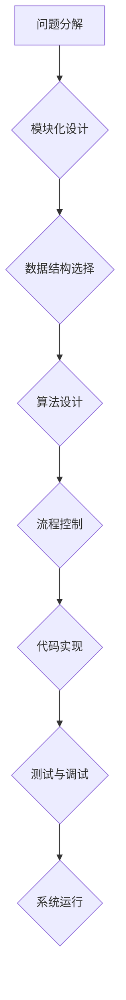

> 结构化思维，算法设计，数据结构，编程逻辑，代码优化，软件架构，复杂系统

## 1. 背景介绍

在当今科技日新月异的时代，面对日益复杂的软件系统和庞大的数据量，结构化思维已成为程序员、软件架构师和技术领导者必备的技能。它不仅能帮助我们更高效地解决问题，还能提升代码的可读性、可维护性和可扩展性。

传统的编程思维往往是碎片化的，缺乏整体规划，容易陷入“代码泥潭”。而结构化思维则强调将问题分解成更小的、可管理的子问题，并采用清晰的逻辑结构进行解决。它就像一把利器，帮助我们从混沌的代码世界中抽丝剥茧，构建出清晰、简洁、高效的软件系统。

## 2. 核心概念与联系

结构化思维的核心概念包括：

* **模块化设计:** 将复杂系统分解成相互独立、可重用的模块，提高代码的可维护性和可扩展性。
* **数据结构:** 选择合适的存储和组织数据的方式，提高算法效率和代码可读性。
* **算法设计:** 设计高效、可理解的算法解决特定问题，是结构化思维的基石。
* **流程控制:** 使用条件语句、循环语句等控制程序执行流程，实现逻辑控制。

**Mermaid 流程图:**



## 3. 核心算法原理 & 具体操作步骤

### 3.1  算法原理概述

算法是一种解决特定问题的步骤序列，是结构化思维的核心。一个好的算法应该具有以下特点：

* **确定性:** 对于给定的输入，算法应该始终产生相同的输出。
* **有限性:** 算法的执行步骤必须有限，不能无限循环。
* **有效性:** 算法的每一步操作都必须能够在有限的时间内完成。

### 3.2  算法步骤详解

以排序算法为例，常见的排序算法包括冒泡排序、插入排序、快速排序等。

**冒泡排序:**

1. 比较相邻的两个元素，如果顺序错误，则交换它们的位置。
2. 重复步骤1，直到整个数组有序。

**插入排序:**

1. 将第一个元素作为有序序列的第一个元素。
2. 从第二个元素开始，将每个元素插入到有序序列的正确位置。
3. 重复步骤2，直到所有元素都被插入到有序序列中。

### 3.3  算法优缺点

不同的算法具有不同的优缺点，选择合适的算法取决于具体问题和数据特点。

**冒泡排序:**

* 优点: 简单易懂，实现代码简洁。
* 缺点: 效率较低，时间复杂度为O(n^2)。

**插入排序:**

* 优点: 效率较高，适用于小规模数据排序。
* 缺点: 对于大规模数据排序，效率较低。

### 3.4  算法应用领域

算法广泛应用于各个领域，例如：

* **计算机科学:** 数据结构、排序、搜索、图论等。
* **人工智能:** 机器学习、深度学习、自然语言处理等。
* **生物信息学:** 基因序列分析、蛋白质结构预测等。
* **金融领域:** 风险管理、投资策略等。

## 4. 数学模型和公式 & 详细讲解 & 举例说明

### 4.1  数学模型构建

数学模型可以用来描述算法的运行过程和性能。例如，我们可以用时间复杂度来衡量算法的效率。

时间复杂度是指算法运行时间随输入数据规模变化的趋势。常用的时间复杂度表示法包括O(n)、O(n^2)、O(log n)等。

### 4.2  公式推导过程

时间复杂度通常通过分析算法的执行步骤数量来计算。例如，冒泡排序的执行步骤数量与输入数据规模的平方成正比，因此其时间复杂度为O(n^2)。

### 4.3  案例分析与讲解

假设我们有一个包含n个元素的数组，我们需要对其进行排序。

* **冒泡排序:** 算法需要进行n-1轮比较，每轮比较需要进行n-i次交换，其中i为当前轮数。因此，冒泡排序的总执行步骤数量为：

```
(n-1) + (n-2) + ... + 2 + 1 = n(n-1)/2
```

* **快速排序:** 算法的时间复杂度为平均情况下O(n log n)，最坏情况下O(n^2)。

## 5. 项目实践：代码实例和详细解释说明

### 5.1  开发环境搭建

本项目使用Python语言进行开发，需要安装Python环境和相关库。

### 5.2  源代码详细实现

```python
# 冒泡排序算法实现
def bubble_sort(arr):
    n = len(arr)
    for i in range(n):
        for j in range(0, n-i-1):
            if arr[j] > arr[j+1]:
                arr[j], arr[j+1] = arr[j+1], arr[j]
    return arr

# 测试代码
arr = [64, 34, 25, 12, 22, 11, 90]
sorted_arr = bubble_sort(arr)
print("排序后的数组:", sorted_arr)
```

### 5.3  代码解读与分析

* `bubble_sort(arr)`函数接收一个数组`arr`作为输入，并对其进行冒泡排序。
* 外层循环`for i in range(n)`控制排序轮数，每次循环将最大的元素“冒泡”到数组末尾。
* 内层循环`for j in range(0, n-i-1)`比较相邻元素，如果顺序错误，则交换它们的位置。
* `arr[j], arr[j+1] = arr[j+1], arr[j]`使用Python的元组解包语法实现元素交换。

### 5.4  运行结果展示

```
排序后的数组: [11, 12, 22, 25, 34, 64, 90]
```

## 6. 实际应用场景

结构化思维在软件开发各个阶段都有广泛的应用场景：

* **需求分析:** 将用户需求分解成具体的子功能，并设计清晰的流程图。
* **系统设计:** 将系统分解成模块，并定义模块之间的接口和数据流。
* **代码编写:** 使用模块化设计、数据结构和算法设计原则编写清晰、可维护的代码。
* **测试和调试:** 使用单元测试和集成测试等方法验证代码的正确性和可靠性。

### 6.4  未来应用展望

随着软件系统越来越复杂，结构化思维将变得更加重要。未来，随着人工智能、云计算等技术的不断发展，结构化思维将应用于更广泛的领域，例如：

* **自动代码生成:** 基于结构化思维，可以自动生成代码模板和代码片段，提高开发效率。
* **智能软件架构设计:** 基于结构化思维和机器学习算法，可以自动设计更优的软件架构。
* **复杂系统管理:** 结构化思维可以帮助我们更好地理解和管理复杂系统，例如城市交通系统、电力系统等。

## 7. 工具和资源推荐

### 7.1  学习资源推荐

* **书籍:**
    * 《程序员的思维方式》
    * 《代码的艺术》
    * 《设计模式》
* **在线课程:**
    * Coursera: 数据结构与算法
    * edX: 算法设计与分析
* **博客和网站:**
    * GeeksforGeeks
    * Stack Overflow

### 7.2  开发工具推荐

* **IDE:**
    * Visual Studio Code
    * IntelliJ IDEA
* **版本控制系统:**
    * Git
* **测试工具:**
    * pytest
    * unittest

### 7.3  相关论文推荐

* **算法设计与分析:**
    * Introduction to Algorithms by Cormen, Leiserson, Rivest, and Stein
* **软件架构设计:**
    * Design Patterns: Elements of Reusable Object-Oriented Software by Gamma, Helm, Johnson, and Vlissides

## 8. 总结：未来发展趋势与挑战

### 8.1  研究成果总结

结构化思维已成为软件开发领域的重要理论和实践，它帮助我们构建更清晰、高效、可维护的软件系统。

### 8.2  未来发展趋势

未来，结构化思维将与人工智能、云计算等新技术融合，推动软件开发模式的创新。

### 8.3  面临的挑战

* **复杂系统管理:** 随着软件系统越来越复杂，如何有效地应用结构化思维进行复杂系统管理仍然是一个挑战。
* **跨学科合作:** 结构化思维的应用需要跨学科的合作，例如软件开发人员、数据科学家、系统架构师等。
* **人才培养:** 需要培养更多具备结构化思维能力的软件开发人才。

### 8.4  研究展望

未来，我们将继续研究结构化思维在软件开发领域的应用，探索其在复杂系统管理、人工智能、云计算等领域的潜力。

## 9. 附录：常见问题与解答

* **什么是结构化思维？**

结构化思维是一种将问题分解成更小的、可管理的子问题，并采用清晰的逻辑结构进行解决的思维方式。

* **结构化思维有哪些优点？**

结构化思维可以提高代码的可读性、可维护性和可扩展性，并帮助我们更高效地解决问题。

* **如何培养结构化思维能力？**

可以通过学习算法设计、数据结构、软件架构等知识，并通过实践项目来锻炼结构化思维能力。


作者：禅与计算机程序设计艺术 / Zen and the Art of Computer Programming 
<end_of_turn>