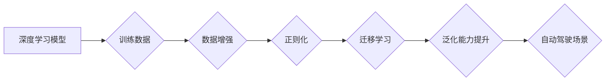

> 自动驾驶, 深度学习, 泛化能力, 模型改进, 数据增强, 正则化, transfer learning

## 1. 背景介绍

自动驾驶技术作为人工智能领域的重要应用之一，近年来取得了显著进展。深度学习模型在自动驾驶中的应用，例如图像识别、路径规划和决策控制，推动了自动驾驶技术的快速发展。然而，深度学习模型的泛化能力仍然是一个关键挑战。

深度学习模型在训练数据上表现出色，但在未见过的数据上表现往往不佳。这主要是因为深度学习模型容易过拟合训练数据，导致模型对训练数据过于敏感，无法很好地推广到新的数据场景。

自动驾驶场景下，数据的多样性和复杂性进一步加剧了泛化能力的挑战。道路环境、天气条件、交通规则等因素都会对自动驾驶模型的性能产生影响。因此，提高深度学习模型的泛化能力对于自动驾驶技术的可靠性和安全性至关重要。

## 2. 核心概念与联系

**2.1 深度学习模型泛化能力**

泛化能力是指模型在未见过的数据上也能保持良好性能的能力。一个好的模型应该能够从有限的训练数据中学习到普遍的规律，并能够应用于新的、未见过的数据。

**2.2 自动驾驶场景下的泛化能力挑战**

自动驾驶场景下，数据的多样性和复杂性导致泛化能力面临以下挑战：

* **数据不均衡:** 训练数据中某些场景或情况可能过于稀少，导致模型对这些场景的泛化能力不足。
* **环境变化:** 道路环境、天气条件、交通规则等因素会不断变化，模型需要能够适应这些变化。
* **安全要求:** 自动驾驶系统需要在各种情况下都能保证安全，因此泛化能力要求更高。

**2.3 提升泛化能力的策略**

提升深度学习模型的泛化能力，主要可以通过以下策略：

* **数据增强:** 通过对训练数据进行各种变换，例如旋转、缩放、裁剪等，增加数据的多样性，提高模型对不同场景的适应能力。
* **正则化:** 通过添加惩罚项到损失函数中，抑制模型的复杂度，防止模型过拟合训练数据。
* **迁移学习:** 利用预训练模型的知识，迁移到新的任务中，减少训练数据需求，提高模型的泛化能力。

**2.4 核心概念架构图**



## 3. 核心算法原理 & 具体操作步骤

### 3.1 算法原理概述

**3.1.1 数据增强**

数据增强是一种常用的技术，通过对训练数据进行各种变换，增加数据的多样性，提高模型对不同场景的适应能力。常见的图像数据增强方法包括：

* **旋转:** 将图像绕中心旋转一定角度。
* **缩放:** 将图像放大或缩小。
* **裁剪:** 从图像中裁剪出部分区域。
* **翻转:** 将图像水平或垂直翻转。
* **噪声添加:** 向图像中添加随机噪声。

**3.1.2 正则化**

正则化是一种防止模型过拟合的技巧，通过添加惩罚项到损失函数中，抑制模型的复杂度。常见的正则化方法包括：

* **L1正则化:** 对模型参数的绝对值求和，惩罚模型参数的非零值。
* **L2正则化:** 对模型参数的平方求和，惩罚模型参数的较大值。
* **Dropout:** 在训练过程中随机忽略一部分神经元，防止模型过于依赖某些神经元。

**3.1.3 迁移学习**

迁移学习是指利用预训练模型的知识，迁移到新的任务中。预训练模型通常是在大型数据集上训练的，已经学习到了一些通用的特征和知识。迁移学习可以减少训练数据需求，提高模型的泛化能力。

### 3.2 算法步骤详解

**3.2.1 数据增强步骤**

1. 准备训练数据。
2. 选择合适的图像数据增强方法。
3. 对训练数据进行增强，生成新的训练样本。
4. 将增强后的数据与原始数据一起用于模型训练。

**3.2.2 正则化步骤**

1. 选择合适的正则化方法。
2. 在损失函数中添加正则化项。
3. 调整正则化参数，以达到最佳的泛化性能。

**3.2.3 迁移学习步骤**

1. 选择合适的预训练模型。
2. 将预训练模型的特征提取层冻结，只训练分类层。
3. 使用新的任务数据进行微调训练。

### 3.3 算法优缺点

**3.3.1 数据增强**

* **优点:** 提高模型对不同场景的适应能力，减少训练数据需求。
* **缺点:** 可能导致数据分布不均匀，影响模型性能。

**3.3.2 正则化**

* **优点:** 防止模型过拟合，提高模型的泛化能力。
* **缺点:** 可能导致模型欠拟合，降低模型性能。

**3.3.3 迁移学习**

* **优点:** 利用预训练模型的知识，减少训练数据需求，提高模型的泛化能力。
* **缺点:** 需要选择合适的预训练模型，预训练模型的知识可能与新任务不匹配。

### 3.4 算法应用领域

* **自动驾驶:** 提升自动驾驶模型的泛化能力，使其能够在各种道路环境和天气条件下安全可靠地行驶。
* **图像识别:** 提高图像识别模型的泛化能力，使其能够识别各种类型的物体和场景。
* **自然语言处理:** 提高自然语言处理模型的泛化能力，使其能够理解和生成更加自然流畅的语言。

## 4. 数学模型和公式 & 详细讲解 & 举例说明

### 4.1 数学模型构建

**4.1.1 数据增强模型**

数据增强模型通常是一个简单的变换函数，例如旋转、缩放、裁剪等。这些变换函数可以表示为数学公式，例如：

* **旋转:**  
  $$
  x' = x \cos(\theta) - y \sin(\theta)
  $$
  $$
  y' = x \sin(\theta) + y \cos(\theta)
  $$
  其中，(x, y) 是原始图像中的坐标，(x', y') 是旋转后的坐标，θ 是旋转角度。

* **缩放:**
  $$
  x' = sx
  $$
  $$
  y' = sy
  $$
  其中，(x, y) 是原始图像中的坐标，(x', y') 是缩放后的坐标，s 是缩放因子。

**4.1.2 正则化模型**

正则化模型通常通过添加惩罚项到损失函数中，抑制模型的复杂度。常见的正则化方法的数学公式如下：

* **L1正则化:**
  $$
  Loss = Loss_original + \lambda ||w||_1
  $$
  其中，Loss_original 是原始损失函数，λ 是正则化参数，||w||_1 是模型参数w的绝对值之和。

* **L2正则化:**
  $$
  Loss = Loss_original + \lambda ||w||_2^2
  $$
  其中，Loss_original 是原始损失函数，λ 是正则化参数，||w||_2^2 是模型参数w的平方之和。

**4.1.3 迁移学习模型**

迁移学习模型通常是一个多层神经网络，其中包含特征提取层和分类层。特征提取层通常是预训练模型的特征提取层，分类层是针对新任务训练的。

### 4.2 公式推导过程

**4.2.1 数据增强模型**

数据增强模型的公式推导过程很简单，主要就是根据变换函数的数学定义进行推导。例如，旋转变换的公式推导过程如下：

1. 假设原始图像中的坐标为(x, y)。
2. 旋转角度为θ。
3. 旋转后的坐标为(x', y')。
4. 根据旋转变换的数学定义，可以得到旋转后的坐标的公式：
  $$
  x' = x \cos(\theta) - y \sin(\theta)
  $$
  $$
  y' = x \sin(\theta) + y \cos(\theta)
  $$

**4.2.2 正则化模型**

正则化模型的公式推导过程主要就是根据正则化方法的定义，将惩罚项添加到损失函数中。例如，L1正则化的公式推导过程如下：

1. 假设原始损失函数为Loss_original。
2. 正则化参数为λ。
3. 模型参数为w。
4. L1正则化惩罚项为||w||_1。
5. 因此，L1正则化后的损失函数为：
  $$
  Loss = Loss_original + \lambda ||w||_1
  $$

**4.2.3 迁移学习模型**

迁移学习模型的公式推导过程比较复杂，需要考虑预训练模型的特征提取层和新任务的分类层之间的关系。

### 4.3 案例分析与讲解

**4.3.1 数据增强案例**

在自动驾驶场景下，可以使用数据增强技术来增加训练数据的多样性。例如，可以对训练图像进行旋转、缩放、裁剪等变换，生成新的训练样本。

**4.3.2 正则化案例**

在训练自动驾驶模型时，可以使用L2正则化来防止模型过拟合。通过添加L2正则化项到损失函数中，可以抑制模型参数的较大值，从而提高模型的泛化能力。

**4.3.3 迁移学习案例**

可以使用预训练的图像识别模型，迁移到自动驾驶场景中，用于识别道路上的物体。例如，可以使用ImageNet预训练模型，迁移到自动驾驶场景中，用于识别车辆、行人、交通信号灯等物体。

## 5. 项目实践：代码实例和详细解释说明

### 5.1 开发环境搭建

* **操作系统:** Ubuntu 18.04
* **深度学习框架:** TensorFlow 2.0
* **编程语言:** Python 3.6

### 5.2 源代码详细实现

```python
import tensorflow as tf

# 定义数据增强函数
def data_augmentation(image, label):
  # 随机旋转图像
  image = tf.image.random_flip_left_right(image)
  # 随机裁剪图像
  image = tf.image.random_crop(image, size=[224, 224, 3])
  return image, label

# 定义模型
model = tf.keras.models.Sequential([
  tf.keras.layers.Conv2D(32, (3, 3), activation='relu', input_shape=(224, 224, 3)),
  tf.keras.layers.MaxPooling2D((2, 2)),
  tf.keras.layers.Conv2D(64, (3, 3), activation='relu'),
  tf.keras.layers.MaxPooling2D((2, 2)),
  tf.keras.layers.Flatten(),
  tf.keras.layers.Dense(10, activation='softmax')
])

# 定义损失函数和优化器
loss_fn = tf.keras.losses.CategoricalCrossentropy()
optimizer = tf.keras.optimizers.Adam()

# 训练模型
model.compile(loss=loss_fn, optimizer=optimizer)
model.fit(train_data, train_labels, epochs=10)

# 评估模型
loss, accuracy = model.evaluate(test_data, test_labels)
print('Loss:', loss)
print('Accuracy:', accuracy)
```

### 5.3 代码解读与分析

* **数据增强:** 代码中定义了`data_augmentation`函数，用于对训练图像进行随机旋转和裁剪，