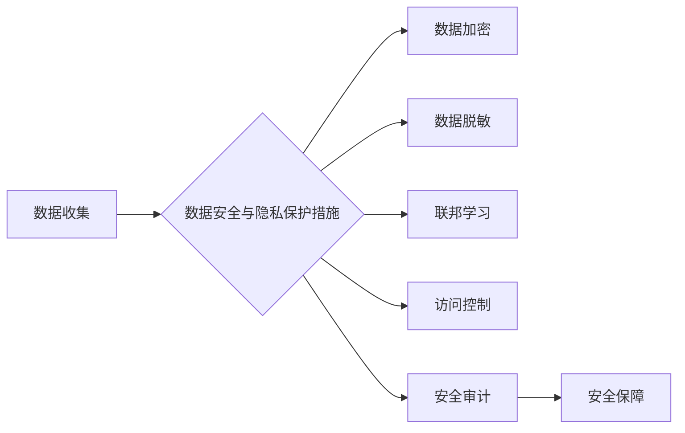

> 自动驾驶, 数据安全, 隐私保护, 联邦学习, 加密技术, 数据脱敏, 监管合规

## 1. 背景介绍

自动驾驶技术作为第四次工业革命的重要组成部分，正在迅速发展，并逐渐渗透到我们的日常生活。自动驾驶汽车依靠海量数据进行训练和运行，这些数据包含了驾驶员的行为模式、路况信息、车辆状态等敏感信息。然而，数据的安全性和隐私保护也成为了自动驾驶行业面临的重大挑战。

自动驾驶公司需要处理大量用户数据，包括驾驶记录、位置信息、车辆传感器数据等。这些数据一旦泄露，可能会导致用户隐私泄露、身份盗窃、安全事故等严重后果。因此，自动驾驶公司必须采取有效的措施来保护用户数据安全和隐私。

## 2. 核心概念与联系

**2.1 数据安全与隐私保护**

* **数据安全**是指保护数据免受未经授权的访问、使用、披露、修改或销毁。
* **隐私保护**是指保护个人信息不被非法收集、使用、披露或利用，保障个人信息安全和合法权益。

**2.2 自动驾驶数据安全与隐私保护的联系**

自动驾驶技术依赖于海量数据进行训练和运行，而这些数据往往包含了用户的敏感信息。因此，数据安全和隐私保护对于自动驾驶技术的发展至关重要。

**2.3 数据安全与隐私保护的挑战**

* **数据量大、种类多:** 自动驾驶汽车收集的数据量巨大，种类繁多，包括图像、视频、传感器数据等，数据处理和安全保护难度较大。
* **数据敏感性高:** 自动驾驶数据包含了用户的敏感信息，如驾驶习惯、位置信息、车辆状态等，一旦泄露，可能会导致用户隐私泄露、身份盗窃等严重后果。
* **数据分散存储:** 自动驾驶数据可能分散存储在云端、边缘设备等多个平台，数据安全管理更加复杂。
* **技术发展快速:** 自动驾驶技术发展迅速，新的安全威胁和隐私风险不断涌现，需要不断更新和完善安全防护措施。

**2.4 数据安全与隐私保护的解决方案**

* **加密技术:** 对敏感数据进行加密，防止未经授权的访问和使用。
* **数据脱敏技术:** 对敏感数据进行脱敏处理，保留数据价值的同时，保护用户隐私。
* **联邦学习:** 在不共享原始数据的情况下，通过模型参数的迭代更新，实现数据训练和模型共享。
* **访问控制机制:** 对数据访问进行严格控制，确保只有授权用户才能访问敏感数据。
* **安全审计:** 定期对数据安全系统进行审计，发现和修复安全漏洞。

**2.5 Mermaid 流程图**



## 3. 核心算法原理 & 具体操作步骤

### 3.1 算法原理概述

**3.1.1 数据加密算法**

数据加密算法将明文数据转换为不可读的密文，只有拥有解密密钥的用户才能解密密文。常见的加密算法包括：

* **对称加密算法:** 使用相同的密钥进行加密和解密，例如AES、DES等。
* **非对称加密算法:** 使用一对密钥进行加密和解密，其中公钥用于加密，私钥用于解密，例如RSA、ECC等。

**3.1.2 数据脱敏算法**

数据脱敏算法将敏感数据转换为不可识别个人身份的匿名数据，保留数据价值的同时，保护用户隐私。常见的脱敏算法包括：

* **数据替换:** 将敏感数据替换为随机值或伪值。
* **数据聚合:** 将多个数据记录聚合在一起，隐藏个体信息。
* **数据模糊化:** 对敏感数据进行模糊处理，例如保留部分数字或字符。

**3.1.3 联邦学习算法**

联邦学习是一种分布式机器学习方法，允许模型训练在数据所有者本地进行，而无需将原始数据共享到中央服务器。

### 3.2 算法步骤详解

**3.2.1 数据加密步骤**

1. 选择合适的加密算法和密钥。
2. 对敏感数据进行加密，生成密文。
3. 将密文存储或传输。

**3.2.2 数据脱敏步骤**

1. 识别敏感数据。
2. 选择合适的脱敏算法。
3. 对敏感数据进行脱敏处理，生成匿名数据。

**3.2.3 联邦学习步骤**

1. 数据所有者在本地训练模型，并生成模型参数。
2. 模型参数通过安全通道传输到中央服务器。
3. 中央服务器对所有模型参数进行聚合，生成全局模型参数。
4. 全局模型参数被分发回数据所有者，用于更新本地模型。
5. 重复步骤1-4，直到模型达到预设精度。

### 3.3 算法优缺点

**3.3.1 数据加密算法**

* **优点:** 能够有效防止未经授权的访问和使用。
* **缺点:** 密钥管理复杂，密钥泄露会导致数据泄露。

**3.3.2 数据脱敏算法**

* **优点:** 保护用户隐私，同时保留数据价值。
* **缺点:** 脱敏效果可能影响数据分析和应用。

**3.3.3 联邦学习算法**

* **优点:** 不需要共享原始数据，能够保护用户隐私。
* **缺点:** 模型训练效率较低，需要强大的计算资源。

### 3.4 算法应用领域

* **数据加密算法:** 广泛应用于金融、医疗、政府等领域，用于保护敏感数据安全。
* **数据脱敏算法:** 应用于市场调研、医疗研究等领域，用于保护用户隐私。
* **联邦学习算法:** 应用于自动驾驶、医疗诊断、金融风险评估等领域，用于训练模型并保护用户隐私。

## 4. 数学模型和公式 & 详细讲解 & 举例说明

### 4.1 数学模型构建

**4.1.1 数据加密模型**

假设明文数据为M，密钥为K，加密算法为E，则加密后的密文为C：

C = E(M, K)

**4.1.2 数据脱敏模型**

假设敏感数据为S，脱敏算法为D，则脱敏后的匿名数据为A：

A = D(S)

**4.1.3 联邦学习模型**

假设每个数据所有者拥有本地数据集D_i，模型参数为θ，学习率为α，则联邦学习迭代更新模型参数的公式为：

θ = θ - α * ∑_i ∇L(θ, D_i)

其中，∇L(θ, D_i)表示在数据集D_i上关于模型参数θ的梯度。

### 4.2 公式推导过程

**4.2.1 数据加密公式推导**

数据加密算法通常基于数学运算，例如置换、循环移位、异或等。具体公式推导取决于选择的加密算法。

**4.2.2 数据脱敏公式推导**

数据脱敏算法的公式推导取决于选择的脱敏方法。例如，数据替换的公式为：

A_i = R_i

其中，A_i表示脱敏后的数据，R_i表示随机值或伪值。

**4.2.3 联邦学习公式推导**

联邦学习公式的推导基于梯度下降算法。目标函数L(θ, D)表示模型在所有数据集上的损失函数。梯度下降算法通过迭代更新模型参数θ，使得损失函数最小化。

### 4.3 案例分析与讲解

**4.3.1 数据加密案例**

使用AES算法对敏感数据进行加密，密钥为128位随机数。

**4.3.2 数据脱敏案例**

对用户的姓名进行脱敏处理，将其替换为随机生成的代号。

**4.3.3 联邦学习案例**

使用联邦学习算法训练自动驾驶模型，数据所有者可以分别在本地训练模型，而无需共享原始数据。

## 5. 项目实践：代码实例和详细解释说明

### 5.1 开发环境搭建

* 操作系统: Ubuntu 20.04
* Python 版本: 3.8
* 必要的库: TensorFlow, PyTorch, scikit-learn

### 5.2 源代码详细实现

```python
# 数据加密示例
from cryptography.fernet import Fernet

# 生成密钥
key = Fernet.generate_key()
fernet = Fernet(key)

# 加密数据
message = "敏感数据".encode()
encrypted_message = fernet.encrypt(message)

# 解密数据
decrypted_message = fernet.decrypt(encrypted_message)

print(f"加密后的数据: {encrypted_message}")
print(f"解密后的数据: {decrypted_message.decode()}")

# 数据脱敏示例
import pandas as pd

# 读取数据
df = pd.read_csv("user_data.csv")

# 脱敏姓名
df["name"] = df["name"].apply(lambda x: "用户" + str(x))

# 保存脱敏数据
df.to_csv("de_identified_data.csv", index=False)
```

### 5.3 代码解读与分析

* 数据加密示例: 使用Fernet库对数据进行加密和解密。
* 数据脱敏示例: 使用pandas库对数据进行脱敏处理，将姓名替换为代号。

### 5.4 运行结果展示

运行上述代码后，会生成加密后的数据和解密后的数据，以及脱敏后的数据文件。

## 6. 实际应用场景

**6.1 自动驾驶数据安全与隐私保护**

* **数据收集与存储:** 自动驾驶汽车收集的数据需要进行加密存储，防止未经授权的访问。
* **数据传输:** 自动驾驶汽车与云端服务器之间的数据传输需要使用安全协议，例如HTTPS，防止数据被窃取。
* **数据分析与使用:** 自动驾驶数据分析和使用需要遵循隐私保护原则，避免泄露用户隐私。

**6.2 其他应用场景**

* **医疗数据安全与隐私保护:** 保护患者医疗数据的安全和隐私。
* **金融数据安全与隐私保护:** 保护用户金融数据的安全和隐私。
* **政府数据安全与隐私保护:** 保护公民个人信息的安全性。

**6.3 未来应用展望**

随着自动驾驶技术的不断发展，数据安全和隐私保护将变得更加重要。未来，我们将看到更多新的技术和解决方案涌现，例如：

* **区块链技术:** 用于构建安全的、不可篡改的数据存储系统。
* **人工智能技术:** 用于识别和预防数据安全威胁。
* **隐私计算技术:** 用于在不共享原始数据的情况下进行数据分析和计算。

## 7. 工具和资源推荐

### 7.1 学习资源推荐

* **书籍:**
    * 《数据安全与隐私保护》
    * 《自动驾驶技术》
* **在线课程:**
    * Coursera: 数据安全与隐私保护
    * edX: 自动驾驶技术

### 7.2 开发工具推荐

* **加密工具:** OpenSSL, GPG
* **数据脱敏工具:** OpenRefine, DataMask
* **联邦学习框架:** TensorFlow Federated, PySyft

### 7.3 相关论文推荐

* **数据安全与隐私保护:**
    * Differential Privacy
    * Homomorphic Encryption
* **自动驾驶数据安全与隐私保护:**
    * Federated Learning for Autonomous Driving
    * Privacy-Preserving Data Sharing for Autonomous Vehicles

## 8. 总结：未来发展趋势与挑战

### 8.1 研究成果总结

自动驾驶公司在数据安全和隐私保护方面取得了显著的成果，例如开发了多种加密算法、脱敏算法和联邦学习算法。

### 8.2 未来发展趋势

未来，数据安全和隐私保护将成为自动驾驶行业发展的关键方向。我们将看到更多新的技术和解决方案涌现，例如区块链技术、人工智能技术和隐私计算技术。

### 8.3 面临的挑战