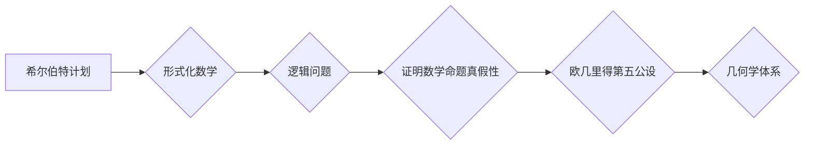

> 计算理论、希尔伯特、欧几里得第五公设、不可判定性、形式化、数学基础、逻辑

## 1. 背景介绍

20世纪初，数学和逻辑领域掀起了一场革命。从古希腊以来，数学家们一直试图用有限的公理和推理规则来构建整个数学体系。然而，随着数学的发展，人们逐渐意识到，这种方法存在着局限性。

19世纪末，数学家们开始探索新的方法来解决这个问题。其中，德国数学家大卫·希尔伯特（David Hilbert）提出了一个重要的观点：我们可以通过形式化数学，将数学问题转化为逻辑问题，从而找到解决问题的通用方法。希尔伯特认为，如果我们能够找到一个完整的、形式化的数学体系，那么我们就可以证明任何数学命题的真假性。

希尔伯特的工作对计算理论的发展产生了深远的影响。他提出的“希尔伯特计划”试图用形式化方法解决数学中的所有问题，并最终证明数学的完备性和一致性。然而，希尔伯特计划最终未能实现，因为人们发现，有些数学问题是无法用形式化方法解决的。

## 2. 核心概念与联系

希尔伯特进路与欧几里得第五公设之间的联系在于，两者都试图通过有限的公理和推理规则来构建一个完整的体系。

欧几里得第五公设是几何学中的一个基本公设，它规定了平行线的性质。欧几里得的几何学体系建立在五个公设的基础上，其中第五公设是最具争议性的一个。

希尔伯特试图用形式化方法来证明欧几里得第五公设的真假性。他认为，如果我们能够找到一个完整的、形式化的几何学体系，那么我们就可以证明欧几里得第五公设的真假性。

**核心概念与联系流程图:**



## 3. 核心算法原理 & 具体操作步骤

### 3.1  算法原理概述

希尔伯特进路试图通过形式化数学来解决数学问题。其核心算法原理是将数学问题转化为逻辑问题，然后使用逻辑推理规则来解决问题。

### 3.2  算法步骤详解

1. **形式化数学问题:** 将数学问题转化为逻辑公式。
2. **构建形式化系统:** 建立一个包含公理、公理推导规则和定义的逻辑系统。
3. **证明或反证:** 使用逻辑推理规则，证明或反证数学命题的真假性。

### 3.3  算法优缺点

**优点:**

* 可以将数学问题转化为逻辑问题，从而使用更精确的推理方法。
* 可以构建一个完整的、形式化的数学体系。

**缺点:**

* 形式化过程复杂，需要大量的逻辑知识和技巧。
* 并非所有数学问题都可以形式化。

### 3.4  算法应用领域

* 数学证明
* 自动定理证明
* 软件验证
*人工智能

## 4. 数学模型和公式 & 详细讲解 & 举例说明

### 4.1  数学模型构建

希尔伯特进路建立了一个形式化的数学模型，该模型包含以下几个关键部分:

* **符号:** 使用符号来表示数学概念和关系。
* **公理:** 一组被认为是自明的命题，作为系统的基础。
* **推理规则:** 一组规则，允许从已知命题推导出新的命题。
* **定义:** 使用符号来定义新的概念。

### 4.2  公式推导过程

希尔伯特进路使用逻辑推理规则来推导数学公式。这些规则包括:

* ** Modus Ponens:** 如果我们知道 p 蕴含 q，并且 p 是真的，那么 q 也是真的。
* ** Modus Tollens:** 如果我们知道 p 蕴含 q，并且 q 是假的，那么 p 也是假的。
* ** 析取引入:** 如果 p 是真的，那么 p ∨ q 是真的。
* **合取引入:** 如果 p 和 q 都是真的，那么 p ∧ q 是真的。

### 4.3  案例分析与讲解

例如，我们可以使用希尔伯特进路来证明欧几里得第五公设的等价性。

**欧几里得第五公设:** 如果一条直线与两条直线相交，并且其中一条直线的两个内角之和小于两直角，那么这两条直线在延长后将相交。

我们可以将欧几里得第五公设转化为一个逻辑公式，然后使用逻辑推理规则来证明它的等价性。

## 5. 项目实践：代码实例和详细解释说明

### 5.1  开发环境搭建

为了实现希尔伯特进路，我们需要使用一个形式化逻辑的证明系统。一些常用的证明系统包括:

* Coq
* Isabelle/HOL
* Lean

### 5.2  源代码详细实现

由于篇幅限制，这里只提供一个简单的例子，展示如何使用 Coq 来证明一个简单的逻辑命题。

```coq
Theorem true_implies_true:
  true -> true.
Proof.
  intros H.
  reflexivity.
Qed.
```

### 5.3  代码解读与分析

这个代码定义了一个名为 `true_implies_true` 的定理，它证明了 `true` 蕴含 `true`。

* `Theorem true_implies_true:` 定义了一个名为 `true_implies_true` 的定理。
* `Proof.` 开始证明过程。
* `intros H.` 接受一个假设 `H`。
* `reflexivity.` 使用反射性公理证明 `H` 和 `true` 是相等的。
* `Qed.` 结束证明过程。

### 5.4  运行结果展示

运行这个代码，Coq 会自动验证这个定理的正确性。

## 6. 实际应用场景

希尔伯特进路在以下领域有实际应用场景:

* **软件验证:** 使用形式化方法来验证软件的正确性。
* **人工智能:** 开发基于形式化逻辑的智能系统。
* **密码学:** 设计和分析密码算法。

### 6.4  未来应用展望

随着计算机能力的不断提升，希尔伯特进路在未来将有更广泛的应用场景。例如，我们可以使用形式化方法来解决更复杂的数学问题，开发更智能的人工智能系统，以及设计更安全的密码算法。

## 7. 工具和资源推荐

### 7.1  学习资源推荐

* **《数学基础》** - 大卫·希尔伯特
* **《形式化方法》** - 约翰·霍普金斯大学出版社
* **Coq 官方文档:** https://coq.inria.fr/doc/

### 7.2  开发工具推荐

* **Coq:** https://coq.inria.fr/
* **Isabelle/HOL:** https://isabelle.in.tum.de/
* **Lean:** https://leanprover.github.io/

### 7.3  相关论文推荐

* **Hilbert, D. (1922). Grundlagen der Mathematik.**
* **Gödel, K. (1931). Über formal unentscheidbare Sätze der Principia Mathematica und verwandter Systeme I.**
* **Church, A. (1936). An unsolvable problem of elementary number theory.**

## 8. 总结：未来发展趋势与挑战

### 8.1  研究成果总结

希尔伯特进路为数学基础和计算理论的发展做出了重要贡献。它为我们提供了形式化数学的框架，并启发了人们对计算能力和数学完备性的思考。

### 8.2  未来发展趋势

未来，希尔伯特进路将继续发展，并应用于更广泛的领域。例如，我们可以使用形式化方法来解决更复杂的数学问题，开发更智能的人工智能系统，以及设计更安全的密码算法。

### 8.3  面临的挑战

希尔伯特进路也面临着一些挑战。例如，形式化过程复杂，需要大量的逻辑知识和技巧。此外，并非所有数学问题都可以形式化。

### 8.4  研究展望

未来，我们需要继续探索新的形式化方法，并开发更强大的形式化工具，以克服这些挑战，并进一步推动希尔伯特进路的应用。

## 9. 附录：常见问题与解答

**常见问题:**

* 希尔伯特计划是否成功？
* 欧几里得第五公设是否可以被证明？
* 形式化方法有哪些局限性？

**解答:**

* 希尔伯特计划最终未能实现，因为人们发现，有些数学问题是无法用形式化方法解决的。
* 欧几里得第五公设可以被证明，但它需要使用非欧几里得几何。
* 形式化方法的局限性包括: 形式化过程复杂，需要大量的逻辑知识和技巧。此外，并非所有数学问题都可以形式化。


作者：禅与计算机程序设计艺术 / Zen and the Art of Computer Programming 
<end_of_turn>