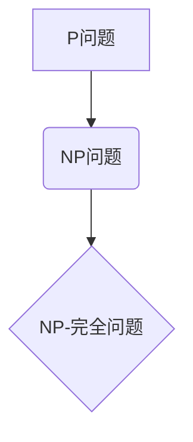

> 计算复杂性，NP问题，P问题，未分类问题，算法复杂度，时间复杂度，空间复杂性，图灵机，NP-完全问题

## 1. 背景介绍

计算复杂性理论是计算机科学的一个重要分支，它研究算法的效率和资源消耗。在计算复杂性理论中，我们用时间复杂度和空间复杂度来衡量算法的效率。时间复杂度是指算法执行所需的时间，空间复杂度是指算法执行所需的空间。

NP问题是计算复杂性理论中一个重要的概念。NP问题是指那些可以通过多项式时间验证的语言。换句话说，如果我们给出一个可能的解，我们可以用多项式时间来验证这个解是否正确。但是，找到一个解可能需要指数时间。

P问题是指那些可以通过多项式时间算法解决的语言。

目前，我们不知道NP问题是否等于P问题。这个问题被称为P vs NP问题，它是计算机科学领域最著名的未解决问题之一。

## 2. 核心概念与联系

**核心概念：**

* **P问题:** 可以被多项式时间算法解决的问题。
* **NP问题:** 可以被多项式时间验证的问题。
* **NP-完全问题:** NP问题中最难的问题，任何NP问题都可以被多项式时间还原到NP-完全问题。
* **多项式时间:** 指的是时间复杂度为多项式函数的算法。

**核心概念联系：**

**解释：**

* P问题是所有可以在多项式时间内解决的问题。
* NP问题是所有可以在多项式时间内验证答案的问题。
* NP-完全问题是NP问题中最难的问题，任何NP问题都可以被多项式时间还原到NP-完全问题。

## 3. 核心算法原理 & 具体操作步骤

### 3.1  算法原理概述

未分类问题是指那些我们目前还没有找到有效算法解决的问题。这些问题通常具有很高的计算复杂度，并且可能需要指数时间才能解决。

### 3.2  算法步骤详解

由于未分类问题本身没有确定的算法，因此无法给出具体的算法步骤。

### 3.3  算法优缺点

由于未分类问题没有确定的算法，因此无法对其进行优缺点分析。

### 3.4  算法应用领域

未分类问题广泛存在于各个领域，例如：

* **密码学:** 许多密码算法依赖于未分类问题的难解性。
* **人工智能:** 许多人工智能算法，例如图搜索和组合优化问题，都属于未分类问题。
* **生物信息学:** 许多生物信息学问题，例如蛋白质折叠问题，都属于未分类问题。

## 4. 数学模型和公式 & 详细讲解 & 举例说明

### 4.1  数学模型构建

未分类问题通常可以用数学模型来描述。例如，图着色问题可以用图论中的邻接矩阵来表示。

### 4.2  公式推导过程

由于未分类问题没有确定的算法，因此无法进行公式推导。

### 4.3  案例分析与讲解

**案例：**

图着色问题

**解释：**

图着色问题是指给定一个图，用尽可能少的颜色将图中的顶点染色，使得相邻的顶点颜色不同。

**数学模型：**

图着色问题可以用图论中的邻接矩阵来表示。

**未分类性：**

图着色问题属于NP问题，并且是NP-完全问题。这意味着，我们目前还没有找到一个多项式时间算法可以解决图着色问题。

## 5. 项目实践：代码实例和详细解释说明

由于未分类问题没有确定的算法，因此无法给出具体的代码实例。

## 6. 实际应用场景

未分类问题广泛存在于各个领域，例如：

* **密码学:** 许多密码算法依赖于未分类问题的难解性。例如，RSA加密算法依赖于大数分解问题，而大数分解问题是NP-完全问题。
* **人工智能:** 许多人工智能算法，例如图搜索和组合优化问题，都属于未分类问题。例如，解决棋盘游戏问题，例如国际象棋和围棋，需要解决NP-完全问题。
* **生物信息学:** 许多生物信息学问题，例如蛋白质折叠问题，都属于未分类问题。

## 7. 工具和资源推荐

### 7.1  学习资源推荐

* **书籍:**
    * 《计算复杂性导论》
    * 《算法导论》
* **在线课程:**
    * Coursera 上的《计算复杂性》课程
    * edX 上的《算法导论》课程

### 7.2  开发工具推荐

* **编程语言:** Python, C++, Java
* **算法库:** NumPy, SciPy

### 7.3  相关论文推荐

* **P vs NP问题:**
    * Cook, S. A. (1971). The complexity of theorem-proving procedures.
* **NP-完全问题:**
    * Karp, R. M. (1972). Reducibility among combinatorial problems.

## 8. 总结：未来发展趋势与挑战

### 8.1  研究成果总结

尽管我们目前还没有解决P vs NP问题，但对计算复杂性的研究取得了重大进展。例如，我们已经找到了许多NP-完全问题，并开发了一些近似算法来解决这些问题。

### 8.2  未来发展趋势

未来，计算复杂性理论的研究将继续朝着以下方向发展：

* **寻找新的NP-完全问题:** 寻找新的NP-完全问题可以帮助我们更好地理解计算复杂性的本质。
* **开发新的近似算法:** 开发新的近似算法可以帮助我们解决一些NP问题，即使我们无法找到精确的算法。
* **研究量子计算:** 量子计算有可能改变我们对计算复杂性的理解，并提供解决一些目前无法解决问题的新的方法。

### 8.3  面临的挑战

计算复杂性理论面临着许多挑战，例如：

* **P vs NP问题:** 这个问题仍然是计算机科学领域最著名的未解决问题之一。
* **NP问题的复杂性:** NP问题非常复杂，即使我们找到了一个近似算法，也可能需要大量的计算资源。
* **量子计算的局限性:** 量子计算虽然有潜力解决一些NP问题，但它仍然面临着许多技术挑战。

### 8.4  研究展望

尽管面临着许多挑战，但计算复杂性理论仍然是一个充满希望的研究领域。我相信，随着技术的进步，我们最终能够解决P vs NP问题，并开发出更有效的算法来解决NP问题。

## 9. 附录：常见问题与解答

**常见问题:**

* P问题和NP问题有什么区别？
* NP-完全问题是什么？
* 为什么P vs NP问题是一个重要的未解决问题？

**解答:**

* P问题是指可以在多项式时间内解决的问题，而NP问题是指可以在多项式时间内验证答案的问题。
* NP-完全问题是NP问题中最难的问题，任何NP问题都可以被多项式时间还原到NP-完全问题。
* P vs NP问题是一个重要的未解决问题，因为它关系到我们对计算能力的理解。如果P=NP，那么意味着我们可以用多项式时间解决所有NP问题，这将对计算机科学和许多其他领域产生深远的影响。

作者：禅与计算机程序设计艺术 / Zen and the Art of Computer Programming

<end_of_turn>