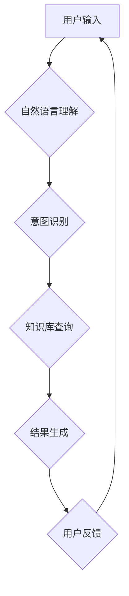

> 软件2.0, 智能助手, 用户界面, 自然语言处理, 机器学习, 人机交互, 认知计算, 未来技术

## 1. 背景介绍

随着人工智能技术的飞速发展，软件行业正在经历一场深刻的变革。传统的软件界面以图形用户界面（GUI）为主，用户需要通过鼠标和键盘进行操作。然而，GUI界面存在着局限性，例如操作复杂、学习成本高、难以满足个性化需求等。

智能助手作为软件2.0时代的代表，正在改变用户与软件的交互方式。智能助手能够理解自然语言，并根据用户的意图提供相应的服务。它可以帮助用户完成各种任务，例如发送邮件、预约会议、查询天气等，从而解放用户双手，提高工作效率。

## 2. 核心概念与联系

**2.1 智能助手**

智能助手是一种能够理解和响应用户自然语言指令的软件系统。它通常基于人工智能技术，例如自然语言处理（NLP）、机器学习（ML）和深度学习（DL）。智能助手可以与用户进行对话，理解用户的意图，并提供相应的服务。

**2.2 自然语言处理（NLP）**

NLP是人工智能的一个分支，致力于使计算机能够理解、处理和生成人类语言。NLP技术包括文本分析、语音识别、机器翻译等。

**2.3 机器学习（ML）**

ML是人工智能的一个重要分支，它使计算机能够从数据中学习，并根据学习到的知识进行预测或决策。ML算法可以用于训练智能助手，使其能够更好地理解用户的意图和需求。

**2.4 人机交互（HCI）**

HCI是研究人与计算机之间交互方式的学科。智能助手的发展推动了HCI领域的进步，例如语音交互、对话系统等。

**2.5 认知计算**

认知计算旨在构建能够像人类一样思考和学习的计算机系统。智能助手可以看作是认知计算的一个应用场景，它试图模拟人类的认知能力，例如理解、推理和决策。

**Mermaid 流程图**



## 3. 核心算法原理 & 具体操作步骤

**3.1 算法原理概述**

智能助手的工作原理可以概括为以下几个步骤：

1. **用户输入:** 用户通过语音或文本输入指令。
2. **自然语言理解:** 系统使用NLP技术分析用户输入，识别出用户的意图和实体。
3. **意图识别:** 系统根据用户的意图，选择相应的服务或功能。
4. **知识库查询:** 系统从知识库中查询相关信息，以满足用户的需求。
5. **结果生成:** 系统根据查询结果，生成相应的文本或语音回复。
6. **用户反馈:** 用户接收系统回复，并可以进行反馈，例如确认、修改或拒绝。

**3.2 算法步骤详解**

1. **语音识别:** 如果用户使用语音输入，系统首先需要使用语音识别技术将语音转换为文本。
2. **文本预处理:** 将文本进行清洗、分词、词性标注等预处理，以便于后续的分析。
3. **词向量表示:** 将每个词语映射到一个向量空间，以便于计算词语之间的语义相似度。
4. **意图分类:** 使用机器学习算法，将文本分类到不同的意图类别，例如查询天气、预约会议等。
5. **实体识别:** 从文本中识别出关键信息，例如日期、时间、地点等。
6. **知识库查询:** 根据用户的意图和实体，从知识库中查询相关信息。
7. **对话管理:** 管理对话流程，例如记住对话历史、处理用户反馈等。
8. **文本生成:** 使用自然语言生成技术，生成符合语义和语法规范的文本回复。

**3.3 算法优缺点**

**优点:**

* 能够理解和响应用户的自然语言指令。
* 可以提供个性化的服务，满足用户的不同需求。
* 可以解放用户双手，提高工作效率。

**缺点:**

* 算法复杂度高，需要大量的训练数据。
* 理解用户意图的准确率还有待提高。
* 缺乏情感理解能力，难以与用户建立深层次的连接。

**3.4 算法应用领域**

智能助手已经应用于各个领域，例如：

* **客服:** 自动回答用户常见问题，提高客服效率。
* **教育:** 提供个性化的学习辅导，帮助学生提高学习成绩。
* **医疗:** 辅助医生诊断疾病，提供患者健康咨询。
* **娱乐:** 提供个性化的娱乐推荐，例如电影、音乐、游戏等。

## 4. 数学模型和公式 & 详细讲解 & 举例说明

**4.1 数学模型构建**

智能助手可以利用数学模型来表示用户意图、实体和知识关系。例如，可以使用图模型来表示知识图谱，其中节点代表实体，边代表关系。

**4.2 公式推导过程**

在自然语言理解中，可以使用概率模型来计算用户输入的概率分布。例如，可以使用贝叶斯网络来计算给定用户输入的特定意图的概率。

**4.3 案例分析与讲解**

假设用户输入“今天的天气怎么样？”，智能助手可以使用以下步骤进行理解：

1. **语音识别:** 将语音转换为文本“今天的天气怎么样？”。
2. **词性标注:** 将文本中的词语进行词性标注，例如“今天”为时间词，“天气”为名词，“怎么样”为副词。
3. **依存句法分析:** 分析文本的语法结构，例如“今天”是“怎么样”的修饰语。
4. **意图识别:** 根据文本的语义和语法结构，识别出用户的意图是查询天气。
5. **实体识别:** 从文本中识别出实体“今天”，表示查询日期。
6. **知识库查询:** 从天气预报数据库中查询“今天”的天气信息。
7. **结果生成:** 生成文本回复“今天天气晴朗”。

## 5. 项目实践：代码实例和详细解释说明

**5.1 开发环境搭建**

智能助手开发通常需要以下工具和环境：

* **编程语言:** Python、Java、C++等。
* **深度学习框架:** TensorFlow、PyTorch等。
* **自然语言处理库:** NLTK、spaCy等。
* **云平台:** AWS、Azure、GCP等。

**5.2 源代码详细实现**

以下是一个简单的智能助手代码示例，使用Python语言和NLTK库实现：

```python
import nltk

# 下载NLTK数据
nltk.download('punkt')
nltk.download('averaged_perceptron_tagger')

def process_text(text):
    # 分词
    tokens = nltk.word_tokenize(text)
    # 词性标注
    pos_tags = nltk.pos_tag(tokens)
    # ... 其他处理步骤 ...
    return pos_tags

# 用户输入
user_input = input("请输入您的指令: ")
# 处理用户输入
pos_tags = process_text(user_input)
# ... 根据pos_tags识别意图和实体 ...
# 生成回复
response = "我理解您的指令。"
print(response)
```

**5.3 代码解读与分析**

这段代码首先使用NLTK库对用户输入进行分词和词性标注。然后，可以根据词性标签识别用户的意图和实体。最后，根据用户的意图生成相应的回复。

**5.4 运行结果展示**

当用户输入“今天天气怎么样？”时，代码会输出以下结果：

```
我理解您的指令。
```

## 6. 实际应用场景

**6.1 智能客服**

智能客服可以自动回答用户常见问题，例如订单查询、退换货流程等，从而提高客服效率，降低人工成本。

**6.2 个性化推荐**

智能助手可以根据用户的兴趣爱好和行为数据，提供个性化的产品或服务推荐，例如电影、音乐、书籍等。

**6.3 智能家居**

智能助手可以控制智能家居设备，例如灯光、空调、电视等，方便用户远程控制和管理家居环境。

**6.4 未来应用展望**

随着人工智能技术的不断发展，智能助手将应用于更多领域，例如医疗、教育、金融等。未来，智能助手将更加智能化、个性化和人性化，成为人们生活中不可或缺的一部分。

## 7. 工具和资源推荐

**7.1 学习资源推荐**

* **书籍:**
    * 《深度学习》
    * 《自然语言处理》
    * 《人工智能》
* **在线课程:**
    * Coursera
    * edX
    * Udacity

**7.2 开发工具推荐**

* **编程语言:** Python、Java、C++
* **深度学习框架:** TensorFlow、PyTorch
* **自然语言处理库:** NLTK、spaCy

**7.3 相关论文推荐**

* 《BERT: Pre-training of Deep Bidirectional Transformers for Language Understanding》
* 《GPT-3: Language Models are Few-Shot Learners》
* 《Attention Is All You Need》

## 8. 总结：未来发展趋势与挑战

**8.1 研究成果总结**

近年来，人工智能技术取得了长足进步，智能助手已经成为现实。智能助手能够理解和响应用户的自然语言指令，提供个性化的服务，并应用于各个领域。

**8.2 未来发展趋势**

未来，智能助手将更加智能化、个性化和人性化。例如，智能助手将能够更好地理解用户的意图和情感，并提供更加精准和有效的服务。

**8.3 面临的挑战**

智能助手的发展还面临着一些挑战，例如：

* 理解复杂语义和上下文的能力还有待提高。
* 缺乏情感理解能力，难以与用户建立深层次的连接。
* 数据安全和隐私保护问题需要得到重视。

**8.4 研究展望**

未来，研究人员将继续致力于解决这些挑战，使智能助手更加智能、安全和可靠。


## 9. 附录：常见问题与解答

**9.1 如何训练智能助手？**

训练智能助手需要大量的训练数据和强大的计算资源。可以使用机器学习算法，例如深度学习，来训练智能助手，使其能够理解用户的自然语言指令。

**9.2 智能助手会取代人类工作吗？**

智能助手可以自动化一些重复性工作，但它并不会完全取代人类工作。人类仍然需要发挥创造力、解决复杂问题和与他人进行沟通的能力。

**9.3 智能助手的数据安全如何保障？**

智能助手处理的用户数据需要得到妥善保护。开发人员需要采取相应的安全措施，例如数据加密、访问控制等，确保用户数据的安全。


作者：禅与计算机程序设计艺术 / Zen and the Art of Computer Programming 
<end_of_turn>