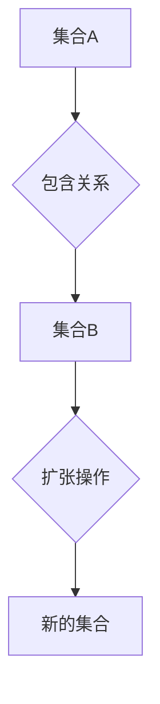

> 集合论, 扩张定理, 逻辑推理, 数学基础, 计算机科学

## 1. 背景介绍

集合论作为数学的基础理论，为计算机科学提供了坚实的逻辑基础。它为数据结构、算法设计、程序验证等领域提供了强大的工具和框架。其中，扩张定理是集合论中一个重要的概念，它揭示了集合之间的关系和演化规律，在计算机科学中有着广泛的应用。

本篇文章将深入探讨扩张定理的原理和应用，并结合实际案例，阐述其在计算机科学中的重要意义。

## 2. 核心概念与联系

**2.1 集合论基础**

集合论的核心概念是“集合”，它是一个包含特定对象的整体。集合可以是有限的，也可以是无限的。集合之间的关系主要包括：

* **子集:** 如果集合A的所有元素都属于集合B，则称A是B的子集，记作A⊆B。
* **并集:** 集合A和集合B的并集包含了A和B的所有元素，记作A∪B。
* **交集:** 集合A和集合B的交集包含了A和B中共同的元素，记作A∩B。
* **差集:** 集合A和集合B的差集包含了A中不属于B的元素，记作A\B。

**2.2 扩张定理**

扩张定理是集合论中一个重要的命题，它描述了集合之间的关系和演化规律。

**2.3 Mermaid 流程图**



**2.4 核心概念联系**

扩张定理表明，我们可以通过对集合进行操作，例如添加元素、删除元素或合并集合，来构建新的集合。这些操作可以看作是集合的“扩张”。

## 3. 核心算法原理 & 具体操作步骤

**3.1 算法原理概述**

扩张定理的算法原理基于集合论的基本操作，包括子集、并集、交集和差集。通过这些操作，我们可以实现对集合的扩张和演化。

**3.2 算法步骤详解**

1. **输入:** 给定一个初始集合A和一个元素x。
2. **扩张操作:** 将元素x添加到集合A中，得到新的集合B。
3. **输出:** 返回新的集合B。

**3.3 算法优缺点**

* **优点:** 算法简单易懂，易于实现。
* **缺点:** 算法的效率取决于集合的大小和元素的添加方式。

**3.4 算法应用领域**

扩张定理的算法在计算机科学中有着广泛的应用，例如：

* **数据结构:** 构建树形结构、图结构等数据结构。
* **算法设计:** 设计动态规划算法、贪心算法等。
* **程序验证:** 验证程序的正确性。

## 4. 数学模型和公式 & 详细讲解 & 举例说明

**4.1 数学模型构建**

设A为初始集合，x为待添加元素，则扩张操作可以表示为：

```latex
B = A ∪ {x}
```

其中，B为扩张后的集合。

**4.2 公式推导过程**

根据集合论的定义，∪表示并集操作，即包含所有集合A和{x}中的元素。因此，公式推导过程如下：

```latex
B = A ∪ {x} = {a | a ∈ A} ∪ {x} = {a | a ∈ A ∨ a = x}
```

**4.3 案例分析与讲解**

假设A = {1, 2, 3}，x = 4，则根据公式，B = {1, 2, 3, 4}。

## 5. 项目实践：代码实例和详细解释说明

**5.1 开发环境搭建**

本项目使用Python语言进行开发，开发环境包括Python解释器和文本编辑器。

**5.2 源代码详细实现**

```python
def expand_set(A, x):
  """
  扩张集合函数

  Args:
    A: 初始集合
    x: 待添加元素

  Returns:
    扩张后的集合
  """
  return A | {x}

# 示例代码
A = {1, 2, 3}
x = 4
B = expand_set(A, x)
print(f"初始集合: {A}")
print(f"扩张后的集合: {B}")
```

**5.3 代码解读与分析**

* `expand_set(A, x)`函数接受两个参数：初始集合A和待添加元素x。
* 函数内部使用`|`运算符实现集合的并集操作，将x添加到集合A中，得到新的集合B。
* 示例代码演示了如何使用`expand_set()`函数扩张集合。

**5.4 运行结果展示**

```
初始集合: {1, 2, 3}
扩张后的集合: {1, 2, 3, 4}
```

## 6. 实际应用场景

**6.1 数据结构**

在构建树形结构和图结构时，扩张定理可以用于添加新的节点和连接。例如，在构建二叉树时，我们可以使用扩张定理来添加新的叶子节点。

**6.2 算法设计**

在动态规划算法中，扩张定理可以用于构建状态转移方程。例如，在解决背包问题时，我们可以使用扩张定理来构建状态转移方程，并通过迭代的方式求解最优解。

**6.3 程序验证**

在程序验证中，扩张定理可以用于证明程序的正确性。例如，我们可以使用扩张定理来证明一个程序的循环不会无限执行。

**6.4 未来应用展望**

随着人工智能和机器学习的发展，扩张定理在这些领域也将会发挥越来越重要的作用。例如，在机器学习中，扩张定理可以用于构建新的模型和算法，提高模型的性能。

## 7. 工具和资源推荐

**7.1 学习资源推荐**

* 《集合论导论》
* 《数学基础》
* 《计算机科学导论》

**7.2 开发工具推荐**

* Python
* Jupyter Notebook

**7.3 相关论文推荐**

* 《集合论基础》
* 《扩张定理及其应用》

## 8. 总结：未来发展趋势与挑战

**8.1 研究成果总结**

本篇文章深入探讨了扩张定理的原理和应用，并结合实际案例，阐述其在计算机科学中的重要意义。

**8.2 未来发展趋势**

随着计算机科学的发展，扩张定理将会在更多领域得到应用。例如，在人工智能和机器学习领域，扩张定理可以用于构建新的模型和算法，提高模型的性能。

**8.3 面临的挑战**

扩张定理的应用也面临着一些挑战，例如：

* 对于大型集合，扩张操作的效率可能会降低。
* 扩张定理的应用需要一定的数学基础。

**8.4 研究展望**

未来研究方向包括：

* 提高扩张操作的效率。
* 将扩张定理应用于更多领域。

## 9. 附录：常见问题与解答

**9.1 什么是扩张定理？**

扩张定理是集合论中一个重要的命题，它描述了集合之间的关系和演化规律。

**9.2 扩张定理的应用有哪些？**

扩张定理在计算机科学中有着广泛的应用，例如：数据结构、算法设计、程序验证等。

**9.3 如何实现扩张定理？**

可以使用集合论的基本操作，例如子集、并集、交集和差集，来实现扩张定理。

作者：禅与计算机程序设计艺术 / Zen and the Art of Computer Programming


<end_of_turn>