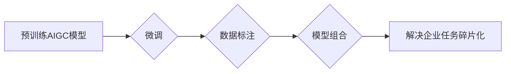

> AIGC, 企业任务, 碎片化, 模型训练, 数据标注, 应用场景, 挑战

## 1. 背景介绍

近年来，人工智能生成内容（AIGC）技术取得了飞速发展，从文本生成、图像生成到视频生成等领域都展现出强大的能力。AIGC技术为企业带来了诸多机遇，例如自动化内容创作、个性化用户体验、数据分析和洞察等。然而，在实际应用中，企业任务往往具有碎片化特征，即需要针对特定场景、特定任务进行定制化开发，这给AIGC技术的应用带来了新的挑战。

## 2. 核心概念与联系

**2.1 AIGC概述**

AIGC是指利用人工智能技术自动生成各种类型的内容，包括文本、图像、音频、视频等。其核心是训练大型语言模型（LLM）或多模态模型，使其能够理解和生成人类语言和多模态数据。

**2.2 企业任务的碎片化**

企业任务的碎片化是指企业内部不同部门、不同团队、不同岗位所面临的任务类型、需求和数据特点存在差异，难以用通用的AIGC模型直接满足。例如，营销部门需要生成广告文案，客服部门需要处理客户咨询，研发部门需要生成技术文档，每个部门的需求和数据特点都不同。

**2.3 核心概念联系**

AIGC技术本身具有强大的生成能力，但其应用场景往往受限于数据和任务的碎片化。为了更好地解决企业任务的碎片化问题，需要结合以下几个核心概念：

* **微调:** 将预训练的AIGC模型针对特定任务进行微调，提升模型在特定领域的性能。
* **数据标注:** 为特定任务收集和标注高质量的数据，用于训练和评估AIGC模型。
* **模型组合:** 将多个AIGC模型组合在一起，形成一个更强大的多模态生成系统，能够处理更复杂的任务。

**2.4 Mermaid 流程图**

## 3. 核心算法原理 & 具体操作步骤

**3.1 算法原理概述**

AIGC的核心算法原理是基于深度学习，主要包括以下几个方面：

* **Transformer网络:** Transformer网络是一种新型的神经网络架构，能够有效处理序列数据，例如文本和音频。
* **注意力机制:** 注意力机制能够帮助模型关注输入数据中重要的信息，提高模型的理解能力。
* **生成式对抗网络 (GAN):** GAN是一种生成模型，通过对抗训练的方式生成逼真的数据，例如图像和视频。

**3.2 算法步骤详解**

1. **数据预处理:** 收集和预处理数据，例如文本清洗、图像裁剪等。
2. **模型训练:** 使用深度学习算法训练AIGC模型，例如Transformer网络或GAN。
3. **模型评估:** 使用测试数据评估模型的性能，例如准确率、流畅度等。
4. **模型微调:** 根据评估结果，对模型进行微调，提升模型在特定任务的性能。
5. **内容生成:** 使用训练好的模型生成新的内容，例如文本、图像、音频等。

**3.3 算法优缺点**

**优点:**

* 生成能力强，能够生成高质量的内容。
* 可扩展性强，能够处理各种类型的数据。
* 自动化程度高，能够解放人力资源。

**缺点:**

* 数据依赖性强，需要大量高质量的数据进行训练。
* 计算资源消耗大，训练模型需要强大的计算能力。
* 存在伦理风险，例如内容生成可能被用于恶意传播信息。

**3.4 算法应用领域**

* 文本生成：新闻报道、广告文案、小说创作等。
* 图像生成：图片合成、图像修复、艺术创作等。
* 音频生成：语音合成、音乐创作、音效制作等。
* 视频生成：视频剪辑、视频特效、虚拟主播等。

## 4. 数学模型和公式 & 详细讲解 & 举例说明

**4.1 数学模型构建**

AIGC模型通常基于深度学习框架，例如TensorFlow或PyTorch。模型的结构通常由多个神经网络层组成，例如卷积层、全连接层和注意力层。

**4.2 公式推导过程**

AIGC模型的训练过程涉及到许多数学公式，例如损失函数、梯度下降算法等。这些公式的推导过程比较复杂，需要一定的数学基础。

**4.3 案例分析与讲解**

例如，在文本生成任务中，可以使用Transformer网络模型，其核心是注意力机制。注意力机制可以帮助模型关注输入文本中重要的信息，从而生成更流畅、更准确的文本。

## 5. 项目实践：代码实例和详细解释说明

**5.1 开发环境搭建**

AIGC模型的开发环境通常需要安装深度学习框架、编程语言和必要的库。例如，可以使用Python语言，安装TensorFlow或PyTorch框架，以及一些自然语言处理库，例如NLTK或spaCy。

**5.2 源代码详细实现**

AIGC模型的源代码实现比较复杂，需要根据具体的任务和模型架构进行编写。例如，可以使用预训练的Transformer模型，对其进行微调，生成特定类型的文本。

**5.3 代码解读与分析**

需要对代码进行详细解读和分析，理解模型的结构、训练过程和生成过程。

**5.4 运行结果展示**

需要运行代码，并展示模型的生成结果，例如生成的文本、图像或音频等。

## 6. 实际应用场景

**6.1 营销领域**

* 自动生成广告文案、社交媒体内容、产品描述等。
* 个性化推荐产品和服务，提高用户转化率。

**6.2 客服领域**

* 自动回复客户咨询，提高客服效率。
* 生成个性化回复，提升客户体验。

**6.3 教育领域**

* 自动生成学习材料、习题和答案。
* 提供个性化学习辅导，提高学习效率。

**6.4 未来应用展望**

AIGC技术将在未来广泛应用于各个领域，例如医疗、金融、法律等。

## 7. 工具和资源推荐

**7.1 学习资源推荐**

* 深度学习框架文档：TensorFlow、PyTorch
* 自然语言处理库文档：NLTK、spaCy
* AIGC相关书籍和论文

**7.2 开发工具推荐**

* 深度学习框架：TensorFlow、PyTorch
* 代码编辑器：VS Code、PyCharm
* 数据可视化工具：Matplotlib、Seaborn

**7.3 相关论文推荐**

* Transformer论文
* BERT论文
* GPT-3论文

## 8. 总结：未来发展趋势与挑战

**8.1 研究成果总结**

AIGC技术取得了显著进展，能够生成高质量的内容，并应用于多个领域。

**8.2 未来发展趋势**

* 模型能力提升：模型将更加强大，能够处理更复杂的任务。
* 多模态生成：模型将能够生成多种类型的内容，例如文本、图像、音频、视频等。
* 个性化定制：模型将能够根据用户的需求进行个性化定制。

**8.3 面临的挑战**

* 数据安全和隐私保护
* 内容原创性和版权问题
* 模型偏见和伦理风险

**8.4 研究展望**

未来研究将重点关注解决上述挑战，并推动AIGC技术在更多领域得到应用。

## 9. 附录：常见问题与解答

**9.1 如何选择合适的AIGC模型？**

需要根据具体的应用场景和任务需求选择合适的AIGC模型。

**9.2 如何进行数据标注？**

数据标注需要根据任务需求进行设计，并使用专业的工具进行标注。

**9.3 如何解决模型偏见问题？**

需要使用多样化的训练数据，并进行模型评估和调优，以减少模型偏见。

作者：禅与计算机程序设计艺术 / Zen and the Art of Computer Programming 
<end_of_turn>