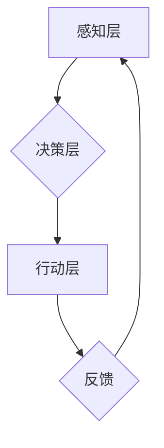

> 人工智能，AI Agent，智能体，机器学习，深度学习，自然语言处理，计算机视觉，生活影响

## 1. 背景介绍

人工智能（AI）正以惊人的速度发展，深刻地改变着我们的生活。其中，AI智能体（AI Agent）作为AI的核心应用之一，正在逐渐渗透到各个领域，从自动驾驶汽车到智能家居，从医疗诊断到金融交易，AI智能体正在以其强大的智能和自动化能力，为我们带来前所未有的便利和效率。

然而，AI智能体的快速发展也引发了人们对未来社会和人类命运的思考。AI智能体将如何影响我们的生活？它会成为人类的伙伴还是我们的竞争对手？这些问题迫切需要我们认真探讨和思考。

## 2. 核心概念与联系

**2.1 AI智能体定义**

AI智能体是指能够感知环境、做出决策并采取行动的软件程序或系统。它具备以下核心特征：

* **感知能力:** AI智能体能够通过传感器或其他方式获取环境信息。
* **决策能力:** AI智能体能够根据感知到的信息，做出合理的决策。
* **行动能力:** AI智能体能够执行决策，并与环境进行交互。
* **学习能力:** AI智能体能够从经验中学习，不断提升其决策和行动能力。

**2.2 AI智能体与传统软件的区别**

传统软件通常是预先编程好的，只能执行特定的任务。而AI智能体则具有学习和适应能力，能够处理更复杂的任务，并根据环境变化进行调整。

**2.3 AI智能体架构**

AI智能体的架构通常包括以下几个部分：

* **感知层:**负责获取环境信息，例如图像、文本、音频等。
* **决策层:**负责分析环境信息，做出决策。
* **行动层:**负责执行决策，与环境进行交互。
* **学习层:**负责从经验中学习，提升智能体性能。

**2.4 Mermaid 流程图**



## 3. 核心算法原理 & 具体操作步骤

**3.1 算法原理概述**

AI智能体的核心算法主要包括机器学习、深度学习和强化学习等。

* **机器学习:** 是一种算法，通过分析数据，学习数据中的模式，并根据这些模式进行预测或分类。
* **深度学习:** 是一种更高级的机器学习算法，使用多层神经网络来模拟人类大脑的学习过程。
* **强化学习:** 是一种算法，通过奖励和惩罚机制，训练智能体在特定环境中做出最优决策。

**3.2 算法步骤详解**

**3.2.1 机器学习算法步骤**

1. **数据收集:** 收集大量相关数据。
2. **数据预处理:** 对数据进行清洗、转换和特征提取。
3. **模型选择:** 选择合适的机器学习算法模型。
4. **模型训练:** 使用训练数据训练模型，调整模型参数。
5. **模型评估:** 使用测试数据评估模型性能。
6. **模型部署:** 将训练好的模型部署到实际应用场景中。

**3.2.2 深度学习算法步骤**

1. **数据收集:** 收集大量数据，例如图像、文本、音频等。
2. **数据预处理:** 对数据进行清洗、转换和增强。
3. **网络结构设计:** 设计合适的深度神经网络结构。
4. **模型训练:** 使用训练数据训练深度神经网络，调整网络参数。
5. **模型评估:** 使用测试数据评估模型性能。
6. **模型部署:** 将训练好的深度神经网络部署到实际应用场景中。

**3.2.3 强化学习算法步骤**

1. **环境定义:** 定义智能体所处的环境和智能体的行为空间。
2. **奖励函数设计:** 设计奖励函数，用于评估智能体行为的好坏。
3. **策略学习:** 使用强化学习算法，训练智能体学习最优策略，以最大化奖励。
4. **环境交互:** 智能体与环境进行交互，根据策略采取行动，获得奖励。
5. **策略更新:** 根据获得的奖励，更新智能体的策略。

**3.3 算法优缺点**

**3.3.1 机器学习算法**

* **优点:** 能够从数据中学习，并进行预测或分类。
* **缺点:** 需要大量数据进行训练，对数据质量要求高。

**3.3.2 深度学习算法**

* **优点:** 能够处理更复杂的数据，例如图像、文本、音频等。
* **缺点:** 需要更多计算资源和训练时间。

**3.3.3 强化学习算法**

* **优点:** 能够训练智能体在复杂环境中做出最优决策。
* **缺点:** 训练过程复杂，需要大量的试错和反馈。

**3.4 算法应用领域**

* **机器学习:** 
    * **图像识别:** 用于识别图像中的物体、场景等。
    * **自然语言处理:** 用于理解和生成自然语言，例如机器翻译、文本摘要等。
    * **推荐系统:** 用于推荐用户感兴趣的内容，例如商品推荐、电影推荐等。
* **深度学习:**
    * **自动驾驶:** 用于感知周围环境，并做出驾驶决策。
    * **医疗诊断:** 用于辅助医生诊断疾病。
    * **语音识别:** 用于识别语音指令。
* **强化学习:**
    * **游戏AI:** 用于训练游戏中的AI对手。
    * **机器人控制:** 用于控制机器人的运动和行为。
    * **金融交易:** 用于进行股票交易和风险管理。

## 4. 数学模型和公式 & 详细讲解 & 举例说明

**4.1 数学模型构建**

AI智能体的行为可以看作是一个决策过程，可以使用数学模型来描述这个过程。例如，可以使用马尔可夫决策过程（MDP）来建模强化学习算法。

**4.2 公式推导过程**

MDP模型包含以下几个要素：

* **状态空间:** 智能体可能处于的所有状态。
* **动作空间:** 智能体可以采取的所有动作。
* **转移概率:** 从一个状态到另一个状态的概率。
* **奖励函数:** 智能体在某个状态采取某个动作获得的奖励。

MDP的目标是找到一个策略，使得智能体在长期内获得最大的总奖励。

**4.3 案例分析与讲解**

例如，我们可以使用MDP模型来训练一个智能体玩游戏。

* **状态空间:** 游戏中的所有游戏状态。
* **动作空间:** 游戏中玩家可以采取的所有动作，例如移动、攻击、使用道具等。
* **转移概率:** 从一个游戏状态到另一个游戏状态的概率，取决于玩家采取的动作。
* **奖励函数:** 智能体在某个游戏状态采取某个动作获得的奖励，例如获得积分、击杀敌人等。

通过训练，智能体可以学习到一个策略，使得它在游戏中获得最高的总奖励。

## 5. 项目实践：代码实例和详细解释说明

**5.1 开发环境搭建**

* **操作系统:** Linux、macOS或Windows
* **编程语言:** Python
* **深度学习框架:** TensorFlow、PyTorch
* **其他工具:** Git、Jupyter Notebook

**5.2 源代码详细实现**

```python
import tensorflow as tf

# 定义模型结构
model = tf.keras.models.Sequential([
    tf.keras.layers.Dense(128, activation='relu', input_shape=(784,)),
    tf.keras.layers.Dense(10, activation='softmax')
])

# 编译模型
model.compile(optimizer='adam',
              loss='sparse_categorical_crossentropy',
              metrics=['accuracy'])

# 训练模型
model.fit(x_train, y_train, epochs=10)

# 评估模型
loss, accuracy = model.evaluate(x_test, y_test)
print('Test loss:', loss)
print('Test accuracy:', accuracy)
```

**5.3 代码解读与分析**

这段代码实现了使用TensorFlow框架训练一个简单的图像分类模型。

* **模型结构:** 使用了两个全连接层，第一层有128个神经元，激活函数为ReLU，输入形状为784（MNIST数据集的图像像素数）。第二层有10个神经元，激活函数为softmax，用于输出10个类别概率。
* **模型编译:** 使用Adam优化器，损失函数为稀疏类别交叉熵，评估指标为准确率。
* **模型训练:** 使用训练数据训练模型10个epoch。
* **模型评估:** 使用测试数据评估模型性能，输出测试损失和准确率。

**5.4 运行结果展示**

训练完成后，可以查看模型的测试准确率，评估模型的性能。

## 6. 实际应用场景

**6.1 自动驾驶**

AI智能体可以用于感知周围环境，做出驾驶决策，实现自动驾驶。

**6.2 智能家居**

AI智能体可以控制智能家居设备，例如灯光、空调、电视等，实现个性化家居体验。

**6.3 医疗诊断**

AI智能体可以辅助医生诊断疾病，提高诊断准确率。

**6.4 未来应用展望**

AI智能体将在未来更加广泛地应用于各个领域，例如教育、金融、娱乐等，为人类生活带来更多便利和效率。

## 7. 工具和资源推荐

**7.1 学习资源推荐**

* **书籍:**
    * 《深度学习》
    * 《人工智能：现代方法》
* **在线课程:**
    * Coursera
    * edX
    * Udacity

**7.2 开发工具推荐**

* **深度学习框架:** TensorFlow、PyTorch
* **编程语言:** Python
* **云计算平台:** AWS、Azure、GCP

**7.3 相关论文推荐**

* **AlphaGo论文:** https://arxiv.org/abs/1607.02883
* **GPT-3论文:** https://arxiv.org/abs/2005.14165

## 8. 总结：未来发展趋势与挑战

**8.1 研究成果总结**

近年来，AI智能体领域取得了显著进展，例如AlphaGo、GPT-3等模型的出现，证明了AI智能体的强大能力。

**8.2 未来发展趋势**

* **更强大的计算能力:** 随着计算能力的提升，AI智能体将能够处理更复杂的数据，并做出更精细的决策。
* **更广泛的应用场景:** AI智能体将应用于更多领域，例如医疗、教育、金融等。
* **更安全的AI智能体:** 如何确保AI智能体的安全性和可靠性，是未来研究的重要方向。

**8.3 面临的挑战**

* **数据获取和隐私问题:** AI智能体需要大量数据进行训练，如何获取高质量数据，并保护用户隐私，是需要解决的关键问题。
* **算法解释性和可解释性:** 许多AI算法是黑箱模型，难以解释其决策过程，这可能会导致信任问题。
* **伦理和社会影响:** AI智能体的快速发展，可能会对社会产生深远影响，需要认真思考其伦理和社会责任。

**8.4 研究展望**

未来，AI智能体研究将继续朝着更智能、更安全、更可解释的方向发展，为人类社会带来更多福祉。

## 9. 附录：常见问题与解答

**9.1 如何选择合适的AI智能体算法？**

选择合适的AI智能体算法取决于具体的应用场景和数据特点。例如，对于图像识别任务，可以使用深度学习算法；对于游戏AI，可以使用强化学习算法。

**9.2 如何保证AI智能体的安全性？**

保证AI智能体的安全性需要从多个方面入手，例如：

* 使用安全的训练数据。
* 设计安全的模型架构。
* 进行严格的测试和评估。
* 建立相应的监管机制。

**9.3 AI智能体会取代人类吗？**

AI智能体可以帮助人类完成许多任务，但它并不会完全取代人类。人类拥有创造力、想象力和情感等特质，这些特质是AI智能体无法替代的。


作者：禅与计算机程序