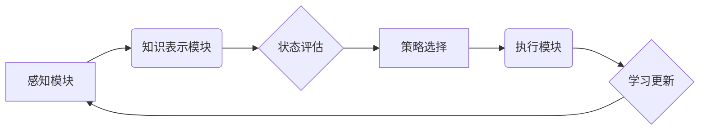

> AI Agent, 智能决策, 决策制定, 算法原理, 数学模型, 项目实践, 应用场景

## 1. 背景介绍

在当今数据爆炸和计算能力飞速发展的时代，人工智能（AI）正以惊人的速度改变着我们的世界。其中，AI Agent作为AI的核心应用之一，在智能决策制定方面展现出巨大的潜力。AI Agent是指能够感知环境、做出决策并执行行动的智能体，它可以自主学习、适应环境变化，并为人类提供智能化服务。

传统的决策制定往往依赖于人类经验和规则，但随着问题的复杂性和数据量的增加，这种方式越来越难以满足需求。AI Agent通过学习和分析海量数据，能够识别出人类难以察觉的模式和趋势，从而做出更准确、更优的决策。

## 2. 核心概念与联系

**2.1 AI Agent 的构成**

AI Agent通常由以下几个核心组件组成：

* **感知模块:** 用于收集环境信息，例如传感器数据、文本信息、图像信息等。
* **知识表示模块:** 用于对感知到的信息进行理解和表示，例如构建知识图谱、使用符号逻辑等。
* **决策模块:** 用于根据环境信息和知识表示，选择最优的行动方案。
* **执行模块:** 用于执行决策结果，并与环境进行交互。

**2.2 智能决策的流程**

AI Agent 的智能决策流程通常可以概括为以下步骤：

1. **感知环境:** 收集环境信息。
2. **知识表示:** 将感知到的信息转化为可理解的形式。
3. **状态评估:** 评估当前状态和目标状态之间的差异。
4. **策略选择:** 根据状态评估和知识库，选择最优的行动策略。
5. **行动执行:** 执行选定的行动，并观察结果。
6. **学习更新:** 根据执行结果，更新知识库和策略模型。

**2.3 核心概念关系图**



## 3. 核心算法原理 & 具体操作步骤

**3.1 算法原理概述**

智能决策算法是AI Agent的核心，它决定了Agent如何从环境信息中学习、评估状态和选择行动。常见的智能决策算法包括：

* **强化学习:** 通过试错学习，Agent在环境中采取行动，并根据奖励信号调整策略，最终学习到最优的行动策略。
* **决策树:** 将决策过程表示为树形结构，每个节点代表一个决策，每个叶子节点代表一个结果。通过训练数据，构建决策树，并根据输入信息进行决策。
* **贝叶斯网络:** 使用概率图模型表示知识和因果关系，通过贝叶斯定理进行推理，预测事件发生的概率。

**3.2 算法步骤详解**

以强化学习为例，其核心步骤如下：

1. **环境建模:** 建立环境模型，定义状态空间、动作空间和奖励函数。
2. **策略初始化:** 初始化Agent的策略，例如随机策略或贪婪策略。
3. **环境交互:** Agent与环境交互，根据策略选择动作，并观察环境状态和奖励信号。
4. **策略更新:** 根据奖励信号，更新Agent的策略，使其朝着更优的方向发展。
5. **重复步骤3-4:** 重复环境交互和策略更新步骤，直到Agent的策略收敛或达到预设的目标。

**3.3 算法优缺点**

* **强化学习:** 优点：能够学习复杂决策问题，适应动态环境。缺点：训练时间长，需要大量数据和计算资源。
* **决策树:** 优点：易于理解和解释，训练速度快。缺点：容易过拟合，难以处理高维数据。
* **贝叶斯网络:** 优点：能够处理不确定性，并进行概率推理。缺点：构建贝叶斯网络需要专业知识，数据量要求较高。

**3.4 算法应用领域**

智能决策算法广泛应用于各个领域，例如：

* **机器人控制:** 使机器人能够自主导航、避障和执行任务。
* **游戏 AI:** 使游戏中的AI角色能够做出更智能的决策，提高游戏体验。
* **金融投资:** 利用市场数据和模型，进行智能投资决策。
* **医疗诊断:** 辅助医生进行诊断，提高诊断准确率。

## 4. 数学模型和公式 & 详细讲解 & 举例说明

**4.1 数学模型构建**

在强化学习中，常用的数学模型包括状态空间、动作空间、奖励函数和价值函数。

* **状态空间:** 表示环境可能存在的全部状态。
* **动作空间:** 表示Agent在每个状态下可以采取的所有动作。
* **奖励函数:** 将Agent在每个状态采取的动作和环境状态的变化映射到一个奖励值。
* **价值函数:** 估计Agent在某个状态下采取某个动作所能获得的长期奖励。

**4.2 公式推导过程**

强化学习的核心目标是最大化Agent的长期奖励。常用的价值函数估计方法包括：

* **蒙特卡罗方法:** 通过模拟多个随机轨迹，估计价值函数。
* **时间差分学习:** 通过更新价值函数，逐步逼近最优价值函数。

**4.3 案例分析与讲解**

例如，在玩游戏“贪吃蛇”时，Agent的目标是尽可能地吃掉更多的食物，并避免撞到墙壁或自己身体。

* 状态空间: 蛇的位置、食物的位置、墙壁的位置。
* 动作空间: 向上、向下、向左、向右移动。
* 奖励函数: 吃到食物获得奖励，撞到墙壁或自己身体扣除奖励。
* 价值函数: 估计Agent在某个状态下采取某个动作所能获得的长期奖励。

通过强化学习算法，Agent可以学习到最优的移动策略，从而获得更高的分数。

## 5. 项目实践：代码实例和详细解释说明

**5.1 开发环境搭建**

* Python 3.x
* TensorFlow 或 PyTorch 等深度学习框架
* NumPy、Pandas 等数据处理库

**5.2 源代码详细实现**

```python
import numpy as np

# 定义状态空间和动作空间
state_space = 4  # 4个方向
action_space = 4  # 4个方向

# 定义奖励函数
def reward_function(state, action):
    # ...

# 定义价值函数
def value_function(state):
    # ...

# 定义强化学习算法
def reinforcement_learning(episodes):
    # ...

# 训练Agent
episodes = 1000
reinforcement_learning(episodes)
```

**5.3 代码解读与分析**

* `state_space` 和 `action_space` 定义了环境的状态和动作空间。
* `reward_function` 定义了Agent在不同状态下采取不同动作的奖励。
* `value_function` 定义了Agent在不同状态下采取不同动作的价值。
* `reinforcement_learning` 函数实现了强化学习算法，例如Q-learning或SARSA。

**5.4 运行结果展示**

通过训练，Agent可以学习到最优的移动策略，并能够在游戏中取得更高的分数。

## 6. 实际应用场景

**6.1 智能客服系统**

AI Agent可以作为智能客服系统，通过自然语言处理技术理解用户需求，并提供智能化的回复和服务。

**6.2 个性化推荐系统**

AI Agent可以根据用户的历史行为和偏好，推荐个性化的商品、服务或内容。

**6.3 自动驾驶系统**

AI Agent可以作为自动驾驶系统的核心，感知周围环境，做出最优的驾驶决策。

**6.4 未来应用展望**

随着AI技术的不断发展，AI Agent将在更多领域得到应用，例如医疗诊断、教育教学、金融风险管理等。

## 7. 工具和资源推荐

**7.1 学习资源推荐**

* **书籍:**
    * 《Reinforcement Learning: An Introduction》
    * 《Artificial Intelligence: A Modern Approach》
* **在线课程:**
    * Coursera: Reinforcement Learning Specialization
    * Udacity: AI Programming with Python

**7.2 开发工具推荐**

* **TensorFlow:** 开源深度学习框架
* **PyTorch:** 开源深度学习框架
* **OpenAI Gym:** 强化学习环境库

**7.3 相关论文推荐**

* Deep Reinforcement Learning with Double Q-learning
* Proximal Policy Optimization Algorithms

## 8. 总结：未来发展趋势与挑战

**8.1 研究成果总结**

近年来，AI Agent在智能决策制定方面取得了显著的进展，例如AlphaGo、AlphaStar等AI系统在围棋、星际争霸等游戏中战胜了人类冠军。

**8.2 未来发展趋势**

* **更强大的计算能力:** 更强大的计算能力将推动AI Agent的学习能力和决策能力的提升。
* **更丰富的环境模拟:** 更丰富的环境模拟将使AI Agent能够更好地适应现实世界。
* **更有效的算法:** 更有效的算法将使AI Agent能够更快地学习和适应环境变化。

**8.3 面临的挑战**

* **数据安全和隐私:** AI Agent的训练需要大量数据，如何保证数据安全和隐私是一个重要的挑战。
* **算法可解释性:** AI Agent的决策过程往往是复杂的，如何提高算法的可解释性是一个重要的研究方向。
* **伦理问题:** AI Agent的决策可能会对人类社会产生影响，如何确保AI Agent的决策符合伦理道德是一个重要的议题。

**8.4 研究展望**

未来，AI Agent将继续朝着更智能、更安全、更可解释的方向发展，并在更多领域发挥重要作用。


## 9. 附录：常见问题与解答

**9.1 如何选择合适的智能决策算法？**

选择合适的智能决策算法需要根据具体应用场景和数据特点进行考虑。例如，对于高维数据和复杂决策问题，强化学习算法可能更合适；对于规则化问题，决策树算法可能更简单易用。

**9.2 如何评估AI Agent的性能？**

AI Agent的性能可以根据具体应用场景进行评估，例如在游戏中的分数、在客服系统中的客户满意度、在自动驾驶系统中的安全性和效率等。

**9.3 如何解决AI Agent的过拟合问题？**

过拟合是指AI Agent在训练数据上表现良好，但在测试数据上表现较差。解决过拟合问题的方法包括：

* 使用更丰富的训练数据
* 使用正则化技术
* 使用交叉验证技术

作者：禅与计算机程序设计艺术 / Zen and the Art of Computer Programming 


<end_of_turn>