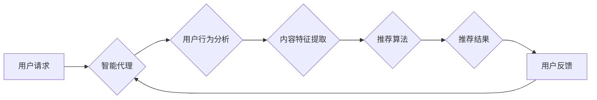

> 智能代理，内容推荐系统，AI工作流，机器学习，深度学习，自然语言处理，用户行为分析

## 1. 背景介绍

在信息爆炸的时代，海量内容的涌现使得用户难以从其中筛选出真正感兴趣的信息。内容推荐系统应运而生，旨在根据用户的兴趣偏好和行为模式，推荐个性化、精准的内容。传统的基于规则或协同过滤的推荐算法，往往难以捕捉用户复杂多变的兴趣，且容易陷入数据稀疏和冷启动问题。

近年来，人工智能（AI）技术的发展为内容推荐系统带来了新的机遇。智能代理作为一种新型的AI技术，能够自主学习和决策，在内容推荐系统中展现出巨大的潜力。智能代理可以根据用户的历史行为、偏好和上下文信息，动态调整推荐策略，提供更精准、更个性化的推荐服务。

## 2. 核心概念与联系

### 2.1 智能代理

智能代理是一种能够自主学习、决策和执行任务的软件实体。它通常具有以下特征：

* **自主性:** 智能代理能够独立地感知环境、制定计划并执行任务，无需人工干预。
* **学习能力:** 智能代理能够从经验中学习，不断改进其决策策略。
* **目标导向:** 智能代理具有明确的目标，并努力实现这些目标。
* **交互性:** 智能代理能够与用户和环境进行交互，获取信息和反馈。

### 2.2 内容推荐系统

内容推荐系统旨在根据用户的兴趣偏好和行为模式，推荐个性化、精准的内容。常见的推荐算法包括：

* **基于规则的推荐:** 基于预先设定的规则，例如用户浏览历史、购买记录等，推荐相关内容。
* **协同过滤的推荐:** 基于用户的相似性，推荐与相似用户喜欢的内容。
* **基于内容的推荐:** 基于内容的特征，例如主题、关键词等，推荐与用户兴趣相关的內容。
* **混合推荐:** 结合多种推荐算法，提高推荐效果。

### 2.3 AI工作流

AI工作流是指利用人工智能技术，自动化执行一系列任务的过程。它可以将多个AI模型和算法串联起来，形成一个完整的智能流程。

**智能代理在内容推荐系统中的应用**

智能代理可以作为内容推荐系统的核心组件，负责处理用户请求、分析用户行为、推荐内容等任务。

**AI工作流与智能代理的结合**

AI工作流可以将智能代理与其他AI技术和工具集成在一起，构建更智能、更强大的内容推荐系统。例如，可以利用AI工作流将用户行为分析、内容特征提取、推荐算法等任务串联起来，形成一个完整的智能推荐流程。

**Mermaid 流程图**



## 3. 核心算法原理 & 具体操作步骤

### 3.1 算法原理概述

智能代理在内容推荐系统中的核心算法通常基于机器学习和深度学习技术。常见的算法包括：

* **协同过滤:** 基于用户的相似性，推荐与相似用户喜欢的内容。
* **内容基元分析:** 基于内容的特征，例如主题、关键词等，推荐与用户兴趣相关的內容。
* **深度学习推荐:** 利用深度神经网络，学习用户和内容之间的复杂关系，进行更精准的推荐。

### 3.2 算法步骤详解

以协同过滤算法为例，其具体操作步骤如下：

1. **数据收集:** 收集用户行为数据，例如用户对不同内容的评分、点击、浏览等行为。
2. **用户相似度计算:** 计算用户之间的相似度，可以使用余弦相似度、皮尔逊相关系数等方法。
3. **推荐内容:** 根据用户与其他用户的相似度，推荐与相似用户喜欢的内容。

### 3.3 算法优缺点

**协同过滤算法的优点:**

* 可以发现用户之间的隐性关系，推荐个性化内容。
* 不需要事先定义内容特征，可以学习用户隐含的偏好。

**协同过滤算法的缺点:**

* 数据稀疏问题: 当用户行为数据不足时，难以计算出准确的用户相似度。
* 冷启动问题: 新用户和新内容难以获得推荐。

### 3.4 算法应用领域

协同过滤算法广泛应用于以下领域:

* 内容推荐系统
* 商品推荐系统
* 社交网络推荐
* 音乐推荐

## 4. 数学模型和公式 & 详细讲解 & 举例说明

### 4.1 数学模型构建

协同过滤算法的数学模型通常基于矩阵分解技术。假设用户集合为U，内容集合为C，用户对内容的评分矩阵为R，其中R(u,c)表示用户u对内容c的评分。

目标是将评分矩阵R分解成两个低维矩阵，分别表示用户特征矩阵U和内容特征矩阵V，即：

R ≈ U * V^T

其中，U(u,:)表示用户u的特征向量，V(c,:)表示内容c的特征向量。

### 4.2 公式推导过程

为了最小化评分矩阵R与分解后的矩阵U * V^T之间的误差，可以使用最小二乘法或梯度下降法进行优化。

最小二乘法目标函数为：

L(U,V) = ∑_(u∈U) ∑_(c∈C) [R(u,c) - U(u,:) * V(c,:)]^2

梯度下降法通过迭代更新U和V的权重，逐步降低目标函数的值。

### 4.3 案例分析与讲解

假设有一个评分矩阵R，其中包含用户对电影的评分信息。

通过协同过滤算法，可以将用户和电影分别表示为低维特征向量。

例如，用户A可能具有“喜欢动作片”和“喜欢喜剧片”的特征，而电影B可能具有“动作片”和“高分”的特征。

当用户A请求推荐电影时，系统可以根据用户A的特征向量和电影B的特征向量计算相似度，并推荐电影B。

## 5. 项目实践：代码实例和详细解释说明

### 5.1 开发环境搭建

* Python 3.x
* TensorFlow 或 PyTorch
* Scikit-learn

### 5.2 源代码详细实现

```python
import numpy as np
from sklearn.metrics.pairwise import cosine_similarity

# 用户评分矩阵
ratings = np.array([
    [5, 4, 3, 2, 1],
    [4, 5, 2, 1, 3],
    [3, 2, 5, 4, 1],
    [2, 1, 4, 5, 3],
    [1, 3, 1, 3, 5]
])

# 计算用户相似度
user_similarity = cosine_similarity(ratings)

# 获取用户1的相似用户
similar_users = np.argsort(user_similarity[0])[::-1][1:]

# 推荐给用户1的内容
recommended_items = np.mean(ratings[similar_users], axis=0)

print(recommended_items)
```

### 5.3 代码解读与分析

* 代码首先定义了用户评分矩阵ratings。
* 然后使用cosine_similarity函数计算用户之间的相似度。
* 通过np.argsort函数获取用户1的相似用户。
* 最后使用np.mean函数计算相似用户对推荐内容的平均评分，作为推荐结果。

### 5.4 运行结果展示

运行代码后，将输出用户1推荐的电影评分。

## 6. 实际应用场景

智能代理在内容推荐系统中的应用场景广泛，例如：

* **电商平台:** 推荐商品、优惠券、促销活动等。
* **视频网站:** 推荐视频、电视剧、电影等。
* **音乐平台:** 推荐歌曲、专辑、歌手等。
* **社交媒体:** 推荐好友、群组、话题等。

### 6.4 未来应用展望

随着人工智能技术的不断发展，智能代理在内容推荐系统中的应用将更加智能化、个性化和精准化。

例如，未来智能代理可以：

* 更好地理解用户的隐性需求和情感。
* 结合多模态数据，例如文本、图像、音频等，提供更丰富的推荐结果。
* 自适应用户的行为变化，动态调整推荐策略。

## 7. 工具和资源推荐

### 7.1 学习资源推荐

* **书籍:**
    * 《深度学习》
    * 《机器学习》
    * 《人工智能：现代方法》
* **在线课程:**
    * Coursera
    * edX
    * Udacity

### 7.2 开发工具推荐

* **TensorFlow:** 开源深度学习框架。
* **PyTorch:** 开源深度学习框架。
* **Scikit-learn:** 机器学习库。

### 7.3 相关论文推荐

* **Collaborative Filtering for Implicit Feedback Datasets**
* **Deep Learning for Recommender Systems**
* **Hybrid Recommender Systems: A Survey**

## 8. 总结：未来发展趋势与挑战

### 8.1 研究成果总结

智能代理在内容推荐系统中的应用取得了显著的成果，能够提供更精准、更个性化的推荐服务。

### 8.2 未来发展趋势

未来智能代理在内容推荐系统中的发展趋势包括：

* **更智能的推荐算法:** 利用更先进的机器学习和深度学习算法，提高推荐的准确性和个性化程度。
* **多模态数据融合:** 结合文本、图像、音频等多模态数据，提供更丰富的推荐结果。
* **个性化用户体验:** 根据用户的个性化需求和行为模式，提供定制化的推荐服务。

### 8.3 面临的挑战

智能代理在内容推荐系统中的应用也面临一些挑战，例如：

* **数据隐私保护:** 如何保护用户的隐私数据，避免信息泄露。
* **算法公平性:** 如何避免算法产生偏见，确保推荐结果公平公正。
* **可解释性:** 如何提高智能代理的透明度，让用户理解推荐结果背后的逻辑。

### 8.4 研究展望

未来研究方向包括：

* 开发更安全、更可靠的智能代理算法。
* 研究智能代理的伦理问题，确保其应用符合社会道德规范。
* 探索智能代理与其他人工智能技术的融合应用，构建更智能的推荐系统。

## 9. 附录：常见问题与解答

### 9.1 什么是智能代理？

智能代理是一种能够自主学习、决策和执行任务的软件实体。

### 9.2 智能代理在内容推荐系统中的应用有哪些？

智能代理可以用于用户行为分析、内容特征提取、推荐算法等任务，提高推荐的精准度和个性化程度。

### 9.3 如何评估智能代理的性能？

常用的评估指标包括准确率、召回率、F1-score等。

### 9.4 智能代理有哪些发展趋势？

未来智能代理将更加智能化、个性化和精准化，并与其他人工智能技术融合应用。

作者：禅与计算机程序设计艺术 / Zen and the Art of Computer Programming


<end_of_turn>