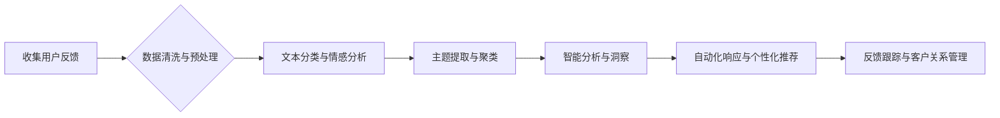

> AI创业公司,用户反馈,数据分析,机器学习,自然语言处理,情感分析,自动化响应,客户关系管理

## 1. 背景介绍

在当今数据爆炸的时代，用户反馈已成为AI创业公司宝贵的资源。它不仅反映了用户对产品或服务的满意度，更能洞察用户需求、发现产品缺陷和激发创新。然而，对于快速发展的AI创业公司来说，如何有效地收集、分析和响应用户反馈是一个巨大的挑战。

传统的用户反馈管理方式往往依赖于人工处理，效率低下，难以应对海量数据。而AI技术的发展为用户反馈管理带来了新的机遇。通过机器学习、自然语言处理等技术，AI创业公司可以实现自动化收集、智能分析和个性化响应，从而提升用户体验、优化产品和服务，最终促进业务增长。

## 2. 核心概念与联系

用户反馈管理的核心在于将用户的声音转化为有价值的洞察，并将其应用于产品和服务的改进。

**2.1 用户反馈类型**

用户反馈可以分为多种类型，包括：

* **文本反馈:** 用户评论、意见建议、投诉等。
* **数值反馈:** 评分、排名、满意度调查等。
* **行为反馈:** 用户使用产品或服务的频率、时长、路径等。

**2.2 数据分析与机器学习**

数据分析和机器学习是用户反馈管理的关键技术。通过分析用户反馈数据，可以识别出用户需求、痛点和潜在问题。机器学习算法可以帮助自动分类、标注和聚类用户反馈，并预测用户行为和情绪。

**2.3 自然语言处理 (NLP)**

自然语言处理技术可以帮助理解和分析用户文本反馈。NLP算法可以用于文本分类、情感分析、主题提取等任务，从而提取用户反馈中的关键信息。

**2.4 自动化响应**

自动化响应是指利用AI技术自动回复用户反馈，例如：

* **常见问题解答:** 使用知识库自动回复常见问题。
* **个性化推荐:** 根据用户反馈推荐相关产品或服务。
* **情绪识别与引导:** 根据用户情绪自动调整回复方式。

**2.5 客户关系管理 (CRM)**

CRM系统可以帮助AI创业公司管理用户关系，例如：

* **用户画像:** 建立用户画像，了解用户需求和行为。
* **反馈跟踪:** 跟踪用户反馈处理进度，确保及时响应。
* **客户服务:** 提供个性化客户服务，提升用户满意度。

**2.6 流程图**



## 3. 核心算法原理 & 具体操作步骤

### 3.1 算法原理概述

用户反馈管理的核心算法包括：

* **文本分类:** 将用户反馈文本分类到不同的类别，例如问题、建议、投诉等。
* **情感分析:** 分析用户反馈文本的情感倾向，例如正面、负面、中性等。
* **主题提取:** 从用户反馈文本中提取出主要主题，例如产品功能、用户体验、服务质量等。
* **聚类分析:** 将用户反馈文本聚类到不同的主题组，例如用户对产品功能的满意度、用户对服务质量的抱怨等。

### 3.2 算法步骤详解

**3.2.1 文本分类**

1. **数据预处理:** 清洗文本数据，去除停用词、标点符号等，并将文本转换为标准格式。
2. **特征提取:** 使用词袋模型、TF-IDF等方法提取文本特征。
3. **模型训练:** 使用支持向量机、朴素贝叶斯等分类算法训练文本分类模型。
4. **模型预测:** 将新用户反馈文本输入模型进行分类。

**3.2.2 情感分析**

1. **数据预处理:** 清洗文本数据，去除停用词、标点符号等，并将文本转换为标准格式。
2. **情感词典构建:** 构建情感词典，将词语与情感倾向进行关联。
3. **情感分类:** 使用情感词典和机器学习算法对文本进行情感分类。

**3.2.3 主题提取**

1. **数据预处理:** 清洗文本数据，去除停用词、标点符号等，并将文本转换为标准格式。
2. **主题模型训练:** 使用LDA、NMF等主题模型训练主题模型。
3. **主题提取:** 将用户反馈文本映射到不同的主题。

**3.2.4 聚类分析**

1. **数据预处理:** 清洗文本数据，去除停用词、标点符号等，并将文本转换为标准格式。
2. **特征提取:** 使用词袋模型、TF-IDF等方法提取文本特征。
3. **聚类算法:** 使用K-means、层次聚类等聚类算法对文本进行聚类。

### 3.3 算法优缺点

**3.3.1 文本分类**

* **优点:** 能够快速准确地将用户反馈分类到不同的类别，方便后续分析和处理。
* **缺点:** 对于语义复杂的文本，分类效果可能不理想。

**3.3.2 情感分析**

* **优点:** 可以了解用户对产品或服务的真实感受，帮助企业及时解决用户问题。
* **缺点:** 情感分析算法对文本风格和语境敏感，容易受到噪音干扰。

**3.3.3 主题提取**

* **优点:** 可以发现用户反馈中的关键主题，帮助企业了解用户需求和痛点。
* **缺点:** 主题提取算法对文本长度和质量要求较高。

**3.3.4 聚类分析**

* **优点:** 可以将用户反馈聚类到不同的主题组，方便进行深入分析和挖掘。
* **缺点:** 聚类算法需要确定聚类数量，选择合适的聚类算法。

### 3.4 算法应用领域

用户反馈管理算法广泛应用于各个领域，例如：

* **电商:** 分析用户评论，了解产品质量和用户体验，优化产品和服务。
* **社交媒体:** 分析用户帖子和评论，了解用户兴趣和需求，提供个性化推荐。
* **金融:** 分析用户反馈，了解用户对金融产品的满意度，改进金融服务。
* **医疗:** 分析患者反馈，了解患者对医疗服务的满意度，提升医疗质量。

## 4. 数学模型和公式 & 详细讲解 & 举例说明

### 4.1 数学模型构建

**4.1.1 文本分类模型**

文本分类模型通常使用概率模型，例如朴素贝叶斯模型或支持向量机模型。

**朴素贝叶斯模型:**

假设每个词语独立地出现在文本中，可以使用贝叶斯定理计算文本属于不同类别的概率。

**支持向量机模型:**

将文本映射到高维空间，找到最佳的分隔超平面，将不同类别文本分开。

**4.1.2 情感分析模型**

情感分析模型通常使用机器学习算法，例如深度学习模型或支持向量机模型。

**深度学习模型:**

例如循环神经网络 (RNN) 或长短期记忆网络 (LSTM)，可以学习文本的语义和情感信息。

**支持向量机模型:**

可以使用情感词典或情感标签训练支持向量机模型，对文本进行情感分类。

### 4.2 公式推导过程

**4.2.1 朴素贝叶斯模型**

假设有类别集合 C = {c1, c2, ..., cn}，文本集合 D = {d1, d2, ..., dm}，词语集合 V = {v1, v2, ..., vn}。

朴素贝叶斯模型的公式如下：

$$P(ci|d) = \frac{P(d|ci)P(ci)}{P(d)}$$

其中：

* P(ci|d) 是文本 d 属于类别 ci 的概率。
* P(d|ci) 是类别 ci 下文本 d 的概率。
* P(ci) 是类别 ci 的先验概率。
* P(d) 是文本 d 的概率。

**4.2.2 支持向量机模型**

支持向量机模型的目标是找到最佳的分隔超平面，将不同类别文本分开。

支持向量机的公式如下：

$$w^T x + b = 0$$

其中：

* w 是权重向量。
* x 是文本特征向量。
* b 是偏置项。

### 4.3 案例分析与讲解

**4.3.1 文本分类案例**

假设我们有一个电商平台，需要对用户评论进行分类，例如：

* 积极评论
* 消极评论
* 中性评论

可以使用朴素贝叶斯模型或支持向量机模型对用户评论进行分类。

**4.3.2 情感分析案例**

假设我们有一个社交媒体平台，需要分析用户帖子中的情感倾向，例如：

* 积极
* 负面
* 中性

可以使用深度学习模型或支持向量机模型对用户帖子进行情感分析。

## 5. 项目实践：代码实例和详细解释说明

### 5.1 开发环境搭建

* **操作系统:** Ubuntu 20.04 LTS
* **编程语言:** Python 3.8
* **开发工具:** Jupyter Notebook
* **库依赖:**

```python
pip install nltk scikit-learn tensorflow
```

### 5.2 源代码详细实现

```python
# 文本分类示例代码

import nltk
from sklearn.model_selection import train_test_split
from sklearn.naive_bayes import MultinomialNB
from sklearn.metrics import accuracy_score

# 数据准备
# ...

# 文本预处理
def preprocess_text(text):
    # ...

# 特征提取
def extract_features(text):
    # ...

# 模型训练
X_train, X_test, y_train, y_test = train_test_split(X, y, test_size=0.2)
model = MultinomialNB()
model.fit(X_train, y_train)

# 模型预测
y_pred = model.predict(X_test)

# 模型评估
accuracy = accuracy_score(y_test, y_pred)
print(f"Accuracy: {accuracy}")
```

### 5.3 代码解读与分析

* **数据准备:** 需要准备用户反馈文本数据，并进行标签标注。
* **文本预处理:** 将文本数据进行清洗、去停用词、转换格式等处理。
* **特征提取:** 使用词袋模型、TF-IDF等方法提取文本特征。
* **模型训练:** 使用朴素贝叶斯模型或支持向量机模型训练文本分类模型。
* **模型预测:** 将新用户反馈文本输入模型进行分类。
* **模型评估:** 使用准确率等指标评估模型性能。

### 5.4 运行结果展示

运行代码后，可以得到模型的准确率，以及分类结果。

## 6. 实际应用场景

### 6.1 电商平台

* **产品评价分析:** 分析用户对产品的评价，了解产品质量和用户体验，优化产品设计和服务。
* **客户服务优化:** 分析用户投诉和建议，及时解决用户问题，提升客户满意度。
* **个性化推荐:** 分析用户购买历史和评价，推荐用户可能感兴趣的产品。

### 6.2 社交媒体平台

* **舆情监测:** 分析用户对品牌、产品和事件的评论，及时了解用户情绪和舆情走向。
* **内容推荐:** 分析用户兴趣和行为，推荐用户可能感兴趣的内容。
* **社区管理:** 分析用户互动和反馈，及时发现和处理社区问题。

### 6.3 金融行业

* **客户服务优化:** 分析客户对金融产品的评价和投诉，改进金融服务。
* **风险控制:** 分析客户行为和反馈，识别潜在的风险。
* **产品开发:** 分析客户需求和反馈，开发新的金融产品。

### 6.4 未来应用展望

随着人工智能技术的不断发展，用户反馈管理将更加智能化、自动化和个性化。

*