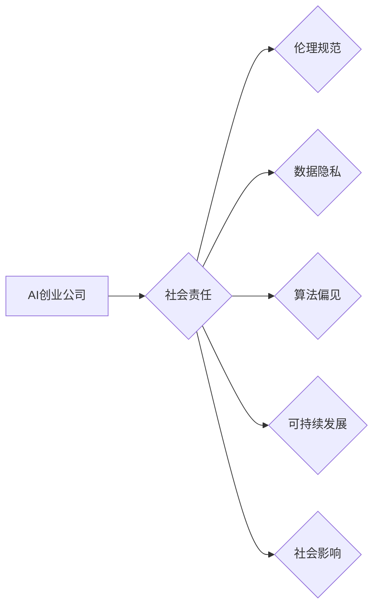

> AI创业公司,社会责任,伦理规范,数据隐私,算法偏见,可持续发展,社会影响

## 1. 背景介绍

人工智能（AI）技术正在以惊人的速度发展，深刻地改变着我们的生活和工作方式。AI创业公司涌现，带来了前所未有的创新和机遇。然而，随着AI技术的广泛应用，其潜在的社会影响也日益凸显。AI创业公司在追求商业成功的同时，也肩负着重要的社会责任，需要认真思考和应对AI技术带来的伦理、社会和环境挑战。

## 2. 核心概念与联系

**2.1 AI创业公司**

AI创业公司是指利用人工智能技术开发和提供产品或服务的公司。这类公司通常专注于特定领域，例如医疗保健、金融、教育、交通等，并利用AI技术解决实际问题，创造新的价值。

**2.2 社会责任**

社会责任是指企业在经营活动中，不仅要追求经济效益，还要考虑其对社会、环境和员工的影响。AI创业公司作为社会的一员，也应该承担相应的社会责任，确保其发展与社会和谐共进。

**2.3 伦理规范**

伦理规范是指指导人们行为的道德准则和价值观。在AI领域，伦理规范尤为重要，需要确保AI技术的使用符合人类的价值观和利益，避免造成负面影响。

**2.4 数据隐私**

数据隐私是指个人信息在收集、使用和存储过程中受到保护的权利。AI技术依赖于大量数据，因此需要特别关注数据隐私问题，确保个人信息的安全和合法使用。

**2.5 算法偏见**

算法偏见是指AI算法在训练过程中，由于数据偏差或设计缺陷，导致对特定群体产生歧视或不公平的对待。

**2.6 可持续发展**

可持续发展是指满足当前需求，同时不损害未来世代满足其需求的能力。AI创业公司需要考虑其技术发展和商业模式对环境和社会的影响，推动可持续发展。

**2.7 社会影响**

AI技术对社会的影响是多方面的，包括就业、教育、医疗保健、安全等方面。AI创业公司需要积极参与社会对话，与政府、学术界和社会各界合作，共同应对AI技术带来的挑战和机遇。

**Mermaid 流程图**

## 3. 核心算法原理 & 具体操作步骤

**3.1 算法原理概述**

AI创业公司通常会使用各种算法来实现其产品或服务的核心功能。这些算法包括机器学习、深度学习、自然语言处理、计算机视觉等。

**3.2 算法步骤详解**

每个算法都有其特定的步骤和流程。例如，机器学习算法通常包括以下步骤：

1. 数据收集和预处理
2. 模型选择和训练
3. 模型评估和优化
4. 模型部署和应用

**3.3 算法优缺点**

不同的算法具有不同的优缺点，需要根据具体应用场景选择合适的算法。例如，深度学习算法在处理复杂数据方面表现出色，但需要大量的计算资源和训练数据。

**3.4 算法应用领域**

AI算法在各个领域都有广泛的应用，例如：

* **医疗保健:** 疾病诊断、药物研发、个性化治疗
* **金融:** 风险评估、欺诈检测、投资决策
* **教育:** 个性化学习、智能辅导、自动批改
* **交通:** 自动驾驶、交通流量预测、智能导航

## 4. 数学模型和公式 & 详细讲解 & 举例说明

**4.1 数学模型构建**

AI算法通常基于数学模型，例如线性回归、逻辑回归、支持向量机等。这些模型通过数学公式来描述数据之间的关系，并预测未来结果。

**4.2 公式推导过程**

每个数学模型都有其特定的公式推导过程，例如线性回归模型的损失函数和梯度下降算法。

**4.3 案例分析与讲解**

可以以具体的案例分析，例如使用线性回归模型预测房价，并解释公式推导过程和结果解读。

## 5. 项目实践：代码实例和详细解释说明

**5.1 开发环境搭建**

介绍AI开发所需的软件环境，例如Python、TensorFlow、PyTorch等。

**5.2 源代码详细实现**

提供一个简单的AI项目代码实例，例如使用机器学习算法进行图像分类。

**5.3 代码解读与分析**

详细解释代码的每一部分功能，并分析算法的运行机制。

**5.4 运行结果展示**

展示代码运行的结果，例如图像分类的准确率。

## 6. 实际应用场景

**6.1 医疗保健**

介绍AI在医疗保健领域的应用场景，例如疾病诊断、药物研发、个性化治疗。

**6.2 金融**

介绍AI在金融领域的应用场景，例如风险评估、欺诈检测、投资决策。

**6.3 教育**

介绍AI在教育领域的应用场景，例如个性化学习、智能辅导、自动批改。

**6.4 交通**

介绍AI在交通领域的应用场景，例如自动驾驶、交通流量预测、智能导航。

**6.5 未来应用展望**

展望AI技术在未来可能带来的更多应用场景。

## 7. 工具和资源推荐

**7.1 学习资源推荐**

推荐一些学习AI技术的在线课程、书籍和网站。

**7.2 开发工具推荐**

推荐一些用于开发AI应用程序的工具和框架。

**7.3 相关论文推荐**

推荐一些关于AI伦理、社会责任和应用领域的学术论文。

## 8. 总结：未来发展趋势与挑战

**8.1 研究成果总结**

总结AI创业公司在社会责任方面的研究成果和实践经验。

**8.2 未来发展趋势**

展望AI创业公司在未来社会责任方面的发展趋势。

**8.3 面临的挑战**

分析AI创业公司在履行社会责任方面的挑战。

**8.4 研究展望**

提出未来研究方向和建议。

## 9. 附录：常见问题与解答

解答一些关于AI创业公司社会责任的常见问题。

---

作者：禅与计算机程序设计艺术 / Zen and the Art of Computer Programming

<end_of_turn>