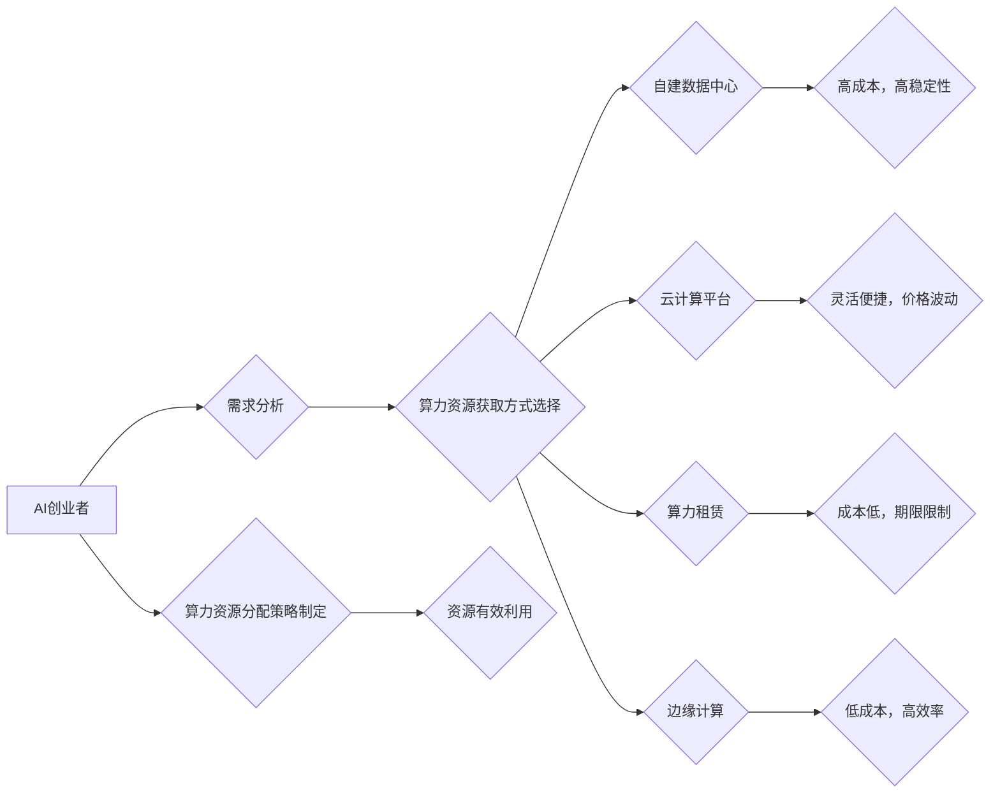

> AI算力、云计算、分布式训练、模型压缩、算力租赁、边缘计算、高效算法

## 1. 背景介绍

人工智能（AI）技术近年来发展迅速，在各个领域都取得了突破性进展。从语音识别、图像识别到自然语言处理，AI正在改变着我们的生活方式。然而，AI技术的快速发展也带来了新的挑战，其中算力资源短缺是最为突出的一项。

AI模型的训练和推理都需要大量的计算资源，而传统的计算硬件难以满足日益增长的需求。对于AI创业者来说，如何获取足够的算力资源，成为了一个关键问题。

## 2. 核心概念与联系

**2.1 算力资源的定义**

算力资源是指用于执行计算任务的硬件和软件资源的总和。在AI领域，算力资源通常指用于训练和推理AI模型的计算能力。

**2.2 AI算力需求的特点**

AI算力需求的特点主要体现在以下几个方面：

* **高计算量:** AI模型的训练和推理都需要大量的计算量，特别是深度学习模型，其参数数量庞大，训练过程极其耗时。
* **并行计算:** AI模型的训练和推理通常采用并行计算的方式，以提高计算效率。
* **数据依赖:** AI模型的训练需要大量的训练数据，而数据处理和预处理也需要一定的计算资源。

**2.3 算力资源获取方式**

AI创业者可以采用以下几种方式获取算力资源：

* **自建数据中心:** 自建数据中心可以提供稳定的算力资源，但成本高昂，维护复杂。
* **云计算平台:** 云计算平台提供按需付费的算力资源，灵活便捷，但价格波动较大。
* **算力租赁:** 算力租赁平台提供短期或长期租赁的算力资源，成本相对较低。
* **边缘计算:** 将计算任务部署到靠近数据源的边缘设备，可以降低数据传输成本，提高计算效率。

**2.4 算力资源分配策略**

AI创业者需要根据实际需求和预算，选择合适的算力资源获取方式，并制定合理的算力资源分配策略，以确保资源的有效利用。

**2.5 Mermaid 流程图**



## 3. 核心算法原理 & 具体操作步骤

**3.1 算法原理概述**

为了应对算力资源的挑战，AI领域涌现出许多高效的算法和技术，例如模型压缩、知识蒸馏、联邦学习等。这些算法旨在通过减少模型参数量、优化模型结构或改变训练方式，来降低算力需求，提高训练效率。

**3.2 算法步骤详解**

**3.2.1 模型压缩**

模型压缩是指通过各种技术手段，减少模型参数量，从而降低模型大小和计算量。常见的模型压缩技术包括：

* **量化:** 将模型参数从高精度浮点数转换为低精度整数，例如8位量化或4位量化。
* **剪枝:** 删除模型中不重要的参数或连接，例如移除权重较小的连接或删除冗余的层。
* **知识蒸馏:** 将大型模型的知识迁移到小型模型中，从而实现模型压缩和性能提升。

**3.2.2 联邦学习**

联邦学习是一种分布式机器学习方法，它允许模型在多个设备上进行训练，而无需将数据集中到一个中心服务器。

联邦学习的训练过程如下：

1. 将模型参数分发到各个设备。
2. 各个设备对本地数据进行训练，并更新模型参数。
3. 各个设备将更新后的模型参数发送回中心服务器。
4. 中心服务器将所有设备的更新参数进行聚合，得到新的全局模型参数。
5. 重复步骤1-4，直到模型收敛。

**3.3 算法优缺点**

**3.3.1 模型压缩**

* **优点:** 可以显著降低模型大小和计算量，提高模型部署效率。
* **缺点:** 模型压缩可能会导致模型精度下降。

**3.3.2 联邦学习**

* **优点:** 可以保护用户隐私，避免数据泄露。
* **缺点:** 训练速度较慢，需要协调多个设备的通信。

**3.4 算法应用领域**

* **模型压缩:** 语音识别、图像识别、自然语言处理等领域。
* **联邦学习:** 医疗保健、金融、电商等领域。

## 4. 数学模型和公式 & 详细讲解 & 举例说明

**4.1 数学模型构建**

模型压缩的目标是找到一个更小的模型，其性能与原始模型尽可能接近。我们可以使用以下数学模型来描述模型压缩过程：

* **损失函数:** 用于衡量模型预测结果与真实值的差异。
* **正则化项:** 用于惩罚模型复杂度，例如L1正则化或L2正则化。

**4.2 公式推导过程**

模型压缩的目标函数可以表示为：

```latex
Loss = Loss_function + λ * Regularization_term
```

其中：

* Loss: 模型损失函数
* Loss_function: 用于衡量模型预测结果与真实值的差异
* λ: 正则化参数
* Regularization_term: 用于惩罚模型复杂度的项

**4.3 案例分析与讲解**

假设我们有一个深度神经网络模型，其参数量为M。我们希望通过模型压缩将其参数量减少到N，其中N<M。我们可以使用以下步骤进行模型压缩：

1. 使用损失函数和正则化项构建模型压缩的目标函数。
2. 使用优化算法，例如梯度下降法，来最小化目标函数。
3. 在优化过程中，逐步减少模型参数量，直到达到目标参数量N。

## 5. 项目实践：代码实例和详细解释说明

**5.1 开发环境搭建**

* 操作系统: Ubuntu 20.04
* Python 版本: 3.8
* 深度学习框架: TensorFlow 2.x

**5.2 源代码详细实现**

```python
import tensorflow as tf

# 定义模型
model = tf.keras.models.Sequential([
    tf.keras.layers.Dense(128, activation='relu', input_shape=(784,)),
    tf.keras.layers.Dense(10, activation='softmax')
])

# 编译模型
model.compile(optimizer='adam',
              loss='sparse_categorical_crossentropy',
              metrics=['accuracy'])

# 加载数据集
(x_train, y_train), (x_test, y_test) = tf.keras.datasets.mnist.load_data()

# 数据预处理
x_train = x_train.reshape(-1, 784).astype('float32') / 255
x_test = x_test.reshape(-1, 784).astype('float32') / 255

# 模型训练
model.fit(x_train, y_train, epochs=5)

# 模型评估
loss, accuracy = model.evaluate(x_test, y_test)
print('Test loss:', loss)
print('Test accuracy:', accuracy)
```

**5.3 代码解读与分析**

这段代码实现了MNIST手写数字识别任务的深度学习模型训练。

* 首先，定义了一个简单的深度神经网络模型，包含两层全连接层。
* 然后，使用Adam优化器和交叉熵损失函数对模型进行编译。
* 接着，加载MNIST数据集并进行数据预处理，将图像数据转换为向量形式并归一化。
* 最后，使用模型训练函数对模型进行训练，并使用模型评估函数评估模型性能。

**5.4 运行结果展示**

运行这段代码后，会输出模型在测试集上的损失值和准确率。

## 6. 实际应用场景

**6.1 语音识别**

语音识别系统需要处理大量的语音数据，进行复杂的语音特征提取和模型训练。

**6.2 图像识别**

图像识别系统需要识别图像中的物体、场景和文本等信息，需要大量的图像数据和计算资源。

**6.3 自然语言处理**

自然语言处理系统需要理解和生成人类语言，需要处理大量的文本数据和进行复杂的语义分析。

**6.4 未来应用展望**

随着算力资源的不断发展，AI技术将应用于更多领域，例如自动驾驶、医疗诊断、金融风险控制等。

## 7. 工具和资源推荐

**7.1 学习资源推荐**

* **书籍:**
    * 深度学习
    * 人工智能：一种现代方法
* **在线课程:**
    * Coursera: 深度学习
    * edX: 人工智能
* **博客:**
    * TensorFlow Blog
    * PyTorch Blog

**7.2 开发工具推荐**

* **深度学习框架:** TensorFlow, PyTorch, Keras
* **云计算平台:** AWS, Azure, Google Cloud
* **算力租赁平台:** Paperspace, FloydHub

**7.3 相关论文推荐**

* **模型压缩:**
    * MobileNet: Efficient Convolutional Neural Networks for Mobile Vision Applications
    * SqueezeNet: AlexNet-level accuracy with 50x fewer parameters and <0.5MB model size
* **联邦学习:**
    * Federated Learning: Collaborative Machine Learning without Centralized Training Data
    * Communication-Efficient Learning of Deep Networks from Decentralized Data

## 8. 总结：未来发展趋势与挑战

**8.1 研究成果总结**

近年来，在AI算力资源挑战方面取得了显著进展，例如模型压缩、联邦学习等技术不断发展，为AI创业者提供了更多选择。

**8.2 未来发展趋势**

* **更加高效的算法:** 研究人员将继续探索更加高效的算法，以进一步降低算力需求。
* **更强大的硬件:** 硬件厂商将继续开发更加强大的GPU和TPU等硬件，以提高算力水平。
* **更灵活的算力资源分配:** 云计算平台和算力租赁平台将提供更加灵活的算力资源分配方案，以满足不同用户的需求。

**8.3 面临的挑战**

* **算力成本:** 即使算力资源变得更加丰富，成本仍然是一个挑战。
* **数据隐私:** 联邦学习等技术可以保护用户隐私，但仍然存在一些挑战。
* **算法可解释性:** 许多AI算法是黑盒模型，难以解释其决策过程，这可能会阻碍AI技术的广泛应用。

**8.4 研究展望**

未来，AI算力资源挑战将继续是AI领域的重要研究方向。研究人员将继续探索新的算法、硬件和资源分配方案，以推动AI技术的进步。

## 9. 附录：常见问题与解答

**9.1 如何选择合适的算力资源获取方式？**

选择合适的算力资源获取方式取决于用户的具体需求和预算。

* 如果需要高稳定性和高性能，可以选择自建数据中心。
* 如果需要灵活便捷和按需付费，可以选择云计算平台。
* 如果需要低成本和短期使用，可以选择算力租赁。

**9.2 如何进行模型压缩？**

模型压缩可以通过量化、剪枝和知识蒸馏等技术实现。

**9.3 如何进行联邦学习？**

联邦学习需要协调多个设备的通信，并使用特殊的训练算法。

**9.4 如何解决数据隐私问题？**

联邦学习可以保护用户隐私，但仍然需要采取一些措施，例如数据加密和匿名化。


作者：禅与计算机程序设计艺术 / Zen and the Art of Computer Programming 
<end_of_turn>