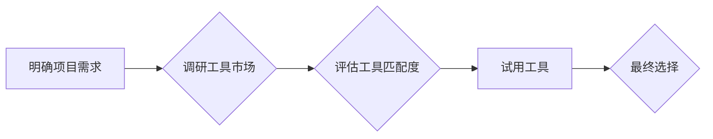

> AI创业,工具选择,机器学习,深度学习,云计算,数据科学,开发平台

## 1. 背景介绍

在人工智能（AI）蓬勃发展的时代，AI创业正成为一个炙手可热的领域。越来越多的创业者看到了AI技术的巨大潜力，希望利用AI技术来解决现实问题，创造新的价值。然而，AI创业并非易事，选择合适的工具是创业成功的关键因素之一。

传统的软件开发工具已经无法满足AI创业的需求，因为AI开发需要处理海量数据、训练复杂的模型，并部署到各种不同的环境中。因此，AI创业者需要选择专门针对AI开发设计的工具和平台。

## 2. 核心概念与联系

**2.1 AI开发工具体系**

AI开发工具体系可以分为以下几个主要类别：

* **数据处理工具:** 用于收集、清洗、转换和分析数据，例如Apache Spark、Hadoop、Pandas等。
* **机器学习工具:** 用于构建和训练机器学习模型，例如Scikit-learn、TensorFlow、PyTorch等。
* **深度学习工具:** 用于构建和训练深度学习模型，例如TensorFlow、PyTorch、Keras等。
* **云计算平台:** 提供计算资源、存储空间和网络服务，例如AWS、Azure、GCP等。
* **AI开发平台:** 集成了数据处理、机器学习、深度学习等功能的平台，例如Google AI Platform、Amazon SageMaker、Microsoft Azure Machine Learning等。

**2.2 工具选择原则**

选择合适的AI开发工具需要考虑以下几个原则：

* **项目需求:** 不同的AI项目有不同的需求，例如数据规模、模型复杂度、部署环境等。
* **技术栈:** 选择与现有技术栈兼容的工具，可以降低开发成本和时间。
* **易用性:** 选择易于学习和使用的工具，可以提高开发效率。
* **社区支持:** 选择拥有活跃社区支持的工具，可以获得及时帮助和资源。
* **成本效益:** 选择性价比高的工具，可以降低开发成本。

**2.3 工具选择流程**

AI创业者可以选择以下流程来选择合适的工具：

1. **明确项目需求:** 确定项目的具体目标、数据规模、模型复杂度、部署环境等。
2. **调研工具市场:** 了解市场上有哪些AI开发工具，并比较它们的特性、优势和劣势。
3. **评估工具匹配度:** 根据项目需求和技术栈，评估不同工具的匹配度。
4. **试用工具:** 选择几款合适的工具进行试用，并进行评估和比较。
5. **最终选择:** 根据试用结果和综合考虑，最终选择最合适的工具。

**2.4 工具选择流程图**

## 3. 核心算法原理 & 具体操作步骤

**3.1 算法原理概述**

**3.2 算法步骤详解**

**3.3 算法优缺点**

**3.4 算法应用领域**

## 4. 数学模型和公式 & 详细讲解 & 举例说明

**4.1 数学模型构建**

**4.2 公式推导过程**

**4.3 案例分析与讲解**

## 5. 项目实践：代码实例和详细解释说明

**5.1 开发环境搭建**

**5.2 源代码详细实现**

**5.3 代码解读与分析**

**5.4 运行结果展示**

## 6. 实际应用场景

**6.1 应用场景介绍**

**6.2 案例分析**

**6.3 优势与挑战**

**6.4 未来应用展望**

## 7. 工具和资源推荐

**7.1 学习资源推荐**

**7.2 开发工具推荐**

**7.3 相关论文推荐**

## 8. 总结：未来发展趋势与挑战

**8.1 研究成果总结**

**8.2 未来发展趋势**

**8.3 面临的挑战**

**8.4 研究展望**

## 9. 附录：常见问题与解答

**9.1 常见问题**

**9.2 问题解答**

作者：禅与计算机程序设计艺术 / Zen and the Art of Computer Programming

<end_of_turn>