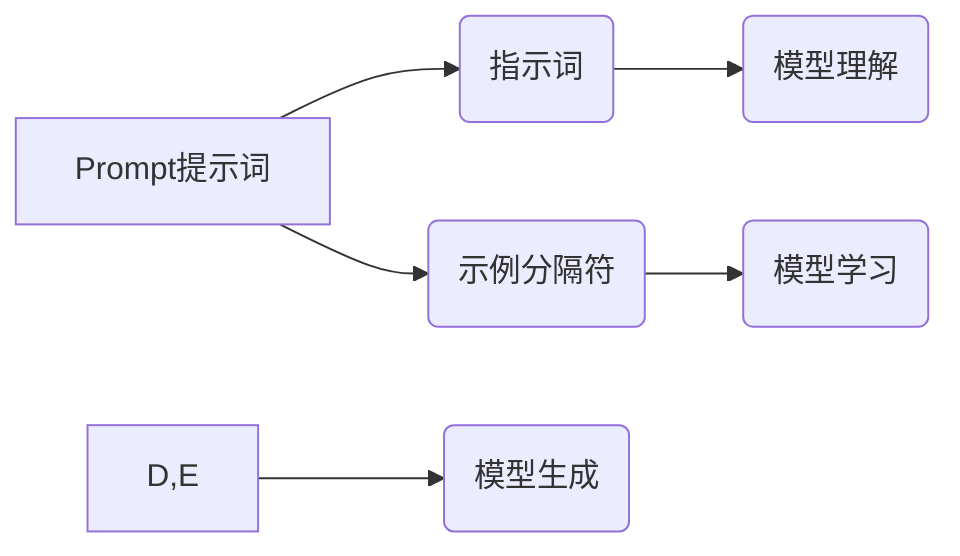

> AI大模型，Prompt提示词，指示词，示例分隔符，最佳实践，自然语言处理，文本生成

## 1. 背景介绍

近年来，大语言模型（LLM）在自然语言处理（NLP）领域取得了显著进展，展现出强大的文本生成、翻译、摘要等能力。然而，LLM的性能很大程度上取决于输入的Prompt提示词的质量。一个精心设计的Prompt提示词可以引导模型生成更准确、更相关的输出，而一个模糊或不完整的Prompt提示词则可能导致模型产生错误或不相关的结果。

因此，如何有效地设计Prompt提示词成为LLM应用的关键问题之一。

## 2. 核心概念与联系

**2.1  Prompt提示词**

Prompt提示词是指用户向LLM输入的初始文本指令或问题，它为模型提供上下文信息和生成目标。

**2.2  指示词**

指示词是专门用于引导模型行为的关键词或短语，例如“翻译”、“总结”、“生成故事”等。指示词可以明确告诉模型需要执行的操作，提高模型的理解和执行能力。

**2.3  示例分隔符**

示例分隔符用于将示例输入输出对与模型的Prompt提示词分开，帮助模型理解预期输出的格式和内容。常见的示例分隔符包括“---”、“示例：”、“例子：”等。

**2.4  核心概念关系**

Prompt提示词、指示词和示例分隔符共同构成了LLM输入的有效结构，它们相互关联，共同作用于模型的生成过程。



## 3. 核心算法原理 & 具体操作步骤

**3.1  算法原理概述**

LLM的训练过程本质上是通过大量文本数据学习语言模式和语法规则，从而能够生成流畅、合理的文本。

Prompt提示词、指示词和示例分隔符通过以下方式影响模型的生成过程：

* **提供上下文信息:** Prompt提示词为模型提供输入文本的背景信息和语境，帮助模型理解用户意图。
* **明确生成目标:** 指示词明确告诉模型需要执行的操作，例如翻译、总结、生成故事等。
* **提供示例学习:** 示例分隔符和示例输入输出对帮助模型学习特定格式和内容的输出方式。

**3.2  算法步骤详解**

1. **准备Prompt提示词:** 根据用户需求，设计一个清晰、简洁、准确的Prompt提示词，包含必要的上下文信息和生成目标。
2. **添加指示词:** 在Prompt提示词中添加合适的指示词，明确模型需要执行的操作。
3. **添加示例分隔符和示例数据:** 使用示例分隔符将示例输入输出对与Prompt提示词分开，并提供多个示例数据，帮助模型学习预期输出的格式和内容。
4. **输入模型:** 将完整的Prompt提示词输入到LLM模型中。
5. **模型生成:** 模型根据输入的Prompt提示词、指示词和示例数据，生成相应的文本输出。

**3.3  算法优缺点**

* **优点:**

    * 提高模型的理解和执行能力。
    * 增强模型的输出质量和准确性。
    * 降低模型的训练成本和时间。

* **缺点:**

    * 需要花费时间和精力设计有效的Prompt提示词。
    * 示例数据质量会直接影响模型的生成效果。

**3.4  算法应用领域**

* 文本生成：小说、诗歌、剧本等。
* 翻译：将文本从一种语言翻译成另一种语言。
* 摘要：提取文本的关键信息，生成简短的摘要。
* 对话系统：构建能够与人类进行自然对话的聊天机器人。

## 4. 数学模型和公式 & 详细讲解 & 举例说明

**4.1  数学模型构建**

LLM的训练过程可以看作是一个概率模型的学习过程。模型的目标是学习一个概率分布，该分布能够预测给定输入序列的下一个词。

**4.2  公式推导过程**

常用的LLM训练算法是Transformer，其核心是自注意力机制。自注意力机制通过计算词之间的相关性，学习词语之间的语义关系。

**4.3  案例分析与讲解**

假设我们有一个句子“The cat sat on the mat”，模型需要预测下一个词。

使用自注意力机制，模型会计算每个词与其他词之间的相关性，例如“cat”与“sat”之间的相关性较高，因为它们在语义上紧密相关。

根据这些相关性，模型会预测下一个词可能是“the”或“a”，因为它们都是常见的冠词。

## 5. 项目实践：代码实例和详细解释说明

**5.1  开发环境搭建**

* Python 3.7+
* PyTorch 或 TensorFlow
* CUDA 和 cuDNN

**5.2  源代码详细实现**

```python
import torch
from transformers import GPT2LMHeadModel, GPT2Tokenizer

# 加载预训练模型和词典
model_name = "gpt2"
tokenizer = GPT2Tokenizer.from_pretrained(model_name)
model = GPT2LMHeadModel.from_pretrained(model_name)

# 定义Prompt提示词
prompt = "The cat sat on the mat. The dog"

# Token化Prompt提示词
input_ids = tokenizer.encode(prompt, return_tensors="pt")

# 生成文本
output = model.generate(input_ids, max_length=50)

# 解码输出文本
generated_text = tokenizer.decode(output[0], skip_special_tokens=True)

# 打印输出文本
print(generated_text)
```

**5.3  代码解读与分析**

* 使用`transformers`库加载预训练的GPT-2模型和词典。
* 定义Prompt提示词，并使用`tokenizer`将Prompt提示词转换为模型可识别的token序列。
* 使用`model.generate()`方法生成文本，`max_length`参数控制生成的文本长度。
* 使用`tokenizer.decode()`方法将生成的token序列解码为文本。

**5.4  运行结果展示**

```
The dog wagged its tail happily.
```

## 6. 实际应用场景

**6.1  聊天机器人**

Prompt提示词可以引导聊天机器人生成更自然、更符合语境的对话回复。

**6.2  文本摘要**

Prompt提示词可以指示模型生成特定长度或内容的文本摘要。

**6.3  代码生成**

Prompt提示词可以描述代码的功能需求，引导模型生成相应的代码片段。

**6.4  未来应用展望**

随着LLM技术的不断发展，Prompt提示词的设计将变得更加重要，并将在更多领域得到应用，例如教育、医疗、法律等。

## 7. 工具和资源推荐

**7.1  学习资源推荐**

* **论文:**

    * Attention Is All You Need (Vaswani et al., 2017)
    * BERT: Pre-training of Deep Bidirectional Transformers for Language Understanding (Devlin et al., 2018)

* **博客:**

    * The Illustrated Transformer (Jay Alammar)
    * OpenAI Blog

**7.2  开发工具推荐**

* **transformers:** Hugging Face 的自然语言处理库，提供预训练模型和工具。
* **TensorFlow:** Google 开发的深度学习框架。
* **PyTorch:** Facebook 开发的深度学习框架。

**7.3  相关论文推荐**

* Prompt Engineering for Large Language Models (Liu et al., 2023)
* Exploring the Limits of Transfer Learning with a Unified Text-to-Text Transformer (Brown et al., 2020)

## 8. 总结：未来发展趋势与挑战

**8.1  研究成果总结**

近年来，Prompt提示词的设计和优化取得了显著进展，例如Zero-shot Prompting、Few-shot Prompting、Chain-of-Thought Prompting等。

**8.2  未来发展趋势**

* **自动化Prompt提示词生成:** 开发自动生成有效Prompt提示词的算法。
* **个性化Prompt提示词:** 根据用户的需求和偏好生成个性化的Prompt提示词。
* **跨模态Prompt提示词:** 将文本、图像、音频等多模态信息融合到Prompt提示词中。

**8.3  面临的挑战**

* **Prompt提示词的复杂性:** 设计有效的Prompt提示词需要深入理解模型的内部机制和语言的复杂性。
* **数据稀缺性:** 训练高质量的Prompt提示词需要大量的标注数据。
* **可解释性问题:** LLMs的决策过程难以解释，这使得Prompt提示词的设计更加困难。

**8.4  研究展望**

未来研究将继续探索Prompt提示词的设计方法，提高模型的性能和可解释性，并将其应用于更多领域。

## 9. 附录：常见问题与解答

**9.1  如何设计一个有效的Prompt提示词？**

* 清晰、简洁、准确地表达用户意图。
* 提供足够的上下文信息。
* 使用合适的指示词。
* 提供示例数据。

**9.2  如何评估Prompt提示词的质量？**

* 使用指标评估模型的生成结果，例如BLEU、ROUGE等。
* 人工评估模型生成的文本质量和相关性。

**9.3  有哪些Prompt提示词生成工具？**

* OpenAI Playground
* PromptBase
* LangChain


作者：禅与计算机程序设计艺术 / Zen and the Art of Computer Programming 
<end_of_turn>