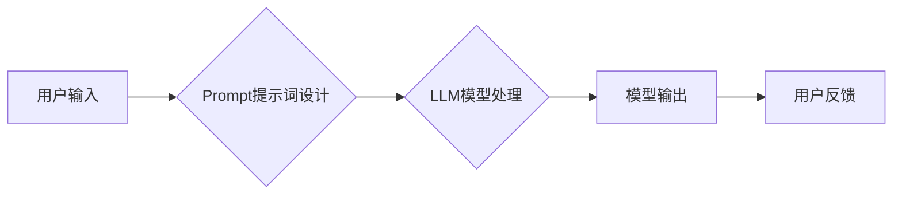

> AI大模型,Prompt提示词,最佳实践,自然语言处理,机器学习,深度学习,文本生成,对话系统

## 1. 背景介绍

近年来，人工智能（AI）技术取得了飞速发展，特别是大语言模型（LLM）的出现，为自然语言处理（NLP）领域带来了革命性的变革。这些强大的模型能够理解和生成人类语言，在文本生成、机器翻译、问答系统等领域展现出令人惊叹的性能。然而，LLM的性能很大程度上取决于输入的Prompt提示词。

Prompt提示词是与LLM交互的关键，它引导模型理解用户意图并生成相应的输出。一个精心设计的Prompt提示词可以显著提升模型的准确性和生成质量，而一个模糊或不完整的Prompt提示词则可能导致模型产生错误或不相关的输出。因此，学习如何编写高质量的Prompt提示词对于充分利用LLM的潜力至关重要。

## 2. 核心概念与联系

**2.1  LLM与Prompt提示词的关系**

LLM本质上是一个复杂的数学模型，它通过学习海量文本数据来掌握语言的规律和结构。然而，LLM本身并不能理解用户的意图，它需要通过Prompt提示词来获取任务信息和上下文。

**2.2  Prompt提示词的类型**

Prompt提示词可以分为多种类型，常见的类型包括：

* **文本填充型Prompt:** 要求模型填充缺失的文本内容，例如“The cat sat on the ____”。
* **文本生成型Prompt:** 要求模型生成一段新的文本内容，例如“写一篇关于人工智能的文章”。
* **问答型Prompt:** 要求模型回答用户的提问，例如“什么是人工智能？”。
* **对话型Prompt:** 要求模型参与一段对话，例如“你好，请问今天天气怎么样？”。

**2.3  Prompt提示词的设计原则**

编写高质量的Prompt提示词需要遵循以下原则：

* **明确性:** Prompt提示词应该清晰地表达用户的意图，避免歧义和模糊性。
* **具体性:** Prompt提示词应该提供足够的上下文信息，帮助模型理解任务的背景和目标。
* **简洁性:** Prompt提示词应该尽量简洁明了，避免冗余和不必要的细节。
* **一致性:** Prompt提示词应该与模型的训练数据和预期输出保持一致。

**2.4  Mermaid 流程图**



## 3. 核心算法原理 & 具体操作步骤

**3.1  算法原理概述**

LLM通常基于Transformer架构，它利用注意力机制来捕捉文本序列中的长距离依赖关系。在处理Prompt提示词时，LLM会将提示词和上下文信息编码成向量表示，然后根据训练数据学习到的语言规律，预测下一个词的概率分布。

**3.2  算法步骤详解**

1. **词嵌入:** 将Prompt提示词中的每个词转换为向量表示，每个词的向量表示可以理解为该词在语义空间中的位置。
2. **编码:** 使用Transformer编码器将Prompt提示词和上下文信息编码成一个固定长度的向量表示。
3. **解码:** 使用Transformer解码器根据编码后的向量表示，预测下一个词的概率分布。
4. **生成:** 根据概率分布选择最可能的词，并将其添加到输出序列中。重复步骤3和4，直到生成一个完整的文本序列。

**3.3  算法优缺点**

* **优点:** 能够捕捉文本序列中的长距离依赖关系，生成流畅自然的文本。
* **缺点:** 计算量大，训练成本高，需要大量的训练数据。

**3.4  算法应用领域**

* 文本生成
* 机器翻译
* 问答系统
* 对话系统
* 代码生成

## 4. 数学模型和公式 & 详细讲解 & 举例说明

**4.1  数学模型构建**

LLM通常使用神经网络模型，其中包含多个隐藏层。每个隐藏层都包含多个神经元，这些神经元通过权重连接在一起。

**4.2  公式推导过程**

LLM的训练过程是通过反向传播算法来进行的。反向传播算法的核心思想是通过计算损失函数的梯度，来更新模型的权重。

损失函数通常是交叉熵损失函数，它衡量模型预测的概率分布与真实分布之间的差异。

**4.3  案例分析与讲解**

假设我们有一个简单的LLM模型，它有两个隐藏层，每个隐藏层包含4个神经元。

我们可以使用Python语言来实现这个模型，并使用TensorFlow框架来进行训练。

## 5. 项目实践：代码实例和详细解释说明

**5.1  开发环境搭建**

需要安装Python语言、TensorFlow框架和必要的库。

**5.2  源代码详细实现**

```python
import tensorflow as tf

# 定义模型结构
model = tf.keras.Sequential([
    tf.keras.layers.Embedding(input_dim=10000, output_dim=128),
    tf.keras.layers.LSTM(units=64),
    tf.keras.layers.Dense(units=10000, activation='softmax')
])

# 编译模型
model.compile(optimizer='adam', loss='sparse_categorical_crossentropy', metrics=['accuracy'])

# 训练模型
model.fit(x_train, y_train, epochs=10)

# 评估模型
loss, accuracy = model.evaluate(x_test, y_test)
print('Loss:', loss)
print('Accuracy:', accuracy)
```

**5.3  代码解读与分析**

* `tf.keras.layers.Embedding`: 将词嵌入为向量表示。
* `tf.keras.layers.LSTM`: 使用LSTM单元来捕捉文本序列中的长距离依赖关系。
* `tf.keras.layers.Dense`: 全连接层，用于预测下一个词的概率分布。
* `optimizer='adam'`: 使用Adam优化器来更新模型的权重。
* `loss='sparse_categorical_crossentropy'`: 使用交叉熵损失函数来衡量模型的性能。
* `metrics=['accuracy']`: 使用准确率作为评估指标。

**5.4  运行结果展示**

训练完成后，我们可以使用模型来生成文本。

## 6. 实际应用场景

**6.1  文本生成**

LLM可以用于生成各种类型的文本，例如小说、诗歌、新闻报道、代码等。

**6.2  机器翻译**

LLM可以用于将文本从一种语言翻译成另一种语言。

**6.3  问答系统**

LLM可以用于构建问答系统，能够回答用户的各种问题。

**6.4  未来应用展望**

LLM在未来将有更广泛的应用场景，例如：

* 个性化教育
* 智能客服
* 创意写作辅助
* 科学研究

## 7. 工具和资源推荐

**7.1  学习资源推荐**

* **书籍:**
    * 《深度学习》
    * 《自然语言处理》
* **在线课程:**
    * Coursera
    * edX
* **博客:**
    * Jay Alammar's Blog
    * The Gradient

**7.2  开发工具推荐**

* **TensorFlow:** 开源深度学习框架
* **PyTorch:** 开源深度学习框架
* **Hugging Face Transformers:** 提供预训练的LLM模型和工具

**7.3  相关论文推荐**

* **BERT:** Pre-training of Deep Bidirectional Transformers for Language Understanding
* **GPT-3:** Language Models are Few-Shot Learners
* **T5:** Text-to-Text Transfer Transformer

## 8. 总结：未来发展趋势与挑战

**8.1  研究成果总结**

近年来，LLM取得了显著的进展，在文本生成、机器翻译、问答系统等领域展现出强大的能力。

**8.2  未来发展趋势**

* 模型规模的进一步扩大
* 训练数据的多样化和高质量化
* 算法的创新和改进
* 伦理和安全问题的研究

**8.3  面临的挑战**

* 计算资源的限制
* 训练数据的标注成本
* 模型的解释性和可解释性
* 伦理和安全问题

**8.4  研究展望**

未来，LLM的研究将继续朝着更强大、更安全、更可解释的方向发展。


## 9. 附录：常见问题与解答

**9.1  如何选择合适的Prompt提示词？**

* 明确你的目标
* 提供足够的上下文信息
* 使用简洁明了的语言
* 测试不同的Prompt提示词

**9.2  如何提高LLM的生成质量？**

* 使用高质量的训练数据
* 调整模型的超参数
* 使用更复杂的模型架构
* 使用Prompt提示词引导模型

**9.3  LLM有哪些伦理和安全问题？**

* 偏见和歧视
* 虚假信息生成
* 隐私泄露
* 恶意利用

作者：禅与计算机程序设计艺术 / Zen and the Art of Computer Programming


<end_of_turn>