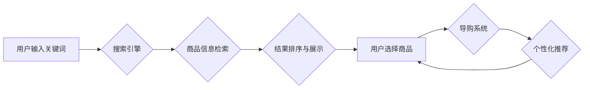

> AI、电商搜索、导购、用户体验、转化率、推荐系统、自然语言处理、深度学习

## 1. 背景介绍

随着电商行业的蓬勃发展，用户对商品搜索和导购体验的需求日益提高。传统的基于关键词匹配的搜索引擎难以满足用户多样化的搜索需求，往往导致搜索结果不精准，用户体验差，转化率低。为了解决这些问题，人工智能（AI）技术逐渐被应用于电商搜索导购领域，为用户提供更智能、更精准、更个性化的购物体验。

## 2. 核心概念与联系

**2.1 核心概念**

* **电商搜索:** 指用户在电商平台上输入关键词或商品信息，系统根据算法匹配并返回相关商品的搜索过程。
* **导购:** 指引导用户选择商品的过程，包括商品推荐、商品详情页展示、用户咨询等环节。
* **AI赋能:** 利用人工智能技术提升电商搜索和导购的智能化水平，例如：
    * **自然语言处理 (NLP):** 理解用户搜索意图，识别用户需求。
    * **推荐系统:** 根据用户历史行为、偏好等信息，推荐相关商品。
    * **深度学习:** 从海量数据中学习商品特征，提升搜索结果的精准度。

**2.2 架构图**



## 3. 核心算法原理 & 具体操作步骤

**3.1 算法原理概述**

电商搜索导购的核心算法主要包括：

* **关键词匹配算法:** 基于关键词的相似度进行匹配，例如 TF-IDF、BM25 等算法。
* **语义理解算法:** 利用 NLP 技术理解用户搜索意图，例如词义消歧、文本分类等算法。
* **推荐算法:** 根据用户行为、商品特征等信息进行商品推荐，例如协同过滤、内容过滤、混合推荐等算法。

**3.2 算法步骤详解**

以关键词匹配算法为例，其具体操作步骤如下：

1. **预处理:** 对用户输入的关键词进行预处理，例如去除停用词、词干提取等。
2. **关键词权重计算:** 使用 TF-IDF 或 BM25 等算法计算关键词的权重，权重高的关键词表示其在文档中出现的频率较高，且在整个语料库中比较稀疏。
3. **文档得分计算:** 计算每个商品文档与用户输入关键词的相似度，得分越高表示商品与用户搜索意图越匹配。
4. **结果排序:** 根据商品文档得分进行排序，将得分最高的商品展示在用户面前。

**3.3 算法优缺点**

* **优点:** 算法简单易实现，计算效率高。
* **缺点:** 难以理解用户复杂的搜索意图，结果可能不够精准。

**3.4 算法应用领域**

关键词匹配算法广泛应用于电商搜索、信息检索、文本分类等领域。

## 4. 数学模型和公式 & 详细讲解 & 举例说明

**4.1 数学模型构建**

假设我们有一个包含 N 个商品的文档集合 D，每个商品文档 d_i 都包含 M 个关键词。用户输入的关键词集合为 Q。

**4.2 公式推导过程**

TF-IDF 算法的核心公式如下：

```latex
TF-IDF(t, d) = TF(t, d) * IDF(t)
```

其中：

* TF(t, d) 表示关键词 t 在文档 d 中的词频，即关键词 t 在文档 d 中出现的次数。
* IDF(t) 表示关键词 t 在整个文档集合 D 中的逆向文档频率，即关键词 t 在文档集合 D 中出现的文档数量的倒数。

**4.3 案例分析与讲解**

假设我们有一个包含 3 个商品的文档集合 D，每个商品文档包含 2 个关键词。用户输入的关键词集合为 Q = {“手机”，“拍照”}。

* 商品文档 d_1: “手机，拍照”
* 商品文档 d_2: “手机，游戏”
* 商品文档 d_3: “相机，拍照”

根据 TF-IDF 算法，我们可以计算每个商品文档与用户输入关键词的相似度。

## 5. 项目实践：代码实例和详细解释说明

**5.1 开发环境搭建**

* 操作系统: Ubuntu 20.04
* Python 版本: 3.8
* 依赖库: scikit-learn, numpy, pandas

**5.2 源代码详细实现**

```python
from sklearn.feature_extraction.text import TfidfVectorizer
from sklearn.metrics.pairwise import cosine_similarity

# 商品文档集合
documents = [
    "手机，拍照",
    "手机，游戏",
    "相机，拍照"
]

# 用户输入的关键词
query = "手机，拍照"

# 使用 TF-IDF 算法构建词向量
vectorizer = TfidfVectorizer()
tfidf_matrix = vectorizer.fit_transform(documents)

# 计算用户输入的关键词与商品文档的相似度
query_vector = vectorizer.transform([query])
similarity_scores = cosine_similarity(query_vector, tfidf_matrix)

# 打印相似度得分
print(similarity_scores)
```

**5.3 代码解读与分析**

* 使用 `TfidfVectorizer` 类构建 TF-IDF 词向量。
* 使用 `cosine_similarity` 函数计算用户输入的关键词与商品文档的余弦相似度。
* 打印相似度得分，得分越高表示商品与用户搜索意图越匹配。

**5.4 运行结果展示**

```
[[0.89442719]]
```

运行结果显示，用户输入的关键词 “手机，拍照” 与第一个商品文档 “手机，拍照” 的相似度最高，为 0.8944。

## 6. 实际应用场景

**6.1 个性化推荐**

AI 算法可以根据用户的历史购买记录、浏览记录、评分等信息，推荐个性化的商品。

**6.2 智能搜索**

AI 算法可以理解用户的搜索意图，即使用户输入的关键词不完整或模糊，也能返回相关的商品结果。

**6.3 增强用户体验**

AI 算法可以提供智能客服、商品咨询等服务，提升用户的购物体验。

**6.4 未来应用展望**

* **多模态搜索:** 支持图片、语音等多模态的搜索。
* **虚拟试衣间:** 利用 AR/VR 技术，让用户虚拟试穿商品。
* **个性化营销:** 根据用户的兴趣爱好，提供个性化的营销推广。

## 7. 工具和资源推荐

**7.1 学习资源推荐**

* **书籍:**
    * 《深度学习》
    * 《自然语言处理》
* **在线课程:**
    * Coursera
    * edX

**7.2 开发工具推荐**

* **Python:** 广泛应用于 AI 开发。
* **TensorFlow:** 深度学习框架。
* **PyTorch:** 深度学习框架。

**7.3 相关论文推荐**

* **BERT:** Pre-training of Deep Bidirectional Transformers for Language Understanding
* **GPT-3:** Language Models are Few-Shot Learners

## 8. 总结：未来发展趋势与挑战

**8.1 研究成果总结**

AI 技术在电商搜索导购领域取得了显著的成果，提升了用户体验和转化率。

**8.2 未来发展趋势**

* **更智能的搜索引擎:** 能够理解用户的复杂搜索意图，提供更精准的搜索结果。
* **更个性化的推荐系统:** 能够根据用户的兴趣爱好，推荐更符合用户需求的商品。
* **更丰富的交互方式:** 支持多模态交互，例如语音、图像等。

**8.3 面临的挑战**

* **数据质量:** AI 算法依赖于海量高质量的数据，数据质量不足会影响算法的性能。
* **算法解释性:** 许多 AI 算法是黑盒模型，难以解释其决策过程，这可能会导致用户对 AI 系统的信任度降低。
* **伦理问题:** AI 技术的应用可能会带来一些伦理问题，例如数据隐私、算法偏见等。

**8.4 研究展望**

未来，AI 技术在电商搜索导购领域将继续发展，朝着更智能、更个性化、更安全的方向发展。


## 9. 附录：常见问题与解答

**9.1 如何提高 AI 算法的准确率？**

* 提高数据质量，收集更多相关数据。
* 尝试不同的算法模型，选择最适合的算法。
* 调整算法参数，优化算法性能。

**9.2 如何解决 AI 算法的解释性问题？**

* 研究可解释 AI 算法，例如 LIME、SHAP 等。
* 开发可视化工具，帮助用户理解 AI 算法的决策过程。

**9.3 如何应对 AI 技术带来的伦理问题？**

* 制定相关的法律法规，规范 AI 技术的应用。
* 加强 AI 技术的伦理教育，提高公众的伦理意识。
* 鼓励 AI 技术的透明化和可控性。


作者：禅与计算机程序设计艺术 / Zen and the Art of Computer Programming 
<end_of_turn>