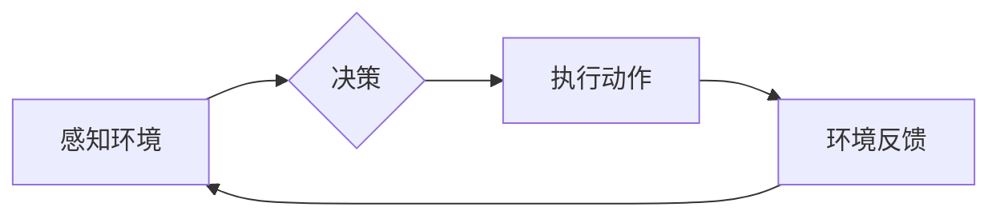

> AI, 代理, 智能体, 决策, 规划, 环境交互, 强化学习, 

## 1. 背景介绍

在人工智能领域，代理的概念扮演着至关重要的角色。代理可以被理解为一个能够感知环境、做出决策并与环境交互的智能体。它代表着AI系统与外部世界进行交互的桥梁，是实现AI应用的关键组成部分。

随着人工智能技术的不断发展，代理的概念也得到了越来越广泛的应用。从自动驾驶汽车到智能家居，从机器人控制到金融交易，代理都扮演着重要的角色。

## 2. 核心概念与联系

**2.1 代理的定义**

代理是一个能够感知环境、做出决策并与环境交互的智能体。它可以是软件程序、机器人、甚至人类。代理的目标通常是最大化其在环境中获得的回报。

**2.2 代理的类型**

代理可以根据其感知能力、决策方式和交互方式进行分类：

* **感知能力:**
    * **完全感知代理:** 可以感知环境中所有相关信息。
    * **部分感知代理:** 只能感知环境中的一部分信息。
* **决策方式:**
    * **确定性代理:** 在给定状态下，总是做出相同的决策。
    * **随机代理:** 在给定状态下，可能做出不同的决策。
* **交互方式:**
    * **单代理:** 只有一个代理与环境交互。
    * **多代理:** 多个代理与环境交互。

**2.3 代理与环境的交互**

代理与环境的交互是一个循环过程，包括以下步骤：

1. 代理感知环境。
2. 代理根据感知到的信息做出决策。
3. 代理与环境交互，执行决策。
4. 环境反馈给代理，代理感知新的状态。

**2.4 代理的架构**

代理的架构通常包括以下几个部分：

* **感知模块:** 用于感知环境信息。
* **决策模块:** 用于根据感知到的信息做出决策。
* **执行模块:** 用于执行决策，与环境交互。

**2.5 Mermaid 流程图**



## 3. 核心算法原理 & 具体操作步骤

**3.1 算法原理概述**

代理的决策通常基于一些算法，例如：

* **模型预测控制 (MPC):**  一种基于模型预测的控制算法，可以预测未来环境状态，并选择最优的控制策略。
* **强化学习 (RL):**  一种基于奖励机制的学习算法，代理通过与环境交互，学习最优的策略，以最大化其获得的奖励。
* **图搜索算法:**  用于在状态空间中搜索最优路径，例如 A* 算法。

**3.2 算法步骤详解**

以强化学习为例，其基本步骤如下：

1. **环境初始化:** 设置环境初始状态。
2. **代理选择动作:** 代理根据当前状态选择一个动作。
3. **环境反馈:** 环境根据代理的动作，给出新的状态和奖励。
4. **更新策略:** 代理根据奖励信息，更新其策略，以提高未来获得奖励的概率。
5. **重复步骤 2-4:** 直到代理达到预设的目标或终止条件。

**3.3 算法优缺点**

* **优点:** 能够学习复杂环境下的最优策略，无需事先定义规则。
* **缺点:** 训练过程可能需要大量时间和数据，容易陷入局部最优。

**3.4 算法应用领域**

* **机器人控制:**  使机器人能够自主学习完成任务。
* **游戏 AI:**  使游戏中的 AI 更加智能和具有挑战性。
* **推荐系统:**  根据用户的行为历史，推荐更符合用户偏好的内容。

## 4. 数学模型和公式 & 详细讲解 & 举例说明

**4.1 数学模型构建**

强化学习的数学模型通常包括以下几个要素:

* **状态空间 (S):** 环境可能存在的全部状态。
* **动作空间 (A):** 代理可以执行的所有动作。
* **奖励函数 (R):**  代理在特定状态执行特定动作后获得的奖励。
* **策略 (π):**  代理在特定状态下选择动作的概率分布。

**4.2 公式推导过程**

强化学习的目标是找到最优策略 π*，使得代理在长期的交互过程中获得最大的总奖励。

最优策略的定义是：

π* = argmax ∑<sub>t=0</sub><sup>∞</sup> γ<sup>t</sup> R(s<sub>t</sub>, a<sub>t</sub>)

其中：

* γ 是折扣因子，控制未来奖励的权重。
* R(s<sub>t</sub>, a<sub>t</sub>) 是代理在状态 s<sub>t</sub> 执行动作 a<sub>t</sub> 后获得的奖励。

**4.3 案例分析与讲解**

例如，在一个简单的迷宫环境中，代理的目标是找到通往出口的路径。

* 状态空间：迷宫中的所有位置。
* 动作空间：向上、向下、向左、向右四个方向。
* 奖励函数：到达出口时获得最大奖励，迷宫中其他位置获得较小的奖励，撞墙时获得惩罚。

通过强化学习算法，代理可以学习到最优的路径，从而找到出口。

## 5. 项目实践：代码实例和详细解释说明

**5.1 开发环境搭建**

* Python 3.x
* TensorFlow 或 PyTorch

**5.2 源代码详细实现**

```python
import tensorflow as tf

# 定义状态空间和动作空间
state_space = 4  # 迷宫大小为 2x2
action_space = 4  # 四个方向

# 定义 Q 网络
model = tf.keras.Sequential([
    tf.keras.layers.Dense(16, activation='relu', input_shape=(state_space,)),
    tf.keras.layers.Dense(action_space)
])

# 定义损失函数和优化器
loss_fn = tf.keras.losses.MeanSquaredError()
optimizer = tf.keras.optimizers.Adam()

# 训练循环
for episode in range(1000):
    state = env.reset()
    done = False
    while not done:
        # 选择动作
        action = tf.argmax(model(state)).numpy()

        # 执行动作
        next_state, reward, done, _ = env.step(action)

        # 更新 Q 值
        target = reward + gamma * tf.reduce_max(model(next_state))
        with tf.GradientTape() as tape:
            q_value = model(state)
            loss = loss_fn(target, q_value[0, action])
        gradients = tape.gradient(loss, model.trainable_variables)
        optimizer.apply_gradients(zip(gradients, model.trainable_variables))

        state = next_state

# 测试
state = env.reset()
while True:
    action = tf.argmax(model(state)).numpy()
    next_state, reward, done, _ = env.step(action)
    state = next_state
    if done:
        break
```

**5.3 代码解读与分析**

* 代码首先定义了状态空间、动作空间、Q 网络、损失函数和优化器。
* 然后，代码实现了强化学习的训练循环，包括选择动作、执行动作、更新 Q 值等步骤。
* 最后，代码演示了如何使用训练好的模型进行测试。

**5.4 运行结果展示**

训练完成后，代理能够在迷宫环境中找到通往出口的路径。

## 6. 实际应用场景

**6.1 自动驾驶**

自动驾驶汽车可以利用代理技术感知周围环境，做出决策，例如加速、减速、转向等。

**6.2 智能家居**

智能家居设备，例如智能音箱、智能灯泡等，可以利用代理技术根据用户的指令和环境信息进行控制。

**6.3 金融交易**

金融交易系统可以利用代理技术进行自动交易，根据市场数据和策略做出决策。

**6.4 未来应用展望**

代理技术在未来将有更广泛的应用，例如：

* **医疗保健:** 代理可以辅助医生诊断疾病、制定治疗方案。
* **教育:** 代理可以个性化学习，为学生提供定制化的教学内容。
* **科学研究:** 代理可以进行科学实验、分析数据、发现新知识。

## 7. 工具和资源推荐

**7.1 学习资源推荐**

* **书籍:**
    * Reinforcement Learning: An Introduction by Sutton and Barto
    * Artificial Intelligence: A Modern Approach by Russell and Norvig
* **在线课程:**
    * Coursera: Reinforcement Learning Specialization
    * Udacity: Intro to Artificial Intelligence

**7.2 开发工具推荐**

* **TensorFlow:**  一个开源的机器学习框架。
* **PyTorch:**  另一个开源的机器学习框架。
* **OpenAI Gym:**  一个用于强化学习的开源环境库。

**7.3 相关论文推荐**

* Deep Reinforcement Learning with Double Q-learning
* Proximal Policy Optimization Algorithms
* Asynchronous Methods for Deep Reinforcement Learning

## 8. 总结：未来发展趋势与挑战

**8.1 研究成果总结**

近年来，代理技术取得了显著的进展，例如：

* 强化学习算法取得了突破性进展，能够解决更复杂的任务。
* 代理技术在多个领域得到了应用，例如自动驾驶、智能家居、金融交易等。

**8.2 未来发展趋势**

* **更强大的代理:**  能够学习更复杂的环境，做出更智能的决策。
* **更安全的代理:**  能够在安全的环境中运行，避免造成危害。
* **更可解释的代理:**  能够解释其决策过程，提高人类的信任度。

**8.3 面临的挑战**

* **数据效率:**  强化学习算法需要大量的数据进行训练。
* **安全性和可靠性:**  代理需要在安全的环境中运行，避免造成危害。
* **可解释性:**  代理的决策过程需要更加透明，以便人类理解。

**8.4 研究展望**

未来，代理技术将继续朝着更强大、更安全、更可解释的方向发展。


## 9. 附录：常见问题与解答

**9.1 什么是代理的感知能力？**

代理的感知能力是指代理能够感知环境中哪些信息。例如，一个自动驾驶汽车的代理需要感知道路、车辆、行人等信息。

**9.2 什么是代理的决策方式？**

代理的决策方式是指代理如何根据感知到的信息做出决策。例如，一个自动驾驶汽车的代理可以使用模型预测控制算法或强化学习算法进行决策。

**9.3 代理技术有哪些应用场景？**

代理技术在多个领域都有应用，例如自动驾驶、智能家居、金融交易等。

**9.4 如何选择合适的代理算法？**

选择合适的代理算法取决于具体的应用场景和任务需求。例如，对于需要学习复杂环境下的最优策略的任务，强化学习算法是一个不错的选择。


作者：禅与计算机程序设计艺术 / Zen and the Art of Computer Programming 
<end_of_turn>