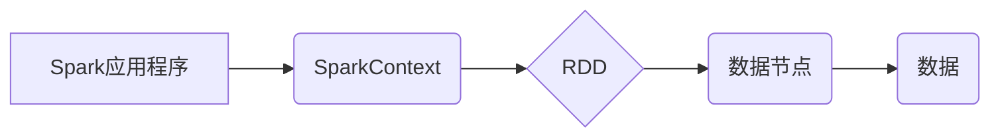

> Apache Spark, RDD, 分布式计算, 数据处理, 数据分析, 编程模型, 故障恢复

## 1. 背景介绍

在海量数据时代，传统的单机计算模式已难以满足对数据处理和分析的需求。分布式计算应运而生，成为处理海量数据的有效解决方案。Apache Spark作为一款开源的分布式计算框架，凭借其高性能、易用性和丰富的功能，在数据处理领域获得了广泛应用。Spark的核心编程模型之一是Resilient Distributed Datasets（RDD），它为用户提供了一种简洁、高效的编程方式，使得开发者能够轻松地编写并执行分布式数据处理任务。

## 2. 核心概念与联系

RDD是一种分布式数据集，它将数据存储在集群中的多个节点上，并提供一系列操作来处理这些数据。RDD的核心特点包括：

* **分布式存储**: RDD的数据分布在集群中的多个节点上，可以充分利用集群的计算资源。
* **容错性**: RDD具有容错机制，如果某个节点发生故障，Spark可以自动从其他节点恢复数据，保证数据的一致性和可靠性。
* **并行处理**: RDD的操作是并行执行的，可以充分利用集群的并行计算能力，提高数据处理速度。

**RDD与Spark的关系**

RDD是Spark的核心编程模型，它为Spark提供了数据处理的基础。Spark提供了丰富的RDD操作，例如转换操作（map、flatMap、filter等）和行动操作（reduce、collect等），用户可以通过这些操作对RDD进行各种处理。

**RDD的架构**



## 3. 核心算法原理 & 具体操作步骤

### 3.1  算法原理概述

RDD的容错机制基于数据分片和数据副本机制。每个RDD都会被划分为多个数据分片，每个分片存储在集群中的一个节点上。为了保证数据的一致性和可靠性，每个分片都会被复制到多个节点上，形成数据副本。如果某个节点发生故障，Spark可以从其他节点恢复数据，保证数据完整性。

### 3.2  算法步骤详解

1. **数据分片**: 将RDD的数据划分为多个数据分片，每个分片存储在集群中的一个节点上。
2. **数据复制**: 每个数据分片都会被复制到多个节点上，形成数据副本。
3. **操作执行**: 对RDD进行操作时，Spark会将操作分配到各个节点上，并并行执行。
4. **数据更新**: 操作执行完成后，Spark会更新数据副本，保证数据的一致性。
5. **故障恢复**: 如果某个节点发生故障，Spark会从其他节点恢复数据，保证数据完整性。

### 3.3  算法优缺点

**优点**:

* **容错性**: RDD具有容错机制，可以保证数据的一致性和可靠性。
* **并行处理**: RDD的操作是并行执行的，可以充分利用集群的并行计算能力，提高数据处理速度。

**缺点**:

* **数据依赖**: RDD的操作是依赖于数据分片和数据副本的，如果数据分片或数据副本发生变化，可能会导致操作结果不一致。
* **内存占用**: RDD的数据需要存储在内存中，如果数据量过大，可能会导致内存占用过高。

### 3.4  算法应用领域

RDD的应用领域非常广泛，例如：

* **数据分析**: 对海量数据进行统计分析、模式识别等。
* **机器学习**: 对数据进行特征提取、模型训练等。
* **图计算**: 对图数据进行分析、挖掘等。
* **流式处理**: 对实时数据进行处理和分析。

## 4. 数学模型和公式 & 详细讲解 & 举例说明

### 4.1  数学模型构建

RDD可以抽象为一个集合，其中每个元素都是一个数据分片。每个数据分片可以表示为一个二元组 (id, data)，其中 id 是分片的唯一标识符，data 是分片中的数据。

### 4.2  公式推导过程

RDD的容错机制基于数据副本机制。假设一个RDD有 n 个数据分片，每个分片被复制 k 次，则每个数据分片有 k 个副本。

### 4.3  案例分析与讲解

假设一个RDD有 10 个数据分片，每个分片被复制 3 次，则每个数据分片有 3 个副本。如果某个节点发生故障，导致其中一个数据分片丢失，Spark可以从其他节点恢复数据，保证数据完整性。

## 5. 项目实践：代码实例和详细解释说明

### 5.1  开发环境搭建

* 安装 Java JDK
* 安装 Apache Spark
* 配置 Spark 环境变量

### 5.2  源代码详细实现

```python
from pyspark import SparkContext

# 创建 SparkContext
sc = SparkContext("local", "RDD Example")

# 创建一个 RDD
data = sc.parallelize([1, 2, 3, 4, 5])

# 对 RDD 进行操作
# 1. map 操作
squared_data = data.map(lambda x: x * x)

# 2. filter 操作
even_data = squared_data.filter(lambda x: x % 2 == 0)

# 3. reduce 操作
sum_of_squares = even_data.reduce(lambda x, y: x + y)

# 打印结果
print(sum_of_squares)

# 关闭 SparkContext
sc.stop()
```

### 5.3  代码解读与分析

* `sc = SparkContext("local", "RDD Example")`: 创建一个 SparkContext对象，用于连接到 Spark集群。
* `data = sc.parallelize([1, 2, 3, 4, 5])`: 创建一个 RDD，包含数字 1 到 5。
* `squared_data = data.map(lambda x: x * x)`: 对 RDD 中每个元素进行平方操作，生成新的 RDD。
* `even_data = squared_data.filter(lambda x: x % 2 == 0)`: 对 RDD 中每个元素进行过滤，只保留偶数。
* `sum_of_squares = even_data.reduce(lambda x, y: x + y)`: 对 RDD 中所有元素进行求和，得到最终结果。

### 5.4  运行结果展示

```
16
```

## 6. 实际应用场景

RDD在实际应用场景中具有广泛的应用，例如：

* **电商平台**: 对用户行为数据进行分析，挖掘用户兴趣和购买偏好。
* **金融机构**: 对交易数据进行分析，识别欺诈行为和风险。
* **社交网络**: 对用户关系数据进行分析，挖掘社交关系和传播路径。

### 6.4  未来应用展望

随着大数据和人工智能技术的不断发展，RDD的应用场景将会更加广泛。例如，在机器学习领域，RDD可以用于构建大规模机器学习模型，并进行高效的模型训练和预测。

## 7. 工具和资源推荐

### 7.1  学习资源推荐

* Apache Spark 官方文档: https://spark.apache.org/docs/latest/
* Spark 中文文档: https://spark.apache.org/docs/latest/zh-cn/
* Spark 入门教程: https://spark.apache.org/docs/latest/getting-started.html

### 7.2  开发工具推荐

* IntelliJ IDEA
* Eclipse
* PyCharm

### 7.3  相关论文推荐

* Resilient Distributed Datasets: A Fault-Tolerant Abstraction for In-Memory Cluster Computing
* Spark: Cluster Computing with Working Sets

## 8. 总结：未来发展趋势与挑战

### 8.1  研究成果总结

RDD作为一种分布式数据处理模型，为大数据处理提供了高效、可靠的解决方案。其容错机制、并行处理能力和丰富的操作使得它在数据分析、机器学习等领域得到了广泛应用。

### 8.2  未来发展趋势

未来，RDD将会朝着以下方向发展：

* **更强大的容错机制**: 提高数据可靠性和可用性。
* **更优的性能**: 进一步提升数据处理速度和效率。
* **更丰富的功能**: 提供更多的数据处理操作和功能。
* **更易于使用**: 简化开发流程，降低使用门槛。

### 8.3  面临的挑战

RDD也面临一些挑战，例如：

* **数据依赖**: RDD的操作依赖于数据分片和数据副本，如果数据分片或数据副本发生变化，可能会导致操作结果不一致。
* **内存占用**: RDD的数据需要存储在内存中，如果数据量过大，可能会导致内存占用过高。
* **开发复杂度**: RDD的开发需要一定的编程经验和对分布式计算的理解。

### 8.4  研究展望

未来，研究人员将继续探索新的算法和技术，以解决RDD面临的挑战，并进一步提升其性能和功能。


## 9. 附录：常见问题与解答

### 9.1  常见问题

* **RDD 和 DataFrame 的区别是什么？**
* **如何实现 RDD 的数据持久化？**
* **如何处理 RDD 中的空值？**

### 9.2  解答

* **RDD 和 DataFrame 的区别是什么？**

RDD 是 Spark 的核心编程模型之一，它是一种分布式数据集，数据存储在集群中的多个节点上。DataFrame 是 Spark 1.0 引入的新数据结构，它基于 RDD，并提供了更丰富的功能和操作，例如 Schema 定义、列式存储和 SQL 查询。

* **如何实现 RDD 的数据持久化？**

Spark 提供了两种数据持久化方式：

* **内存持久化**: 将 RDD 的数据存储在内存中，可以提高数据访问速度。
* **磁盘持久化**: 将 RDD 的数据存储在磁盘上，可以保证数据持久性。

* **如何处理 RDD 中的空值？**

Spark 提供了 `filter` 和 `map` 操作来处理 RDD 中的空值。例如，可以使用 `filter` 操作过滤掉空值，可以使用 `map` 操作将空值替换为其他值。


作者：禅与计算机程序设计艺术 / Zen and the Art of Computer Programming<end_of_turn>