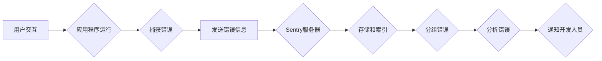

> Sentry,错误监控,异常跟踪,日志分析,代码分析,程序调试,软件开发

## 1. 背景介绍

在现代软件开发中，可靠性和稳定性至关重要。用户期望应用程序始终可用，并且能够快速、高效地解决问题。然而，软件系统在运行过程中可能会遇到各种各样的错误和异常，这些问题可能会导致应用程序崩溃、数据丢失或用户体验下降。为了应对这些挑战，错误监控和异常跟踪工具应运而生，其中 Sentry 作为一款领先的开源错误监控平台，凭借其强大的功能和易于使用的界面，赢得了广泛的赞誉。

Sentry 的核心功能是收集、分析和展示应用程序中的错误信息，帮助开发人员快速定位和修复问题。它能够捕获各种类型的错误，包括崩溃、异常、日志错误和性能问题，并提供详细的错误堆栈跟踪、用户上下文信息和错误发生的代码片段，从而帮助开发人员快速理解问题根源并进行修复。

## 2. 核心概念与联系

Sentry 的工作原理基于以下核心概念：

* **错误捕获:** Sentry 提供 SDK（软件开发工具包）集成到应用程序中，用于捕获应用程序中的错误信息。当应用程序发生错误时，SDK 会将错误信息发送到 Sentry 的服务器。
* **错误存储和索引:** Sentry 的服务器会将捕获的错误信息存储在数据库中，并对其进行索引，以便快速检索和分析。
* **错误分组:** Sentry 会根据错误信息中的关键特征，将相同的错误信息分组在一起，以便开发人员能够更清晰地了解问题的范围和影响。
* **错误分析:** Sentry 提供各种工具和功能，帮助开发人员分析错误信息，例如错误堆栈跟踪、用户上下文信息、错误发生的代码片段等。
* **错误通知:** Sentry 可以根据配置，将错误信息发送到开发人员的邮件、Slack 或其他通知平台，以便及时提醒开发人员处理问题。

**核心架构流程图:**



## 3. 核心算法原理 & 具体操作步骤

### 3.1  算法原理概述

Sentry 的核心算法原理主要包括以下几个方面：

* **错误分组算法:** Sentry 使用哈希算法和机器学习算法来对错误信息进行分组，确保相同类型的错误被归为一组。
* **错误优先级算法:** Sentry 根据错误信息的重要性、影响范围和发生频率等因素，为每个错误分配优先级，以便开发人员能够优先处理重要问题。
* **错误趋势分析算法:** Sentry 使用时间序列分析和统计学方法来分析错误趋势，帮助开发人员识别潜在问题并进行预警。

### 3.2  算法步骤详解

1. **错误捕获:** 当应用程序发生错误时，Sentry SDK 会捕获错误信息，包括错误类型、堆栈跟踪、用户上下文信息等。
2. **错误发送:** Sentry SDK 会将捕获的错误信息发送到 Sentry 的服务器。
3. **错误存储和索引:** Sentry 的服务器会将错误信息存储在数据库中，并对其进行索引，以便快速检索和分析。
4. **错误分组:** Sentry 会根据错误信息中的关键特征，例如错误类型、堆栈跟踪、用户上下文信息等，将相同的错误信息分组在一起。
5. **错误优先级排序:** Sentry 会根据错误信息的重要性、影响范围和发生频率等因素，为每个错误分配优先级。
6. **错误趋势分析:** Sentry 会使用时间序列分析和统计学方法来分析错误趋势，帮助开发人员识别潜在问题并进行预警。
7. **错误通知:** Sentry 可以根据配置，将错误信息发送到开发人员的邮件、Slack 或其他通知平台，以便及时提醒开发人员处理问题。

### 3.3  算法优缺点

**优点:**

* **高准确率:** Sentry 使用先进的算法和机器学习技术，能够准确地识别和分组错误信息。
* **实时监控:** Sentry 可以实时监控应用程序的运行状态，并及时通知开发人员出现问题。
* **易于使用:** Sentry 提供友好的用户界面和丰富的 API，方便开发人员集成和使用。
* **开源免费:** Sentry 是开源的免费软件，可以满足各种规模的项目需求。

**缺点:**

* **性能消耗:** Sentry 的 SDK 会增加应用程序的性能消耗，尤其是在处理大量错误信息时。
* **数据隐私:** Sentry 收集用户数据，需要谨慎考虑数据隐私问题。

### 3.4  算法应用领域

Sentry 的核心算法原理和技术应用广泛，例如：

* **软件开发:** Sentry 可以帮助开发人员快速定位和修复软件中的错误，提高软件质量和稳定性。
* **网站监控:** Sentry 可以帮助网站管理员监控网站的运行状态，及时发现和解决问题。
* **移动应用监控:** Sentry 可以帮助移动应用开发人员监控应用程序的运行状态，及时发现和解决问题。
* **云服务监控:** Sentry 可以帮助云服务提供商监控云服务的运行状态，及时发现和解决问题。

## 4. 数学模型和公式 & 详细讲解 & 举例说明

### 4.1  数学模型构建

Sentry 的核心算法原理涉及到概率统计、机器学习和数据挖掘等数学模型。例如，错误分组算法可以使用聚类算法，将具有相似特征的错误信息分组在一起。

### 4.2  公式推导过程

聚类算法的公式推导过程比较复杂，涉及到距离度量、相似度计算和聚类中心更新等步骤。

### 4.3  案例分析与讲解

假设我们有一个包含多个错误信息的集合，每个错误信息都包含以下特征：错误类型、堆栈跟踪、用户上下文信息等。我们可以使用 k-means 聚类算法将这些错误信息分组。

k-means 算法的基本思想是将数据点划分为 k 个簇，每个簇都由一个聚类中心代表。算法迭代地更新聚类中心和数据点的簇分配，直到收敛。

**公式:**

* **距离度量:** 使用欧氏距离或曼哈顿距离等度量方法计算两个数据点之间的距离。
* **聚类中心更新:** 计算每个簇中所有数据点的平均值作为新的聚类中心。
* **数据点分配:** 将每个数据点分配到距离其最近的聚类中心所在的簇。

## 5. 项目实践：代码实例和详细解释说明

### 5.1  开发环境搭建

* 安装 Python 3.x
* 安装 Sentry SDK

```bash
pip install sentry-sdk
```

### 5.2  源代码详细实现

```python
from sentry_sdk import init
from sentry_sdk.integrations.logging import LoggingIntegration

# 初始化 Sentry SDK
init(
    dsn="YOUR_SENTRY_DSN",
    integrations=[LoggingIntegration()]
)

# 模拟发生错误
try:
    # 执行可能导致错误的代码
    result = 10 / 0
except ZeroDivisionError as e:
    # 记录错误信息
    sentry_sdk.capture_exception(e)

# 打印正常输出
print("程序运行正常")
```

### 5.3  代码解读与分析

* **初始化 Sentry SDK:** 使用 `init()` 函数初始化 Sentry SDK，并传入 Sentry 的 DSN（Data Source Name）。
* **集成 LoggingIntegration:** 使用 `LoggingIntegration()` 将 Sentry SDK 与 Python 的日志系统集成，以便捕获日志错误信息。
* **模拟发生错误:** 使用 `try-except` 语句模拟发生 `ZeroDivisionError` 异常。
* **记录错误信息:** 使用 `sentry_sdk.capture_exception()` 函数捕获异常信息并发送到 Sentry 服务器。
* **打印正常输出:** 打印正常输出，表明程序运行正常。

### 5.4  运行结果展示

运行上述代码后，会在 Sentry 的服务器上记录一条错误信息，包括错误类型、堆栈跟踪、用户上下文信息等。

## 6. 实际应用场景

Sentry 在软件开发、网站监控、移动应用监控和云服务监控等领域都有广泛的应用场景。

### 6.1  软件开发

Sentry 可以帮助开发人员快速定位和修复软件中的错误，提高软件质量和稳定性。例如，当用户报告应用程序崩溃时，开发人员可以使用 Sentry 的错误信息来快速定位问题所在，并进行修复。

### 6.2  网站监控

Sentry 可以帮助网站管理员监控网站的运行状态，及时发现和解决问题。例如，当网站出现错误时，Sentry 可以自动发送通知到网站管理员的邮箱，以便及时处理问题。

### 6.3  移动应用监控

Sentry 可以帮助移动应用开发人员监控应用程序的运行状态，及时发现和解决问题。例如，当用户在使用移动应用程序时遇到错误，Sentry 可以收集错误信息并发送到开发人员的手机，以便及时进行修复。

### 6.4  未来应用展望

随着人工智能和机器学习技术的不断发展，Sentry 将能够提供更智能的错误监控和分析功能。例如，Sentry 将能够自动识别潜在问题并进行预警，帮助开发人员提前解决问题。

## 7. 工具和资源推荐

### 7.1  学习资源推荐

* Sentry 官方文档: https://docs.sentry.io/
* Sentry 博客: https://blog.sentry.io/
* Sentry GitHub 仓库: https://github.com/getsentry/sentry

### 7.2  开发工具推荐

* Python: https://www.python.org/
* Sentry SDK: https://pypi.org/project/sentry-sdk/

### 7.3  相关论文推荐

* [A Survey of Error Tracking Systems](https://arxiv.org/abs/1909.01933)
* [Sentry: A Distributed Error Tracking System](https://www.usenix.org/system/files/conference/hotos17/hotos17-paper-chen.pdf)

## 8. 总结：未来发展趋势与挑战

### 8.1  研究成果总结

Sentry 作为一款领先的开源错误监控平台，已经取得了显著的成果，帮助开发人员提高软件质量和稳定性。

### 8.2  未来发展趋势

未来，Sentry 将会朝着以下方向发展：

* **更智能的错误分析:** 利用人工智能和机器学习技术，自动识别潜在问题并进行预警。
* **更强大的用户体验:** 提供更友好的用户界面和更丰富的功能，方便开发人员使用和管理。
* **更广泛的应用场景:** 将 Sentry 的技术应用到更多领域，例如云服务监控、安全监控等。

### 8.3  面临的挑战

Sentry 也面临着一些挑战，例如：

* **数据隐私:** Sentry 收集用户数据，需要谨慎考虑数据隐私问题。
* **性能消耗:** Sentry 的 SDK 会增加应用程序的性能消耗，需要优化算法和代码，降低性能影响。
* **开源社区建设:** 需要继续吸引和培养开源社区成员，共同推动 Sentry 的发展。

### 8.4  研究展望

未来，我们将继续研究和开发 Sentry 的相关技术，例如：

* **更精准的错误分组算法:** 利用深度学习技术，提高错误分组的准确率。
* **更智能的错误预测模型:** 利用时间序列分析和机器学习技术，预测未来可能出现的错误。
* **更安全的错误监控系统:** 加强数据加密和访问控制，保障用户数据安全。

## 9. 附录：常见问题与解答

**常见问题:**

* **Sentry 如何与我的应用程序集成？**

**解答:** Sentry 提供了多种 SDK，可以方便地将 Sentry 集成到各种类型的应用程序中。

* **Sentry 的价格是多少？**

**解答:** Sentry 提供了免费和付费计划，免费计划适合小型项目，付费计划提供更多功能和支持。

* **Sentry 如何保护我的数据隐私？**

**解答:** Sentry 采取了多种措施来保护用户数据隐私，例如数据加密、访问控制和匿名化处理。

**作者：禅与计算机程序设计艺术 / Zen and the Art of Computer Programming**<end_of_turn>