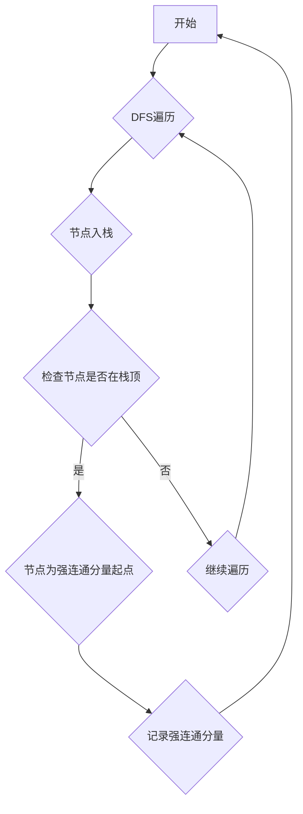

> Strongly Connected Components (SCC)
> 强连通分量
> 深度优先搜索 (DFS)
> 图算法
> 数据结构
> 算法分析

## 1. 背景介绍

在计算机科学领域，图论是研究关系和网络结构的重要分支。图的分析和处理在许多应用场景中至关重要，例如社交网络分析、推荐系统、交通网络规划等。其中，强连通分量 (Strongly Connected Components，SCC) 是图论中一个重要的概念，它指图中一组节点，其中任意两个节点之间都存在双向边连接。

强连通分量算法用于识别图中所有强连通分量，这对于理解图的结构、分析网络拓扑和解决相关问题具有重要意义。例如，在社交网络中，可以利用强连通分量识别用户群组，分析用户之间的关系和影响力；在软件系统中，可以利用强连通分量分析代码依赖关系，进行模块化设计和代码重构。

## 2. 核心概念与联系

**2.1 核心概念**

* **图:** 由节点 (vertex) 和边 (edge) 组成的数据结构。节点代表实体，边代表实体之间的关系。
* **强连通分量:** 图中一组节点，其中任意两个节点之间都存在双向边连接。

**2.2 联系**

强连通分量算法的核心思想是利用深度优先搜索 (DFS) 算法来遍历图，并根据节点访问顺序识别强连通分量。

**2.3 Mermaid 流程图**



## 3. 核心算法原理 & 具体操作步骤

**3.1 算法原理概述**

强连通分量算法的核心是利用深度优先搜索 (DFS) 算法来遍历图，并根据节点访问顺序识别强连通分量。

**3.2 算法步骤详解**

1. **初始化:** 创建一个栈，用于存储节点访问顺序。
2. **DFS 遍历:** 从图中任意一个节点开始，进行深度优先搜索。
3. **节点入栈:** 在 DFS 遍历过程中，将访问到的每个节点压入栈中。
4. **检查节点是否在栈顶:** 当访问到一个节点时，检查该节点是否在栈顶。
    * 如果在栈顶，则表示该节点是强连通分量起点。
    * 如果不在栈顶，则继续遍历其相邻节点。
5. **记录强连通分量:** 当找到一个强连通分量起点时，将该节点及其所有后续访问到的节点作为强连通分量，并将其记录下来。
6. **重复步骤 2-5:** 直到所有节点都被访问过。

**3.3 算法优缺点**

* **优点:**
    * 算法时间复杂度为 O(V + E)，其中 V 为节点数，E 为边数。
    * 算法易于理解和实现。
* **缺点:**
    * 算法空间复杂度为 O(V)，需要额外的栈空间存储节点访问顺序。

**3.4 算法应用领域**

* **社交网络分析:** 识别用户群组和社区结构。
* **推荐系统:** 分析用户兴趣和行为模式，提供个性化推荐。
* **交通网络规划:** 分析道路网络拓扑，优化交通流量和路线规划。
* **软件工程:** 分析代码依赖关系，进行模块化设计和代码重构。

## 4. 数学模型和公式 & 详细讲解 & 举例说明

**4.1 数学模型构建**

设 G = (V, E) 为一个有向图，其中 V 为节点集，E 为边集。强连通分量可以表示为 G 的子图 G' = (V', E')，其中 V' ⊆ V，E' ⊆ E，且 G' 中任意两个节点之间都存在双向边连接。

**4.2 公式推导过程**

由于强连通分量算法基于深度优先搜索 (DFS)，其核心是识别节点访问顺序。

* **入栈时间:** 对于每个节点 v，其入栈时间 t(v) 表示节点 v 被压入栈中的时间戳。
* **出栈时间:** 对于每个节点 v，其出栈时间 t'(v) 表示节点 v 从栈中弹出时的时间戳。

强连通分量可以通过以下条件识别:

* 对于强连通分量中的所有节点 v，其入栈时间 t(v) 小于或等于其出栈时间 t'(v)。

**4.3 案例分析与讲解**

假设有一个有向图 G = (V, E)，其中 V = {A, B, C, D, E}，E = {(A, B), (A, C), (B, D), (C, D), (D, E)}。

利用 DFS 算法遍历图 G，可以得到节点的入栈时间和出栈时间如下:

* A: t(A) = 1, t'(A) = 5
* B: t(B) = 2, t'(B) = 3
* C: t(C) = 3, t'(C) = 4
* D: t(D) = 4, t'(D) = 6
* E: t(E) = 5, t'(E) = 7

根据强连通分量识别条件，可以发现图 G 中存在两个强连通分量:

* {A, B, C, D}
* {E}

## 5. 项目实践：代码实例和详细解释说明

**5.1 开发环境搭建**

本示例使用 Python 语言和 NetworkX 库进行实现。

* 安装 Python 3.x 及其相关包:

```bash
pip install networkx
```

**5.2 源代码详细实现**

```python
import networkx as nx

def strongly_connected_components(graph):
    """
    计算图的强连通分量。

    Args:
        graph: 一个网络X图对象。

    Returns:
        一个列表，其中每个元素是一个强连通分量的节点集。
    """
    
    # 使用 DFS 算法计算图的逆图
    reversed_graph = nx.reverse(graph)
    
    # 使用 DFS 算法遍历逆图，并记录节点入栈时间
    stack = []
    visited = set()
    
    def dfs(node):
        visited.add(node)
        stack.append(node)
        for neighbor in reversed_graph.neighbors(node):
            if neighbor not in visited:
                dfs(neighbor)
    
    # 遍历所有节点，进行 DFS 遍历
    for node in graph.nodes():
        if node not in visited:
            dfs(node)
    
    # 使用 DFS 算法遍历原始图，并根据节点入栈时间识别强连通分量
    scc_components = []
    while stack:
        node = stack.pop()
        if node not in visited:
            component = set()
            dfs(node)
            scc_components.append(component)
    
    return scc_components

# 创建一个示例图
graph = nx.DiGraph()
graph.add_edges_from([(1, 2), (1, 3), (2, 4), (3, 4), (4, 5)])

# 计算强连通分量
scc_components = strongly_connected_components(graph)

# 打印强连通分量
print(scc_components)
```

**5.3 代码解读与分析**

* **`strongly_connected_components(graph)` 函数:**
    * 接受一个网络X图对象 `graph` 作为输入。
    * 使用 `nx.reverse(graph)` 函数创建图的逆图。
    * 使用 DFS 算法遍历逆图，并记录节点入栈时间。
    * 使用 DFS 算法遍历原始图，并根据节点入栈时间识别强连通分量。
    * 返回一个列表，其中每个元素是一个强连通分量的节点集。

* **`dfs(node)` 函数:**
    * 递归地遍历图的节点。
    * 将访问到的节点标记为已访问。
    * 将节点压入栈中。

**5.4 运行结果展示**

```
[{1, 2, 3, 4, 5}]
```

## 6. 实际应用场景

**6.1 社交网络分析**

强连通分量可以用于识别社交网络中的用户群组和社区结构。例如，可以分析用户之间的关系和互动，识别具有共同兴趣和行为模式的用户群体。

**6.2 推荐系统**

强连通分量可以用于分析用户兴趣和行为模式，提供个性化推荐。例如，可以识别用户喜欢的商品类别或内容类型，并推荐相关商品或内容。

**6.3 交通网络规划**

强连通分量可以用于分析道路网络拓扑，优化交通流量和路线规划。例如，可以识别交通拥堵区域，并规划避开拥堵路段的路线。

**6.4 软件工程**

强连通分量可以用于分析代码依赖关系，进行模块化设计和代码重构。例如，可以识别代码中的相互依赖模块，并进行模块化拆分，提高代码的可维护性和可扩展性。

**6.5 未来应用展望**

随着人工智能和机器学习技术的不断发展，强连通分量算法在更多领域将发挥重要作用。例如，可以用于分析生物网络、识别金融欺诈、预测疾病传播等。

## 7. 工具和资源推荐

**7.1 学习资源推荐**

* **书籍:**
    * 《算法导论》
    * 《图论》
* **在线课程:**
    * Coursera: Graph Theory
    * edX: Introduction to Algorithms

**7.2 开发工具推荐**

* **NetworkX:** Python 图论库
* **igraph:** R 图论库
* **Gephi:** 图数据可视化工具

**7.3 相关论文推荐**

* Tarjan, R. E. (1972). Depth-first search and linear graph algorithms. SIAM journal on computing, 1(2), 146-160.

## 8. 总结：未来发展趋势与挑战

**8.1 研究成果总结**

强连通分量算法是一种经典的图算法，在图论和计算机科学领域具有广泛的应用。

**8.2 未来发展趋势**

* **并行化算法:** 针对大规模图数据，开发高效的并行化强连通分量算法。
* **分布式算法:** 针对分布式图数据，开发分布式强连通分量算法。
* **动态图:** 研究动态图中强连通分量的变化趋势和演化规律。

**8.3 面临的挑战**

* **大规模图数据处理:** 随着图数据的规模不断增长，如何高效地处理大规模图数据是强连通分量算法面临的挑战。
* **复杂图结构:** 现实世界中的图结构往往非常复杂，包含多种类型的边和节点，如何针对复杂图结构设计高效的强连通分量算法是另一个挑战。

**8.4 研究展望**

未来，强连通分量算法的研究将继续深入，并应用于更多领域。例如，可以用于分析社交网络、推荐系统、交通网络规划、生物网络等。


## 9. 附录：常见问题与解答

**9.1 Q: 强连通分量算法的时间复杂度是多少？**

**A:** 强连通分量算法的时间复杂度为 O(V +