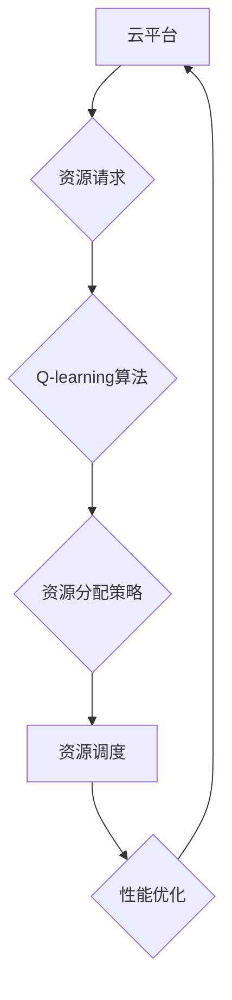

> Q-learning, 云计算, 强化学习, 算法优化, 资源调度

## 1. 背景介绍

云计算作为一种新型的计算模式，以其弹性、可扩展性和按需付费的特点，迅速成为现代企业和个人应用的基石。然而，随着云计算平台的规模不断扩大，资源管理和优化问题日益突出。传统的手动配置和规则驱动的调度策略难以应对云环境的动态变化和复杂需求。

强化学习（Reinforcement Learning，RL）作为一种机器学习范式，能够通过智能代理与环境的交互学习最优策略，在解决资源管理和优化问题方面展现出巨大的潜力。其中，Q-learning作为一种经典的RL算法，凭借其简单易懂、易于实现的特点，在云计算领域得到了广泛的应用。

## 2. 核心概念与联系

**2.1 云计算资源管理**

云计算资源包括计算资源、存储资源、网络资源等。资源管理的目标是高效地分配和调度这些资源，以满足用户需求，同时最大化资源利用率。

**2.2 强化学习**

强化学习是一种机器学习方法，它通过智能代理与环境的交互学习最优策略。强化学习的核心概念包括：

* **智能代理（Agent）：** 学习和决策的实体。
* **环境（Environment）：** 智能代理所处的外部世界。
* **状态（State）：** 环境的当前状态。
* **动作（Action）：** 智能代理可以采取的行动。
* **奖励（Reward）：** 环境对智能代理动作的反馈。
* **策略（Policy）：** 智能代理根据状态选择动作的规则。

**2.3 Q-learning**

Q-learning是一种基于价值函数的强化学习算法，它通过学习状态-动作对的价值函数来指导智能代理选择最优动作。价值函数表示从某个状态执行某个动作所能获得的长期奖励。

**2.4 Q-learning在云计算中的应用**

Q-learning可以应用于云计算资源管理的多个方面，例如：

* **虚拟机调度：** 根据虚拟机的资源需求和云平台的资源可用性，选择最优的虚拟机放置位置。
* **资源分配：** 根据用户需求和资源可用性，动态分配计算、存储和网络资源。
* **云服务价格优化：** 根据用户需求和市场价格波动，动态调整云服务价格。

**2.5 Mermaid 流程图**



## 3. 核心算法原理 & 具体操作步骤

### 3.1 算法原理概述

Q-learning算法的核心思想是通过迭代更新状态-动作对的价值函数，来学习最优策略。

* **价值函数：** Q(s, a) 表示在状态s下执行动作a所能获得的长期奖励。
* **学习率：** α 控制着学习过程中的更新幅度。
* **折扣因子：** γ 控制着未来奖励的权重。

Q-learning算法的更新规则如下：

```
Q(s, a) = Q(s, a) + α * [r + γ * max(Q(s', a')) - Q(s, a)]
```

其中：

* s 是当前状态。
* a 是当前动作。
* r 是从状态s执行动作a后获得的奖励。
* s' 是状态s执行动作a后进入的下一个状态。
* a' 是在下一个状态s'中可以执行的动作，其中a' 选择的是价值最高的动作。

### 3.2 算法步骤详解

1. **初始化：** 初始化状态-动作对的价值函数Q(s, a)为0。
2. **环境交互：** 智能代理与环境交互，观察当前状态s和获得奖励r。
3. **动作选择：** 根据当前状态s和价值函数Q(s, a)，选择一个动作a。
4. **状态转移：** 执行动作a后，进入下一个状态s'。
5. **价值更新：** 根据更新规则更新价值函数Q(s, a)。
6. **重复步骤2-5：** 直到达到终止条件，例如达到最大迭代次数或达到目标奖励。

### 3.3 算法优缺点

**优点：**

* 简单易懂，易于实现。
* 不需要事先知道环境模型。
* 可以学习离散和连续的动作空间。

**缺点：**

* 学习过程可能比较慢。
* 容易陷入局部最优解。
* 需要大量的训练数据。

### 3.4 算法应用领域

Q-learning算法广泛应用于以下领域：

* **机器人控制**
* **游戏人工智能**
* **推荐系统**
* **金融交易**
* **医疗诊断**

## 4. 数学模型和公式 & 详细讲解 & 举例说明

### 4.1 数学模型构建

Q-learning算法的核心是价值函数Q(s, a)，它表示在状态s下执行动作a所能获得的长期奖励。

数学模型可以表示为：

```
Q(s, a) = E[R_t+1 + γ * max_a' Q(s', a') | s_t = s, a_t = a]
```

其中：

* E 表示期望值。
* R_t+1 是从状态s执行动作a后获得的奖励。
* γ 是折扣因子，控制着未来奖励的权重。
* s' 是状态s执行动作a后进入的下一个状态。
* a' 是在下一个状态s'中可以执行的动作，其中a' 选择的是价值最高的动作。

### 4.2 公式推导过程

Q-learning算法的更新规则如下：

```
Q(s, a) = Q(s, a) + α * [r + γ * max(Q(s', a')) - Q(s, a)]
```

其中：

* α 是学习率，控制着学习过程中的更新幅度。

该公式的推导过程如下：

1. 将价值函数的期望值展开：

```
Q(s, a) = E[R_t+1 + γ * max_a' Q(s', a') | s_t = s, a_t = a]
```

2. 将奖励r和下一个状态s'代入公式：

```
Q(s, a) = E[r + γ * max_a' Q(s', a') | s_t = s, a_t = a]
```

3. 使用学习率α对价值函数进行更新：

```
Q(s, a) = Q(s, a) + α * [r + γ * max_a' Q(s', a') - Q(s, a)]
```

### 4.3 案例分析与讲解

假设有一个简单的环境，智能代理可以执行两种动作：向上和向下。

* 状态：智能代理的位置。
* 动作：向上或向下。
* 奖励：到达目标位置获得奖励1，否则获得奖励0。

使用Q-learning算法，智能代理可以学习到最优策略，即如何选择动作以到达目标位置。

## 5. 项目实践：代码实例和详细解释说明

### 5.1 开发环境搭建

* Python 3.x
* TensorFlow 或 PyTorch

### 5.2 源代码详细实现

```python
import numpy as np

# 定义状态空间和动作空间
state_space = 5
action_space = 2

# 初始化价值函数
Q = np.zeros((state_space, action_space))

# 设置超参数
alpha = 0.1
gamma = 0.9

# 训练过程
for episode in range(1000):
    state = 0
    while state != state_space - 1:
        # 选择动作
        action = np.argmax(Q[state, :])

        # 执行动作并获得奖励和下一个状态
        next_state, reward = env.step(action)

        # 更新价值函数
        Q[state, action] = Q[state, action] + alpha * (reward + gamma * np.max(Q[next_state, :]) - Q[state, action])

        # 更新状态
        state = next_state

# 打印价值函数
print(Q)
```

### 5.3 代码解读与分析

* **状态空间和动作空间：** 定义了智能代理可以处的状态和可以执行的动作。
* **价值函数：** 用一个数组来存储每个状态-动作对的价值。
* **超参数：** 学习率α和折扣因子γ控制着学习过程。
* **训练过程：** 通过重复执行动作，观察奖励和下一个状态，更新价值函数。
* **价值函数更新：** 使用Bellman方程更新价值函数。

### 5.4 运行结果展示

运行代码后，会输出一个价值函数矩阵，其中每个元素表示在对应状态下执行对应动作的价值。

## 6. 实际应用场景

### 6.1 云平台资源调度

Q-learning可以用于优化云平台的资源调度策略，例如：

* **虚拟机调度：** 根据虚拟机的资源需求和云平台的资源可用性，选择最优的虚拟机放置位置。
* **容器调度：** 根据容器的资源需求和云平台的资源可用性，选择最优的容器放置位置。
* **网络流量调度：** 根据网络流量的特性和网络资源的可用性，选择最优的流量路由路径。

### 6.2 云服务价格优化

Q-learning可以用于优化云服务的价格策略，例如：

* **动态调整价格：** 根据用户需求和市场价格波动，动态调整云服务的价格。
* **个性化定价：** 根据用户的历史使用情况和需求特征，提供个性化的价格方案。

### 6.3 云安全防护

Q-learning可以用于强化云平台的安全防护策略，例如：

* **入侵检测：** 学习识别网络攻击的特征，并采取相应的防御措施。
* **数据安全：** 学习识别数据泄露的风险，并采取相应的防护措施。

### 6.4 未来应用展望

随着云计算技术的不断发展，Q-learning在云计算领域的应用前景广阔。未来，Q-learning可以应用于更多场景，例如：

* **云平台自动运维：** 自动化云平台的管理和维护任务。
* **云平台资源预测：** 预测云平台的资源需求和可用性。
* **云平台性能优化：** 优化云平台的性能和效率。

## 7. 工具和资源推荐

### 7.1 学习资源推荐

* **书籍：**
    * Reinforcement Learning: An Introduction by Richard S. Sutton and Andrew G. Barto
    * Deep Reinforcement Learning Hands-On by Maxim Lapan
* **在线课程：**
    * Coursera: Reinforcement Learning Specialization
    * Udacity: Deep Reinforcement Learning Nanodegree

### 7.2 开发工具推荐

* **TensorFlow:** 开源深度学习框架，支持Q-learning算法的实现。
* **PyTorch:** 开源深度学习框架，支持Q-learning算法的实现。
* **OpenAI Gym:** 提供了多种环境，可以用于训练Q-learning算法。

### 7.3 相关论文推荐

* **Q-Learning: A Reinforcement Learning Algorithm for Adaptive Control** by Richard S. Sutton and Andrew G. Barto
* **Deep Q-Networks** by Volodymyr Mnih et al.
* **Proximal Policy Optimization Algorithms** by John Schulman et al.

## 8. 总结：未来发展趋势与挑战

### 8.1 研究成果总结

Q-learning算法在云计算领域取得了显著的成果，例如：

* 提高了资源利用率。
* 降低了资源成本。
* 增强了云平台的安全防护能力。

### 8.2 未来发展趋势

未来，Q-learning算法将在以下方面得到发展：

* **结合深度学习：** 将深度学习技术与Q-learning算法相结合，提高算法