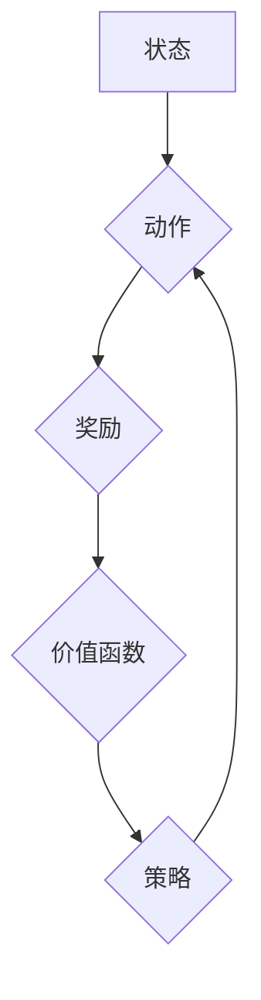

> Deep Q-Network (DQN), 损失函数, 监督学习, 强化学习, 价值函数, 经验回放, 贪婪策略

## 1. 背景介绍

在机器学习领域，深度强化学习 (Deep Reinforcement Learning, DRL) 作为一种强大的学习范式，在解决复杂决策问题方面展现出巨大的潜力。其中，Deep Q-Network (DQN) 作为DRL领域的重要里程碑，成功地将深度神经网络与 Q-learning 算法相结合，为解决复杂环境下的决策问题提供了新的思路。

DQN 的核心在于学习一个 Q-function，该函数能够估计在给定状态下采取特定动作的期望回报。然而，DQN 的训练过程并非一帆风顺，损失函数的设计和优化策略对模型的性能有着至关重要的影响。本文将深入探讨 DQN 损失函数的设计原理、影响因素以及其对模型性能的影响。

## 2. 核心概念与联系

DQN 算法的核心概念包括：

* **状态 (State):** 环境的当前状态，例如游戏中的棋盘布局。
* **动作 (Action):** 智能体在当前状态下可以采取的行动，例如在游戏中移动棋子。
* **奖励 (Reward):** 智能体在采取特定动作后获得的反馈，例如在游戏中获得分数。
* **价值函数 (Value Function):** 估计在给定状态下采取特定动作的期望回报，即 Q-function。

DQN 算法通过最小化 Q-function 的预测误差来学习价值函数。

**Mermaid 流程图:**



## 3. 核心算法原理 & 具体操作步骤

### 3.1  算法原理概述

DQN 算法的核心思想是利用深度神经网络来逼近 Q-function，并通过最小化预测误差来学习价值函数。

具体来说，DQN 算法包含以下步骤：

1. **初始化 Q-网络:** 使用深度神经网络初始化 Q-网络，该网络的输入是状态，输出是各个动作对应的 Q-值。
2. **收集经验:** 在环境中与环境交互，收集状态、动作、奖励和下一个状态的经验数据，并存储在经验回放缓冲池中。
3. **采样经验:** 从经验回放缓冲池中随机采样一批经验数据。
4. **计算目标 Q-值:** 使用目标 Q-网络 (target network) 计算目标 Q-值，该网络的参数更新频率低于主网络。
5. **计算损失函数:** 使用预测 Q-值与目标 Q-值之间的差值计算损失函数。
6. **更新网络参数:** 使用梯度下降算法更新主网络的参数，以最小化损失函数。

### 3.2  算法步骤详解

1. **初始化 Q-网络:**

   * 定义网络结构，例如使用多层感知机 (MLP) 或卷积神经网络 (CNN)。
   * 初始化网络权重和偏置。

2. **收集经验:**

   * 在环境中进行交互，根据当前状态选择动作。
   * 收集状态、动作、奖励和下一个状态的经验数据。
   * 将经验数据存储在经验回放缓冲池中。

3. **采样经验:**

   * 从经验回放缓冲池中随机采样一批经验数据。
   * 经验数据包括状态、动作、奖励和下一个状态。

4. **计算目标 Q-值:**

   * 使用目标 Q-网络计算目标 Q-值。
   * 目标 Q-网络的参数更新频率低于主网络，以减少训练过程中的震荡。
   * 目标 Q-值计算公式如下:

     $$
     y_i = r_i + \gamma \max_{a'} Q(s_{i+1}, a'; \theta_-)
     $$

     其中:
     * $y_i$ 是目标 Q-值。
     * $r_i$ 是奖励。
     * $\gamma$ 是折扣因子。
     * $s_{i+1}$ 是下一个状态。
     * $a'$ 是下一个状态下采取的动作。
     * $Q(s_{i+1}, a'; \theta_-)$ 是目标 Q-网络在下一个状态下采取动作 $a'$ 的 Q-值。
     * $\theta_-$ 是目标 Q-网络的参数。

5. **计算损失函数:**

   * 使用预测 Q-值与目标 Q-值之间的差值计算损失函数。
   * 常见的损失函数是均方误差 (MSE)。

6. **更新网络参数:**

   * 使用梯度下降算法更新主网络的参数，以最小化损失函数。

### 3.3  算法优缺点

**优点:**

* **能够学习复杂决策问题:** DQN 能够学习解决复杂环境下的决策问题，例如游戏和机器人控制。
* **能够利用深度神经网络:** DQN 可以利用深度神经网络的强大表达能力，学习更复杂的价值函数。
* **经验回放机制:** 经验回放机制可以提高训练效率和稳定性。

**缺点:**

* **训练过程可能不稳定:** DQN 的训练过程可能不稳定，需要仔细调整超参数。
* **计算资源需求高:** DQN 的训练需要大量的计算资源。
* **探索与利用的平衡:** DQN 需要平衡探索和利用，以找到最优策略。

### 3.4  算法应用领域

DQN 算法在以下领域有广泛的应用:

* **游戏 AI:** DQN 能够学习玩各种游戏，例如 Atari 游戏和 Go。
* **机器人控制:** DQN 可以用于控制机器人执行复杂任务，例如导航和抓取。
* **推荐系统:** DQN 可以用于个性化推荐，例如推荐电影和商品。
* **金融交易:** DQN 可以用于自动交易，例如股票和期货交易。

## 4. 数学模型和公式 & 详细讲解 & 举例说明

### 4.1  数学模型构建

DQN 的核心数学模型是 Q-function，它估计在给定状态下采取特定动作的期望回报。

$$
Q(s, a) = E[\sum_{t=0}^{\infty} \gamma^t r_{t+1} | s_t = s, a_t = a]
$$

其中:

* $Q(s, a)$ 是状态 $s$ 下采取动作 $a$ 的 Q-值。
* $E$ 表示期望值。
* $r_{t+1}$ 是时间步 $t+1$ 的奖励。
* $\gamma$ 是折扣因子，控制未来奖励的权重。

### 4.2  公式推导过程

DQN 算法的目标是最小化 Q-function 的预测误差。

损失函数通常使用均方误差 (MSE) 来衡量预测误差:

$$
L = \frac{1}{N} \sum_{i=1}^{N} (y_i - Q(s_i, a_i))^2
$$

其中:

* $L$ 是损失函数。
* $N$ 是样本数量。
* $y_i$ 是目标 Q-值。
* $Q(s_i, a_i)$ 是预测 Q-值。

### 4.3  案例分析与讲解

假设我们有一个简单的游戏环境，智能体可以选择向上、向下、向左、向右四个动作。

在某个状态下，智能体采取向上动作，获得奖励为 1，下一个状态下采取向左动作，获得奖励为 -1。

使用 DQN 算法，我们可以学习到在该状态下采取向上动作的 Q-值。

目标 Q-值可以计算为:

$$
y = 1 + \gamma \max_{a'} Q(s_{next}, a')
$$

其中:

* $s_{next}$ 是下一个状态。
* $a'$ 是下一个状态下可以采取的动作。

通过不断更新 Q-网络的参数，我们可以使预测 Q-值与目标 Q-值之间的误差最小化，从而学习到最优策略。

## 5. 项目实践：代码实例和详细解释说明

### 5.1  开发环境搭建

* Python 3.x
* TensorFlow 或 PyTorch
* OpenAI Gym

### 5.2  源代码详细实现

```python
import tensorflow as tf

# 定义 Q-网络
class QNetwork(tf.keras.Model):
    def __init__(self):
        super(QNetwork, self).__init__()
        self.dense1 = tf.keras.layers.Dense(64, activation='relu')
        self.dense2 = tf.keras.layers.Dense(64, activation='relu')
        self.output = tf.keras.layers.Dense(4)

    def call(self, state):
        x = self.dense1(state)
        x = self.dense2(x)
        return self.output(x)

# 创建 Q-网络实例
q_network = QNetwork()

# 定义损失函数和优化器
optimizer = tf.keras.optimizers.Adam(learning_rate=0.001)
loss_fn = tf.keras.losses.MeanSquaredError()

# 训练循环
for episode in range(num_episodes):
    state = env.reset()
    done = False
    total_reward = 0

    while not done:
        # 选择动作
        action = tf.argmax(q_network(state), axis=-1).numpy()

        # 执行动作并获取奖励和下一个状态
        next_state, reward, done, _ = env.step(action)

        # 计算目标 Q-值
        target_q_value = reward + gamma * tf.reduce_max(q_network(next_state), axis=-1)

        # 计算损失
        with tf.GradientTape() as tape:
            predicted_q_value = q_network(state)
            loss = loss_fn(target_q_value, predicted_q_value)

        # 更新网络参数
        gradients = tape.gradient(loss, q_network.trainable_variables)
        optimizer.apply_gradients(zip(gradients, q_network.trainable_variables))

        # 更新状态
        state = next_state

        # 更新总奖励
        total_reward += reward

    print(f"Episode {episode+1}, Total Reward: {total_reward}")

```

### 5.3  代码解读与分析

* **Q-网络定义:** 代码中定义了一个 Q-网络类，该网络使用多层感知机 (MLP) 结构，包含两个全连接层和一个输出层。
* **损失函数和优化器:** 使用均方误差 (MSE) 作为损失函数，并使用 Adam 优化器来更新网络参数。
* **训练循环:** 训练循环中，智能体与环境交互，收集经验数据，并使用这些数据更新 Q-网络的参数。
* **动作选择:** 使用贪婪策略选择动作，即选择 Q-网络预测的 Q-值最大的动作。

### 5.4  运行结果展示

训练完成后，可以将训练好的 Q-网络应用于游戏环境中，观察智能体的行为。

## 6. 实际应用场景

DQN 算法在实际应用场景中展现出强大的潜力，例如:

* **游戏 AI:** DQN 能够学习玩各种游戏，例如 Atari 游戏和 Go。AlphaGo 使用 DQN 算法战胜了世界冠军围棋手，标志着深度学习在游戏领域的突破。
* **机器人控制:** DQN 可以用于控制机器人执行复杂任务，例如导航和抓取。例如，DeepMind 使用 DQN 训练了机器人学会如何用机械臂抓取物体。
* **推荐系统:** DQN 可以用于个性化推荐，例如推荐电影和商品。例如，Netflix 使用 DQN 算法推荐电影，提高用户体验。
* **金融交易:** DQN 可以用于自动交易，例如股票和期货交易。例如，一些金融机构使用 DQN 算法进行高频交易，提高交易效率。

### 6.4  未来应用展望

DQN 算法在未来将有更广泛的应用前景，例如:

* **自动驾驶