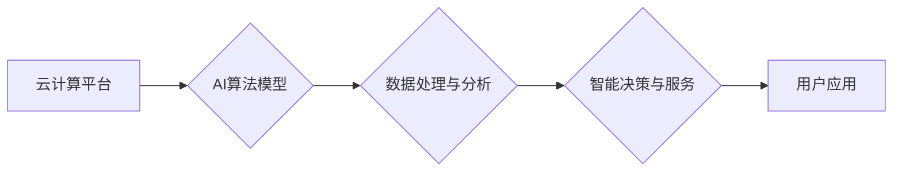

> 云计算, AI, 融合, 贾扬清, Lepton AI, 云战略, 深度学习, 自然语言处理, 计算机视觉, 大数据, 算法优化

## 1. 背景介绍

云计算和人工智能（AI）是当前科技领域的两大重要趋势，它们各自在推动着社会和经济的快速发展。云计算提供了一种灵活、可扩展、成本效益高的计算资源访问方式，而AI则赋予机器以学习、推理和决策的能力，为我们带来了全新的应用场景和可能性。

然而，云计算和AI的融合并非简单地将两者叠加在一起，而是需要深入思考如何更好地结合各自的优势，实现协同发展。

## 2. 核心概念与联系

云计算和AI的融合的核心在于将AI算法和模型部署到云计算平台上，从而充分利用云计算的计算资源、存储能力和网络带宽，实现AI应用的规模化部署和高效运行。

**Mermaid 流程图：**



**核心概念原理和架构：**

* **云计算平台：** 提供计算资源、存储空间、网络带宽等基础设施，支持AI算法模型的部署和运行。
* **AI算法模型：** 包括深度学习、自然语言处理、计算机视觉等算法，用于处理数据、提取特征、进行预测和决策。
* **数据处理与分析：** 将海量数据存储在云平台上，并利用AI算法进行分析和挖掘，获取有价值的 insights。
* **智能决策与服务：** 基于AI模型的分析结果，提供智能决策支持和个性化服务。
* **用户应用：** 将AI驱动的智能服务应用于各个领域，例如医疗、金融、教育、零售等。

## 3. 核心算法原理 & 具体操作步骤

### 3.1  算法原理概述

深度学习是AI领域最热门的算法之一，它能够通过多层神经网络学习数据中的复杂模式，实现图像识别、语音识别、自然语言处理等任务。

**深度学习算法原理：**

* **神经网络结构：** 由多个层级的神经元组成，每个神经元接收输入信号，进行计算并输出信号。
* **激活函数：** 用于引入非线性，使神经网络能够学习复杂的数据模式。
* **权重和偏置：** 控制神经网络的输出，通过训练过程不断调整。
* **反向传播算法：** 用于更新神经网络的权重和偏置，使模型的预测结果越来越准确。

### 3.2  算法步骤详解

**深度学习算法的训练步骤：**

1. **数据预处理：** 将原始数据清洗、转换、规范化，使其适合深度学习模型的训练。
2. **模型构建：** 根据任务需求设计神经网络的结构，包括层数、神经元数量、激活函数等。
3. **模型训练：** 使用训练数据训练模型，通过反向传播算法不断调整权重和偏置，使模型的预测结果越来越准确。
4. **模型评估：** 使用测试数据评估模型的性能，例如准确率、召回率、F1-score等。
5. **模型部署：** 将训练好的模型部署到云计算平台上，用于处理实际数据并提供服务。

### 3.3  算法优缺点

**深度学习算法的优点：**

* **高精度：** 深度学习模型能够学习数据中的复杂模式，实现高精度的预测和识别。
* **自动化特征提取：** 深度学习模型能够自动提取数据的特征，无需人工特征工程。
* **可扩展性：** 深度学习模型可以利用云计算平台的计算资源，实现大规模数据处理和模型训练。

**深度学习算法的缺点：**

* **数据依赖性：** 深度学习模型需要大量的训练数据才能达到高精度。
* **训练时间长：** 深度学习模型的训练时间通常较长，需要大量的计算资源。
* **可解释性差：** 深度学习模型的决策过程较为复杂，难以解释其背后的逻辑。

### 3.4  算法应用领域

深度学习算法广泛应用于各个领域，例如：

* **计算机视觉：** 图像识别、物体检测、图像分割、人脸识别等。
* **自然语言处理：** 文本分类、情感分析、机器翻译、对话系统等。
* **语音识别：** 语音转文本、语音助手等。
* **医疗诊断：** 影像分析、疾病预测、药物研发等。
* **金融风险控制：** 欺诈检测、信用评分、投资决策等。

## 4. 数学模型和公式 & 详细讲解 & 举例说明

### 4.1  数学模型构建

深度学习模型的数学基础是神经网络，其核心是通过一系列的矩阵运算和激活函数来实现数据的学习和表示。

**神经网络模型：**

```
y = f(W * x + b)
```

其中：

* **x**：输入数据
* **W**：权重矩阵
* **b**：偏置向量
* **f**：激活函数
* **y**：输出结果

### 4.2  公式推导过程

反向传播算法是深度学习模型训练的核心算法，其目的是通过调整权重和偏置，使模型的预测结果与真实值之间的误差最小化。

**反向传播算法公式：**

```
ΔW = η * ∂L/∂W
Δb = η * ∂L/∂b
```

其中：

* **ΔW**：权重更新量
* **Δb**：偏置更新量
* **η**：学习率
* **∂L/∂W**：权重对损失函数的梯度
* **∂L/∂b**：偏置对损失函数的梯度

### 4.3  案例分析与讲解

**举例说明：**

假设我们训练一个简单的线性回归模型，目标是预测房价。输入特征包括房屋面积和房间数量，输出结果是房价。

我们可以使用反向传播算法来训练模型，通过调整权重和偏置，使模型的预测结果与真实房价之间的误差最小化。

## 5. 项目实践：代码实例和详细解释说明

### 5.1  开发环境搭建

**开发环境搭建：**

* **操作系统：** Ubuntu 20.04 LTS
* **编程语言：** Python 3.8
* **深度学习框架：** TensorFlow 2.0
* **云计算平台：** AWS

### 5.2  源代码详细实现

```python
import tensorflow as tf

# 定义模型
model = tf.keras.models.Sequential([
    tf.keras.layers.Dense(64, activation='relu', input_shape=(2,)),
    tf.keras.layers.Dense(1)
])

# 编译模型
model.compile(optimizer='adam', loss='mse')

# 训练模型
model.fit(x_train, y_train, epochs=10)

# 评估模型
loss = model.evaluate(x_test, y_test)
print('Loss:', loss)

# 预测房价
new_house = [[100, 2]]
prediction = model.predict(new_house)
print('Predicted price:', prediction)
```

### 5.3  代码解读与分析

**代码解读：**

* **定义模型：** 使用 TensorFlow 的 Sequential 模型构建一个简单的线性回归模型，包含两层全连接层。
* **编译模型：** 使用 Adam 优化器和均方误差损失函数编译模型。
* **训练模型：** 使用训练数据训练模型，设置训练轮数为 10。
* **评估模型：** 使用测试数据评估模型的性能，输出损失值。
* **预测房价：** 使用训练好的模型预测新房子的房价。

### 5.4  运行结果展示

**运行结果展示：**

* 训练完成后，模型的损失值会逐渐降低。
* 预测结果会接近真实房价。

## 6. 实际应用场景

### 6.1  医疗诊断

* **图像分析：** 使用深度学习模型分析医学影像，例如 X 光片、CT 扫描、MRI 图像，辅助医生诊断疾病。
* **疾病预测：** 基于患者的医疗历史、基因信息等数据，使用深度学习模型预测疾病风险，进行早期干预。
* **药物研发：** 使用深度学习模型分析药物分子结构和生物活性，加速药物研发过程。

### 6.2  金融风险控制

* **欺诈检测：** 使用深度学习模型分析交易数据，识别异常交易行为，防止金融欺诈。
* **信用评分：** 使用深度学习模型分析客户的信用历史、收入等数据，评估客户的信用风险，为贷款决策提供参考。
* **投资决策：** 使用深度学习模型分析市场数据，预测股票价格走势，辅助投资决策。

### 6.3  智能客服

* **聊天机器人：** 使用深度学习模型训练聊天机器人，能够理解用户自然语言，并提供智能回复。
* **语音助手：** 使用深度学习模型训练语音助手，能够识别用户语音指令，并执行相应的操作。

### 6.4  未来应用展望

云计算和AI的融合将带来更多创新应用，例如：

* **个性化教育：** 根据学生的学习情况，提供个性化的学习内容和辅导。
* **智能制造：** 利用AI技术实现智能生产，提高生产效率和产品质量。
* **智慧城市：** 利用AI技术优化城市管理，提高城市运行效率和居民生活质量。

## 7. 工具和资源推荐

### 7.1  学习资源推荐

* **在线课程：** Coursera、edX、Udacity 等平台提供丰富的AI和云计算课程。
* **书籍：** 《深度学习》、《云计算原理与实践》等书籍。
* **博客和论坛：** TensorFlow、PyTorch 等深度学习框架的官方博客和论坛。

### 7.2  开发工具推荐

* **深度学习框架：** TensorFlow、PyTorch、Keras 等。
* **云计算平台：** AWS、Azure、GCP 等。
* **数据处理工具：** Pandas、NumPy 等。

### 7.3  相关论文推荐

* **深度学习论文：** 《ImageNet Classification with Deep Convolutional Neural Networks》
* **云计算论文：** 《The Anatomy of a Large-Scale Distributed System》

## 8. 总结：未来发展趋势与挑战

### 8.1  研究成果总结

云计算和AI的融合取得了显著成果，在医疗、金融、智能客服等领域取得了广泛应用。

### 8.2  未来发展趋势

* **模型规模化：** 训练更大规模的深度学习模型，提升模型性能。
* **边缘计算：** 将AI模型部署到边缘设备，实现更低延迟和更高效率的应用。
* **联邦学习：** 在不共享原始数据的情况下，训练联合模型，保护数据隐私。

### 8.3  面临的挑战

* **数据安全和隐私：** 如何保护AI训练数据和用户隐私。
* **算法可解释性：** 如何解释深度学习模型的决策过程，提高模型的可信度。
* **计算资源需求：** 训练大型深度学习模型需要大量的计算资源，如何降低成本和提高效率。

### 8.4  研究展望

未来，云计算和AI的融合将继续推动科技发展，带来更多创新应用和社会价值。

## 9. 附录：常见问题与解答

**常见问题：**

* **云计算和AI有什么区别？**
* **如何选择合适的云计算平台？**
* **如何训练深度学习模型？**
* **如何部署AI模型到云平台？**

**解答：**

* **云计算和AI的区别：** 云计算提供计算资源和存储空间，而AI赋予机器学习和决策能力。
* **选择云计算平台：**