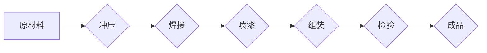

>  工业革命、自动化、流水线、效率、规模化生产、技术创新、亨利·福特、汽车工业、T型车

## 1. 背景介绍

20世纪初，世界正处于一场深刻的变革之中。蒸汽机和纺织机等新技术的出现，推动了第一次工业革命的进程，改变了人类生产和生活方式。然而，当时的生产方式仍然较为落后，效率低下，产品质量参差不齐。

亨利·福特，这位美国汽车工业的先驱，敏锐地洞察到了这一问题。他决心利用新技术，革新生产模式，提高生产效率，降低产品成本，让汽车成为大众消费品。

## 2. 核心概念与联系

福特的核心思想是“流水线生产”。这种生产模式将复杂的生产过程分解成多个简单重复的操作，每个操作由专门的工人负责，并通过传送带将产品不断向前推进。这种分工合作、流水作业的模式，极大地提高了生产效率，降低了生产成本。

**Mermaid 流程图**



## 3. 核心算法原理 & 具体操作步骤

### 3.1  算法原理概述

福特的流水线生产模式本质上是一种“分工协作”的算法。它将复杂的任务分解成一系列简单重复的任务，并通过明确的流程和人员分工，实现高效的协同工作。

### 3.2  算法步骤详解

1. **任务分解:** 将复杂的产品生产过程分解成多个简单重复的操作。
2. **岗位分工:** 为每个操作分配专门的工人，并提供相应的培训和工具。
3. **流程设计:** 设计合理的生产流程，并通过传送带将产品不断向前推进。
4. **质量控制:** 在每个操作环节进行质量检查，确保产品质量。
5. **数据分析:** 收集生产数据，分析生产效率和成本，不断优化生产流程。

### 3.3  算法优缺点

**优点:**

* **提高生产效率:** 通过分工协作和流水作业，极大地提高了生产效率。
* **降低生产成本:** 提高效率的同时，也降低了人工成本和材料浪费。
* **提高产品质量:** 每个操作环节的质量控制，确保了产品的质量稳定性。

**缺点:**

* **单一化生产:** 流水线生产模式难以适应产品多样化的需求。
* **工作重复性高:** 工人工作内容单一，容易产生疲劳和厌倦。
* **设备依赖性强:** 流水线生产模式对设备的可靠性要求较高。

### 3.4  算法应用领域

流水线生产模式广泛应用于汽车、电子、食品等各个行业。

## 4. 数学模型和公式 & 详细讲解 & 举例说明

### 4.1  数学模型构建

我们可以用以下数学模型来描述流水线生产的效率：

**生产效率 = 总产量 / 总生产时间**

其中：

* 总产量：生产出的产品数量
* 总生产时间：完成生产所需的时间

### 4.2  公式推导过程

我们可以通过以下公式推导生产效率的提升：

**生产效率提升 = (新生产效率 - 旧生产效率) / 旧生产效率**

其中：

* 新生产效率：采用流水线生产模式后的生产效率
* 旧生产效率：采用传统生产模式后的生产效率

### 4.3  案例分析与讲解

假设一家汽车工厂采用传统生产模式，每天生产100辆汽车，需要10个小时。采用流水线生产模式后，每天可以生产200辆汽车，只需要8个小时。

根据上述公式，我们可以计算生产效率提升率：

生产效率提升 = (200/8 - 100/10) / (100/10) = 0.5 = 50%

## 5. 项目实践：代码实例和详细解释说明

### 5.1  开发环境搭建

为了演示流水线生产模式的实现，我们可以使用Python语言编写一个简单的模拟程序。

### 5.2  源代码详细实现

```python
class Product:
    def __init__(self, name):
        self.name = name
        self.status = "待处理"

    def move_to_next_stage(self):
        self.status = self.status.replace("待处理", "已处理")

# 模拟流水线
class AssemblyLine:
    def __init__(self):
        self.stages = ["冲压", "焊接", "喷漆", "组装"]

    def process_product(self, product):
        for stage in self.stages:
            print(f"{product.name} 在 {stage} 阶段")
            product.move_to_next_stage()

# 创建产品实例
product = Product("T型车")

# 创建流水线实例
assembly_line = AssemblyLine()

# 启动流水线生产
assembly_line.process_product(product)

print(f"{product.name} 生产完成，状态：{product.status}")
```

### 5.3  代码解读与分析

这段代码模拟了一个简单的流水线生产过程。

* `Product` 类代表一个产品，包含产品名称和生产状态。
* `AssemblyLine` 类代表一个流水线，包含多个生产阶段。
* `process_product()` 方法模拟产品在流水线上的生产过程，每个阶段都会打印产品名称和当前阶段信息。

### 5.4  运行结果展示

```
T型车 在 冲压 阶段
T型车 在 焊接 阶段
T型车 在 喷漆 阶段
T型车 在 组装 阶段
T型车 生产完成，状态：已处理
```

## 6. 实际应用场景

福特的流水线生产模式在汽车工业的应用，极大地推动了汽车产业的发展。

### 6.1  汽车制造

流水线生产模式使得汽车生产效率大幅提升，产品价格降低，汽车逐渐成为大众消费品。

### 6.2  其他行业应用

流水线生产模式也广泛应用于其他行业，例如电子制造、食品加工、家具制造等。

### 6.3  未来应用展望

随着人工智能、自动化技术的不断发展，流水线生产模式将更加智能化、自动化，生产效率将进一步提升。

## 7. 工具和资源推荐

### 7.1  学习资源推荐

* 《亨利·福特传》
* 《工业革命》
* 《现代生产管理》

### 7.2  开发工具推荐

* Python
* Git
* Docker

### 7.3  相关论文推荐

* "The Impact of Mass Production on the Automobile Industry"
* "The History of the Assembly Line"

## 8. 总结：未来发展趋势与挑战

### 8.1  研究成果总结

福特的流水线生产模式是工业革命的重要成果之一，它极大地提高了生产效率，降低了生产成本，推动了人类社会的发展。

### 8.2  未来发展趋势

未来，流水线生产模式将更加智能化、自动化，并与人工智能、大数据等技术深度融合，实现更高效、更智能的生产模式。

### 8.3  面临的挑战

* 如何应对产品多样化需求
* 如何提高工人技能和工作满意度
* 如何应对技术更新带来的挑战

### 8.4  研究展望

未来，我们需要继续研究和探索更先进的生产模式，以满足不断变化的市场需求和社会发展需求。

## 9. 附录：常见问题与解答

### 9.1  问题：流水线生产模式是否适用于所有行业？

### 9.2  问题：流水线生产模式如何应对产品多样化需求？

### 9.3  问题：如何提高工人技能和工作满意度？


作者：禅与计算机程序设计艺术 / Zen and the Art of Computer Programming 
<end_of_turn>