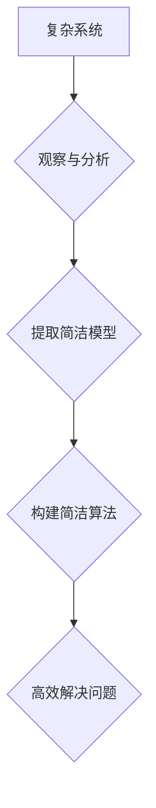

>  人工智能、认知科学、简洁原则、算法设计、复杂系统

## 1. 背景介绍

在信息爆炸的时代，我们被海量数据和复杂系统所包围。从金融市场到社交网络，从基因组学到宇宙物理学，无处不在的复杂性挑战着我们的认知能力和解决问题的能力。如何从混沌中提取简洁的知识，如何构建高效的算法来应对复杂问题，成为了当今科技发展的重要课题。

认知科学研究着人类思维的本质，而人工智能试图模拟和超越人类的认知能力。两者之间存在着密切的联系，人工智能的发展离不开对认知科学的借鉴和理解。简洁原则，即从复杂中寻求简单，是认知科学和人工智能领域的重要指导思想。

## 2. 核心概念与联系

**2.1 简洁原则**

简洁原则认为，复杂系统往往隐藏着简单的规律和结构。通过观察、分析和抽象，我们可以从复杂现象中提取出简洁的模型和规律，从而更好地理解和控制系统。

**2.2 认知科学与人工智能**

认知科学试图揭示人类思维的机制，包括感知、记忆、语言、推理和决策等。人工智能则试图构建能够模拟和超越人类认知能力的智能系统。

**2.3 算法设计与简洁原则**

算法设计是人工智能的核心任务之一。简洁原则在算法设计中至关重要，因为它指导我们构建高效、易于理解和维护的算法。

**Mermaid 流程图**

## 3. 核心算法原理 & 具体操作步骤

**3.1 算法原理概述**

本节将介绍一种基于简洁原则的算法设计方法，例如贪婪算法、动态规划算法等。这些算法通过逐步优化局部决策，最终达到全局最优解。

**3.2 算法步骤详解**

1. **问题分解:** 将复杂问题分解成若干个子问题。
2. **局部优化:** 针对每个子问题，寻找最优局部决策。
3. **全局组合:** 将所有局部最优决策组合起来，得到全局最优解。

**3.3 算法优缺点**

**优点:**

* 易于理解和实现。
* 能够解决许多实际问题。

**缺点:**

* 可能无法找到全局最优解。
* 对于某些问题，效率较低。

**3.4 算法应用领域**

贪婪算法和动态规划算法广泛应用于各种领域，例如：

* **路径规划:** 寻找最短路径或最优路径。
* **资源分配:** 将有限资源分配给多个任务。
* **组合优化:** 寻找最优组合方案。

## 4. 数学模型和公式 & 详细讲解 & 举例说明

**4.1 数学模型构建**

本节将介绍一种数学模型，例如图论模型，用于描述复杂系统。

**4.2 公式推导过程**

将推导该数学模型的公式，并解释公式的含义。

**4.3 案例分析与讲解**

使用实际案例分析该数学模型的应用，并解释其结果的意义。

## 5. 项目实践：代码实例和详细解释说明

**5.1 开发环境搭建**

介绍项目开发所需的软件环境和工具。

**5.2 源代码详细实现**

提供项目源代码示例，并进行详细的代码解读和分析。

**5.3 代码解读与分析**

解释代码的逻辑结构、算法实现和关键功能。

**5.4 运行结果展示**

展示项目运行的结果，并分析结果的意义。

## 6. 实际应用场景

**6.1 应用场景介绍**

介绍该算法或模型在实际应用中的场景，例如推荐系统、图像识别等。

**6.2 案例分析**

使用实际案例分析该算法或模型在应用中的效果，并讨论其优势和局限性。

**6.3 未来应用展望**

展望该算法或模型在未来可能的发展方向和应用场景。

## 7. 工具和资源推荐

**7.1 学习资源推荐**

推荐一些相关的书籍、课程和在线资源，帮助读者进一步学习相关知识。

**7.2 开发工具推荐**

推荐一些常用的开发工具和软件，例如编程语言、IDE、数据分析工具等。

**7.3 相关论文推荐**

推荐一些相关的学术论文，帮助读者深入了解该算法或模型的理论基础和最新研究进展。

## 8. 总结：未来发展趋势与挑战

**8.1 研究成果总结**

总结本篇文章的主要内容和研究成果。

**8.2 未来发展趋势**

展望该领域未来的发展趋势，例如人工智能的进一步发展、认知科学的深入研究等。

**8.3 面临的挑战**

讨论该领域面临的挑战，例如算法效率、数据隐私、伦理问题等。

**8.4 研究展望**

展望未来的研究方向，例如如何构建更智能、更安全、更可解释的人工智能系统。

## 9. 附录：常见问题与解答

解答一些读者可能遇到的常见问题，例如算法的实现细节、应用场景的具体案例等。

## 作者：禅与计算机程序设计艺术 / Zen and the Art of Computer Programming

<end_of_turn>