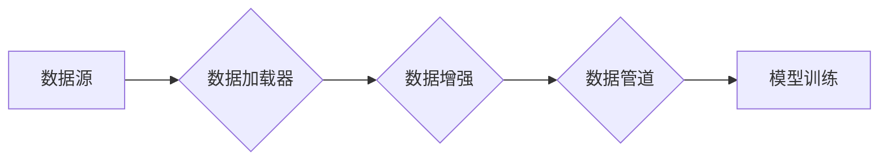

> 大模型开发, 微调, torch.utils.data, 自定义数据集, 数据加载, 数据增强,  PyTorch

## 1. 背景介绍

近年来，大模型在自然语言处理、计算机视觉、语音识别等领域取得了突破性进展，展现出强大的泛化能力和应用潜力。然而，现有的预训练大模型往往在特定领域或任务上表现欠佳，需要针对特定应用场景进行微调。

微调是指在预训练模型的基础上，使用少量标记数据进行训练，以提高模型在特定任务上的性能。微调过程的关键在于高效地加载和处理自定义数据集。PyTorch 提供了强大的 `torch.utils.data` 工具箱，可以帮助我们轻松构建数据加载器，并实现数据增强等操作，从而提高微调效率和模型性能。

## 2. 核心概念与联系

### 2.1 数据加载器

数据加载器是 `torch.utils.data` 工具箱的核心组件，负责从磁盘或内存中读取数据，并将其转换为模型可以理解的格式。

### 2.2 数据增强

数据增强是指通过对数据进行一些人为操作，例如旋转、缩放、裁剪等，增加数据集的规模和多样性，从而提高模型的鲁棒性和泛化能力。

### 2.3 数据管道

数据管道是将数据加载器、数据增强和模型训练等步骤串联起来的流程，可以有效地管理数据流，提高训练效率。

**Mermaid 流程图**



## 3. 核心算法原理 & 具体操作步骤

### 3.1 算法原理概述

`torch.utils.data` 工具箱的核心算法是基于迭代器模式，它将数据加载器包装成迭代器对象，可以方便地遍历数据集。

### 3.2 算法步骤详解

1. **创建数据集类:** 定义一个继承自 `torch.utils.data.Dataset` 的类，实现 `__len__` 和 `__getitem__` 方法，分别返回数据集大小和根据索引获取数据样本。

2. **创建数据加载器:** 使用 `torch.utils.data.DataLoader` 类创建数据加载器，传入数据集对象、批处理大小、随机打乱等参数。

3. **迭代数据:** 使用 `for` 循环迭代数据加载器，获取每个批次的训练数据。

### 3.3 算法优缺点

**优点:**

* 简单易用，易于理解和实现。
* 灵活可定制，可以根据需要调整数据加载和处理流程。
* 高效性能，可以并行加载数据，提高训练速度。

**缺点:**

* 对内存占用较高，需要根据数据集大小调整批处理大小。
* 数据加载过程可能存在延迟，影响训练效率。

### 3.4 算法应用领域

`torch.utils.data` 工具箱广泛应用于各种深度学习任务，例如图像分类、目标检测、自然语言处理等。

## 4. 数学模型和公式 & 详细讲解 & 举例说明

### 4.1 数学模型构建

数据加载器可以看作是一个数学模型，其输入是数据集，输出是训练数据批次。

### 4.2 公式推导过程

数据加载器内部使用循环和索引操作来获取数据样本，其核心公式可以表示为：

```latex
data_batch = dataset[start_index:end_index]
```

其中，`dataset` 是数据集对象，`start_index` 和 `end_index` 分别表示数据批次开始和结束索引。

### 4.3 案例分析与讲解

假设我们有一个包含 100 个图像样本的数据集，我们希望每次加载 10 个图像样本进行训练。

使用 `torch.utils.data.DataLoader` 创建数据加载器，设置批处理大小为 10，则每次迭代都会返回一个包含 10 个图像样本的数据批次。

## 5. 项目实践：代码实例和详细解释说明

### 5.1 开发环境搭建

* Python 3.7+
* PyTorch 1.7+
* torchvision 0.8+

### 5.2 源代码详细实现

```python
import torch
from torch.utils.data import Dataset, DataLoader

class ImageDataset(Dataset):
    def __init__(self, image_paths, labels):
        self.image_paths = image_paths
        self.labels = labels

    def __len__(self):
        return len(self.image_paths)

    def __getitem__(self, idx):
        image = Image.open(self.image_paths[idx]).convert('RGB')
        label = self.labels[idx]
        return image, label

# 数据集路径和标签
image_paths = ['image1.jpg', 'image2.jpg', ...]
labels = [0, 1, ...]

# 创建数据集对象
dataset = ImageDataset(image_paths, labels)

# 创建数据加载器
dataloader = DataLoader(dataset, batch_size=16, shuffle=True)

# 迭代数据
for images, labels in dataloader:
    # 进行模型训练
    # ...
```

### 5.3 代码解读与分析

* `ImageDataset` 类继承自 `torch.utils.data.Dataset`，实现 `__len__` 和 `__getitem__` 方法，分别返回数据集大小和根据索引获取数据样本。
* `DataLoader` 类创建数据加载器，传入数据集对象、批处理大小和随机打乱等参数。
* 迭代数据加载器，获取每个批次的训练数据。

### 5.4 运行结果展示

运行代码后，会输出每个批次的训练数据，例如：

```
images: tensor([[[..., ...],
          [..., ...],
          [..., ...]],

         [[..., ...],
          [..., ...],
          [..., ...]],
         ...])
labels: tensor([0, 1, 0, ...])
```

## 6. 实际应用场景

### 6.1 图像分类

使用 `torch.utils.data` 工具箱加载图像数据集，并使用卷积神经网络进行图像分类。

### 6.2 目标检测

使用 `torch.utils.data` 工具箱加载图像数据集，并使用目标检测模型进行目标检测。

### 6.3 自然语言处理

使用 `torch.utils.data` 工具箱加载文本数据集，并使用循环神经网络或 Transformer 模型进行自然语言处理任务。

### 6.4 未来应用展望

随着大模型的不断发展，`torch.utils.data` 工具箱将在数据加载和处理方面发挥越来越重要的作用。未来，我们可以期待看到更多基于 `torch.utils.data` 的创新应用，例如：

* 更高效的数据加载和处理算法。
* 更强大的数据增强技术。
* 更智能的数据管道管理系统。

## 7. 工具和资源推荐

### 7.1 学习资源推荐

* PyTorch 官方文档：https://pytorch.org/docs/stable/index.html
* PyTorch Tutorials：https://pytorch.org/tutorials/

### 7.2 开发工具推荐

* Jupyter Notebook
* VS Code

### 7.3 相关论文推荐

* PyTorch: Deep Learning with Dynamic Computational Graphs
* Data Augmentation for Deep Learning: A Survey

## 8. 总结：未来发展趋势与挑战

### 8.1 研究成果总结

`torch.utils.data` 工具箱为深度学习开发提供了强大的数据加载和处理能力，简化了模型训练流程，提高了训练效率。

### 8.2 未来发展趋势

未来，`torch.utils.data` 工具箱将朝着以下方向发展：

* 更高效的数据加载和处理算法。
* 更强大的数据增强技术。
* 更智能的数据管道管理系统。

### 8.3 面临的挑战

* 如何处理海量数据？
* 如何提高数据加载和处理的效率？
* 如何开发更智能的数据管道管理系统？

### 8.4 研究展望

未来，我们将继续研究和开发更先进的数据加载和处理技术，以推动深度学习的发展。

## 9. 附录：常见问题与解答

### 9.1 如何处理数据缺失？

可以使用 `torch.nn.functional.interpolate` 函数对缺失数据进行插值。

### 9.2 如何进行数据增强？

可以使用 `torchvision.transforms` 模块中的各种数据增强操作，例如旋转、缩放、裁剪等。

### 9.3 如何调整批处理大小？

可以通过 `batch_size` 参数来调整批处理大小。

### 9.4 如何随机打乱数据？

可以通过 `shuffle=True` 参数来随机打乱数据。


作者：禅与计算机程序设计艺术 / Zen and the Art of Computer Programming 
<end_of_turn>