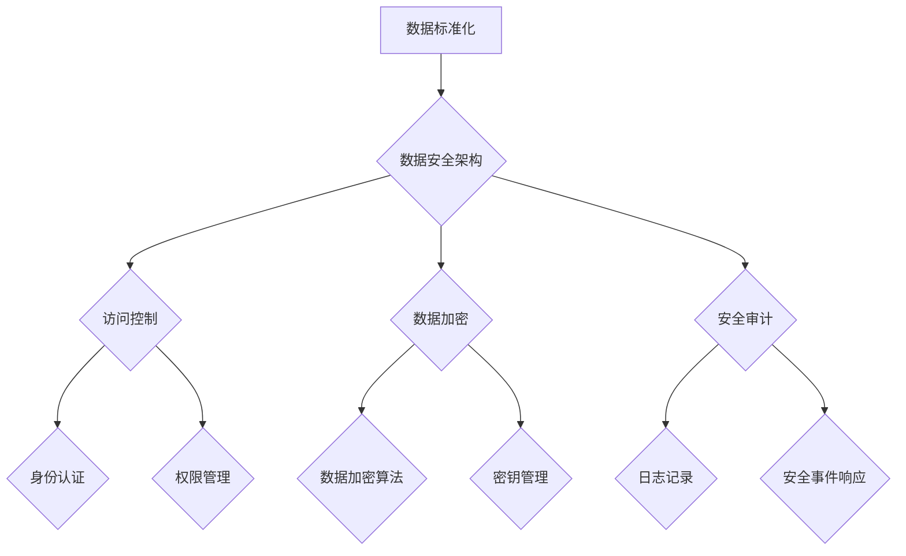

> 数据标准化, 信息安全, 数据加密, 数据访问控制, 数据备份与恢复, 隐私保护, 违规处理

## 1. 背景介绍

在当今数据驱动型社会，企业积累了海量的数据资产，这些数据蕴含着巨大的商业价值。然而，数据安全和隐私保护也日益受到重视。为了有效管理和保护企业数据，建立完善的数据标准及信息保密制度至关重要。

本制度旨在规范企业内部数据管理流程，确保数据安全、完整性和可信度，同时保护用户隐私，维护企业声誉和合法权益。

## 2. 核心概念与联系

### 2.1 数据标准化

数据标准化是指对企业内部的数据进行统一规范，使其具有可读性、可理解性和可交换性。数据标准化包括以下几个方面：

* **数据定义:** 明确数据的含义、类型、格式和单位等信息。
* **数据结构:** 规定数据的组织方式和存储结构。
* **数据命名规范:** 使用统一的命名规则，避免数据名称重复或混乱。
* **数据质量控制:** 建立数据质量标准，确保数据的准确性、完整性和一致性。

### 2.2 信息保密

信息保密是指对企业内部敏感信息进行保护，防止未经授权的访问、使用和披露。信息保密措施包括：

* **访问控制:** 限制对敏感信息的访问权限，仅授权人员才能访问。
* **数据加密:** 使用加密技术对敏感信息进行保护，防止未经授权的解密和使用。
* **安全审计:** 定期对系统和数据进行审计，记录访问日志和操作记录，以便追溯和调查安全事件。

### 2.3 数据安全架构

数据安全架构是企业内部数据安全管理的整体框架，它定义了数据安全策略、技术措施和组织流程。



## 3. 核心算法原理 & 具体操作步骤

### 3.1 算法原理概述

数据加密算法是信息保密的重要技术手段，它通过数学运算将明文转换为密文，防止未经授权的访问和使用。常见的加密算法包括：

* **对称加密算法:** 使用相同的密钥进行加密和解密，例如AES、DES。
* **非对称加密算法:** 使用一对密钥进行加密和解密，公钥用于加密，私钥用于解密，例如RSA、ECC。

### 3.2 算法步骤详解

**对称加密算法 (AES)**

1. **密钥扩展:** 将初始密钥扩展为多个子密钥。
2. **轮函数:** 对明文进行一系列的加密操作，包括置换、混淆、子密钥加解密等。
3. **循环迭代:** 将明文分组进行轮函数处理，直到所有明文分组都被加密。
4. **最终置换:** 对最后加密分组进行置换，得到密文。

**非对称加密算法 (RSA)**

1. **密钥生成:** 生成一对密钥，公钥和私钥。
2. **加密:** 使用公钥对明文进行加密，得到密文。
3. **解密:** 使用私钥对密文进行解密，得到明文。

### 3.3 算法优缺点

**对称加密算法:**

* **优点:** 加密速度快，效率高。
* **缺点:** 密钥分发和管理较为复杂。

**非对称加密算法:**

* **优点:** 密钥分发和管理相对简单，安全性高。
* **缺点:** 加密速度慢，效率低。

### 3.4 算法应用领域

* **数据加密:** 对敏感数据进行加密保护，防止未经授权的访问。
* **数字签名:** 验证数据来源和完整性。
* **身份认证:** 验证用户的身份信息。

## 4. 数学模型和公式 & 详细讲解 & 举例说明

### 4.1 数学模型构建

**对称加密算法 (AES)**

AES算法使用一个置换矩阵进行置换操作，该矩阵可以表示为一个n x n的方阵，其中n是块大小。置换矩阵的元素是0到n-1的排列，每个元素代表一个置换操作。

**非对称加密算法 (RSA)**

RSA算法基于大数分解的困难性。它使用两个大素数p和q生成公钥和私钥。公钥为(n,e)，私钥为(n,d)，其中n = p * q，e和d是模n的整数，满足以下条件：

* e * d ≡ 1 (mod φ(n))

其中φ(n)是欧拉函数，表示小于n且与n互质的正整数个数。

### 4.2 公式推导过程

**AES算法置换操作公式:**

```
C = S * P
```

其中C是置换后的数据，S是置换矩阵，P是原始数据。

**RSA算法加密公式:**

```
C = M^e mod n
```

其中C是密文，M是明文，e是公钥指数，n是模数。

### 4.3 案例分析与讲解

**AES算法案例:**

假设AES算法使用128位密钥，块大小为128位。将明文数据分组，每个分组长度为128位。使用密钥扩展算法生成多个子密钥，然后对每个分组进行轮函数处理，直到所有分组都被加密。

**RSA算法案例:**

假设p = 17，q = 19，则n = 323。选择e = 7，则d = 233。将明文数据转换为整数，然后使用RSA算法加密公式计算密文。

## 5. 项目实践：代码实例和详细解释说明

### 5.1 开发环境搭建

* 操作系统: Linux/Windows/macOS
* 编程语言: Python/Java/C++
* 开发工具: IDE (例如Eclipse, IntelliJ IDEA, Visual Studio Code)
* 数据存储: 数据库 (例如MySQL, PostgreSQL, MongoDB)

### 5.2 源代码详细实现

**Python代码示例 (AES加密)**

```python
from Crypto.Cipher import AES
from Crypto.Util.Padding import pad, unpad

# 密钥
key = b'your_secret_key'

# 明文数据
plaintext = b'This is a secret message.'

# 加密
cipher = AES.new(key, AES.MODE_ECB)
ciphertext = cipher.encrypt(pad(plaintext, AES.block_size))

# 解密
cipher = AES.new(key, AES.MODE_ECB)
plaintext = unpad(cipher.decrypt(ciphertext), AES.block_size)

print(f'明文: {plaintext}')
print(f'密文: {ciphertext}')
```

### 5.3 代码解读与分析

* **导入库:** 导入必要的加密库。
* **密钥设置:** 设置加密密钥。
* **明文数据:** 设置需要加密的数据。
* **加密:** 使用AES算法对明文数据进行加密，并使用ECB模式进行加密。
* **解密:** 使用相同的密钥和模式对密文数据进行解密。

### 5.4 运行结果展示

运行代码后，将输出明文和密文数据。

## 6. 实际应用场景

### 6.1 数据存储安全

对数据库中的敏感数据进行加密，防止未经授权的访问和泄露。

### 6.2 数据传输安全

对数据传输过程进行加密，防止数据在传输过程中被窃取。

### 6.3 个人信息保护

对用户的个人信息进行加密，保护用户的隐私安全。

### 6.4 企业内部数据安全

对企业内部的敏感数据进行加密，防止数据泄露和内部威胁。

### 6.5 未来应用展望

随着数据量的不断增长和安全威胁的不断升级，数据标准化和信息保密将变得更加重要。未来，数据安全技术将朝着以下方向发展：

* **更强大的加密算法:** 开发更安全的加密算法，抵御更高级的攻击。
* **更智能的数据安全系统:** 利用人工智能和机器学习技术，构建更智能的数据安全系统，能够自动识别和应对安全威胁。
* **更全面的数据安全解决方案:** 提供更全面的数据安全解决方案，涵盖数据标准化、加密、访问控制、安全审计等多个方面。

## 7. 工具和资源推荐

### 7.1 学习资源推荐

* **书籍:**
    * 《数据安全》
    * 《信息安全》
    * 《密码学原理》
* **在线课程:**
    * Coursera: 数据安全与隐私
    * edX: 信息安全
    * Udemy: 密码学

### 7.2 开发工具推荐

* **加密库:**
    * Python: Cryptography
    * Java: Bouncy Castle
    * C++: OpenSSL
* **安全审计工具:**
    * Splunk
    * Elasticsearch
    * Logstash

### 7.3 相关论文推荐

* **数据加密算法:**
    * AES算法论文
    * RSA算法论文
* **数据安全架构:**
    * NIST数据安全框架
    * ISO/IEC 27001信息安全管理体系标准

## 8. 总结：未来发展趋势与挑战

### 8.1 研究成果总结

本文章介绍了数据标准化和信息保密的重要概念、核心算法原理、实际应用场景以及未来发展趋势。数据标准化和信息保密是保障数据安全和隐私的重要措施，对于企业和个人都具有重要意义。

### 8.2 未来发展趋势

数据安全技术将朝着更强大、更智能、更全面的方向发展，以应对不断升级的安全威胁。

### 8.3 面临的挑战

* **新兴安全威胁:** 随着技术的不断发展，新的安全威胁不断涌现，例如量子计算攻击、人工智能攻击等。
* **数据隐私保护:** 如何平衡数据安全和用户隐私保护是一个重要的挑战。
* **技术标准化:** 数据标准化需要不断完善和更新，以适应不断变化的技术环境。

### 8.4 研究展望

未来，需要继续研究更安全的加密算法、更智能的数据安全系统、更全面的数据安全解决方案，以应对不断升级的安全挑战。

## 9. 附录：常见问题与解答

### 9.1 数据加密和解密需要什么条件？

数据加密和解密都需要相应的密钥。加密时使用密钥将明文转换为密文，解密时使用相同的密钥将密文转换为明文。

### 9.2 数据标准化有什么好处？

数据标准化可以提高数据质量、提高数据可交换性和可分析性，降低数据管理成本。

### 9.3 如何选择合适的加密算法？

选择合适的加密算法需要考虑多种因素，例如数据敏感程度、安全需求、性能要求等。

### 9.4 如何保护数据免受内部威胁？

除了技术措施外，还需要建立完善的内部控制制度，加强员工安全意识培训，定期进行安全审计，以防止内部威胁。


作者：禅与计算机程序设计艺术 / Zen and the Art of Computer Programming 
<end_of_turn>