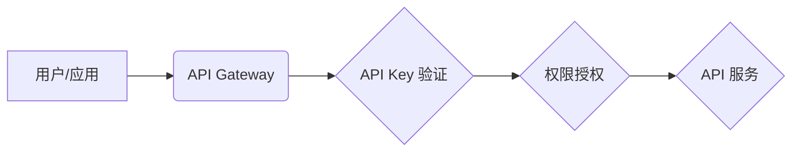
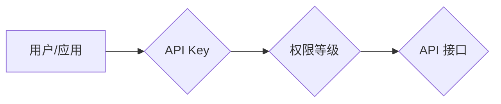

> API Key, 分级权限, 安全管理, 身份验证, 访问控制, API Gateway, OAuth 2.0

## 1. 背景介绍

在当今以 API 为核心的软件架构中，API Key 作为一种身份验证和访问控制机制，扮演着至关重要的角色。它允许开发者安全地访问应用程序的资源和功能，同时也能帮助平台方对 API 的使用进行管理和控制。然而，传统的 API Key 往往采用单一等级的授权模式，无法满足不同用户或应用对 API 功能的差异化需求。

随着 API 的日益普及和应用场景的不断扩展，对 API 权限管理的需求也日益增长。为了更好地满足不同用户和应用的个性化需求，分级 API Key 的设置方法应运而生。

## 2. 核心概念与联系

分级 API Key 的核心概念在于将 API 的访问权限进行分层管理，根据用户的身份、角色、应用类型等因素，分配不同的 API Key 和相应的权限等级。

**分级 API Key 的架构**



**核心概念原理和架构的 Mermaid 流程图**



**核心概念与联系**

* **用户/应用:**  需要访问 API 的主体，可以是个人开发者、企业应用或第三方平台。
* **API Gateway:**  API 的入口点，负责接收 API 请求并进行路由、验证、授权等操作。
* **API Key:**  用于身份验证的唯一标识符，每个用户或应用都拥有一个或多个 API Key。
* **权限等级:**  API Key 的权限级别，决定了用户或应用可以访问哪些 API 接口和功能。
* **API 接口:**  API 提供的服务，每个接口都有特定的功能和权限要求。

## 3. 核心算法原理 & 具体操作步骤

### 3.1  算法原理概述

分级 API Key 的核心算法原理是基于权限等级的策略匹配。当用户或应用发起 API 请求时，API Gateway 会首先验证 API Key 的有效性，然后根据 API Key 的权限等级与 API 接口的权限要求进行匹配。如果匹配成功，则允许用户或应用访问该 API 接口；否则，拒绝访问。

### 3.2  算法步骤详解

1. **API Key 验证:** API Gateway 首先需要验证 API Key 的有效性，确保其合法性和安全性。
2. **权限等级获取:** 根据验证结果，API Gateway 获取 API Key 的权限等级。
3. **API 接口权限匹配:** API Gateway 获取 API 接口的权限要求，并与 API Key 的权限等级进行匹配。
4. **访问控制:** 根据匹配结果，API Gateway 决定是否允许用户或应用访问该 API 接口。

### 3.3  算法优缺点

**优点:**

* **灵活的权限管理:**  可以根据不同的用户或应用需求，灵活地分配不同的 API Key 和权限等级。
* **精细化的访问控制:**  可以对 API 接口进行细粒度的权限控制，确保数据安全和系统稳定。
* **易于扩展:**  可以根据业务需求，轻松添加新的 API 接口和权限等级。

**缺点:**

* **管理复杂度:**  需要维护多个 API Key 和权限等级，管理起来相对复杂。
* **安全风险:**  如果 API Key 被泄露，可能会导致安全风险。

### 3.4  算法应用领域

分级 API Key 的应用领域非常广泛，包括：

* **云计算平台:**  为不同的用户和应用提供不同的服务和资源访问权限。
* **移动应用开发:**  为不同的用户提供个性化的服务和功能。
* **金融科技:**  对金融数据和交易进行安全访问控制。
* **物联网:**  管理和控制物联网设备的访问权限。

## 4. 数学模型和公式 & 详细讲解 & 举例说明

### 4.1  数学模型构建

我们可以用一个简单的数学模型来表示分级 API Key 的权限管理机制：

```
P(u, i) = f(K(u), L(i))
```

其中：

* **P(u, i):** 用户 u 对接口 i 的访问权限（0表示禁止访问，1表示允许访问）。
* **K(u):** 用户 u 的 API Key 权限等级。
* **L(i):** 接口 i 的权限要求。
* **f():** 权限匹配函数，根据 API Key 权限等级和接口权限要求进行匹配。

### 4.2  公式推导过程

权限匹配函数 f() 可以根据不同的策略进行设计，例如：

* **严格匹配:**  如果用户 API Key 的权限等级小于等于接口权限要求，则允许访问；否则，禁止访问。

* **宽松匹配:**  如果用户 API Key 的权限等级大于接口权限要求，则允许访问；否则，禁止访问。

* **组合匹配:**  根据多个条件进行匹配，例如用户 API Key 的权限等级、用户角色、时间限制等。

### 4.3  案例分析与讲解

**案例:**

假设一个 API 平台提供三个权限等级：

* **普通用户:**  只能访问基础功能的 API 接口。
* **高级用户:**  可以访问基础功能和高级功能的 API 接口。
* **管理员:**  可以访问所有 API 接口。

一个 API 接口需要管理员权限才能访问。

**分析:**

* 用户 API Key 的权限等级为普通用户，则无法访问该 API 接口。
* 用户 API Key 的权限等级为高级用户，则无法访问该 API 接口。
* 用户 API Key 的权限等级为管理员，则可以访问该 API 接口。

## 5. 项目实践：代码实例和详细解释说明

### 5.1  开发环境搭建

* **操作系统:**  Linux/macOS/Windows
* **编程语言:**  Python
* **框架:**  Flask/Django
* **数据库:**  MySQL/PostgreSQL

### 5.2  源代码详细实现

```python
from flask import Flask, request, jsonify

app = Flask(__name__)

# API Key 权限等级
API_KEY_LEVELS = {
    "user": 1,
    "admin": 2,
}

# API 接口权限
API_PERMISSIONS = {
    "/api/v1/users": {"level": 1},
    "/api/v1/admin": {"level": 2},
}

@app.route("/api/v1/users", methods=["GET"])
def get_users():
    api_key = request.headers.get("Authorization")
    if api_key:
        level = API_KEY_LEVELS.get(api_key)
        if level and level >= API_PERMISSIONS["/api/v1/users"]["level"]:
            # 允许访问
            return jsonify({"message": "Success"})
        else:
            # 权限不足
            return jsonify({"message": "Unauthorized"}), 401
    else:
        # 未提供 API Key
        return jsonify({"message": "Missing Authorization header"}), 400

if __name__ == "__main__":
    app.run(debug=True)
```

### 5.3  代码解读与分析

* **API Key 权限等级:**  `API_KEY_LEVELS` 字典定义了不同的 API Key 权限等级及其对应的数值。
* **API 接口权限:**  `API_PERMISSIONS` 字典定义了每个 API 接口的权限要求。
* **API 请求处理:**  `get_users()` 函数处理 `/api/v1/users` API 请求，从请求头中获取 API Key，并根据 API Key 的权限等级和接口权限要求进行匹配。

### 5.4  运行结果展示

当用户使用具有 "user" 权限的 API Key 请求 `/api/v1/users` 接口时，会返回 "Success" 消息，表示访问成功。

当用户使用具有 "admin" 权限的 API Key 请求 `/api/v1/admin` 接口时，会返回 "Success" 消息，表示访问成功。

当用户使用具有 "user" 权限的 API Key 请求 `/api/v1/admin` 接口时，会返回 "Unauthorized" 消息，表示权限不足。

## 6. 实际应用场景

### 6.1  云计算平台

云计算平台可以利用分级 API Key 来管理不同用户的资源访问权限。例如，普通用户只能访问基础云服务，而高级用户可以访问更多高级服务，例如大数据分析、机器学习等。

### 6.2  移动应用开发

移动应用开发可以利用分级 API Key 来提供个性化的服务和功能。例如，免费用户可以访问基础功能，而付费用户可以访问更多高级功能，例如无广告、专属客服等。

### 6.3  金融科技

金融科技可以利用分级 API Key 来对金融数据和交易进行安全访问控制。例如，银行可以为不同的合作伙伴分配不同的 API Key 和权限等级，控制他们对银行数据的访问权限。

### 6.4  未来应用展望

随着 API 的日益普及和应用场景的不断扩展，分级 API Key 的应用场景将会更加广泛。例如，在物联网领域，可以利用分级 API Key 来管理和控制物联网设备的访问权限，确保数据安全和系统稳定。

## 7. 工具和资源推荐

### 7.1  学习资源推荐

* **RESTful API 设计指南:**  https://restfulapi.net/
* **OAuth 2.0 规范:**  https://oauth.net/2/

### 7.2  开发工具推荐

* **Postman:**  https://www.postman.com/
* **Swagger:**  https://swagger.io/

### 7.3  相关论文推荐

* **API Key Management for Secure Access Control:**  https://ieeexplore.ieee.org/document/8876708

## 8. 总结：未来发展趋势与挑战

### 8.1  研究成果总结

分级 API Key 的设置方法为 API 的安全管理和权限控制提供了更加灵活和精细化的解决方案。

### 8.2  未来发展趋势

* **更细粒度的权限控制:**  未来可能会出现更加细粒度的权限控制机制，例如基于时间、地理位置、设备类型等条件进行权限控制。
* **动态权限管理:**  API 权限可以根据用户的行为、环境等因素进行动态调整，实现更加灵活和安全的访问控制。
* **机器学习驱动的权限管理:**  利用机器学习算法分析用户的行为模式，自动识别潜在的安全风险，并进行相应的权限控制。

### 8.3  面临的挑战

* **API Key 安全性:**  API Key 的泄露可能会导致安全风险，需要采取更加有效的安全措施来保护 API Key 的安全性。
* **权限管理复杂度:**  随着 API 的数量和复杂度不断增加，权限管理的复杂度也会随之提高，需要开发更加智能和高效的权限管理工具。
* **标准化问题:**  目前 API Key 的标准化程度不高，不同平台和服务之间存在兼容性问题，需要制定更加统一的标准规范。

### 8.4  研究展望

未来研究方向包括：

* 开发更加安全、高效、智能的 API Key 管理系统。
* 研究基于机器学习的动态权限管理机制。
* 推动 API Key 的标准化，提高平台和服务的互操作性。

## 9. 附录：常见问题与解答

**常见问题:**

* **如何生成 API Key?**

**解答:**  API Key 的生成方式取决于具体的平台和服务。一般来说，可以通过平台的管理后台或 API 接口进行生成。

* **如何保护 API Key 的安全性?**

**解答:**  API Key 应妥善保管，避免泄露。可以使用加密技术、令牌机制等方式来保护 API Key 的安全性。

* **如何管理多个 API Key?**

**解答:**  可以使用 API 管理平台或工具来管理多个 API Key，方便地查看、修改、删除 API Key。


作者：禅与计算机程序设计艺术 / Zen and the Art of Computer Programming 
<end_of_turn>