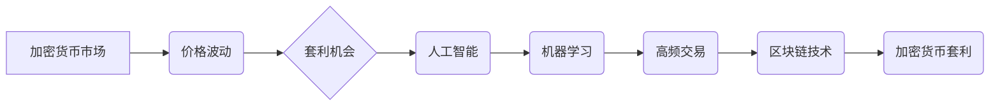

>  加密货币、套利、人工智能、机器学习、高频交易、区块链、算法、风险管理

## 1. 背景介绍

加密货币市场自诞生以来，便以其波动性、匿名性和去中心化特性吸引了全球投资者的目光。然而，其价格的剧烈波动也为投资者带来了巨大的风险和挑战。套利，作为一种利用价格差异获取利润的交易策略，在加密货币市场中得到了广泛应用。传统的套利策略往往依赖于人工操作和市场观察，效率有限，难以应对市场瞬息万变的节奏。随着人工智能、机器学习等技术的快速发展，利用技术优势进行加密货币套利成为了一个新的趋势。

## 2. 核心概念与联系

**2.1  加密货币套利**

加密货币套利是指在不同交易平台或市场上，同时买卖同一类加密货币，利用价格差异获取利润的行为。套利策略的核心是识别和利用市场上的价格不一致性，并通过快速交易来捕捉利润。

**2.2  人工智能与机器学习**

人工智能 (AI) 和机器学习 (ML) 是近年来发展迅速的领域，其核心是模拟人类智能，并通过数据分析和模式识别来进行决策和预测。在加密货币市场中，AI 和 ML 可以用于识别价格趋势、预测价格波动、识别套利机会等。

**2.3  高频交易**

高频交易 (HFT) 是一种利用高速计算机和算法，在极短时间内进行大量交易的交易策略。HFT 能够快速捕捉市场上的价格波动，并以微小的利润进行累积。

**2.4  区块链技术**

区块链技术是加密货币的基础，其特点是去中心化、透明和不可篡改。区块链技术为加密货币市场提供了安全可靠的交易基础，也为套利策略提供了新的可能性。

**2.5  核心概念关系图**



## 3. 核心算法原理 & 具体操作步骤

**3.1  算法原理概述**

利用技术优势进行加密货币套利，核心算法通常基于以下原理：

* **价格差异识别:** 利用机器学习算法分析不同交易平台或市场的加密货币价格数据，识别价格差异。
* **交易策略制定:** 根据识别出的价格差异，制定相应的交易策略，例如同时买入低价平台，卖出高价平台。
* **高频交易执行:** 利用高频交易系统，快速执行交易策略，捕捉利润。
* **风险管理:** 设置风险控制机制，例如止损价、仓位控制等，避免过度亏损。

**3.2  算法步骤详解**

1. **数据采集:** 从多个交易平台或市场收集加密货币价格数据。
2. **数据预处理:** 对收集到的数据进行清洗、转换和格式化，以便于后续算法分析。
3. **特征提取:** 从价格数据中提取特征，例如价格波动、交易量、成交时间等。
4. **模型训练:** 利用机器学习算法，训练模型以识别价格差异和预测价格波动。
5. **策略制定:** 根据训练好的模型，制定相应的交易策略。
6. **交易执行:** 利用高频交易系统，快速执行交易策略。
7. **风险管理:** 实时监控交易情况，并根据风险控制机制进行调整。

**3.3  算法优缺点**

**优点:**

* **效率高:** 利用机器学习和高频交易技术，能够快速识别和捕捉套利机会。
* **准确性高:** 机器学习算法能够学习市场规律，提高套利策略的准确性。
* **自动化程度高:** 能够自动执行交易策略，减少人工操作的风险。

**缺点:**

* **技术门槛高:** 需要具备一定的编程、机器学习和金融知识。
* **成本高:** 需要投入大量的资金和资源用于开发和维护系统。
* **风险高:** 市场波动性大，套利策略存在一定的风险。

**3.4  算法应用领域**

* **加密货币套利:** 利用价格差异获取利润。
* **市场预测:** 预测加密货币价格走势。
* **风险管理:** 识别和控制加密货币投资风险。

## 4. 数学模型和公式 & 详细讲解 & 举例说明

**4.1  数学模型构建**

假设有两个交易平台 A 和 B，交易平台 A 上的加密货币价格为 P_A，交易平台 B 上的加密货币价格为 P_B。套利机会的数学模型可以表示为：

```latex
\Delta P = P_B - P_A
```

其中，ΔP 表示价格差异。

**4.2  公式推导过程**

套利策略的目标是最大化利润，利润可以表示为：

```latex
Profit = \Delta P \times Quantity
```

其中，Quantity 表示交易数量。

为了最大化利润，需要选择合适的交易数量和交易时机。

**4.3  案例分析与讲解**

假设交易平台 A 上的加密货币价格为 100 美元，交易平台 B 上的加密货币价格为 102 美元，交易数量为 100 个。

根据公式，套利机会为：

```latex
\Delta P = 102 - 100 = 2 美元
```

利润为：

```latex
Profit = 2 \times 100 = 200 美元
```

## 5. 项目实践：代码实例和详细解释说明

**5.1  开发环境搭建**

* 操作系统：Linux 或 Windows
* Python 版本：3.7 或更高版本
* 必要的库：pandas, numpy, matplotlib, requests, websocket-client

**5.2  源代码详细实现**

```python
import pandas as pd
import numpy as np
import requests
from websocket_client import WebSocketClient

# 定义交易平台 API 接口
API_KEY = "your_api_key"
API_SECRET = "your_api_secret"

def get_price(exchange):
    url = f"https://api.{exchange}.com/v1/ticker/BTCUSDT"
    response = requests.get(url)
    data = response.json()
    return float(data["price"])

# 定义 WebSocket 连接
class CryptoWebSocketClient(WebSocketClient):
    def on_message(self, message):
        # 处理接收到的消息
        print(f"Received message: {message}")

# 创建 WebSocket 连接
client = CryptoWebSocketClient("wss://stream.example.com/ws")
client.connect()

# 获取交易平台价格数据
price_a = get_price("exchange_a")
price_b = get_price("exchange_b")

# 计算价格差异
price_diff = price_b - price_a

# 如果价格差异大于阈值，则执行交易
if price_diff > 0.01:
    # 执行交易逻辑
    print(f"Executing trade: Price difference is {price_diff}")

# 关闭 WebSocket 连接
client.close()
```

**5.3  代码解读与分析**

* 代码首先定义了交易平台 API 接口和获取价格函数。
* 然后定义了一个 WebSocket 连接类，用于接收实时价格数据。
* 代码获取了两个交易平台的价格数据，并计算了价格差异。
* 如果价格差异大于阈值，则执行交易逻辑。

**5.4  运行结果展示**

运行代码后，程序会连接到 WebSocket 服务器，接收实时价格数据。当价格差异大于阈值时，程序会打印执行交易的消息。

## 6. 实际应用场景

**6.1  跨平台套利**

利用不同交易平台的价格差异进行套利。

**6.2  同平台套利**

利用同一交易平台不同交易对的价格差异进行套利。

**6.3  市场波动套利**

利用市场波动进行套利，例如在价格下跌时买入，价格上涨时卖出。

**6.4  未来应用展望**

随着人工智能和机器学习技术的不断发展，加密货币套利策略将更加智能化、自动化和高效化。未来，我们可以期待看到更多基于人工智能的套利策略，例如：

* **深度学习套利:** 利用深度学习算法识别更复杂的市场规律，提高套利策略的准确性。
* **强化学习套利:** 利用强化学习算法，让套利策略能够不断学习和优化，适应不断变化的市场环境。
* **多因子套利:** 利用多个因素，例如价格、交易量、技术指标等，进行综合分析，制定更精准的套利策略。

## 7. 工具和资源推荐

**7.1  学习资源推荐**

* **书籍:**
    * 《Python机器学习》
    * 《深度学习》
    * 《加密货币投资指南》
* **在线课程:**
    * Coursera
    * edX
    * Udemy

**7.2  开发工具推荐**

* **编程语言:** Python
* **机器学习库:** scikit-learn, TensorFlow, PyTorch
* **高频交易平台:** QuantConnect, Alpaca

**7.3  相关论文推荐**

* **人工智能在金融领域的应用:**
    * "Deep Learning for Financial Forecasting"
    * "Reinforcement Learning for Algorithmic Trading"
* **加密货币套利策略:**
    * "Arbitrage Opportunities in Cryptocurrency Markets"
    * "A Machine Learning Approach to Cryptocurrency Arbitrage"

## 8. 总结：未来发展趋势与挑战

**8.1  研究成果总结**

利用技术优势进行加密货币套利是一个新兴的领域，取得了一些初步成果。机器学习算法能够有效识别价格差异，高频交易系统能够快速执行交易策略。

**8.2  未来发展趋势**

未来，人工智能和机器学习技术将进一步推动加密货币套利策略的发展，例如：

* **更智能化的套利策略:** 利用深度学习和强化学习算法，开发更智能、更精准的套利策略。
* **更自动化化的套利系统:** 利用自动化技术，实现更自动化、更高效的套利系统。
* **更安全的套利平台:** 利用区块链技术，构建更安全、更透明的套利平台。

**8.3  面临的挑战**

* **市场波动性:** 加密货币市场波动性大，套利策略存在一定的风险。
* **技术门槛:** 开发和维护套利系统需要一定的技术能力。
* **监管环境:** 加密货币监管环境不完善，可能会对套利活动产生影响。

**8.4  研究展望**

未来，我们需要继续研究和探索更有效的套利策略，并开发更安全、更可靠的套利平台。同时，还需要关注监管环境的变化，并积极与监管机构合作，推动加密货币市场健康发展。

## 9. 附录：常见问题与解答

**9.1  Q: 如何选择合适的交易平台？**

**A:** 选择交易平台时，需要考虑以下因素：交易费用、交易速度、平台安全性、交易品种等。

**9.2  Q: 如何设置风险控制机制？**

**A:** 风险控制机制可以包括止损价、仓位控制等。止损价是指在价格跌到一定程度时自动卖出，以止损亏损。仓位控制是指限制每次交易的资金比例，以避免过度亏损。

**9.3  Q: 加密货币套利是否合法？**

**A:** 加密货币套利本身是合法的，但需要遵守当地法律法规。


作者：禅与计算机程序设计艺术 / Zen and the Art of Computer Programming 
<end_of_turn>