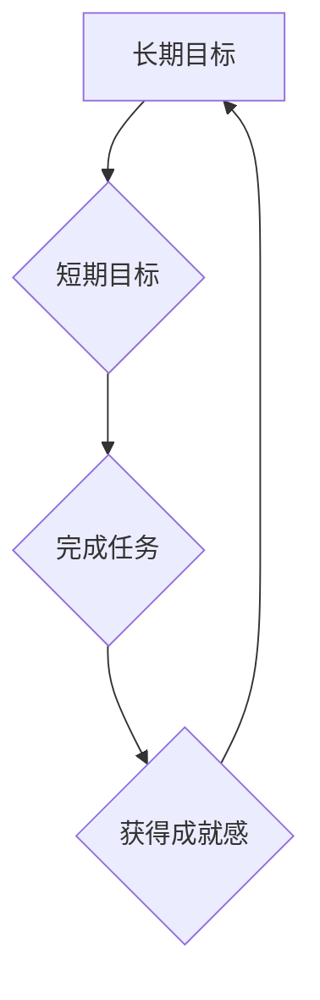

> 双目标清单,优先级,时间管理,效率提升,目标设定,任务分解,项目管理

## 1. 背景介绍

在当今快节奏的科技时代，IT从业者们面临着日益增长的工作压力和任务量。如何高效地管理时间，聚焦重要任务，并最终实现目标，成为了摆在每个人面前的挑战。传统的任务管理方法往往难以应对复杂的工作场景，而双目标清单实操则提供了一种全新的思路，帮助我们更好地规划和执行工作。

## 2. 核心概念与联系

双目标清单实操是一种基于目标优先级的任务管理方法，它将任务分解为两个相互关联的目标：**短期目标**和**长期目标**。

* **短期目标**：指在短期内需要完成的具体任务，通常以几天或几周为周期。
* **长期目标**：指需要长期努力才能实现的大目标，通常以几个月或几年为周期。

双目标清单的核心在于将短期目标与长期目标相结合，通过完成短期目标来逐步实现长期目标。这种方法可以帮助我们：

* **明确目标方向**:  长期目标为我们指明了前进的方向，而短期目标则为我们提供了具体的行动步骤。
* **提高效率**:  通过聚焦重要任务，避免分散精力，从而提高工作效率。
* **增强动力**:  完成短期目标可以带来成就感，从而增强我们完成长期目标的动力。

**Mermaid 流程图**



## 3. 核心算法原理 & 具体操作步骤

### 3.1  算法原理概述

双目标清单实操的核心算法原理是基于目标优先级和任务分解。

* **目标优先级**:  根据目标的重要性、紧急程度和对长期目标的贡献度，对目标进行排序，确定优先级。
* **任务分解**:  将长期目标分解成多个可执行的短期目标，并进一步分解成具体的任务。

### 3.2  算法步骤详解

1. **设定长期目标**:  明确你想要在未来实现的大目标。
2. **分解长期目标**: 将长期目标分解成多个短期目标，每个短期目标都应该能够独立完成，并为实现长期目标做出贡献。
3. **制定短期目标**:  为每个短期目标设定具体的行动步骤，并确定完成时间。
4. **优先级排序**:  根据目标的重要性、紧急程度和对长期目标的贡献度，对短期目标进行排序，确定优先级。
5. **执行任务**:  按照优先级顺序，逐个完成短期目标，并不断调整计划，以适应变化的状况。
6. **回顾总结**:  定期回顾完成情况，总结经验教训，并对计划进行调整。

### 3.3  算法优缺点

**优点**:

* **清晰目标**:  明确目标方向，提高工作效率。
* **高效执行**:  聚焦重要任务，避免分散精力。
* **增强动力**:  完成短期目标带来成就感，增强完成长期目标的动力。

**缺点**:

* **需要时间投入**:  设定目标和分解任务需要一定的思考和时间投入。
* **计划调整**:  需要根据实际情况不断调整计划，保持灵活性。

### 3.4  算法应用领域

双目标清单实操适用于各种工作场景，例如：

* **项目管理**:  将项目分解成多个阶段和任务，并制定相应的计划和进度跟踪。
* **个人时间管理**:  规划个人学习、工作和生活，提高时间利用率。
* **产品开发**:  将产品功能分解成多个模块，并制定开发计划和测试方案。

## 4. 数学模型和公式 & 详细讲解 & 举例说明

### 4.1  数学模型构建

我们可以用一个简单的数学模型来描述双目标清单实操的过程：

**长期目标 (LT) = ∑(短期目标 (ST))**

其中，∑表示求和符号，表示短期目标的累积贡献。

### 4.2  公式推导过程

这个公式的推导过程基于以下假设：

* 每个短期目标都能够为实现长期目标做出贡献。
* 短期目标的贡献度可以量化。

### 4.3  案例分析与讲解

假设我们的长期目标是“成为一名优秀的软件工程师”。我们可以将其分解成以下几个短期目标：

* 学习编程语言 (ST1)
* 掌握软件开发工具 (ST2)
* 完成个人项目 (ST3)
* 参加技术交流活动 (ST4)

根据公式，我们可以看到：

**长期目标 (成为一名优秀的软件工程师) = 学习编程语言 (ST1) + 掌握软件开发工具 (ST2) + 完成个人项目 (ST3) + 参加技术交流活动 (ST4)**

通过完成这些短期目标，我们最终能够实现长期目标。

## 5. 项目实践：代码实例和详细解释说明

### 5.1  开发环境搭建

为了更好地理解双目标清单实操的应用，我们可以使用 Python 语言开发一个简单的任务管理工具。

**开发环境:**

* Python 3.x
* Jupyter Notebook

### 5.2  源代码详细实现

```python
class Task:
    def __init__(self, name, description, priority, due_date):
        self.name = name
        self.description = description
        self.priority = priority
        self.due_date = due_date

    def __str__(self):
        return f"任务名称: {self.name}
描述: {self.description}
优先级: {self.priority}
截止日期: {self.due_date}"

class TaskManager:
    def __init__(self):
        self.tasks = []

    def add_task(self, task):
        self.tasks.append(task)

    def get_tasks_by_priority(self, priority):
        return [task for task in self.tasks if task.priority == priority]

    def get_tasks_by_due_date(self, due_date):
        return [task for task in self.tasks if task.due_date == due_date]

# 示例代码
manager = TaskManager()
manager.add_task(Task("学习 Python", "完成 Python 基础教程", "高", "2023-12-31"))
manager.add_task(Task("完成项目", "开发一个简单的 web 应用", "中", "2024-03-31"))
manager.add_task(Task("参加会议", "参加技术分享会", "低", "2023-11-15"))

print(manager.get_tasks_by_priority("高"))
```

### 5.3  代码解读与分析

这段代码实现了简单的任务管理功能。

* `Task` 类定义了任务的基本属性，包括名称、描述、优先级和截止日期。
* `TaskManager` 类负责管理任务列表，提供添加任务、根据优先级或截止日期获取任务等功能。

### 5.4  运行结果展示

运行这段代码后，我们可以看到根据优先级获取的任务列表：

```
任务名称: 学习 Python
描述: 完成 Python 基础教程
优先级: 高
截止日期: 2023-12-31
```

## 6. 实际应用场景

### 6.1  项目管理

在软件开发项目中，双目标清单实操可以帮助项目经理将项目分解成多个阶段和任务，并制定相应的计划和进度跟踪。例如，一个软件开发项目可以分解成以下几个阶段：需求分析、设计、开发、测试、部署和维护。每个阶段又可以进一步分解成多个具体的任务。通过双目标清单实操，项目经理可以清晰地了解项目进度，并及时调整计划，确保项目按时完成。

### 6.2  个人时间管理

对于个人时间管理，双目标清单实操可以帮助我们规划学习、工作和生活，提高时间利用率。例如，我们可以将学习目标分解成每天学习的章节数，将工作任务分解成每天需要完成的任务数量，并将生活目标分解成每天需要完成的活动。通过双目标清单实操，我们可以更好地控制时间，提高效率，并实现个人目标。

### 6.3  产品开发

在产品开发过程中，双目标清单实操可以帮助产品经理将产品功能分解成多个模块，并制定开发计划和测试方案。例如，一个新的社交媒体平台可以分解成用户注册、消息推送、好友关系、动态发布等多个模块。通过双目标清单实操，产品经理可以清晰地了解每个模块的开发进度，并及时调整计划，确保产品按时发布。

### 6.4  未来应用展望

随着科技的发展，双目标清单实操的应用场景将会更加广泛。例如，我们可以利用人工智能技术，自动生成双目标清单，并根据用户的行为数据，智能调整计划。未来，双目标清单实操将成为一种更加智能化、个性化的任务管理方法。

## 7. 工具和资源推荐

### 7.1  学习资源推荐

* **书籍**:
    * 《Getting Things Done: The Art of Stress-Free Productivity》 by David Allen
    * 《Eat That Frog!: 21 Great Ways to Stop Procrastinating and Get More Done in Less Time》 by Brian Tracy
* **在线课程**:
    * Coursera: "Time Management"
    * Udemy: "Productivity Masterclass"

### 7.2  开发工具推荐

* **Trello**:  一款基于 Kanban 的项目管理工具，可以用于创建双目标清单。
* **Asana**:  一款功能强大的项目管理工具，可以用于创建任务、分配责任、跟踪进度等。
* **Todoist**:  一款专注于任务管理的工具，可以用于创建双目标清单，并设置提醒。

### 7.3  相关论文推荐

* "The Eisenhower Matrix: A Framework for Prioritizing Tasks"
* "The Pomodoro Technique: A Time Management Method"

## 8. 总结：未来发展趋势与挑战

### 8.1  研究成果总结

双目标清单实操是一种有效的任务管理方法，它可以帮助我们聚焦重要任务，提高效率，并实现目标。通过将长期目标分解成多个短期目标，并根据优先级排序，我们可以更好地规划和执行工作。

### 8.2  未来发展趋势

未来，双目标清单实操将会更加智能化和个性化。例如，我们可以利用人工智能技术，自动生成双目标清单，并根据用户的行为数据，智能调整计划。此外，双目标清单实操还将与其他技术融合，例如协作工具、时间跟踪工具等，形成更加完善的管理体系。

### 8.3  面临的挑战

尽管双目标清单实操具有许多优点，但也面临一些挑战。例如，需要用户投入时间和精力进行计划和执行，并且需要不断调整计划，以适应变化的状况。此外，如何量化短期目标的贡献度，以及如何将双目标清单实操与其他管理方法结合，也是需要进一步研究的问题。

### 8.4  研究展望

未来，我们将继续研究双目标清单实操的应用场景，探索其在不同领域和不同用户群体中的有效性。此外，我们将研究如何利用人工智能技术，提高双目标清单实操的智能化和个性化程度，并将其与其他管理方法相结合，形成更加完善的管理体系。

## 9. 附录：常见问题与解答

**Q1: 如何设定长期目标？**

**A1:**  设定长期目标需要考虑你的兴趣、能力和价值观。问问自己，你想要在未来实现什么？你的梦想是什么？你的目标应该具有挑战性，但又必须是可实现的。

**Q2: 如何分解长期目标？**

**A2:**  将长期目标分解成多个可执行的短期目标，每个短期目标都应该能够独立完成，并为实现长期目标做出贡献。

**Q3: 如何确定短期目标的优先级？**

**A3:**  根据目标的重要性、紧急程度和对长期目标的贡献度，对短期目标进行排序，确定优先级。

**Q4: 如何保持计划的执行力？**

**A4:**  制定计划后，要坚持执行，并定期回顾总结，根据实际情况调整计划。


作者：禅与计算机程序设计艺术 /