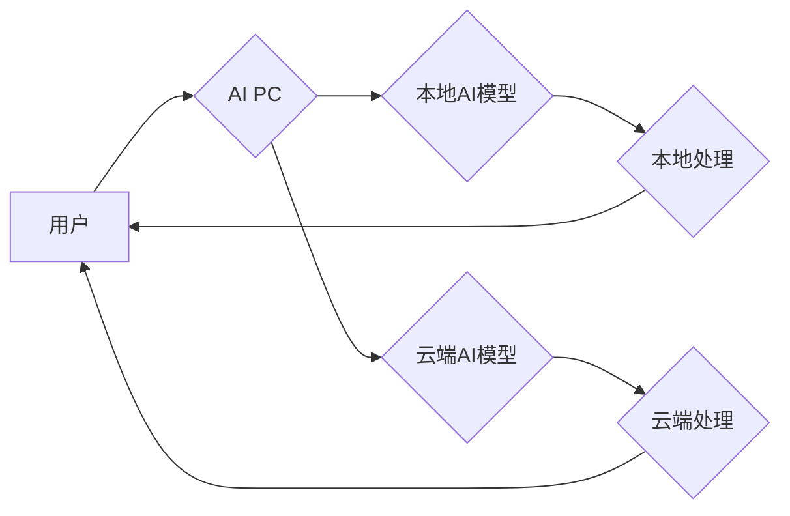

> 人工智能，个人电脑，AI PC，深度学习，自然语言处理，计算机视觉，边缘计算，云计算，未来技术

## 1. 背景介绍

近年来，人工智能（AI）技术飞速发展，已渗透到生活的方方面面。从智能手机的语音助手到自动驾驶汽车，AI正在改变着我们的世界。然而，现有的AI应用大多依赖于云端计算，这带来了数据隐私、网络延迟等问题。

为了解决这些问题，打造一个能够本地运行AI应用的“AI PC”成为了一个新的技术方向。AI PC将结合个人电脑的强大计算能力和AI技术的智能化，为用户提供更安全、更便捷、更个性化的体验。

## 2. 核心概念与联系

**2.1 AI PC 的概念**

AI PC是指集成了深度学习、自然语言处理、计算机视觉等AI技术的个人电脑。它不仅能够执行传统的计算任务，还能理解和响应用户的自然语言指令，识别图像和视频，并根据用户的需求提供个性化的服务。

**2.2 AI PC 的架构**

AI PC 的架构通常包括以下几个部分：

* **硬件平台:** 包括CPU、GPU、内存、存储等硬件设备，为AI算法的执行提供计算资源。
* **软件平台:** 包括操作系统、AI框架、应用软件等软件组件，为AI算法的开发和部署提供运行环境。
* **AI模型库:** 包含预训练的AI模型，例如语言模型、图像识别模型等，可以快速部署到AI PC 上。
* **数据管理系统:** 用于存储和管理AI模型训练数据和用户数据，确保数据安全和隐私。

**2.3 AI PC 与云计算的关系**

AI PC 和云计算是互补的关系。AI PC 可以利用云端计算资源进行大规模数据训练，并下载预训练的AI模型进行本地部署。同时，AI PC 也可以将数据上传到云端进行分析和处理，实现数据共享和协同工作。

**Mermaid 流程图**



## 3. 核心算法原理 & 具体操作步骤

**3.1 算法原理概述**

AI PC 的核心算法主要包括深度学习、自然语言处理和计算机视觉等。

* **深度学习:** 利用多层神经网络模拟人类大脑的学习过程，能够从海量数据中学习特征，并进行预测和分类。
* **自然语言处理:** 使计算机能够理解和处理人类语言，包括文本分析、语音识别、机器翻译等。
* **计算机视觉:** 使计算机能够“看”图像和视频，识别物体、场景和人脸等。

**3.2 算法步骤详解**

**3.2.1 深度学习算法步骤**

1. **数据收集和预处理:** 收集大量相关数据，并进行清洗、格式化等预处理工作。
2. **模型构建:** 选择合适的深度学习模型架构，例如卷积神经网络（CNN）、循环神经网络（RNN）等。
3. **模型训练:** 利用训练数据训练模型，调整模型参数，使模型能够准确地进行预测或分类。
4. **模型评估:** 使用测试数据评估模型的性能，例如准确率、召回率等。
5. **模型部署:** 将训练好的模型部署到AI PC上，供用户使用。

**3.2.2 自然语言处理算法步骤**

1. **文本预处理:** 对文本进行清洗、分词、词性标注等预处理工作。
2. **特征提取:** 从文本中提取语义特征，例如词向量、句向量等。
3. **模型训练:** 利用训练数据训练自然语言处理模型，例如文本分类、情感分析等。
4. **模型评估:** 使用测试数据评估模型的性能，例如准确率、F1-score等。
5. **模型部署:** 将训练好的模型部署到AI PC上，供用户使用。

**3.3 算法优缺点**

**3.3.1 深度学习算法**

* **优点:** 能够学习复杂特征，性能优异。
* **缺点:** 需要大量数据进行训练，训练时间长，参数量大。

**3.3.2 自然语言处理算法**

* **优点:** 能够理解和处理人类语言，应用广泛。
* **缺点:** 语言理解的复杂性，需要不断改进算法和模型。

**3.4 算法应用领域**

* **智能助手:** 理解用户的语音指令，提供个性化的服务。
* **图像识别:** 识别物体、场景和人脸，用于安防、医疗等领域。
* **文本分析:** 分析文本内容，用于市场调研、舆情监测等。
* **机器翻译:** 将一种语言翻译成另一种语言，用于跨语言交流。

## 4. 数学模型和公式 & 详细讲解 & 举例说明

**4.1 数学模型构建**

深度学习模型通常使用神经网络结构，其中每个神经元都接收来自其他神经元的输入，并通过激活函数进行处理，输出到下一个神经元。

**4.2 公式推导过程**

神经网络的训练过程是通过反向传播算法来实现的。反向传播算法的核心思想是通过计算误差，并反向传播到每个神经元，调整每个神经元的权重和偏置，使得模型的输出更接近真实值。

**4.3 案例分析与讲解**

例如，在图像识别任务中，我们可以使用卷积神经网络（CNN）模型。CNN模型利用卷积层和池化层来提取图像特征，并使用全连接层进行分类。

**4.3.1 卷积层**

卷积层使用卷积核对图像进行卷积运算，提取图像局部特征。卷积核是一个小的矩阵，通过滑动在图像上，计算每个位置的卷积结果。

**4.3.2 池化层**

池化层对卷积层的输出进行降维，减少计算量，并提高模型的鲁棒性。常见的池化操作包括最大池化和平均池化。

**4.3.3 全连接层**

全连接层将卷积层和池化层的输出进行连接，并进行分类。全连接层使用softmax函数将输出映射到多个类别概率。

## 5. 项目实践：代码实例和详细解释说明

**5.1 开发环境搭建**

* 操作系统: Ubuntu 20.04
* CPU: Intel Core i7-10700K
* GPU: NVIDIA GeForce RTX 3080
* 软件环境: Python 3.8, TensorFlow 2.4, PyTorch 1.7

**5.2 源代码详细实现**

```python
# 使用 TensorFlow 构建一个简单的图像分类模型

import tensorflow as tf

# 定义模型结构
model = tf.keras.models.Sequential([
    tf.keras.layers.Conv2D(32, (3, 3), activation='relu', input_shape=(28, 28, 1)),
    tf.keras.layers.MaxPooling2D((2, 2)),
    tf.keras.layers.Conv2D(64, (3, 3), activation='relu'),
    tf.keras.layers.MaxPooling2D((2, 2)),
    tf.keras.layers.Flatten(),
    tf.keras.layers.Dense(10, activation='softmax')
])

# 编译模型
model.compile(optimizer='adam',
              loss='sparse_categorical_crossentropy',
              metrics=['accuracy'])

# 训练模型
model.fit(x_train, y_train, epochs=5)

# 评估模型
loss, accuracy = model.evaluate(x_test, y_test)
print('Test loss:', loss)
print('Test accuracy:', accuracy)
```

**5.3 代码解读与分析**

这段代码定义了一个简单的卷积神经网络模型，用于图像分类任务。模型包含两个卷积层、两个池化层、一个全连接层和一个softmax输出层。

* **Conv2D层:** 用于提取图像特征。
* **MaxPooling2D层:** 用于降维，提高模型的鲁棒性。
* **Flatten层:** 将多维数据转换为一维数据。
* **Dense层:** 全连接层，用于分类。
* **softmax层:** 将输出映射到多个类别概率。

**5.4 运行结果展示**

训练完成后，模型可以用于预测新的图像类别。

## 6. 实际应用场景

**6.1 智能家居**

AI PC 可以用于控制智能家居设备，例如灯光、空调、窗帘等，并根据用户的需求进行个性化调节。

**6.2 个人健康管理**

AI PC 可以用于监测用户的健康数据，例如心率、血压、睡眠等，并提供个性化的健康建议。

**6.3 教育辅助**

AI PC 可以用于提供个性化的教育辅导，例如智能答疑、知识点讲解等。

**6.4 娱乐休闲**

AI PC 可以用于提供个性化的娱乐体验，例如智能游戏、虚拟现实等。

**6.4 未来应用展望**

随着AI技术的不断发展，AI PC 的应用场景将更加广泛。例如，AI PC 可以用于自动驾驶、医疗诊断、金融风险控制等领域。

## 7. 工具和资源推荐

**7.1 学习资源推荐**

* **在线课程:** Coursera, edX, Udacity
* **书籍:** 深度学习，自然语言处理，计算机视觉
* **开源项目:** TensorFlow, PyTorch, Keras

**7.2 开发工具推荐**

* **IDE:** PyCharm, VS Code
* **深度学习框架:** TensorFlow, PyTorch
* **数据可视化工具:** Matplotlib, Seaborn

**7.3 相关论文推荐**

* **深度学习论文:** ImageNet Classification with Deep Convolutional Neural Networks
* **自然语言处理论文:** Attention Is All You Need
* **计算机视觉论文:** Mask R-CNN

## 8. 总结：未来发展趋势与挑战

**8.1 研究成果总结**

AI PC 技术已经取得了显著的进展，在图像识别、自然语言处理、语音识别等领域取得了突破性成果。

**8.2 未来发展趋势**

* **边缘计算:** 将AI模型部署到边缘设备，实现更低延迟、更高效率的AI应用。
* **联邦学习:** 在不共享原始数据的情况下，训练联合模型，保护用户隐私。
* **跨模态学习:** 融合不同模态数据，例如文本、图像、音频等，实现更智能的AI应用。

**8.3 面临的挑战**

* **模型规模和效率:** 训练大型AI模型需要大量的计算资源，如何提高模型效率是一个关键挑战。
* **数据安全和隐私:** AI模型的训练和部署需要大量数据，如何保护用户数据安全和隐私是一个重要问题。
* **算法可解释性:** 许多AI模型是黑盒模型，难以解释其决策过程，如何提高算法的可解释性是一个重要的研究方向。

**8.4 研究展望**

未来，AI PC 技术将继续发展，为用户提供更智能、更便捷、更安全的体验。


## 9. 附录：常见问题与解答

**9.1 如何选择合适的AI PC硬件配置？**

选择AI PC硬件配置需要根据用户的需求和预算进行选择。

* **CPU:** 选择多核CPU，例如Intel Core i7或AMD Ryzen 7。
* **GPU:** 选择高性能GPU，例如NVIDIA GeForce RTX 30系列或AMD Radeon RX 6000系列。
* **内存:** 选择至少16GB内存，最好32GB或以上。
* **存储:** 选择SSD硬盘，提高数据读写速度。

**9.2 如何安装和配置AI PC软件环境？**

安装和配置AI PC软件环境需要根据选择的软件框架进行操作。例如，安装TensorFlow需要安装Python、pip等软件包。

**9.3 如何训练自己的AI模型？**

训练自己的AI模型需要准备训练数据、选择合适的模型架构、调整模型参数等步骤。

**9.4 如何部署AI模型到AI PC上？**

部署AI模型到AI PC上需要