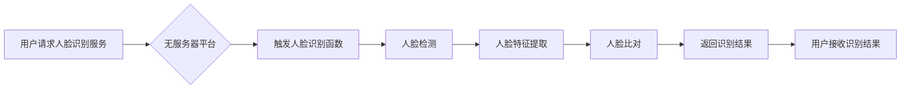

> 无服务器架构，人脸识别，深度学习，云计算，计算机视觉

## 1. 背景介绍

人脸识别技术作为计算机视觉领域的重要分支，近年来取得了长足的进步，并在安防监控、身份验证、人脸搜索等领域得到了广泛应用。传统的基于服务器的人脸识别系统通常需要部署和维护复杂的硬件设施，成本高昂，且缺乏灵活性。随着云计算和无服务器架构的兴起，基于无服务器架构的人脸识别系统逐渐成为一种新的趋势。

无服务器架构（Serverless Architecture）是一种将应用程序的执行逻辑委托给云服务提供商的计算模型。开发者无需关注服务器的管理和维护，只需专注于应用程序的业务逻辑。这种架构具有以下优势：

* **弹性伸缩：** 无服务器架构可以根据应用程序的需求自动伸缩计算资源，无需手动配置。
* **成本效益：** 只需为实际使用的计算资源付费，无需支付空闲资源的费用。
* **快速部署：** 无服务器平台提供简化的部署流程，可以快速将应用程序上线。

基于无服务器架构的人脸识别系统可以充分利用云计算的优势，实现快速部署、弹性伸缩、成本效益等特点，为用户提供更加便捷、高效的人脸识别服务。

## 2. 核心概念与联系

### 2.1 无服务器架构

无服务器架构是一种将应用程序的执行逻辑委托给云服务提供商的计算模型。开发者无需关注服务器的管理和维护，只需专注于应用程序的业务逻辑。

**无服务器架构的典型特点：**

* **事件驱动：** 无服务器函数通常由事件触发执行，例如用户请求、数据更新等。
* **按需执行：** 无服务器函数只在需要时执行，无需持续运行。
* **自动伸缩：** 无服务器平台可以根据应用程序的需求自动伸缩计算资源。

**无服务器架构的优势：**

* **弹性伸缩：** 无服务器架构可以根据应用程序的需求自动伸缩计算资源，无需手动配置。
* **成本效益：** 只需为实际使用的计算资源付费，无需支付空闲资源的费用。
* **快速部署：** 无服务器平台提供简化的部署流程，可以快速将应用程序上线。

**无服务器架构的应用场景：**

* **微服务：** 将大型应用程序拆分成多个小型服务，每个服务都作为一个独立的无服务器函数。
* **实时数据处理：** 处理来自传感器、社交媒体等实时数据。
* **API 网关：** 提供 API 接口，并根据请求自动执行相应的业务逻辑。

**无服务器架构的典型平台：**

* AWS Lambda
* Azure Functions
* Google Cloud Functions

### 2.2 人脸识别技术

人脸识别技术是指利用计算机技术识别和验证人脸图像的技术。它通常包括以下步骤：

* **人脸检测：** 从图像中检测出人脸区域。
* **人脸特征提取：** 从人脸图像中提取特征，例如眼睛、鼻子、嘴巴等位置和形状。
* **人脸比对：** 将提取的特征与数据库中的特征进行比对，判断是否匹配。

**人脸识别技术的应用场景：**

* **安防监控：** 人脸识别可以用于识别嫌疑人、监控人员进出情况。
* **身份验证：** 人脸识别可以用于验证用户的身份，例如解锁手机、登录账户。
* **人脸搜索：** 人脸识别可以用于搜索数据库中的人脸图像，例如查找失散人员。

**人脸识别技术的核心算法：**

* **传统方法：** 基于特征工程的人脸识别算法，例如 PCA、LDA 等。
* **深度学习方法：** 基于深度神经网络的人脸识别算法，例如 CNN、ResNet 等。

### 2.3 无服务器架构与人脸识别技术的结合

将无服务器架构与人脸识别技术结合，可以构建更加灵活、高效、成本效益的人脸识别系统。

**无服务器架构带来的优势：**

* **弹性伸缩：** 人脸识别系统可以根据用户需求自动伸缩计算资源，应对高峰期流量。
* **成本效益：** 只需为实际使用的计算资源付费，无需支付空闲资源的费用。
* **快速部署：** 无服务器平台提供简化的部署流程，可以快速将人脸识别系统上线。

**无服务器架构与人脸识别技术的结合场景：**

* **云端人脸识别服务：** 提供基于无服务器架构的人脸识别服务，供开发者集成到自己的应用程序中。
* **边缘人脸识别：** 将人脸识别模型部署到边缘设备上，实现实时人脸识别。

**Mermaid 流程图：**



## 3. 核心算法原理 & 具体操作步骤

### 3.1 算法原理概述

人脸识别算法的核心是提取人脸图像的特征，并将其与数据库中的特征进行比对。传统的基于特征工程的人脸识别算法，例如 PCA、LDA 等，需要人工设计特征，且对光照、姿态等变化敏感。深度学习方法，例如 CNN、ResNet 等，可以自动学习人脸特征，具有更高的识别精度和鲁棒性。

### 3.2 算法步骤详解

**基于深度学习的人脸识别算法步骤：**

1. **数据预处理：** 对人脸图像进行预处理，例如裁剪、缩放、归一化等。
2. **特征提取：** 使用深度神经网络提取人脸图像的特征。
3. **特征匹配：** 将提取的特征与数据库中的特征进行比对，计算相似度。
4. **识别结果输出：** 根据相似度阈值，判断是否匹配，并输出识别结果。

**具体操作步骤：**

1. **数据收集：** 收集大量的人脸图像数据，并进行标注。
2. **模型训练：** 使用深度学习框架，例如 TensorFlow、PyTorch 等，训练人脸识别模型。
3. **模型评估：** 使用测试数据评估模型的识别精度。
4. **模型部署：** 将训练好的模型部署到无服务器平台上。
5. **API 接口开发：** 开发 API 接口，供用户调用人脸识别服务。

### 3.3 算法优缺点

**优点：**

* **高识别精度：** 深度学习方法可以自动学习人脸特征，具有更高的识别精度。
* **鲁棒性强：** 对光照、姿态等变化具有较强的鲁棒性。
* **可扩展性强：** 可以根据需求增加计算资源，满足高并发需求。

**缺点：**

* **训练数据量大：** 需要大量的人脸图像数据进行训练。
* **计算资源消耗大：** 训练和部署深度学习模型需要较大的计算资源。
* **模型解释性差：** 深度学习模型的决策过程难以解释。

### 3.4 算法应用领域

* **安防监控：** 人脸识别可以用于识别嫌疑人、监控人员进出情况。
* **身份验证：** 人脸识别可以用于验证用户的身份，例如解锁手机、登录账户。
* **人脸搜索：** 人脸识别可以用于搜索数据库中的人脸图像，例如查找失散人员。
* **医疗诊断：** 人脸识别可以用于识别患者的病情，辅助医生诊断。
* **零售业：** 人脸识别可以用于个性化推荐、会员管理等。

## 4. 数学模型和公式 & 详细讲解 & 举例说明

### 4.1 数学模型构建

人脸识别算法的核心是提取人脸图像的特征，并将其与数据库中的特征进行比对。常用的特征提取方法包括 PCA、LDA、CNN 等。

**PCA（主成分分析）**

PCA 是一种降维技术，可以将高维数据降维到低维空间，同时保留数据的最大信息量。

**数学模型：**

* **协方差矩阵：**  
$$
\Sigma = \frac{1}{n} \sum_{i=1}^{n} (x_i - \mu)(x_i - \mu)^T
$$
* **特征值和特征向量：**  
$$
\Sigma v_i = \lambda_i v_i
$$

其中：

* $x_i$ 是第 $i$ 个数据点。
* $\mu$ 是数据的均值向量。
* $\Sigma$ 是数据的协方差矩阵。
* $v_i$ 是第 $i$ 个特征向量。
* $\lambda_i$ 是第 $i$ 个特征值。

**LDA（线性判别分析）**

LDA 是一种监督学习算法，可以将数据投影到一个低维空间，使得不同类别的数据尽可能地分离。

**数学模型：**

* **类内散度矩阵：**  
$$
S_w = \sum_{i=1}^{c} \sum_{x_j \in C_i} (x_j - \mu_i)(x_j - \mu_i)^T
$$
* **类间散度矩阵：**  
$$
S_b = \sum_{i=1}^{c} n_i (\mu_i - \mu)(\mu_i - \mu)^T
$$

其中：

* $c$ 是类别的数量。
* $C_i$ 是第 $i$ 个类别的数据集。
* $\mu_i$ 是第 $i$ 个类别的均值向量。
* $\mu$ 是所有类别的均值向量。
* $n_i$ 是第 $i$ 个类别的样本数量。

**CNN（卷积神经网络）**

CNN 是一种专门用于处理图像数据的深度学习算法，可以自动学习人脸特征。

**数学模型：**

CNN 的数学模型主要包括卷积层、池化层、全连接层等。

* **卷积层：** 使用卷积核对输入图像进行卷积运算，提取图像特征。
* **池化层：** 对卷积层的输出进行池化运算，降低特征维度，提高模型鲁棒性。
* **全连接层：** 将池化层的输出连接到全连接层，进行分类或回归。

### 4.2 公式推导过程

由于篇幅限制，这里只列举了 PCA、LDA、CNN 的数学模型，详细的公式推导过程可以参考相关书籍和论文。

### 4.3 案例分析与讲解

**PCA 应用案例：**

PCA 可以用于人脸图像的降维，减少存储空间和计算量。例如，可以将人脸图像降维到 100 维，同时保留大部分的人脸信息。

**LDA 应用案例：**

LDA 可以用于人脸识别，将不同人的人脸图像投影到一个低维空间，使得不同人的特征更加分离。

**CNN 应用案例：**

CNN 可以用于人脸识别，自动学习人脸特征，并实现高精度的人脸识别。例如，FaceNet、VGGFace 等模型都使用了 CNN 算法，取得了很好的识别效果。

## 5. 项目实践：代码实例和详细解释说明

### 5.1 开发环境搭建

* **操作系统：** Linux (Ubuntu 18.04 或更高版本)
* **云平台：** AWS, Azure 或 Google Cloud
* **无服务器平台：** AWS Lambda, Azure Functions 或 Google Cloud Functions
* **编程语言：** Python 3.7 或更高版本
* **深度学习框架：** TensorFlow 或 PyTorch

### 5.2 源代码详细实现

```python
# 人脸识别函数
def lambda_handler(event, context):
    # 从事件中获取人脸图像数据
    image_data = event['image_data']

    # 使用深度学习模型进行人脸识别
    # ...

    # 返回识别结果
    return {
        'statusCode': 200,
        'body': json.dumps({'face_id': face_id, 'confidence': confidence})
    }
```

**代码解释：**

* `lambda_