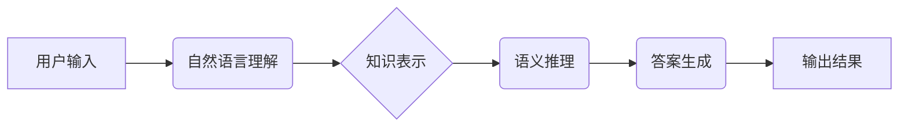

> 大模型、问答机器人、知识处理、自然语言理解、知识图谱、语义推理

## 1. 背景介绍

近年来，深度学习技术的飞速发展推动了人工智能领域取得了突破性进展，其中大模型问答机器人作为人工智能的重要应用场景之一，备受关注。大模型问答机器人能够理解用户自然语言问题，并从海量知识库中检索和推理出准确的答案，为用户提供智能化服务。

传统的问答系统主要依赖于规则引擎和手工构建的知识库，难以应对复杂、开放式的自然语言问题。而大模型问答机器人则通过训练海量文本数据，学习语言的语义和结构，能够更好地理解用户意图，并进行更精准的知识检索和推理。

## 2. 核心概念与联系

大模型问答机器人的知识处理是其核心功能之一，它涉及到自然语言理解、知识表示和语义推理等多个方面。

**2.1 自然语言理解 (NLU)**

NLU是问答系统理解用户输入的关键环节，它需要识别用户问题的类型、实体、关系等信息。

**2.2 知识表示**

知识表示是指将知识以机器可理解的形式进行存储和组织。常用的知识表示形式包括知识图谱、语义网络等。

**2.3 语义推理**

语义推理是指根据已有的知识，推断出新的知识或关系。

**2.4 核心架构**



## 3. 核心算法原理 & 具体操作步骤

### 3.1  算法原理概述

大模型问答机器人的知识处理主要依赖于深度学习算法，例如Transformer模型、BERT模型等。这些模型通过训练海量文本数据，学习语言的语义和结构，能够实现自然语言理解、知识表示和语义推理等功能。

### 3.2  算法步骤详解

1. **数据预处理:** 将用户输入和知识库数据进行清洗、分词、标记等预处理操作。
2. **模型训练:** 使用深度学习算法训练模型，使其能够理解用户问题和知识库中的信息。
3. **知识表示构建:** 将知识库中的信息表示为知识图谱或语义网络等形式。
4. **语义推理:** 根据用户问题和知识图谱，进行语义推理，推断出用户问题的答案。
5. **答案生成:** 将推理结果转换为自然语言形式，生成最终的答案。

### 3.3  算法优缺点

**优点:**

* 能够处理复杂、开放式的自然语言问题。
* 能够从海量知识库中检索和推理出准确的答案。
* 能够不断学习和改进，提高问答质量。

**缺点:**

* 训练数据量大，计算资源消耗高。
* 对知识库的构建和维护有较高要求。
* 仍然存在一些理解和推理能力不足的问题。

### 3.4  算法应用领域

大模型问答机器人知识处理算法在多个领域都有广泛的应用，例如：

* **客户服务:** 自动回答客户常见问题，提高服务效率。
* **教育:** 提供个性化的学习辅导，帮助学生理解知识。
* **医疗:** 辅助医生诊断疾病，提供医疗信息咨询。
* **搜索引擎:** 提升搜索结果的准确性和相关性。

## 4. 数学模型和公式 & 详细讲解 & 举例说明

### 4.1  数学模型构建

大模型问答机器人的知识处理可以建模为一个图结构问题，其中节点代表知识实体，边代表知识关系。

**知识图谱:**

```
实体1 -- 关系1 -- 实体2
实体3 -- 关系2 -- 实体4
```

**语义网络:**

```
实体1 -> 关系1 -> 实体2
实体3 -> 关系2 -> 实体4
```

### 4.2  公式推导过程

语义推理可以使用逻辑规则或概率模型进行推导。

**逻辑规则:**

```
如果 A 并且 B，那么 C
A 是真的，B 是真的
所以，C 是真的
```

**概率模型:**

```
P(C|A,B) = P(C|A,B,D) * P(D|A,B)
```

### 4.3  案例分析与讲解

**案例:**

知识库中包含以下信息:

* 实体1: 张三
* 实体2: 李四
* 关系1: 是朋友
* 实体3: 王五
* 关系2: 是老师

用户问题: 张三的朋友是谁?

**推理过程:**

1. 识别用户问题中的实体和关系: 实体1: 张三, 关系1: 是朋友
2. 从知识库中检索相关信息: 张三和李四是朋友
3. 生成答案: 张三的朋友是李四

## 5. 项目实践：代码实例和详细解释说明

### 5.1  开发环境搭建

* Python 3.7+
* TensorFlow/PyTorch
* NLTK
* SpaCy

### 5.2  源代码详细实现

```python
# 导入必要的库
import nltk
import spacy

# 下载语言模型
nltk.download('punkt')
nlp = spacy.load('en_core_web_sm')

# 定义一个函数来处理用户问题
def process_question(question):
    # 使用 spaCy 进行分词和实体识别
    doc = nlp(question)
    entities = [(ent.text, ent.label_) for ent in doc.ents]
    # ... 其他处理逻辑 ...

# 定义一个函数来检索知识库
def retrieve_knowledge(entities):
    # ... 检索知识库逻辑 ...

# 定义一个函数来生成答案
def generate_answer(knowledge):
    # ... 生成答案逻辑 ...

# 用户输入问题
question = "Who is the author of the book 'Pride and Prejudice'?"

# 处理问题
processed_question = process_question(question)

# 检索知识库
knowledge = retrieve_knowledge(processed_question)

# 生成答案
answer = generate_answer(knowledge)

# 输出答案
print(answer)
```

### 5.3  代码解读与分析

* 代码首先导入必要的库，并下载语言模型。
* `process_question()` 函数使用 spaCy 进行分词和实体识别，提取用户问题中的关键信息。
* `retrieve_knowledge()` 函数根据提取的信息从知识库中检索相关知识。
* `generate_answer()` 函数根据检索到的知识生成最终的答案。

### 5.4  运行结果展示

```
The author of the book 'Pride and Prejudice' is Jane Austen.
```

## 6. 实际应用场景

### 6.1  客户服务

大模型问答机器人可以自动回答客户常见问题，例如产品信息、订单状态、退换货政策等，提高客户服务效率，降低人工成本。

### 6.2  教育

大模型问答机器人可以提供个性化的学习辅导，帮助学生理解知识，解答疑问，提高学习效率。

### 6.3  医疗

大模型问答机器人可以辅助医生诊断疾病，提供医疗信息咨询，帮助患者了解病情和治疗方案。

### 6.4  未来应用展望

随着大模型技术的不断发展，大模型问答机器人将应用于更多领域，例如法律、金融、娱乐等，为人们的生活带来更多便利。

## 7. 工具和资源推荐

### 7.1  学习资源推荐

* **书籍:**
    * 《深度学习》
    * 《自然语言处理》
    * 《大模型》
* **在线课程:**
    * Coursera: 深度学习
    * edX: 自然语言处理
    * fast.ai: 深度学习

### 7.2  开发工具推荐

* **TensorFlow:** 开源深度学习框架
* **PyTorch:** 开源深度学习框架
* **HuggingFace:** 大模型库和工具平台

### 7.3  相关论文推荐

* BERT: Pre-training of Deep Bidirectional Transformers for Language Understanding
* GPT-3: Language Models are Few-Shot Learners
* T5: Text-to-Text Transfer Transformer

## 8. 总结：未来发展趋势与挑战

### 8.1  研究成果总结

大模型问答机器人的知识处理取得了显著进展，能够处理更复杂、更开放式的自然语言问题，并从海量知识库中检索和推理出更准确的答案。

### 8.2  未来发展趋势

* **模型规模和能力提升:** 随着计算资源的不断发展，大模型规模将进一步扩大，模型能力将得到进一步提升。
* **多模态知识处理:** 将文本、图像、音频等多模态信息融合到知识处理中，实现更全面的知识理解。
* **个性化知识服务:** 根据用户的需求和偏好，提供个性化的知识服务。

### 8.3  面临的挑战

* **数据质量和可获取性:** 大模型训练需要海量高质量数据，而获取高质量数据的难度较大。
* **模型解释性和可信任性:** 大模型的决策过程往往难以解释，如何提高模型的解释性和可信任性是一个重要的挑战。
* **伦理和安全问题:** 大模型的应用可能带来一些伦理和安全问题，例如信息泄露、算法偏见等，需要引起重视。

### 8.4  研究展望

未来，大模型问答机器人的知识处理将继续朝着更智能、更安全、更可解释的方向发展，为人们的生活带来更多便利和价值。

## 9. 附录：常见问题与解答

**常见问题:**

* **大模型问答机器人如何理解用户问题?**

大模型问答机器人使用深度学习算法，例如Transformer模型，训练海量文本数据，学习语言的语义和结构，能够理解用户问题的意图和关键信息。

* **大模型问答机器人如何检索知识?**

大模型问答机器人将知识存储在知识图谱或语义网络等形式中，根据用户问题中的实体和关系，从知识库中检索相关知识。

* **大模型问答机器人的答案准确性如何?**

大模型问答机器人的答案准确性取决于训练数据质量、模型能力和知识库的完整性。随着模型规模和训练数据的不断增加，答案准确性将不断提高。

**作者：禅与计算机程序设计艺术 / Zen and the Art of Computer Programming**


<end_of_turn>