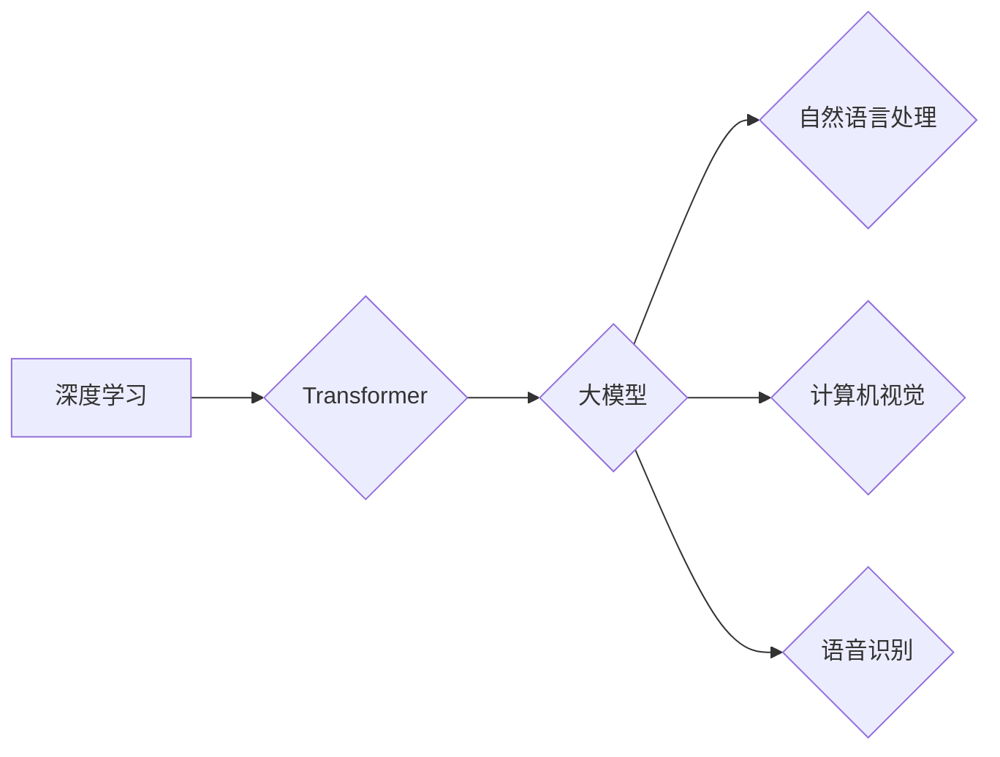

> 大模型、深度学习、Transformer、自然语言处理、计算机视觉、人工智能、智能化发展

## 1. 背景介绍

人工智能（AI）作为科技发展的重要方向，近年来取得了显著进展。其中，大模型作为AI领域的新兴技术，凭借其强大的学习能力和泛化能力，在自然语言处理、计算机视觉、语音识别等领域展现出巨大的潜力，成为推动智能化发展的重要驱动力。

大模型是指参数规模庞大、训练数据海量的人工智能模型。与传统机器学习模型相比，大模型拥有更强的学习能力和泛化能力，能够处理更复杂的任务，并取得更优的性能。例如，GPT-3、BERT、DALL-E等大模型在文本生成、语言理解、图像生成等方面取得了突破性的进展，展现出强大的应用潜力。

## 2. 核心概念与联系

大模型的核心概念包括：

* **深度学习:** 大模型基于深度神经网络架构，通过多层神经元网络学习数据特征，实现复杂任务的处理。
* **Transformer:** Transformer是一种新型的神经网络架构，通过自注意力机制学习序列数据之间的关系，在自然语言处理领域取得了显著成果。
* **参数规模:** 大模型的参数规模通常在数十亿甚至数千亿级别，庞大的参数量使得模型能够学习更丰富的知识和模式。
* **训练数据:** 大模型需要海量的数据进行训练，才能充分发挥其学习能力和泛化能力。

**Mermaid 流程图:**



## 3. 核心算法原理 & 具体操作步骤

### 3.1  算法原理概述

大模型的训练主要基于深度学习算法，其中Transformer架构在自然语言处理领域尤为重要。Transformer通过自注意力机制学习序列数据之间的关系，能够捕捉长距离依赖关系，从而实现更准确的文本理解和生成。

### 3.2  算法步骤详解

大模型的训练过程可以概括为以下步骤：

1. **数据预处理:** 将原始数据进行清洗、格式化和编码，使其能够被模型理解。
2. **模型构建:** 根据任务需求选择合适的模型架构，例如Transformer，并定义模型参数。
3. **模型训练:** 使用训练数据训练模型，通过反向传播算法调整模型参数，使其能够准确预测目标输出。
4. **模型评估:** 使用测试数据评估模型的性能，并根据评估结果进行模型调优。
5. **模型部署:** 将训练好的模型部署到实际应用场景中，用于处理真实数据。

### 3.3  算法优缺点

**优点:**

* **强大的学习能力:** 大模型拥有庞大的参数量，能够学习更复杂的模式和关系。
* **良好的泛化能力:** 大模型在训练数据之外的未知数据上也能表现出较好的性能。
* **多任务学习:** 大模型可以同时学习多个任务，提高资源利用率。

**缺点:**

* **训练成本高:** 大模型的训练需要大量的计算资源和时间。
* **数据依赖性强:** 大模型的性能取决于训练数据的质量和数量。
* **可解释性差:** 大模型的决策过程复杂，难以解释其背后的逻辑。

### 3.4  算法应用领域

大模型在多个领域都有广泛的应用，例如：

* **自然语言处理:** 文本生成、机器翻译、问答系统、情感分析等。
* **计算机视觉:** 图像识别、物体检测、图像生成等。
* **语音识别:** 语音转文本、语音合成等。
* **推荐系统:** 商品推荐、内容推荐等。

## 4. 数学模型和公式 & 详细讲解 & 举例说明

### 4.1  数学模型构建

大模型的训练基于深度学习算法，其核心是神经网络模型。神经网络模型由多个层组成，每层包含多个神经元。神经元之间通过权重连接，并将输入数据进行线性变换和非线性激活函数处理，最终输出预测结果。

### 4.2  公式推导过程

**损失函数:**

损失函数用于衡量模型预测结果与真实值的差异。常用的损失函数包括均方误差（MSE）、交叉熵损失（Cross-Entropy Loss）等。

**反向传播算法:**

反向传播算法用于更新模型参数，使其能够最小化损失函数。该算法通过计算梯度，将误差信号反向传播到各层神经元，并根据梯度更新参数值。

### 4.3  案例分析与讲解

**举例说明:**

假设我们训练一个图像分类模型，目标是将图像分类为猫或狗。

* **输入数据:** 图像像素数据。
* **模型架构:** 多层卷积神经网络（CNN）。
* **损失函数:** 交叉熵损失。
* **反向传播算法:** 梯度下降法。

训练过程中，模型会根据输入图像数据和标签信息，不断调整参数值，使其能够将图像准确分类为猫或狗。

## 5. 项目实践：代码实例和详细解释说明

### 5.1  开发环境搭建

* **操作系统:** Linux/macOS
* **编程语言:** Python
* **深度学习框架:** TensorFlow/PyTorch
* **硬件环境:** GPU

### 5.2  源代码详细实现

```python
# 使用 TensorFlow 框架构建一个简单的图像分类模型

import tensorflow as tf

# 定义模型架构
model = tf.keras.models.Sequential([
    tf.keras.layers.Conv2D(32, (3, 3), activation='relu', input_shape=(28, 28, 1)),
    tf.keras.layers.MaxPooling2D((2, 2)),
    tf.keras.layers.Conv2D(64, (3, 3), activation='relu'),
    tf.keras.layers.MaxPooling2D((2, 2)),
    tf.keras.layers.Flatten(),
    tf.keras.layers.Dense(10, activation='softmax')
])

# 定义损失函数和优化器
model.compile(loss='sparse_categorical_crossentropy',
              optimizer='adam',
              metrics=['accuracy'])

# 训练模型
model.fit(x_train, y_train, epochs=10)

# 评估模型
loss, accuracy = model.evaluate(x_test, y_test)
print('Test loss:', loss)
print('Test accuracy:', accuracy)
```

### 5.3  代码解读与分析

* **模型架构:** 代码中定义了一个简单的卷积神经网络模型，包含卷积层、池化层和全连接层。
* **损失函数和优化器:** 使用交叉熵损失函数和Adam优化器进行模型训练。
* **训练过程:** 使用训练数据训练模型，并设置训练轮数（epochs）。
* **评估过程:** 使用测试数据评估模型的性能，并打印测试损失和准确率。

### 5.4  运行结果展示

训练完成后，模型会输出测试损失和准确率，可以根据结果评估模型的性能。

## 6. 实际应用场景

大模型在多个领域都有广泛的应用，例如：

### 6.1 自然语言处理

* **机器翻译:** 大模型可以实现高质量的机器翻译，例如Google Translate。
* **文本生成:** 大模型可以生成高质量的文本内容，例如新闻文章、小说、诗歌等。
* **问答系统:** 大模型可以理解用户的问题，并给出准确的答案，例如百度AI问答。

### 6.2 计算机视觉

* **图像识别:** 大模型可以识别图像中的物体，例如人脸识别、物体检测等。
* **图像生成:** 大模型可以生成逼真的图像，例如DALL-E可以根据文本描述生成图像。
* **视频分析:** 大模型可以分析视频内容，例如动作识别、事件检测等。

### 6.3 语音识别

* **语音转文本:** 大模型可以将语音转换为文本，例如语音助手Siri、Google Assistant。
* **语音合成:** 大模型可以将文本转换为语音，例如语音播报、虚拟助手等。

### 6.4 其他应用

* **推荐系统:** 大模型可以根据用户的行为数据，推荐相关的商品、内容等。
* **医疗诊断:** 大模型可以辅助医生进行疾病诊断，例如图像分析、病历分析等。
* **金融风险控制:** 大模型可以识别金融风险，例如欺诈检测、信用评估等。

## 7. 工具和资源推荐

### 7.1 学习资源推荐

* **书籍:**
    * 《深度学习》
    * 《自然语言处理》
    * 《计算机视觉》
* **在线课程:**
    * Coursera
    * edX
    * Udacity

### 7.2 开发工具推荐

* **深度学习框架:** TensorFlow, PyTorch, Keras
* **编程语言:** Python
* **云计算平台:** AWS, Azure, Google Cloud

### 7.3 相关论文推荐

* **Transformer:** Attention Is All You Need
* **GPT-3:** Language Models are Few-Shot Learners
* **BERT:** BERT: Pre-training of Deep Bidirectional Transformers for Language Understanding

## 8. 总结：未来发展趋势与挑战

### 8.1 研究成果总结

大模型在人工智能领域取得了显著进展，展现出强大的学习能力和泛化能力，在多个领域都有广泛的应用。

### 8.2 未来发展趋势

* **模型规模继续扩大:** 随着计算资源的不断发展，大模型的规模将继续扩大，学习能力和性能将进一步提升。
* **模型架构创新:** 研究人员将继续探索新的模型架构，例如混合模型、联邦学习等，提高模型效率和鲁棒性。
* **应用场景拓展:** 大模型将应用于更多领域，例如医疗、教育、金融等，推动智能化发展。

### 8.3 面临的挑战

* **训练成本高:** 大模型的训练需要大量的计算资源和时间，成本较高。
* **数据依赖性强:** 大模型的性能取决于训练数据的质量和数量，数据获取和标注成本高。
* **可解释性差:** 大模型的决策过程复杂，难以解释其背后的逻辑，缺乏透明度。

### 8.4 研究展望

未来研究将重点关注以下方面:

* **降低训练成本:** 研究更有效的训练算法和硬件架构，降低大模型的训练成本。
* **提升数据利用效率:** 研究数据增强、联邦学习等技术，提高数据利用效率。
* **增强模型可解释性:** 研究可解释AI技术，提高大模型的透明度和可信度。


## 9. 附录：常见问题与解答

**常见问题:**

* **什么是大模型？**

大模型是指参数规模庞大、训练数据海量的人工智能模型。

* **大模型有哪些应用场景？**

大模型在自然语言处理、计算机视觉、语音识别等多个领域都有广泛的应用。

* **大模型的训练成本高吗？**

是的，大模型的训练需要大量的计算资源和时间，成本较高。

* **如何降低大模型的训练成本？**

可以通过研究更有效的训练算法和硬件架构，降低大模型的训练成本。

**解答:**

* **大模型的训练成本可以通过以下方式降低:**
    * 使用更有效的训练算法，例如梯度下降变种算法、混合精度训练等。
    * 使用更强大的硬件平台，例如GPU、TPU等。
    * 利用云计算平台，共享计算资源。
    * 采用模型压缩技术，减少模型参数量。

* **大模型的训练数据需要满足以下条件:**
    * 数据量大，数量足够支持模型训练。
    * 数据质量高，准确无误，避免噪声数据影响模型训练。
    * 数据多样性强，覆盖不同场景和类型的数据。


作者：禅与计算机程序设计艺术 / Zen and the Art of Computer Programming 
<end_of_turn>