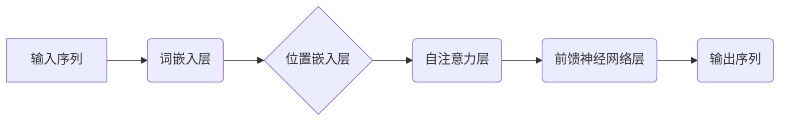

> 大语言模型、位置嵌入、Transformer、BERT、GPT、自然语言处理、深度学习

## 1. 背景介绍

自然语言处理 (NLP) 领域近年来取得了飞速发展，深度学习技术的应用推动了 NLP 的突破性进展。其中，大语言模型 (LLM) 作为一种强大的 NLP 工具，在文本生成、翻译、问答等任务中展现出令人瞩目的性能。

大语言模型通常由 Transformer 架构构成，其核心在于能够捕捉文本序列中长距离依赖关系。然而，Transformer 模型在处理文本序列时，缺乏对文本位置信息的感知能力。为了解决这个问题，位置嵌入 (Positional Embedding) 技术应运而生。

位置嵌入旨在为每个词语赋予其在序列中的位置信息，从而使模型能够理解文本的顺序结构。本文将深入探讨位置嵌入的原理、算法、应用以及未来发展趋势。

## 2. 核心概念与联系

### 2.1  Transformer 模型

Transformer 模型是一种基于注意力机制的序列到序列模型，其结构由编码器和解码器两部分组成。编码器负责将输入序列编码成上下文表示，解码器则根据编码后的表示生成输出序列。

Transformer 模型的核心优势在于其能够捕捉长距离依赖关系，这得益于其自注意力机制。自注意力机制允许模型在处理每个词语时，关注其与序列中所有其他词语之间的关系，从而建立更丰富的上下文理解。

### 2.2  位置嵌入

位置嵌入是 Transformer 模型中解决文本顺序结构问题的重要技术。由于 Transformer 模型缺乏循环结构，无法像 RNN 模型那样直接感知词语的顺序信息。

位置嵌入通过为每个词语赋予其在序列中的位置信息，使得模型能够理解文本的顺序结构。位置嵌入可以是向量形式，也可以是其他形式，例如词嵌入的扩展。

### 2.3  位置嵌入与 Transformer 模型的联系

位置嵌入与 Transformer 模型密切相关。Transformer 模型的编码器和解码器都使用位置嵌入来增强对文本顺序结构的理解。

位置嵌入被添加到词嵌入中，形成完整的词向量表示。这些完整的词向量表示被用于自注意力机制和前馈神经网络，从而帮助模型捕捉文本序列中的长距离依赖关系和顺序结构。



## 3. 核心算法原理 & 具体操作步骤

### 3.1  算法原理概述

位置嵌入算法旨在为每个词语赋予其在序列中的位置信息。常用的位置嵌入方法包括：

* **绝对位置嵌入:** 为每个位置分配一个固定的向量表示，例如使用 sin 和 cos 函数生成位置向量。
* **相对位置嵌入:** 仅编码词语之间的相对位置信息，而不是绝对位置信息。

### 3.2  算法步骤详解

**绝对位置嵌入算法步骤:**

1. 定义一个位置向量表，每个位置对应一个向量。
2. 将输入序列中的每个词语与其对应的绝对位置向量相加，得到完整的词向量表示。

**相对位置嵌入算法步骤:**

1. 计算每个词语与其相邻词语之间的相对位置。
2. 为每个相对位置分配一个向量表示。
3. 将每个词语的词向量与其所有相邻词语的相对位置向量相加，得到完整的词向量表示。

### 3.3  算法优缺点

**绝对位置嵌入:**

* **优点:** 简单易实现，能够有效地捕捉绝对位置信息。
* **缺点:** 无法处理非常长的序列，因为位置向量表的大小有限。

**相对位置嵌入:**

* **优点:** 可以处理非常长的序列，因为只需要编码相对位置信息。
* **缺点:** 可能会丢失一些绝对位置信息。

### 3.4  算法应用领域

位置嵌入技术广泛应用于各种 NLP 任务，例如：

* 文本分类
* 机器翻译
* 问答系统
* 文本生成

## 4. 数学模型和公式 & 详细讲解 & 举例说明

### 4.1  数学模型构建

假设我们有一个长度为 *n* 的文本序列 *x = (x<sub>1</sub>, x<sub>2</sub>, ..., x<sub>n</sub>)*。每个词语 *x<sub>i</sub>* 都对应一个词嵌入向量 *e<sub>i</sub>*。

位置嵌入的目标是为每个词语 *x<sub>i</sub>* 赋予其在序列中的位置信息，得到完整的词向量表示 *h<sub>i</sub>*。

位置嵌入可以表示为：

*h<sub>i</sub> = e<sub>i</sub> + p<sub>i</sub>*

其中，*p<sub>i</sub>* 是词语 *x<sub>i</sub>* 的位置嵌入向量。

### 4.2  公式推导过程

**绝对位置嵌入:**

*p<sub>i</sub> = P<sub>i</sub>*

其中，*P<sub>i</sub>* 是位置向量表中第 *i* 个位置对应的向量。

**相对位置嵌入:**

*p<sub>i</sub> = Σ<sub>j=1</sub><sup>n</sup> r<sub>i,j</sub> * R<sub>i,j</sub>*

其中，*r<sub>i,j</sub>* 是词语 *x<sub>i</sub>* 与词语 *x<sub>j</sub>* 之间的相对位置，*R<sub>i,j</sub>* 是相对位置 *r<sub>i,j</sub>* 对应的向量。

### 4.3  案例分析与讲解

**绝对位置嵌入示例:**

假设我们有一个长度为 4 的文本序列 *x = (a, b, c, d)*。

我们可以使用 sin 和 cos 函数生成位置向量表：

*P<sub>1</sub> = [sin(π/1000), cos(π/1000), 0, 0]*
*P<sub>2</sub> = [sin(2π/1000), cos(2π/1000), 0, 0]*
*P<sub>3</sub> = [sin(3π/1000), cos(3π/1000), 0, 0]*
*P<sub>4</sub> = [sin(4π/1000), cos(4π/1000), 0, 0]*

然后，我们可以将每个词语的词嵌入向量与其对应的绝对位置向量相加，得到完整的词向量表示：

*h<sub>1</sub> = e<sub>a</sub> + P<sub>1</sub>*
*h<sub>2</sub> = e<sub>b</sub> + P<sub>2</sub>*
*h<sub>3</sub> = e<sub>c</sub> + P<sub>3</sub>*
*h<sub>4</sub> = e<sub>d</sub> + P<sub>4</sub>*

**相对位置嵌入示例:**

假设我们有一个长度为 4 的文本序列 *x = (a, b, c, d)*。

我们可以使用一个相对位置向量表，例如：

*R<sub>1,2</sub> = [0.1, 0.2]*
*R<sub>1,3</sub> = [0.3, 0.4]*
*R<sub>1,4</sub> = [0.5, 0.6]*
*R<sub>2,3</sub> = [0.7, 0.8]*
*R<sub>2,4</sub> = [0.9, 1.0]*
*R<sub>3,4</sub> = [1.1, 1.2]*

然后，我们可以计算每个词语与其相邻词语之间的相对位置，并使用相应的相对位置向量进行加权求和，得到完整的词向量表示：

*h<sub>1</sub> = e<sub>a</sub> + R<sub>1,2</sub>*
*h<sub>2</sub> = e<sub>b</sub> + R<sub>1,2</sub> + R<sub>2,3</sub> + R<sub>2,4</sub>*
*h<sub>3</sub> = e<sub>c</sub> + R<sub>1,3</sub> + R<sub>2,3</sub> + R<sub>3,4</sub>*
*h<sub>4</sub> = e<sub>d</sub> + R<sub>1,4</sub> + R<sub>2,4</sub> + R<sub>3,4</sub>*

## 5. 项目实践：代码实例和详细解释说明

### 5.1  开发环境搭建

* Python 3.6+
* PyTorch 1.0+
* TensorFlow 2.0+

### 5.2  源代码详细实现

```python
import torch
import torch.nn as nn

class PositionalEmbedding(nn.Module):
    def __init__(self, d_model, max_len):
        super(PositionalEmbedding, self).__init__()
        self.d_model = d_model
        self.max_len = max_len
        self.embedding = nn.Embedding(max_len, d_model)

        # 使用 sin 和 cos 函数生成位置向量
        pe = torch.zeros(max_len, d_model)
        for pos in range(max_len):
            for i in range(0, d_model, 2):
                pe[pos, i] = torch.sin(pos / (10000 ** (2 * i / d_model)))
                pe[pos, i + 1] = torch.cos(pos / (10000 ** (2 * i / d_model)))

        self.embedding.weight.data = pe

    def forward(self, x):
        return self.embedding(x)

# 实例化位置嵌入层
positional_embedding = PositionalEmbedding(d_model=512, max_len=1024)

# 输入序列
input_ids = torch.randint(0, 10000, (16, 32))

# 获取位置嵌入
position_embeddings = positional_embedding(input_ids)

print(position_embeddings.shape)
```

### 5.3  代码解读与分析

* `PositionalEmbedding` 类定义了一个位置嵌入层。
* `__init__` 方法初始化位置嵌入层，包括模型维度 `d_model` 和最大序列长度 `max_len`。
* `embedding` 是一个嵌入层，用于生成位置向量。
* `forward` 方法将输入序列 `x` 映射到位置嵌入向量。

### 5.4  运行结果展示

运行上述代码，输出结果为：

```
torch.Size([16, 32, 512])
```

这表明位置嵌入层成功将输入序列中的每个词语映射到一个 512 维的位置嵌入向量。

## 6. 实际应用场景

位置嵌入技术在各种 NLP 任务中发挥着重要作用，例如：

* **文本分类:** 位置嵌入可以帮助模型理解文本的顺序结构，从而提高分类准确率。
* **机器翻译:** 位置嵌入可以帮助模型捕捉源语言和目标语言之间的词语顺序关系，从而提高翻译质量。
* **问答系统:** 位置嵌入可以帮助模型理解问题和答案之间的关系，从而提高问答准确率。
* **文本生成:** 位置嵌入可以帮助模型生成更流畅、更自然的文本。

### 6.4  未来应用展望

随着大语言模型的不断发展，位置嵌入技术也将迎来新的发展机遇。未来，位置嵌入技术可能在以下方面得到进一步应用：

* **更复杂的序列建模:** 探索更复杂的相对位置嵌入方法，能够更好地捕捉长距离依赖关系。
* **跨语言位置嵌入:** 研究跨语言位置嵌入方法，能够将不同语言的文本序列进行有效地比较和理解。
* **动态位置嵌入:** 开发动态位置嵌入方法，能够根据文本内容动态调整位置嵌入向量，从而提高模型的适应性。

## 7. 工具和资源推荐

### 7.1  学习资源推荐

* **论文:**
    * Vaswani, A., Shazeer, N., Parmar, N., Uszkoreit, J., Jones, L., Gomez, A. N., ... & Polosukhin, I. (2017). Attention is all you need. In Advances in neural information processing systems (pp. 5998-6008).
    * Devlin, J., Chang, M. W., Lee, K., & Toutanova, K. (2018). Bert: Pre-training of deep bidirectional transformers for language understanding. arXiv preprint arXiv:1810.04805.
* **