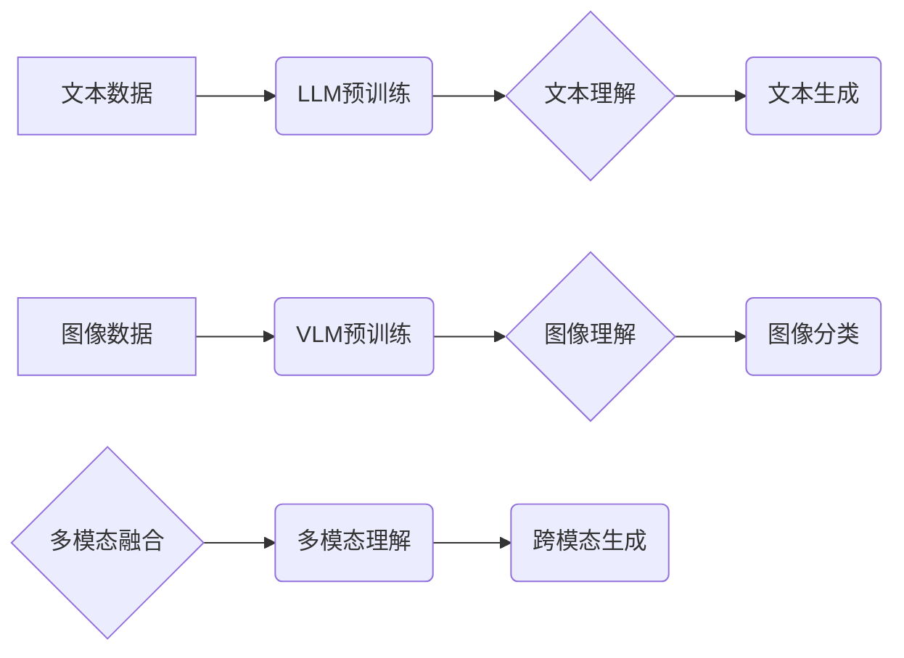

> 大语言模型，视觉语言模型，Transformer，BERT，GPT，视觉理解，自然语言处理，深度学习

## 1. 背景介绍

近年来，人工智能领域取得了令人瞩目的进展，其中大语言模型（Large Language Models，LLMs）和视觉语言模型（Visual Language Models，VLMs）作为代表性技术，在自然语言处理（NLP）和计算机视觉（CV）领域展现出强大的能力。

大语言模型，如GPT-3、BERT等，能够理解和生成人类语言，在文本生成、机器翻译、问答系统等领域取得了突破性进展。视觉语言模型，如CLIP、VL-BERT等，能够理解图像和文本之间的关系，在图像识别、图像 Captioning、视觉问答等领域展现出强大的潜力。

随着深度学习技术的不断发展，LLMs和VLMs的性能不断提升，应用场景也越来越广泛。然而，这些模型的原理、架构和训练方法仍然存在许多挑战和问题，需要进一步深入研究和探索。

## 2. 核心概念与联系

**2.1 大语言模型 (LLMs)**

大语言模型是基于Transformer架构的深度神经网络，能够处理和理解大量的文本数据。其核心特点包括：

* **Transformer架构:** Transformer是一种新型的神经网络架构，能够有效地处理序列数据，并具有强大的并行计算能力。
* **自注意力机制:** 自注意力机制能够捕捉文本序列中单词之间的长距离依赖关系，提高模型的理解能力。
* **预训练和微调:** LLMs通常采用预训练和微调的训练方法，在大量文本数据上进行预训练，然后针对特定任务进行微调。

**2.2 视觉语言模型 (VLMs)**

视觉语言模型旨在理解图像和文本之间的关系，其核心特点包括：

* **多模态融合:** VLMs需要融合图像和文本的多模态信息，并学习它们之间的映射关系。
* **视觉特征提取:** VLMs需要使用卷积神经网络（CNN）等方法提取图像特征。
* **文本嵌入:** VLMs需要将文本转换为向量表示，以便与图像特征进行融合。

**2.3 LLMs 与 VLMs 的联系**

LLMs 和 VLMs 虽然各自侧重于不同的模态，但它们之间存在着密切的联系。

* **多模态理解:** 将 LLMs 和 VLMs 结合起来，可以构建更强大的多模态理解模型，能够理解和生成图像和文本的综合信息。
* **跨模态生成:** LLMs 可以根据图像描述生成文本，而 VLMs 可以根据文本描述生成图像，两者可以协同完成跨模态生成任务。
* **知识图谱构建:** LLMs 和 VLMs 可以共同构建知识图谱，将图像和文本信息整合起来，形成更完整的知识体系。

**2.4 Mermaid 流程图**



## 3. 核心算法原理 & 具体操作步骤

### 3.1 算法原理概述

大语言模型和视觉语言模型的核心算法原理主要基于深度学习，特别是Transformer架构和自注意力机制。

* **Transformer架构:** Transformer是一种新型的神经网络架构，能够有效地处理序列数据，并具有强大的并行计算能力。其主要特点包括：
    * **自注意力机制:** 自注意力机制能够捕捉文本序列中单词之间的长距离依赖关系，提高模型的理解能力。
    * **多头注意力:** 多头注意力机制能够从不同的角度捕捉文本序列中的信息，提高模型的表达能力。
    * **前馈神经网络:** 前馈神经网络用于对每个单词的表示进行非线性变换，提高模型的学习能力。

* **自注意力机制:** 自注意力机制能够计算每个单词与其他单词之间的相关性，并根据相关性调整每个单词的权重。

### 3.2 算法步骤详解

**3.2.1 大语言模型训练步骤:**

1. **数据预处理:** 将文本数据进行清洗、分词、标记等预处理操作。
2. **模型构建:** 使用Transformer架构构建大语言模型，并设置模型参数。
3. **预训练:** 在大量文本数据上进行预训练，学习语言的语法和语义知识。
4. **微调:** 将预训练好的模型微调到特定任务，例如文本分类、机器翻译等。

**3.2.2 视觉语言模型训练步骤:**

1. **数据预处理:** 将图像和文本数据进行预处理，例如图像裁剪、文本分词等。
2. **模型构建:** 使用CNN和Transformer架构构建视觉语言模型，并设置模型参数。
3. **预训练:** 在图像和文本数据上进行预训练，学习图像和文本之间的关系。
4. **微调:** 将预训练好的模型微调到特定任务，例如图像 Captioning、视觉问答等。

### 3.3 算法优缺点

**3.3.1 大语言模型优点:**

* 强大的文本理解和生成能力。
* 能够处理大量的文本数据。
* 可迁移性强，可以应用于多种自然语言处理任务。

**3.3.1 大语言模型缺点:**

* 训练成本高，需要大量的计算资源和数据。
* 容易受到训练数据偏差的影响。
* 缺乏对真实世界知识的理解。

**3.3.2 视觉语言模型优点:**

* 能够理解图像和文本之间的关系。
* 能够完成跨模态生成任务。
* 具有广泛的应用场景。

**3.3.2 视觉语言模型缺点:**

* 训练难度高，需要融合多模态信息。
* 容易受到图像和文本噪声的影响。
* 缺乏对视觉和语言的全局理解。

### 3.4 算法应用领域

* **大语言模型应用领域:**
    * 文本生成：小说、诗歌、剧本等。
    * 机器翻译：将一种语言翻译成另一种语言。
    * 问答系统：回答用户提出的问题。
    * 聊天机器人：与用户进行自然语言对话。
* **视觉语言模型应用领域:**
    * 图像 Captioning：为图像生成描述性文本。
    * 视觉问答：根据图像回答用户提出的问题。
    * 图像检索：根据文本查询图像。
    * 视频理解：理解视频内容。

## 4. 数学模型和公式 & 详细讲解 & 举例说明

### 4.1 数学模型构建

大语言模型和视觉语言模型的数学模型主要基于深度学习，使用神经网络来模拟人类大脑的学习过程。

* **神经网络:** 神经网络由多个层组成，每层包含多个神经元。神经元之间通过连接进行信息传递，每个连接都有一个权重。

* **激活函数:** 激活函数用于将神经元的输入转换为输出，并引入非线性特性。常见的激活函数包括ReLU、Sigmoid和Tanh。

* **损失函数:** 损失函数用于衡量模型预测结果与真实结果之间的差异。常见的损失函数包括交叉熵损失和均方误差损失。

### 4.2 公式推导过程

**4.2.1 自注意力机制公式:**

```latex
Attention(Q, K, V) = softmax(Q K^T / sqrt(d_k)) V
```

其中：

* Q：查询矩阵
* K：键矩阵
* V：值矩阵
* d_k：键向量的维度
* softmax：归一化函数

**4.2.2 Transformer Encoder 公式:**

```latex
Encoder(X) = MultiHeadAttention(X, X, X) + FeedForwardNetwork(X)
```

其中：

* X：输入序列
* MultiHeadAttention：多头注意力机制
* FeedForwardNetwork：前馈神经网络

### 4.3 案例分析与讲解

**4.3.1 BERT 模型案例:**

BERT（Bidirectional Encoder Representations from Transformers）是一种基于Transformer架构的大语言模型，能够理解文本中的上下文信息。BERT模型通过双向编码来学习文本表示，并使用Masked Language Modeling（MLM）和Next Sentence Prediction（NSP）两种预训练任务来训练模型。

**4.3.2 CLIP 模型案例:**

CLIP（Contrastive Language-Image Pre-training）是一种视觉语言模型，能够学习图像和文本之间的关系。CLIP模型通过对比学习来训练模型，将图像和文本配对，并学习它们的相似性。

## 5. 项目实践：代码实例和详细解释说明

### 5.1 开发环境搭建

* **操作系统:** Ubuntu 20.04
* **Python 版本:** 3.8
* **深度学习框架:** PyTorch 1.8

### 5.2 源代码详细实现

```python
# 这是一个简单的BERT模型示例代码
import torch
import torch.nn as nn

class BERTLayer(nn.Module):
    def __init__(self, d_model, nhead, dim_feedforward=2048, dropout=0.1):
        super(BERTLayer, self).__init__()
        self.self_attn = nn.MultiheadAttention(d_model, nhead, dropout=dropout)
        self.linear1 = nn.Linear(d_model, dim_feedforward)
        self.dropout = nn.Dropout(dropout)
        self.linear2 = nn.Linear(dim_feedforward, d_model)

    def forward(self, x):
        attn_output, _ = self.self_attn(x, x, x)
        attn_output = self.dropout(attn_output)
        feedforward_output = self.linear2(self.dropout(torch.relu(self.linear1(attn_output))))
        return feedforward_output + attn_output

# 定义BERT模型
class BERT(nn.Module):
    def __init__(self, vocab_size, d_model, nhead, num_layers, dim_feedforward, dropout=0.1):
        super(BERT, self).__init__()
        self.embedding = nn.Embedding(vocab_size, d_model)
        self.encoder_layers = nn.ModuleList([BERTLayer(d_model, nhead, dim_feedforward, dropout) for _ in range(num_layers)])

    def forward(self, x):
        x = self.embedding(x)
        for layer in self.encoder_layers:
            x = layer(x)
        return x
```

### 5.3 代码解读与分析

* **BERTLayer类:** 定义了BERT模型中的一个编码层，包含自注意力机制和前馈神经网络。
* **BERT类:** 定义了完整的BERT模型，包含嵌入层、编码层和输出层。
* **forward方法:** 定义了模型的正向传播过程。

### 5.4 运行结果展示

运行上述代码，可以训练一个简单的BERT模型，并进行文本分类、问答等任务。

## 6. 实际应用场景

### 6.1 大语言模型应用场景

* **聊天机器人:** 使用大语言模型构建更智能、更自然的聊天机器人，能够理解用户意图并提供更精准的回复。
* **文本生成:** 使用大语言模型生成高质量的文本内容，例如小说、诗歌、剧本等。
* **机器翻译:** 使用大语言模型实现更高效、更准确的机器翻译，突破语言障碍。
* **问答系统:** 使用大语言模型构建更智能的问答系统，能够理解用户问题并提供更全面的答案。

### 6.2 视觉语言模型应用场景

* **图像 Captioning:** 为图像生成描述性文本，方便用户理解图像内容。
* **视觉问答:** 根据图像回答用户提出的问题，例如“图片中有什么动物？”、“图片中的人在做什么？”。
* **图像检索:** 根据文本查询图像，例如“查找一张猫的图片”。
* **视频理解:** 理解视频内容，例如识别视频中的事件、人物和物体。

### 6.4 未来应用展望

* **多模态交互:**