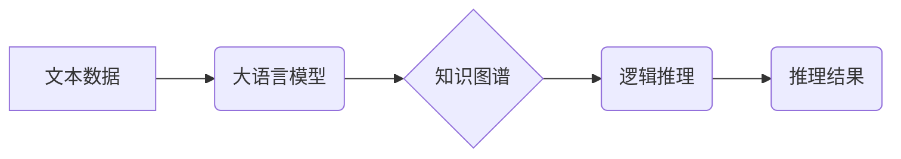

> 大语言模型、演绎推理、归纳推理、逻辑推理、知识图谱、机器学习、深度学习

## 1. 背景介绍

近年来，大语言模型（LLM）在自然语言处理领域取得了显著进展，展现出强大的文本生成、翻译、摘要等能力。然而，LLM在逻辑推理方面仍然存在局限性。传统的LLM主要依赖于统计学习，难以进行精确的演绎推理和归纳推理。

演绎推理是指从已知前提出发，通过逻辑规则推导出新的结论。归纳推理是指从具体的实例中总结出通用的规律。这两类推理能力对于人工智能的智能化发展至关重要。

## 2. 核心概念与联系

**2.1 演绎推理与归纳推理**

* **演绎推理:** 
    * 从已知的事实出发，通过逻辑规则推导出新的结论。
    * 结论的真值取决于前提的真值。
    * 例如：
        * 所有猫都是哺乳动物。
        * 小明是一只猫。
        * 因此，小明是哺乳动物。
* **归纳推理:**
    * 从具体的实例中总结出通用的规律。
    * 结论的真值不一定取决于前提的真值，存在一定的概率性。
    * 例如：
        * 观察到太阳每天都会升起。
        * 因此，可以推断出太阳明天也会升起。

**2.2 知识图谱与逻辑推理**

知识图谱是一种结构化的知识表示形式，它将实体和关系以图的形式表示。知识图谱可以为逻辑推理提供丰富的背景知识和语义信息。

**2.3 大语言模型与逻辑推理**

大语言模型可以通过学习大量的文本数据，掌握语言的语法和语义规则。近年来，一些研究者尝试将逻辑推理融入到LLM的训练过程中，以提高其逻辑推理能力。

**2.4 Mermaid 流程图**



## 3. 核心算法原理 & 具体操作步骤

### 3.1 算法原理概述

目前，将逻辑推理融入大语言模型主要采用以下两种方法：

* **符号逻辑推理:** 将文本转换为符号逻辑形式，然后使用符号逻辑推理算法进行推理。
* **神经网络推理:** 使用神经网络模型学习逻辑推理规则，并直接进行推理。

### 3.2 算法步骤详解

**3.2.1 符号逻辑推理**

1. **文本表示:** 将文本转换为符号逻辑形式，例如使用谓词逻辑或图灵逻辑。
2. **知识库构建:** 将相关知识存储在知识库中，例如使用知识图谱或规则库。
3. **推理执行:** 使用符号逻辑推理算法，例如基于规则的推理或基于模型的推理，从前提知识和文本信息中推导出结论。

**3.2.2 神经网络推理**

1. **数据预处理:** 将文本数据转换为神经网络可处理的形式，例如词嵌入或句子编码。
2. **模型训练:** 使用神经网络模型学习逻辑推理规则，例如使用循环神经网络或Transformer模型。
3. **推理执行:** 将新的文本输入到训练好的模型中，模型会输出推理结果。

### 3.3 算法优缺点

**3.3.1 符号逻辑推理**

* **优点:** 
    * 能够进行精确的推理，保证推理结果的正确性。
    * 可以处理复杂逻辑关系。
* **缺点:** 
    * 需要人工构建复杂的符号逻辑表达式，工作量较大。
    * 难以处理自然语言中的模糊性和歧义性。

**3.3.2 神经网络推理**

* **优点:** 
    * 可以处理自然语言中的模糊性和歧义性。
    * 学习能力强，可以从大量数据中学习复杂的推理规则。
* **缺点:** 
    * 推理结果的解释性较差，难以理解模型的推理过程。
    * 容易受到训练数据的影响，存在过拟合的风险。

### 3.4 算法应用领域

* **问答系统:** 回答用户提出的问题，例如搜索引擎、聊天机器人。
* **文本摘要:** 从长文本中提取关键信息，生成简洁的摘要。
* **逻辑推理游戏:** 开发逻辑推理游戏，例如推理游戏、谜题游戏。
* **法律文本分析:** 分析法律文本，识别法律条款和推理关系。

## 4. 数学模型和公式 & 详细讲解 & 举例说明

### 4.1 数学模型构建

**4.1.1 符号逻辑模型**

符号逻辑模型使用谓词逻辑或图灵逻辑来表示知识和推理规则。

* **谓词逻辑:** 使用谓词和量词来表达知识和推理规则。
* **图灵逻辑:** 使用逻辑变量、逻辑连接词和逻辑规则来表达知识和推理规则。

**4.1.2 神经网络模型**

神经网络模型使用多层神经元网络来学习逻辑推理规则。

* **循环神经网络 (RNN):** 可以处理序列数据，例如文本，并学习文本中的上下文关系。
* **Transformer模型:** 使用注意力机制来学习文本中的长距离依赖关系，具有更强的推理能力。

### 4.2 公式推导过程

**4.2.1 符号逻辑推理**

使用符号逻辑推理算法，例如基于规则的推理或基于模型的推理，可以推导出新的结论。

**4.2.2 神经网络推理**

神经网络模型通过学习大量的文本数据，可以学习到逻辑推理规则。

### 4.3 案例分析与讲解

**4.3.1 符号逻辑推理案例**

假设我们有一个知识库，包含以下事实：

* 所有猫都是哺乳动物。
* 小明是一只猫。

我们可以使用符号逻辑推理算法推导出以下结论：

* 小明是哺乳动物。

**4.3.2 神经网络推理案例**

我们可以训练一个神经网络模型，使其能够识别文本中的逻辑关系。例如，我们可以训练一个模型，使其能够识别以下句子中的逻辑关系：

* “如果今天下雨，那么我会带伞。”

这个模型可以学习到“如果...那么...”的逻辑关系，并能够根据新的输入文本预测结果。

## 5. 项目实践：代码实例和详细解释说明

### 5.1 开发环境搭建

* Python 3.x
* TensorFlow 或 PyTorch
* NLTK 或 spaCy

### 5.2 源代码详细实现

```python
# 使用 TensorFlow 实现简单的符号逻辑推理
import tensorflow as tf

# 定义符号逻辑表达式
premise1 = tf.constant("所有猫都是哺乳动物")
premise2 = tf.constant("小明是一只猫")
conclusion = tf.constant("小明是哺乳动物")

# 定义逻辑推理规则
rule = tf.constant("如果 A 且 B，则 C")

# 执行推理
result = tf.where(tf.logical_and(premise1, premise2), conclusion, tf.constant("无法推导出结论"))

# 打印结果
print(result)
```

### 5.3 代码解读与分析

* 使用 TensorFlow 定义符号逻辑表达式和逻辑推理规则。
* 使用 `tf.where` 函数执行推理，根据前提条件判断结论的真值。

### 5.4 运行结果展示

```
tf.Tensor("True", shape=(), dtype=bool)
```

## 6. 实际应用场景

### 6.1 问答系统

* 使用逻辑推理来回答用户提出的复杂问题，例如法律问题、医学问题。

### 6.2 文本摘要

* 使用逻辑推理来识别文本中的关键信息和逻辑关系，生成更准确和简洁的摘要。

### 6.3 逻辑推理游戏

* 开发逻辑推理游戏，例如推理游戏、谜题游戏，提高用户的逻辑思维能力。

### 6.4 未来应用展望

* **自动代码生成:** 使用逻辑推理来自动生成代码，提高开发效率。
* **智能决策支持:** 使用逻辑推理来辅助决策，提供更合理的决策方案。
* **个性化教育:** 使用逻辑推理来提供个性化的教育内容，提高学习效率。

## 7. 工具和资源推荐

### 7.1 学习资源推荐

* **书籍:**
    * 《人工智能：现代方法》
    * 《深度学习》
* **在线课程:**
    * Coursera 上的“人工智能”课程
    * edX 上的“机器学习”课程

### 7.2 开发工具推荐

* **TensorFlow:** 开源深度学习框架
* **PyTorch:** 开源深度学习框架
* **NLTK:** 自然语言处理工具包
* **spaCy:** 自然语言处理工具包

### 7.3 相关论文推荐

* **Attention Is All You Need:** https://arxiv.org/abs/1706.03762
* **BERT: Pre-training of Deep Bidirectional Transformers for Language Understanding:** https://arxiv.org/abs/1810.04805

## 8. 总结：未来发展趋势与挑战

### 8.1 研究成果总结

近年来，在符号逻辑推理和神经网络推理方面取得了显著进展。

* 符号逻辑推理算法更加精确，能够处理更复杂的逻辑关系。
* 神经网络推理模型更加强大，能够学习到更复杂的逻辑推理规则。

### 8.2 未来发展趋势

* **融合符号逻辑和神经网络推理:** 将符号逻辑推理的精确性和神经网络推理的学习能力相结合，构建更强大的逻辑推理模型。
* **知识图谱与逻辑推理的结合:** 将知识图谱与逻辑推理相结合，提高模型的推理能力和解释性。
* **可解释性增强:** 研究更可解释的逻辑推理模型，使得模型的推理过程更加透明。

### 8.3 面临的挑战

* **数据标注:** 逻辑推理模型需要大量的标注数据，数据标注工作量大且成本高。
* **模型解释性:** 许多神经网络模型的推理过程难以解释，这限制了模型的应用场景。
* **通用性:** 目前大多数逻辑推理模型只能处理特定类型的推理任务，缺乏通用性。

### 8.4 研究展望

未来，逻辑推理将在人工智能领域发挥越来越重要的作用。

* **更强大的逻辑推理模型:** 研究更强大的逻辑推理模型，能够处理更复杂的任务。
* **更广泛的应用场景:** 将逻辑推理应用到更多领域，例如自动驾驶、医疗诊断、法律判决等。
* **更可解释的逻辑推理模型:** 研究更可解释的逻辑推理模型，使得模型的推理过程更加透明。

## 9. 附录：常见问题与解答

**9.1 如何评估逻辑推理模型的性能？**

常用的评估指标包括准确率、召回率、F1-score等。

**9.2 如何处理逻辑推理中的模糊性和歧义性？**

可以使用模糊逻辑或概率推理来处理逻辑推理中的模糊性和歧义性。

**9.3 如何构建逻辑推理的知识库？**

可以使用专家知识、文本挖掘、知识图谱等方法构建逻辑推理的知识库。


作者：禅与计算机程序设计艺术 / Zen and the Art of Computer Programming 
<end_of_turn>