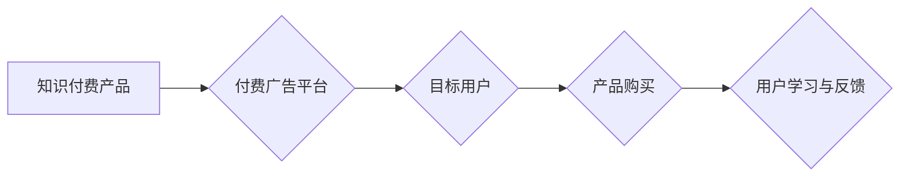

>  知识付费、付费广告、推广策略、目标用户、转化率、ROI

## 1. 背景介绍

知识付费行业近年来蓬勃发展，越来越多的优质内容创作者选择通过线上平台提供付费课程、咨询服务等知识产品。然而，在竞争激烈的市场环境下，如何有效推广知识付费产品，吸引目标用户并实现盈利，成为众多创作者面临的挑战。付费广告作为一种高效的推广手段，在知识付费行业中发挥着越来越重要的作用。

## 2. 核心概念与联系

**2.1 知识付费产品**

知识付费产品是指以知识、技能、经验等为核心内容，通过付费的方式向用户提供学习、提升和服务的在线产品。常见的知识付费产品包括：

* 在线课程：涵盖各个领域，如编程、设计、写作、营销等。
* 咨询服务：一对一或小班制的专业咨询，提供个性化解决方案。
* 电子书、音频、视频：提供知识和技能的学习资料。
* 会员体系：提供持续更新的优质内容和专属服务。

**2.2 付费广告**

付费广告是指在互联网平台上，通过付费的方式向目标用户展示广告，以获取流量、曝光和转化。常见的付费广告平台包括：

* 搜索引擎广告：例如 Google Ads、百度竞价。
* 社交媒体广告：例如 Facebook Ads、微博广告、抖音广告。
* 内容平台广告：例如 知乎广告、Bilibili 广告。

**2.3 核心概念联系**

知识付费产品通过付费广告实现推广，可以有效地提高产品曝光度、吸引目标用户，最终实现销售转化。付费广告可以精准定位目标用户，根据用户兴趣和行为进行投放，提高广告效果。

**2.4  Mermaid 流程图**



## 3. 核心算法原理 & 具体操作步骤

**3.1 算法原理概述**

付费广告的推广算法主要基于机器学习和数据分析技术，通过分析用户行为数据、广告投放数据等，预测用户对广告的点击率、转化率等指标，并根据这些预测结果优化广告投放策略。

**3.2 算法步骤详解**

1. **数据收集与预处理:** 收集用户行为数据、广告投放数据等，并进行清洗、转换、特征提取等预处理工作。
2. **模型训练:** 使用机器学习算法，例如线性回归、逻辑回归、深度学习等，对数据进行训练，建立预测模型。
3. **模型评估:** 使用测试数据对模型进行评估，评估模型的预测精度和泛化能力。
4. **模型优化:** 根据模型评估结果，调整模型参数、特征选择等，优化模型性能。
5. **广告投放:** 根据模型预测结果，选择合适的广告投放渠道、目标用户群体、广告创意等，进行广告投放。
6. **效果监测与分析:** 持续监测广告投放效果，分析用户行为数据，并根据分析结果进行策略调整。

**3.3 算法优缺点**

* **优点:** 能够精准定位目标用户，提高广告效果；能够根据数据反馈不断优化投放策略，提高投资回报率。
* **缺点:** 需要大量的数据进行训练，模型训练成本较高；算法模型的复杂度较高，需要专业的技术人员进行维护和优化。

**3.4 算法应用领域**

付费广告算法广泛应用于电商、金融、教育、医疗等各个领域，帮助企业精准营销、提高转化率。

## 4. 数学模型和公式 & 详细讲解 & 举例说明

**4.1 数学模型构建**

假设我们有一个知识付费产品，目标是通过付费广告吸引用户购买。我们可以构建一个简单的数学模型来描述广告投放效果：

```latex
CTR = \frac{点击次数}{展示次数}
```

```latex
转化率 = \frac{购买次数}{点击次数}
```

```latex
ROI = \frac{收益 - 成本}{成本}
```

其中：

* CTR：点击率
* 转化率：转化率
* ROI：投资回报率

**4.2 公式推导过程**

* CTR：点击率是衡量广告吸引用户注意力的指标，可以通过广告创意、标题、图片等因素影响。
* 转化率：转化率是衡量广告引导用户购买的指标，可以通过产品价格、优惠活动、用户体验等因素影响。
* ROI：投资回报率是衡量广告推广效益的指标，可以通过广告成本、产品利润等因素影响。

**4.3 案例分析与讲解**

假设我们有一个知识付费产品，成本为 1000 元，目标是通过付费广告吸引用户购买，并获得 5000 元的收益。

* 假设广告点击率为 5%，转化率为 10%。
* 则需要展示 10000 次广告才能获得 500 次点击。
* 其中 50 次点击会转化为购买。
* 因此，ROI = (5000 - 1000) / 1000 = 4。

## 5. 项目实践：代码实例和详细解释说明

**5.1 开发环境搭建**

* 操作系统：Windows/macOS/Linux
* 编程语言：Python
* 开发工具：PyCharm/VS Code
* 库依赖：pandas、numpy、scikit-learn

**5.2 源代码详细实现**

```python
import pandas as pd
from sklearn.linear_model import LogisticRegression

# 数据加载
data = pd.read_csv('广告数据.csv')

# 数据预处理
# ...

# 模型训练
model = LogisticRegression()
model.fit(data[['特征1', '特征2', ...]], data['目标变量'])

# 模型预测
predictions = model.predict(new_data[['特征1', '特征2', ...]])

# 结果评估
# ...
```

**5.3 代码解读与分析**

* 代码首先加载广告数据，并进行预处理，例如特征工程、数据清洗等。
* 然后使用 LogisticRegression 模型训练，将用户特征作为输入，预测用户点击广告的概率。
* 最后使用训练好的模型对新数据进行预测，并评估模型性能。

**5.4 运行结果展示**

* 模型预测结果可以用于优化广告投放策略，例如选择合适的广告创意、目标用户群体等。
* 模型性能评估结果可以帮助我们了解模型的准确性，并进行模型优化。

## 6. 实际应用场景

**6.1 在线课程推广**

* 通过付费广告精准定位目标用户，例如对编程、设计、写作等领域感兴趣的用户。
* 使用不同类型的广告创意，例如视频广告、图文广告等，吸引用户点击。
* 提供优惠活动，例如限时折扣、免费试听等，提高用户转化率。

**6.2 咨询服务推广**

* 通过付费广告精准定位目标用户，例如需要专业咨询的用户，例如创业者、职场人士等。
* 使用案例分享、专家推荐等方式，提升用户信任度。
* 提供免费咨询服务，例如在线问答、电话咨询等，吸引用户体验。

**6.3 电子书、音频、视频推广**

* 通过付费广告精准定位目标用户，例如对特定主题感兴趣的用户。
* 使用精美的封面设计、吸引人的标题等，提升用户点击率。
* 提供试读服务，例如免费章节、试听音频等，提高用户转化率。

**6.4 会员体系推广**

* 通过付费广告精准定位目标用户，例如对持续学习、提升技能的用户。
* 提供会员专属福利，例如折扣优惠、独家课程等，提升用户价值。
* 使用会员成功案例分享，提升用户信任度。

**6.5 未来应用展望**

随着人工智能技术的不断发展，付费广告推广将更加智能化、个性化。例如：

* 基于用户行为数据和兴趣偏好，进行更精准的广告投放。
* 使用个性化广告创意，提高用户点击率和转化率。
* 利用机器学习算法，自动优化广告投放策略，提高投资回报率。

## 7. 工具和资源推荐

**7.1 学习资源推荐**

* **书籍:**
    * 《数字营销》
    * 《付费广告实战》
    * 《机器学习》
* **在线课程:**
    * Coursera: 数字营销、付费广告
    * Udemy: 机器学习、数据分析
* **博客和网站:**
    * Google Ads 官方博客
    * Facebook Ads 官方博客
    * 知乎

**7.2 开发工具推荐**

* **广告平台:**
    * Google Ads
    * Facebook Ads
    * 百度竞价
* **数据分析工具:**
    * Google Analytics
    * Facebook Pixel
* **机器学习库:**
    * scikit-learn
    * TensorFlow
    * PyTorch

**7.3 相关论文推荐**

* **广告点击率预测:**
    * "A Deep Learning Approach to Click-Through Rate Prediction"
    * "Learning to Rank: From Pairwise Approach to Listwise Approach"
* **广告转化率预测:**
    * "Deep Learning for Conversion Rate Prediction"
    * "A Bayesian Approach to Conversion Rate Optimization"

## 8. 总结：未来发展趋势与挑战

**8.1 研究成果总结**

付费广告推广在知识付费行业中发挥着越来越重要的作用，通过精准定位目标用户、优化广告投放策略，可以有效提高产品曝光度、吸引用户购买，实现盈利目标。

**8.2 未来发展趋势**

* **更精准的广告投放:** 利用人工智能技术，更加精准地定位目标用户，提高广告效果。
* **更个性化的广告创意:** 使用个性化广告创意，吸引用户的注意力，提高点击率和转化率。
* **更智能的广告投放策略:** 利用机器学习算法，自动优化广告投放策略，提高投资回报率。

**8.3 面临的挑战**

* **数据隐私保护:** 

在使用用户数据进行广告投放时，需要严格遵守数据隐私保护政策，避免侵犯用户隐私。
* **广告欺诈:** 

需要采取措施防范广告欺诈行为，例如点击机器人、虚假流量等，确保广告投放效果真实可靠。
* **用户体验:** 

需要注重用户体验，避免过度广告投放，影响用户浏览体验。

**8.4 研究展望**

未来，付费广告推广将更加智能化、个性化、私密化。研究者将继续探索新的算法模型、数据分析方法，以及更有效的广告投放策略，为知识付费行业的发展提供更强大的技术支持。

## 9. 附录：常见问题与解答

**9.1 如何选择合适的付费广告平台？**

选择付费广告平台需要根据目标用户群体、产品特点、预算等因素进行综合考虑。例如，如果目标用户群体主要集中在社交媒体平台，可以选择 Facebook Ads、微博广告等平台。

**9.2 如何优化付费广告投放策略？**

可以通过分析广告数据、调整广告创意、目标用户群体等方式优化广告投放策略。例如，如果广告点击率较低，可以尝试更换广告创意或调整目标用户群体。

**9.3 如何衡量付费广告推广效果？**

可以通过分析广告数据、转化率、ROI等指标衡量付费广告推广效果。例如，可以通过 Google Analytics 分析网站流量、用户行为数据，了解广告带来的流量和转化效果。


作者：禅与计算机程序设计艺术 / Zen and the Art of Computer Programming 
<end_of_turn>