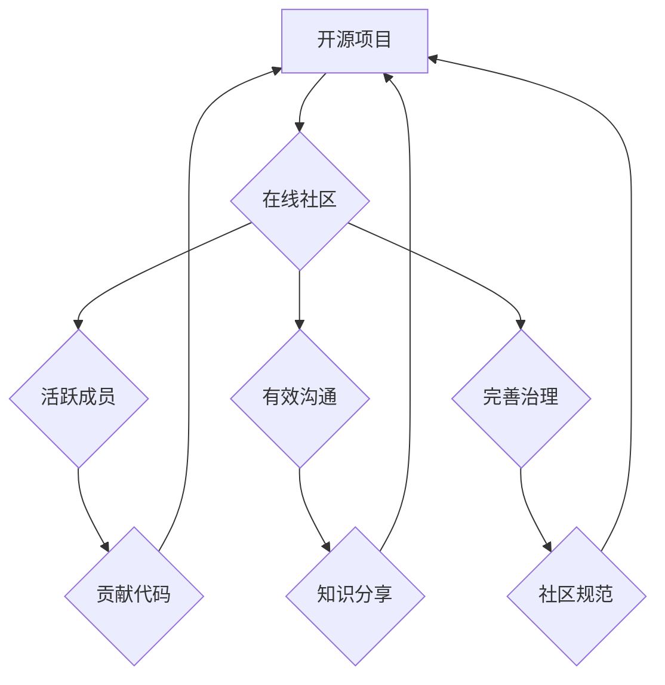

> 开源项目，在线社区，商业化，社区运营，贡献者管理，知识共享，技术生态

## 1. 背景介绍

开源软件已经成为现代软件开发的基石，其灵活、可定制和协作性的优势推动着技术创新和产业发展。然而，开源项目的成功不仅取决于其技术本身，更依赖于一个活跃、健康的在线社区。在线社区为开发者提供了一个交流、协作、学习和贡献的平台，是开源项目持续发展和商业化的关键。

随着开源项目的蓬勃发展，建立和运营一个成功的在线社区变得越来越重要。一个良好的在线社区可以：

* **促进项目发展:** 吸引更多开发者参与贡献代码、文档和测试，加速项目迭代和功能完善。
* **增强用户粘性:** 为用户提供技术支持、知识分享和社区互动，提升用户体验和项目忠诚度。
* **拓展商业机会:** 通过社区建设，吸引企业和个人用户，为开源项目提供商业化支持和发展路径。

## 2. 核心概念与联系

**2.1 开源项目与在线社区的关系**

开源项目和在线社区是相互依存、相互促进的关系。开源项目提供了一个技术基础和共同目标，而在线社区则为项目提供了平台和动力。

**2.2 在线社区的构成要素**

一个成功的在线社区通常包含以下要素：

* **明确的目标和价值观:** 社区应该围绕一个明确的目标和价值观而构建，吸引志同道合的成员。
* **活跃的成员群体:** 社区需要拥有活跃的成员群体，积极参与讨论、贡献代码和提供支持。
* **有效的沟通机制:** 社区需要提供有效的沟通机制，例如论坛、聊天室、邮件列表等，方便成员交流和协作。
* **完善的社区治理机制:** 社区需要建立完善的治理机制，确保社区的健康发展和秩序维护。

**2.3 商业化与开源社区的平衡**

开源社区的商业化需要谨慎处理，避免过度商业化损害社区的开放性和协作性。

**Mermaid 流程图**



## 3. 核心算法原理 & 具体操作步骤

**3.1 算法原理概述**

社区运营是一个复杂的系统工程，需要结合多种算法和技术手段来实现。其中，一些核心算法原理可以帮助我们更好地理解和运营社区：

* **推荐算法:** 根据用户的兴趣和行为，推荐相关内容和用户，提高用户参与度和粘性。
* **内容分类算法:** 自动分类和组织社区内容，方便用户查找和浏览。
* **社区分析算法:** 分析社区成员的互动行为、话题趋势等，为社区运营提供数据支持。

**3.2 算法步骤详解**

以下是一些常用的社区运营算法的具体操作步骤：

* **推荐算法:**

    1. 收集用户行为数据，例如浏览记录、点赞、评论等。
    2. 利用机器学习算法，构建用户兴趣模型。
    3. 根据用户兴趣模型，推荐相关内容和用户。

* **内容分类算法:**

    1. 使用自然语言处理技术，提取内容关键词和主题。
    2. 利用机器学习算法，训练内容分类模型。
    3. 将新内容分类到相应的类别。

* **社区分析算法:**

    1. 收集社区成员的互动数据，例如帖子回复、评论点赞等。
    2. 利用社交网络分析算法，构建社区成员关系图。
    3. 分析社区成员的活跃度、话题趋势等，为社区运营提供数据支持。

**3.3 算法优缺点**

* **推荐算法:**

    优点: 可以提高用户参与度和粘性。
    缺点: 可能导致信息茧房效应，限制用户接触不同观点。

* **内容分类算法:**

    优点: 可以方便用户查找和浏览内容。
    缺点: 分类结果可能存在误差，需要不断优化模型。

* **社区分析算法:**

    优点: 可以帮助运营者了解社区成员的兴趣和需求。
    缺点: 需要收集大量数据，并保证数据隐私安全。

**3.4 算法应用领域**

* **社交媒体平台:** 推荐好友、内容和活动。
* **电商平台:** 推荐商品和服务。
* **在线教育平台:** 推荐课程和学习资源。
* **开源社区:** 推荐贡献者、项目和资源。

## 4. 数学模型和公式 & 详细讲解 & 举例说明

**4.1 数学模型构建**

社区运营可以抽象为一个网络模型，其中节点代表社区成员，边代表成员之间的互动关系。我们可以使用图论和网络分析的数学模型来描述社区结构和演化过程。

**4.2 公式推导过程**

* **节点度:** 度代表节点连接的边的数量，反映节点在社区中的影响力。
* **聚类系数:** 聚类系数衡量节点邻居之间的连接程度，反映节点所属的社区结构。
* **中心性:** 中心性衡量节点在网络中的重要性，例如，度中心性、接近中心性和介数中心性等。

**4.3 案例分析与讲解**

我们可以使用这些数学模型和公式来分析开源社区的结构和演化过程。例如，我们可以计算社区成员的度、聚类系数和中心性，了解不同成员在社区中的角色和影响力。

## 5. 项目实践：代码实例和详细解释说明

**5.1 开发环境搭建**

* **操作系统:** Linux/macOS/Windows
* **编程语言:** Python
* **框架:** Django/Flask
* **数据库:** PostgreSQL/MySQL

**5.2 源代码详细实现**

以下是一个简单的开源社区项目代码示例，使用 Python 和 Django 框架实现：

```python
# models.py
from django.db import models

class User(models.Model):
    username = models.CharField(max_length=255)
    email = models.EmailField()
    # ...

class Project(models.Model):
    name = models.CharField(max_length=255)
    description = models.TextField()
    # ...

class Issue(models.Model):
    title = models.CharField(max_length=255)
    description = models.TextField()
    project = models.ForeignKey(Project, on_delete=models.CASCADE)
    # ...
```

**5.3 代码解读与分析**

* **models.py:** 定义了社区中的用户、项目和问题模型。
* **views.py:** 定义了社区页面和功能的视图函数。
* **templates:** 定义了社区页面和功能的模板文件。

**5.4 运行结果展示**

运行代码后，可以访问一个简单的开源社区网站，用户可以注册、登录、创建项目、提交问题等。

## 6. 实际应用场景

**6.1 开源软件社区**

开源软件社区是建立在线社区的典型应用场景。例如，Linux、Apache、MySQL 等开源项目都拥有活跃的在线社区，为开发者提供技术支持、代码贡献和项目讨论平台。

**6.2 技术论坛和讨论组**

技术论坛和讨论组是开发者交流和学习的技术平台。在线社区可以为这些平台提供更丰富的功能和互动体验。

**6.3 行业垂直社区**

一些行业领域也建立了在线社区，例如，游戏开发、金融科技、医疗健康等。这些社区可以帮助行业内的人员交流经验、分享资源和推动行业发展。

**6.4 未来应用展望**

随着人工智能、虚拟现实等技术的进步，在线社区将更加智能化、沉浸化和个性化。

## 7. 工具和资源推荐

**7.1 学习资源推荐**

* **书籍:**
    * 《社区运营实战》
    * 《网络社区的构建与运营》
* **在线课程:**
    * Coursera: 社区运营
    * Udemy: 社区管理

**7.2 开发工具推荐**

* **社区平台:** Discourse, Flarum, NodeBB
* **协作工具:** GitHub, GitLab, Bitbucket
* **数据分析工具:** Google Analytics, Matomo

**7.3 相关论文推荐**

* **社区结构分析:**
    * Newman, M. E. J. (2003). Communities in graphs.
* **社区运营策略:**
    * Wasko, J. M., & Faraj, S. (2000). It's not just about the technology: The role of community in open source software development.

## 8. 总结：未来发展趋势与挑战

**8.1 研究成果总结**

开源社区的建立和运营是一个复杂的系统工程，需要结合多种算法和技术手段来实现。

**8.2 未来发展趋势**

* **智能化社区:** 利用人工智能技术，实现社区自动化运营、个性化推荐和智能客服。
* **沉浸式社区:** 利用虚拟现实和增强现实技术，打造更加沉浸式的社区体验。
* **去中心化社区:** 利用区块链技术，构建更加去中心化的社区治理机制。

**8.3 面临的挑战**

* **社区治理:** 如何建立有效的社区治理机制，确保社区的健康发展和秩序维护。
* **内容质量:** 如何保证社区内容的质量和可靠性，避免虚假信息和恶意内容的传播。
* **商业化模式:** 如何实现开源社区的商业化，而不损害社区的开放性和协作性。

**8.4 研究展望**

未来，我们将继续研究开源社区的运营机制、技术应用和商业化模式，为开源社区的发展提供更多理论支持和实践指导。

## 9. 附录：常见问题与解答

**9.1 如何吸引更多开发者参与开源项目？**

* 提供清晰的项目目标和贡献指南。
* 建立活跃的在线社区，提供技术支持和交流平台。
* 举办线下活动，促进开发者之间的交流和合作。

**9.2 如何维护开源社区的秩序和质量？**

* 建立完善的社区规范和行为准则。
* 设置有效的举报机制，处理违规行为。
* 鼓励社区成员积极参与内容审核和质量控制。

**9.3 如何实现开源社区的商业化？**

* 提供付费服务，例如技术支持、定制开发等。
* 销售开源软件的商业版，提供更高级的功能和支持。
* 通过赞助和捐赠等方式获得资金支持。


作者：禅与计算机程序设计艺术 / Zen and the Art of Computer Programming 
<end_of_turn>