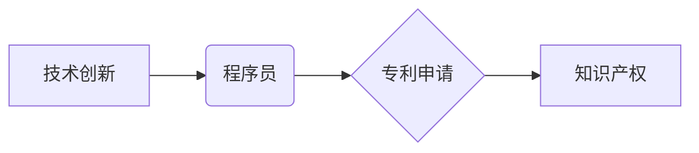

> 技术创新、专利申请、程序员、软件开发、知识产权、发明创造、技术文档、专利检索

## 1. 背景介绍

在当今科技日新月异的时代，技术创新是企业和个人持续发展的关键驱动力。程序员作为软件开发的基石，拥有着丰富的技术积累和创造力，他们能够将想法转化为现实，构建出改变世界的新技术。然而，如何有效保护自己的技术成果，使其得到合理的回报，是程序员需要认真思考的问题。

专利申请作为一种重要的知识产权保护方式，为程序员提供了有效手段，可以帮助他们将技术创新转化为经济价值。然而，对于程序员来说，专利申请流程较为复杂，涉及到大量的专业知识和技术细节，这往往会让程序员望而却步。

本指南旨在为程序员提供一份完整的技术创新与专利申请指南，帮助他们了解专利申请流程，掌握相关知识，并最终成功申请专利，保护自己的技术成果。

## 2. 核心概念与联系

**2.1  技术创新**

技术创新是指在现有技术基础上，通过创造性思维和实践活动，开发出新的技术方案、产品或服务，并使其具有实用价值和市场竞争力的过程。

**2.2  专利申请**

专利申请是指申请人向专利局提交专利申请文件，请求授予其对发明或实用新型的独占权利的过程。

**2.3  知识产权**

知识产权是指对知识、创造和发明等方面的权利，包括专利权、商标权、著作权等。

**2.4  程序员的角色**

程序员作为软件开发的实践者，在技术创新过程中扮演着重要的角色。他们能够将抽象的思想转化为具体的代码，并通过代码实现新的功能和应用场景。

**2.5  专利申请与技术创新的关系**

专利申请是保护技术创新的重要手段之一。通过申请专利，程序员可以获得对自己的技术成果的独占权利，防止他人无权使用或复制，从而保障自己的利益。

**2.6  核心概念关系图**

## 3. 核心算法原理 & 具体操作步骤

**3.1  算法原理概述**

在技术创新过程中，程序员经常需要设计和实现新的算法，以解决特定问题或实现新的功能。算法的原理是描述算法逻辑和步骤的数学模型，它决定了算法的效率和正确性。

**3.2  算法步骤详解**

算法的步骤详解是指对算法的逻辑流程进行详细描述，包括每个步骤的具体操作和数据处理过程。

**3.3  算法优缺点**

算法的优缺点是指算法在效率、准确性、复杂度等方面的优劣势。程序员需要根据具体应用场景选择合适的算法。

**3.4  算法应用领域**

算法的应用领域非常广泛，包括人工智能、数据挖掘、图像处理、网络安全等多个领域。

## 4. 数学模型和公式 & 详细讲解 & 举例说明

**4.1  数学模型构建**

数学模型是描述客观现象和关系的抽象模型，它可以帮助程序员理解算法的原理和行为。

**4.2  公式推导过程**

公式推导过程是指从已知条件出发，通过逻辑推理和数学运算，推导出算法的具体公式。

**4.3  案例分析与讲解**

案例分析与讲解是指通过具体的例子，解释数学模型和公式的应用，帮助程序员理解算法的原理和应用场景。

## 5. 项目实践：代码实例和详细解释说明

**5.1  开发环境搭建**

开发环境搭建是指为程序员提供必要的软件工具和运行环境，以便进行代码开发和测试。

**5.2  源代码详细实现**

源代码详细实现是指程序员根据算法原理和步骤，编写出具体的代码实现。

**5.3  代码解读与分析**

代码解读与分析是指对源代码进行详细的解释和分析，帮助程序员理解代码的逻辑和功能。

**5.4  运行结果展示**

运行结果展示是指程序员运行代码，并展示代码的运行结果，验证算法的正确性和有效性。

## 6. 实际应用场景

**6.1  人工智能**

人工智能技术在各个领域都有广泛的应用，例如语音识别、图像识别、自然语言处理等。

**6.2  数据挖掘**

数据挖掘技术可以从海量数据中挖掘出有价值的信息，例如客户行为分析、市场趋势预测等。

**6.3  图像处理**

图像处理技术可以对图像进行各种操作，例如图像增强、图像识别、图像压缩等。

**6.4  未来应用展望**

随着技术的不断发展，算法的应用场景将会更加广泛，例如自动驾驶、医疗诊断、个性化推荐等。

## 7. 工具和资源推荐

**7.1  学习资源推荐**

* 在线课程平台：Coursera、edX、Udemy等
* 书籍：算法导论、数据结构与算法分析等
* 博客和论坛：Stack Overflow、GitHub等

**7.2  开发工具推荐**

* 编程语言：Python、Java、C++等
* 开发环境：IDE、文本编辑器等
* 版本控制系统：Git等

**7.3  相关论文推荐**

* ACM Digital Library
* IEEE Xplore

## 8. 总结：未来发展趋势与挑战

**8.1  研究成果总结**

技术创新与专利申请是程序员职业发展的重要组成部分。通过学习相关知识和掌握实践技能，程序员可以有效保护自己的技术成果，并将其转化为经济价值。

**8.2  未来发展趋势**

未来，人工智能、大数据、云计算等技术将推动算法的快速发展，程序员需要不断学习和提升自己的技术能力，才能适应未来的发展趋势。

**8.3  面临的挑战**

程序员在进行技术创新和专利申请过程中，面临着知识产权保护、技术竞争、市场需求等方面的挑战。

**8.4  研究展望**

未来，需要进一步加强技术创新与专利申请的宣传和引导，帮助程序员更好地理解和掌握相关知识，促进技术创新的发展。

## 9. 附录：常见问题与解答

**9.1  如何判断自己的技术成果是否具有专利申请价值？**

**9.2  专利申请流程是什么？**

**9.3  如何撰写有效的专利申请文件？**

**9.4  专利申请需要花费多少时间和费用？**

**9.5  如何维护和管理自己的专利权？**

作者：禅与计算机程序设计艺术 / Zen and the Art of Computer Programming 
<end_of_turn>