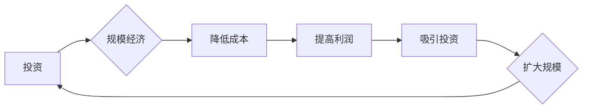

> 投资收益、规模经济、技术进步、市场饱和、竞争加剧、创新驱动、新兴技术、商业模式

## 1. 背景介绍

在过去几十年里，科技行业经历了前所未有的繁荣。互联网、移动互联网、云计算等技术的快速发展，催生了一批科技巨头，并为全球经济增长做出了巨大贡献。然而，近年来，科技行业的投资收益开始下降，规模经济效应也逐渐减弱。

这种现象的出现，引发了广泛的讨论和担忧。一些人认为，这是科技行业发展到瓶颈期，未来增长乏力；另一些人则认为，这是科技行业进入新阶段，需要新的增长引擎。

## 2. 核心概念与联系

**2.1 规模经济效应**

规模经济效应是指随着企业规模的扩大，单位成本下降的现象。这是因为大规模生产可以实现资源配置的优化，降低采购成本、生产成本和管理成本。

**2.2 投资收益**

投资收益是指投资者通过投资获得的回报。在科技行业，投资收益通常以股价上涨、市场份额增长、利润率提升等形式体现。

**2.3 联系**

规模经济效应是科技行业投资收益的重要驱动因素。通过规模经济，科技企业可以降低成本，提高利润，从而吸引更多的投资，进一步扩大规模，形成良性循环。

**2.4 Mermaid 流程图**

## 3. 核心算法原理 & 具体操作步骤

**3.1 算法原理概述**

在科技行业，算法是核心竞争力之一。许多成功的科技产品和服务都依赖于高效、精准的算法。

**3.2 算法步骤详解**

具体算法步骤取决于具体的应用场景。例如，推荐算法需要根据用户的历史行为和偏好，预测用户可能感兴趣的内容；搜索算法需要根据用户的搜索词，从海量数据中找到最相关的结果。

**3.3 算法优缺点**

不同的算法有不同的优缺点。例如，一些算法在准确率方面表现出色，但计算复杂度较高；另一些算法计算效率高，但准确率相对较低。

**3.4 算法应用领域**

算法广泛应用于科技行业的各个领域，例如：

* 搜索引擎
* 推荐系统
* 人工智能
* 数据分析
* 计算机视觉

## 4. 数学模型和公式 & 详细讲解 & 举例说明

**4.1 数学模型构建**

在科技行业，数学模型是分析和解决复杂问题的重要工具。例如，我们可以使用数学模型来预测用户行为、优化资源分配、评估投资风险等。

**4.2 公式推导过程**

具体的数学模型和公式取决于具体的应用场景。例如，我们可以使用线性回归模型来预测用户购买行为，使用贝叶斯网络来分析风险因素等。

**4.3 案例分析与讲解**

我们可以通过具体的案例来分析和讲解数学模型的应用。例如，我们可以分析电商平台如何使用推荐算法来提高用户转化率，分析金融机构如何使用风险模型来评估贷款风险等。

## 5. 项目实践：代码实例和详细解释说明

**5.1 开发环境搭建**

在进行项目实践之前，我们需要搭建开发环境。这包括安装必要的软件、配置开发工具等。

**5.2 源代码详细实现**

我们可以通过代码实例来展示具体的算法实现。例如，我们可以实现一个简单的推荐算法，并解释代码的每一行。

**5.3 代码解读与分析**

我们需要对代码进行解读和分析，理解代码的逻辑和功能。

**5.4 运行结果展示**

我们可以通过运行代码来展示算法的运行结果，并分析结果的准确性和效率。

## 6. 实际应用场景

**6.1 实际应用场景**

我们可以通过具体的案例来展示算法的实际应用场景。例如，我们可以分析搜索引擎如何使用算法来提高搜索结果的准确率，分析社交媒体平台如何使用算法来推荐好友等。

**6.2 未来应用展望**

随着技术的不断发展，算法将在更多领域得到应用。例如，我们可以期待人工智能算法在医疗、教育、交通等领域发挥更大的作用。

## 7. 工具和资源推荐

**7.1 学习资源推荐**

* 在线课程：Coursera、edX、Udacity等平台提供丰富的算法学习课程。
* 书籍：
    * 《算法导论》
    * 《深入理解算法》
    * 《机器学习》

**7.2 开发工具推荐**

* Python：Python 是机器学习和数据科学领域最常用的编程语言。
* TensorFlow：TensorFlow 是 Google 开发的开源机器学习框架。
* PyTorch：PyTorch 是 Facebook 开发的开源机器学习框架。

**7.3 相关论文推荐**

* 《Attention Is All You Need》
* 《Deep Learning》
* 《Generative Adversarial Networks》

## 8. 总结：未来发展趋势与挑战

**8.1 研究成果总结**

近年来，算法研究取得了显著进展，例如深度学习、强化学习等新兴算法的出现，为解决复杂问题提供了新的思路和方法。

**8.2 未来发展趋势**

未来，算法研究将朝着以下方向发展：

* 更智能、更强大的算法
* 更广泛的应用场景
* 更注重算法的可解释性和安全性

**8.3 面临的挑战**

算法研究也面临着一些挑战，例如：

* 算法的复杂性
* 数据的获取和处理
* 算法的伦理问题

**8.4 研究展望**

尽管面临挑战，但算法研究的前景依然光明。随着技术的不断发展，算法将继续推动科技进步，改变我们的生活。

## 9. 附录：常见问题与解答

**9.1 常见问题与解答**

* 什么是算法？
* 算法的分类有哪些？
* 如何选择合适的算法？
* 如何评估算法的性能？

作者：禅与计算机程序设计艺术 / Zen and the Art of Computer Programming

<end_of_turn>