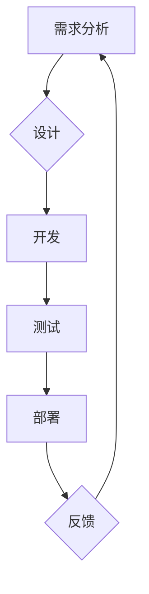

> 敏捷开发,快速迭代,Scrum,Kanban,代码质量,持续集成,持续交付,DevOps

## 1. 背景介绍

在当今瞬息万变的科技时代，软件开发面临着越来越高的要求。用户对软件的功能、性能、体验等方面都提出了更高的期望。传统的瀑布式开发模式由于其线性、僵化的特点，难以适应快速变化的需求和市场环境。因此，敏捷开发方法论应运而生，它强调灵活、迭代、协作和客户价值，旨在帮助开发团队更快地交付高质量的软件产品。

## 2. 核心概念与联系

敏捷开发的核心概念包括：

* **迭代开发:** 将软件开发过程划分为多个短周期（迭代），每个迭代都包含需求分析、设计、开发、测试和部署等环节。
* **协作:** 敏捷开发强调团队成员之间的紧密合作，包括开发人员、测试人员、产品经理、客户等。
* **客户价值:** 敏捷开发的核心目标是交付客户价值，因此开发团队需要与客户保持密切沟通，了解客户的需求和期望。
* **持续改进:** 敏捷开发强调持续改进，开发团队需要不断反思和优化开发流程，提高开发效率和软件质量。

**敏捷开发流程图:**



## 3. 核心算法原理 & 具体操作步骤

敏捷开发的核心算法原理是基于迭代和反馈的循环开发模式。

### 3.1  算法原理概述

敏捷开发算法的核心思想是将软件开发过程分解成多个小的迭代周期，每个迭代周期都包含完整的开发流程，从需求分析到部署，并通过客户反馈不断改进和优化软件。

### 3.2  算法步骤详解

1. **需求分析:** 团队与客户合作，明确软件的功能需求和目标。
2. **迭代规划:** 根据需求，团队制定迭代计划，确定迭代周期、目标和任务。
3. **设计和开发:** 团队根据迭代计划进行设计和开发工作。
4. **测试和验收:** 开发完成后的软件进行测试和验收，确保软件功能符合需求。
5. **部署和发布:** 将测试通过的软件部署到生产环境，并进行发布。
6. **反馈和改进:** 收集用户反馈，分析问题，并进行软件改进和优化。

### 3.3  算法优缺点

**优点:**

* 能够快速响应客户需求变化。
* 能够提高软件质量，因为每个迭代都包含测试和验收环节。
* 能够提高开发效率，因为团队可以专注于完成每个迭代的目标。
* 能够增强团队协作和沟通。

**缺点:**

* 需要团队成员具备较高的协作能力和沟通能力。
* 需要客户积极参与开发过程。
* 对于大型复杂项目，可能需要更复杂的管理和协调机制。

### 3.4  算法应用领域

敏捷开发方法论广泛应用于各种软件开发领域，例如：

* Web 应用开发
* 移动应用开发
* 企业级软件开发
* 游戏开发

## 4. 数学模型和公式 & 详细讲解 & 举例说明

敏捷开发的迭代周期长度可以根据项目需求和团队能力进行调整。

### 4.1  数学模型构建

假设一个软件项目的总开发时间为 T，迭代周期长度为 I，则迭代次数为：

```latex
迭代次数 = T / I
```

### 4.2  公式推导过程

该公式的推导过程非常简单，即总开发时间除以每个迭代周期长度，即可得到迭代次数。

### 4.3  案例分析与讲解

例如，一个软件项目的总开发时间为 6 个月，每个迭代周期长度为 2 周，则迭代次数为：

```latex
迭代次数 = 6 个月 / 2 周 = 12 周
```

## 5. 项目实践：代码实例和详细解释说明

以下是一个使用敏捷开发方法论开发一个简单的 Web 应用的代码实例。

### 5.1  开发环境搭建

* 使用 Node.js 和 Express.js 构建 Web 应用。
* 使用 Git 进行版本控制。
* 使用 Docker 进行容器化部署。

### 5.2  源代码详细实现

```javascript
const express = require('express');
const app = express();

app.get('/', (req, res) => {
  res.send('Hello World!');
});

app.listen(3000, () => {
  console.log('Server listening on port 3000');
});
```

### 5.3  代码解读与分析

* 使用 Express.js 框架构建 Web 应用。
* 定义一个根路径 `/` 的路由，返回 "Hello World!" 字符串。
* 监听端口 3000，启动 Web 应用。

### 5.4  运行结果展示

运行代码后，访问 http://localhost:3000/，即可看到 "Hello World!" 的输出。

## 6. 实际应用场景

敏捷开发方法论广泛应用于各种软件开发场景，例如：

* **电商平台开发:** 敏捷开发可以帮助电商平台快速迭代新功能，例如新品上架、促销活动、支付方式等，以满足用户不断变化的需求。
* **金融软件开发:** 敏捷开发可以帮助金融软件开发团队快速响应市场变化，例如推出新的金融产品、优化交易流程等，以保持竞争优势。
* **医疗软件开发:** 敏捷开发可以帮助医疗软件开发团队快速迭代新功能，例如电子病历系统、远程医疗平台等，以提高医疗服务效率和质量。

### 6.4  未来应用展望

随着科技发展和用户需求的变化，敏捷开发方法论将继续演进和发展，例如：

* **更精细化的迭代周期:** 迭代周期将更加短，例如每天或每周一次，以更快地响应用户反馈。
* **更智能化的开发工具:** 开发工具将更加智能化，例如自动代码生成、测试和部署等，以提高开发效率。
* **更广泛的应用场景:** 敏捷开发方法论将应用于更多领域，例如硬件开发、数据分析等。

## 7. 工具和资源推荐

### 7.1  学习资源推荐

* **敏捷开发书籍:** 《敏捷软件开发》
* **敏捷开发网站:** Scrum Alliance, Agile Alliance

### 7.2  开发工具推荐

* **版本控制工具:** Git
* **项目管理工具:** Jira, Trello
* **持续集成工具:** Jenkins, CircleCI

### 7.3  相关论文推荐

* **敏捷开发论文:** "The Agile Manifesto"

## 8. 总结：未来发展趋势与挑战

敏捷开发方法论已经成为软件开发行业的主流方法，它帮助开发团队更快地交付高质量的软件产品。未来，敏捷开发将继续演进和发展，但同时也面临着一些挑战，例如：

### 8.1  研究成果总结

敏捷开发方法论已经取得了显著的成果，例如：

* **提高软件开发效率:** 敏捷开发可以帮助开发团队更快地交付软件产品。
* **提高软件质量:** 敏捷开发强调持续测试和反馈，可以帮助提高软件质量。
* **增强团队协作:** 敏捷开发强调团队合作，可以增强团队协作能力。

### 8.2  未来发展趋势

* **更精细化的迭代周期:** 迭代周期将更加短，以更快地响应用户反馈。
* **更智能化的开发工具:** 开发工具将更加智能化，例如自动代码生成、测试和部署等。
* **更广泛的应用场景:** 敏捷开发方法论将应用于更多领域，例如硬件开发、数据分析等。

### 8.3  面临的挑战

* **团队文化转变:** 敏捷开发需要团队成员具备一定的协作能力和沟通能力，需要团队文化转变。
* **项目管理复杂性:** 大型复杂项目需要更复杂的管理和协调机制。
* **技术复杂性:** 随着软件技术的不断发展，敏捷开发需要不断学习和适应新的技术。

### 8.4  研究展望

未来，敏捷开发研究将继续深入，例如：

* **敏捷开发方法论的优化:** 研究更适合不同项目类型的敏捷开发方法论。
* **敏捷开发工具的创新:** 开发更智能化、更易用的敏捷开发工具。
* **敏捷开发的应用扩展:** 将敏捷开发方法论应用于更多领域，例如硬件开发、数据分析等。

## 9. 附录：常见问题与解答

**常见问题:**

* **敏捷开发适合哪些项目类型？**

敏捷开发适合所有类型的软件开发项目，但对于小型、灵活的项目更适用。

* **敏捷开发需要哪些工具？**

敏捷开发可以使用各种工具，例如版本控制工具、项目管理工具、持续集成工具等。

* **如何进行敏捷开发团队的培训？**

可以参考 Scrum Alliance 和 Agile Alliance 等机构提供的敏捷开发培训课程。

**作者：禅与计算机程序设计艺术 / Zen and the Art of Computer Programming**


<end_of_turn>