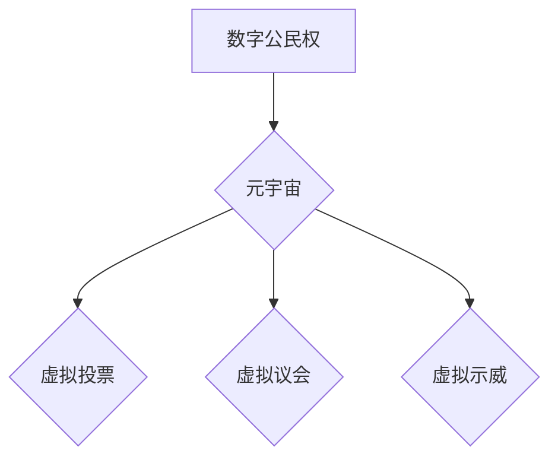

> 元宇宙、数字公民权、政治参与、去中心化、区块链、人工智能、数据隐私

## 1. 背景介绍

元宇宙概念的兴起，标志着人类社会进入了一个全新的数字时代。这个虚拟世界将与现实世界深度融合，人们可以在其中工作、学习、娱乐、社交，甚至参与政治活动。然而，元宇宙的开放性和虚拟性也带来了新的挑战，其中之一就是如何保障数字公民权，确保每个人在元宇宙中都能平等地参与政治进程。

传统政治参与模式主要依赖于现实世界中的线下活动，例如投票、示威、参与政党组织等。但元宇宙的出现，为政治参与提供了全新的可能性。虚拟世界可以打破地域限制，降低参与门槛，让更多人能够参与到政治决策中。

## 2. 核心概念与联系

**2.1 数字公民权**

数字公民权是指在数字时代，公民享有的在网络空间中平等参与、表达和决策的权利。它包括：

* **信息获取权:** 能够平等地获取真实、准确的信息。
* **表达权:** 能够自由地表达自己的观点和意见。
* **参与权:** 能够参与到公共事务的决策中。
* **隐私权:** 能够保护自己的个人信息和数据安全。

**2.2 元宇宙与政治参与**

元宇宙为政治参与提供了新的平台和工具。

* **虚拟投票:** 在元宇宙中，可以使用区块链技术进行安全、透明的投票，让更多人能够参与到选举中。
* **虚拟议会:** 在元宇宙中建立虚拟议会，让公民可以与议员进行实时互动，参与到政策讨论和制定中。
* **虚拟示威:** 在元宇宙中组织虚拟示威，让公民能够表达自己的诉求，并与政府进行沟通。

**2.3 核心概念架构**



## 3. 核心算法原理 & 具体操作步骤

**3.1 算法原理概述**

元宇宙中的政治参与需要依赖于一系列的算法，例如：

* **身份验证算法:** 确保每个参与者都是真实的人，而不是机器人或恶意攻击者。
* **投票算法:** 确保投票过程安全、透明、不可篡改。
* **数据分析算法:** 分析公民的意见和诉求，帮助政府制定更符合民意的政策。

**3.2 算法步骤详解**

* **身份验证算法:**

    1. 使用区块链技术生成每个公民的唯一身份标识。
    2. 使用生物识别技术验证用户的身份。
    3. 使用多因素身份验证机制，提高安全性。

* **投票算法:**

    1. 使用区块链技术记录每个投票，确保投票过程不可篡改。
    2. 使用加密技术保护投票者的隐私。
    3. 使用智能合约自动计算投票结果。

* **数据分析算法:**

    1. 收集公民在元宇宙中的活动数据，例如投票记录、论坛发言、虚拟会议参与等。
    2. 使用机器学习算法分析数据，识别出公民的意见和诉求。
    3. 将分析结果反馈给政府，帮助政府制定更符合民意的政策。

**3.3 算法优缺点**

* **优点:**

    * 安全性高：区块链技术和加密技术可以确保投票过程的安全性和透明度。
    * 效率高：智能合约可以自动执行投票计算，提高效率。
    * 可扩展性强：元宇宙的虚拟环境可以容纳更多参与者。

* **缺点:**

    * 技术门槛高：需要一定的技术知识才能参与元宇宙中的政治活动。
    * 数据隐私问题：收集公民数据需要谨慎处理，避免侵犯隐私。
    * 监管挑战：元宇宙的虚拟环境需要新的监管机制。

**3.4 算法应用领域**

* **选举:** 元宇宙可以提供一个安全、透明的投票平台，让更多人能够参与到选举中。
* **政策制定:** 元宇宙可以提供一个平台，让公民与政府进行互动，参与到政策讨论和制定中。
* **公共服务:** 元宇宙可以提供一个平台，让公民更容易地获取公共服务信息。

## 4. 数学模型和公式 & 详细讲解 & 举例说明

**4.1 数学模型构建**

元宇宙中的政治参与可以建模为一个网络系统，其中每个节点代表一个公民，边代表公民之间的关系。

* **节点:** 代表每个公民，每个节点拥有以下属性：
    * 身份标识
    * 兴趣爱好
    * 政治观点
    * 社会关系

* **边:** 代表公民之间的关系，例如：
    * 共同关注的议题
    * 虚拟社交关系
    * 投票关系

**4.2 公式推导过程**

我们可以使用图论中的算法来分析元宇宙中的政治参与网络。例如：

* **中心度:** 衡量一个节点在网络中的重要性。
* **聚类系数:** 衡量一个节点与其他节点之间的连接程度。
* **路径长度:** 衡量两个节点之间的距离。

这些指标可以帮助我们了解元宇宙中不同公民的政治参与程度，以及不同群体之间的关系。

**4.3 案例分析与讲解**

假设我们有一个元宇宙中的政治参与网络，其中有100个节点，每个节点代表一个公民。我们可以使用中心度算法来找出网络中的关键人物，这些关键人物可能对政治决策有更大的影响力。

## 5. 项目实践：代码实例和详细解释说明

**5.1 开发环境搭建**

* **操作系统:** Ubuntu 20.04 LTS
* **编程语言:** Python 3.8
* **开发工具:** Jupyter Notebook

**5.2 源代码详细实现**

```python
import networkx as nx

# 创建一个网络图
graph = nx.Graph()

# 添加节点
for i in range(100):
    graph.add_node(i)

# 添加边
for i in range(100):
    for j in range(i + 1, 100):
        if i % 2 == j % 2:
            graph.add_edge(i, j)

# 计算中心度
centrality = nx.degree_centrality(graph)

# 打印中心度
print(centrality)
```

**5.3 代码解读与分析**

* `networkx` 是一个用于构建和分析网络图的 Python 库。
* `nx.Graph()` 创建了一个空的网络图。
* `graph.add_node(i)` 添加一个节点到网络图中。
* `graph.add_edge(i, j)` 添加一条边连接节点 `i` 和节点 `j`。
* `nx.degree_centrality(graph)` 计算每个节点的中心度。

**5.4 运行结果展示**

运行代码后，会输出每个节点的中心度值。中心度值越高，节点在网络中的重要性就越高。

## 6. 实际应用场景

元宇宙中的政治参与可以应用于以下场景：

* **虚拟选举:** 在元宇宙中进行安全、透明的选举，让更多人能够参与到政治决策中。
* **虚拟议会:** 在元宇宙中建立虚拟议会，让公民与议员进行实时互动，参与到政策讨论和制定中。
* **虚拟示威:** 在元宇宙中组织虚拟示威，让公民能够表达自己的诉求，并与政府进行沟通。

**6.4 未来应用展望**

随着元宇宙技术的不断发展，数字公民权在元宇宙中的应用将更加广泛和深入。未来，我们可能会看到：

* **更智能的政治参与平台:** 利用人工智能技术，为公民提供更个性化的政治参与体验。
* **更广泛的政治参与群体:** 元宇宙可以打破地域限制，让更多人能够参与到政治活动中。
* **更透明和可信的政治决策:** 元宇宙可以提供一个公开透明的平台，让公民能够监督政府的决策过程。

## 7. 工具和资源推荐

**7.1 学习资源推荐**

* **书籍:**
    * 《元宇宙：下一代互联网》
    * 《数字公民权》
* **在线课程:**
    * Coursera: 元宇宙与虚拟现实
    * edX: 区块链技术与应用

**7.2 开发工具推荐**

* **Unity:** 游戏引擎，用于开发元宇宙应用。
* **Unreal Engine:** 游戏引擎，用于开发元宇宙应用。
* **Decentraland:** 元宇宙平台，用于开发和体验元宇宙应用。

**7.3 相关论文推荐**

* **The Metaverse: A New Era of Digital Citizenship**
* **Blockchain Technology for Secure and Transparent Voting**

## 8. 总结：未来发展趋势与挑战

**8.1 研究成果总结**

元宇宙为数字公民权提供了新的可能性，但也带来了新的挑战。我们需要不断研究和探索，以确保元宇宙能够成为一个更加公平、透明、包容的数字社会。

**8.2 未来发展趋势**

* 元宇宙技术将继续发展，带来更加沉浸式、交互式的体验。
* 数字公民权的概念将更加完善，并得到更广泛的应用。
* 元宇宙将与现实世界更加融合，成为人们生活、工作、娱乐的重要场所。

**8.3 面临的挑战**

* 如何保障元宇宙中的数据隐私和安全。
* 如何防止元宇宙被用于恶意目的，例如传播虚假信息、煽动暴力。
* 如何确保元宇宙中的政治参与公平公正。

**8.4 研究展望**

未来，我们需要继续研究元宇宙与数字公民权的关系，探索元宇宙如何更好地服务于人类社会。


## 9. 附录：常见问题与解答

**9.1 如何在元宇宙中投票？**

在元宇宙中投票通常使用区块链技术，确保投票过程安全、透明、不可篡改。

**9.2 元宇宙中的政治参与会取代现实世界中的政治参与吗？**

元宇宙中的政治参与可以补充现实世界中的政治参与，但不会完全取代它。

**9.3 元宇宙中的数据隐私如何保障？**

元宇宙中的数据隐私需要通过技术手段和法律法规来保障。

**9.4 元宇宙中的政治参与会更加公平吗？**

元宇宙可以打破地域限制，让更多人能够参与到政治活动中，但还需要解决其他问题，例如数字鸿沟和算法偏见，才能真正实现政治参与的公平性。


作者：禅与计算机程序设计艺术 / Zen and the Art of Computer Programming 
<end_of_turn>