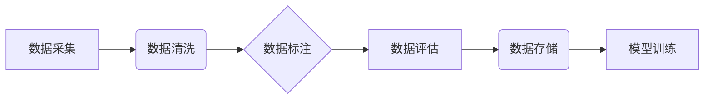

> 数据标注平台，AI 2.0，高质量数据集，机器学习，深度学习，数据标注工具，数据标注流程

## 1. 背景介绍

人工智能（AI）技术近年来发展迅速，特别是深度学习的兴起，推动了 AI 在各个领域的应用，例如图像识别、自然语言处理、语音识别等。然而，深度学习模型的训练离不开海量高质量的数据集。数据标注作为 AI 模型训练的基础环节，其质量直接影响模型的性能和可靠性。

传统的 AI 数据标注方式主要依赖人工标注，效率低、成本高，难以满足 AI 发展对数据量的需求。随着 AI 2.0 时代的到来，对数据标注平台的需求更加迫切。AI 2.0 强调模型的泛化能力、鲁棒性和可解释性，需要更加多样化、复杂化的训练数据。

## 2. 核心概念与联系

数据标注平台是一个用于收集、管理、标注和评估 AI 训练数据的软件系统。它提供了一系列工具和功能，帮助用户高效地完成数据标注任务，并确保数据标注的质量和一致性。

**数据标注平台的架构**



**核心概念:**

* **数据采集:** 从各种来源收集原始数据，例如图像、文本、音频等。
* **数据清洗:** 对收集到的数据进行预处理，例如去除噪声、格式化数据等。
* **数据标注:** 根据任务需求，对数据进行人工或自动标注，例如图像识别中的物体识别、文本分类中的情感分析等。
* **数据评估:** 对标注数据进行评估，例如准确率、召回率等，确保数据标注的质量。
* **数据存储:** 将标注数据存储到数据库或文件系统中，方便后续使用。
* **模型训练:** 使用标注数据训练 AI 模型。

## 3. 核心算法原理 & 具体操作步骤

### 3.1  算法原理概述

数据标注平台的核心算法主要包括数据清洗算法、数据标注算法和数据评估算法。

* **数据清洗算法:** 主要用于去除数据中的噪声、缺失值和重复数据，提高数据质量。常用的算法包括正则表达式匹配、统计分析和机器学习算法等。
* **数据标注算法:** 主要用于对数据进行人工或自动标注。人工标注需要专业人员进行标注，而自动标注则利用机器学习算法对数据进行自动标注。常用的自动标注算法包括监督学习、半监督学习和无监督学习等。
* **数据评估算法:** 主要用于评估标注数据的质量，常用的指标包括准确率、召回率、F1-score等。

### 3.2  算法步骤详解

**数据清洗算法步骤:**

1. 数据导入：将原始数据导入到数据清洗平台。
2. 数据预处理：对数据进行格式化、编码转换等预处理操作。
3. 数据清洗：使用清洗算法去除数据中的噪声、缺失值和重复数据。
4. 数据输出：将清洗后的数据输出到指定位置。

**数据标注算法步骤:**

1. 数据准备：将清洗后的数据准备用于标注。
2. 标注工具选择：根据标注任务选择合适的标注工具。
3. 标注规则定义：定义标注规则，例如图像识别中的物体类别、文本分类中的情感类别等。
4. 数据标注：人工或自动标注数据，并根据标注规则进行标注。
5. 数据验证：对标注数据进行验证，确保标注的准确性和一致性。

**数据评估算法步骤:**

1. 数据划分：将标注数据划分为训练集、验证集和测试集。
2. 模型训练：使用训练集训练 AI 模型。
3. 模型评估：使用验证集和测试集评估模型的性能，例如准确率、召回率、F1-score等。
4. 结果分析：分析模型的评估结果，并根据结果进行模型调优。

### 3.3  算法优缺点

**数据清洗算法:**

* **优点:** 可以有效去除数据中的噪声、缺失值和重复数据，提高数据质量。
* **缺点:** 算法的选择和参数设置需要根据具体的数据特点进行调整，否则可能会导致数据丢失或误判。

**数据标注算法:**

* **优点:** 可以提高数据标注的效率和准确性。
* **缺点:** 自动标注算法的性能仍然不如人工标注，需要不断改进和完善。

**数据评估算法:**

* **优点:** 可以客观地评估标注数据的质量，并为模型训练提供参考。
* **缺点:** 评估指标的选择需要根据具体的任务需求进行调整，不同的指标可能反映不同的方面。

### 3.4  算法应用领域

数据标注平台的算法应用领域非常广泛，例如：

* **图像识别:** 用于标注图像中的物体、场景、人物等信息。
* **自然语言处理:** 用于标注文本中的情感、主题、实体等信息。
* **语音识别:** 用于标注语音中的单词、句子、语调等信息。
* **自动驾驶:** 用于标注道路场景中的车辆、行人、交通信号等信息。

## 4. 数学模型和公式 & 详细讲解 & 举例说明

### 4.1  数学模型构建

数据标注平台的数学模型主要用于描述数据标注过程中的关系和规则。例如，在图像识别任务中，可以使用卷积神经网络（CNN）模型来描述图像特征的提取和分类过程。

### 4.2  公式推导过程

CNN 模型的训练过程涉及到许多数学公式，例如损失函数、梯度下降算法等。这些公式的推导过程比较复杂，需要一定的数学基础。

### 4.3  案例分析与讲解

以图像识别为例，假设我们想要训练一个 CNN 模型来识别猫和狗的图像。

1. **数据标注:** 首先需要对大量的猫和狗图像进行标注，标记出每个图像中是否存在猫或狗。
2. **模型训练:** 使用标注数据训练 CNN 模型，模型会学习到猫和狗的特征。
3. **模型评估:** 使用测试集评估模型的性能，例如准确率、召回率等。
4. **模型调优:** 根据评估结果，调整模型参数，例如学习率、网络结构等，提高模型性能。

## 5. 项目实践：代码实例和详细解释说明

### 5.1  开发环境搭建

数据标注平台的开发环境通常包括以下软件：

* 操作系统：Linux、Windows 或 macOS
* 编程语言：Python、Java 或 C++
* 数据库：MySQL、PostgreSQL 或 MongoDB
* Web 服务器：Apache、Nginx 或 Tomcat

### 5.2  源代码详细实现

由于篇幅限制，这里只提供一个简单的 Python 代码示例，用于演示数据标注平台的基本功能。

```python
# 数据标注平台示例代码

class DataAnnotator:
    def __init__(self, data_path):
        self.data_path = data_path

    def load_data(self):
        # 从数据文件中加载数据
        pass

    def annotate_data(self, data):
        # 对数据进行标注
        pass

    def save_data(self, data):
        # 将标注后的数据保存到文件
        pass

# 使用示例
annotator = DataAnnotator("data.txt")
data = annotator.load_data()
annotator.annotate_data(data)
annotator.save_data(data)
```

### 5.3  代码解读与分析

这段代码定义了一个简单的 `DataAnnotator` 类，用于演示数据标注平台的基本功能。

* `__init__` 方法：初始化数据标注平台，设置数据文件路径。
* `load_data` 方法：从数据文件中加载数据。
* `annotate_data` 方法：对数据进行标注。
* `save_data` 方法：将标注后的数据保存到文件。

### 5.4  运行结果展示

运行这段代码后，将从 `data.txt` 文件中加载数据，对数据进行标注，并将标注后的数据保存到文件。

## 6. 实际应用场景

数据标注平台在各个领域都有广泛的应用场景，例如：

* **医疗保健:** 用于标注医学图像，辅助医生诊断疾病。
* **金融服务:** 用于标注金融文本，识别欺诈交易和风险。
* **制造业:** 用于标注工业图像，进行缺陷检测和质量控制。
* **教育:** 用于标注教育文本，辅助学生学习和评估。

### 6.4  未来应用展望

随着 AI 技术的不断发展，数据标注平台将发挥越来越重要的作用。未来，数据标注平台将朝着以下方向发展：

* **自动化程度更高:** 利用机器学习算法，提高数据标注的自动化程度，降低人工成本。
* **标注质量更高:** 使用更先进的标注算法和工具，提高数据标注的准确性和一致性。
* **数据标注平台更加智能化:** 数据标注平台将更加智能化，能够根据用户的需求自动生成标注规则和标注工具。

## 7. 工具和资源推荐

### 7.1  学习资源推荐

* **书籍:**
    * 《数据标注：人工智能训练数据的关键》
    * 《深度学习》
* **在线课程:**
    * Coursera 上的《机器学习》课程
    * Udacity 上的《深度学习工程师》课程

### 7.2  开发工具推荐

* **LabelImg:** 一个开源的图像标注工具。
* **BRAT:** 一个开源的文本标注工具。
* **VGG Image Annotator (VIA):** 一个开源的图像标注工具。

### 7.3  相关论文推荐

* **《数据标注的挑战与机遇》**
* **《自动数据标注方法综述》**

## 8. 总结：未来发展趋势与挑战

### 8.1  研究成果总结

数据标注平台的发展取得了显著成果，自动化程度不断提高，标注质量不断提升。

### 8.2  未来发展趋势

未来，数据标注平台将朝着自动化、智能化、高质量的方向发展。

### 8.3  面临的挑战

数据标注平台面临着以下挑战：

* **标注数据质量:** 确保标注数据的准确性和一致性仍然是一个挑战。
* **标注成本:** 数据标注仍然是一个成本较高的环节。
* **数据隐私:** 数据标注过程中需要处理大量敏感数据，数据隐私保护是一个重要问题。

### 8.4  研究展望

未来，需要进一步研究以下问题：

* 如何提高自动数据标注的准确性和效率？
* 如何降低数据标注的成本？
* 如何更好地保护数据隐私？


## 9. 附录：常见问题与解答

**常见问题:**

* **数据标注平台有哪些类型？**

**解答:** 数据标注平台可以分为开源平台和商业平台两种类型。

* **如何选择合适的标注工具？**

**解答:** 选择标注工具需要根据具体的标注任务和数据类型进行选择。

* **如何保证数据标注的质量？**

**解答:** 可以通过制定标注规范、进行标注人员培训、使用标注质量评估工具等方式保证数据标注的质量。

作者：禅与计算机程序设计艺术 / Zen and the Art of Computer Programming


<end_of_turn>