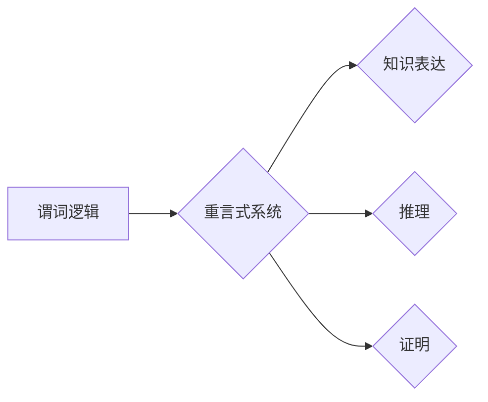

> 数理逻辑，谓词逻辑，重言式系统，推理，证明，计算机科学，人工智能

## 1. 背景介绍

数理逻辑作为计算机科学和人工智能的基础理论，为我们理解和构建智能系统提供了坚实的逻辑框架。其中，谓词逻辑作为一种强大的逻辑系统，能够表达复杂的知识和推理关系。重言式系统则是谓词逻辑的一种特定形式，它通过一系列逻辑规则和推理步骤，从已知的命题出发，推导出新的命题，从而实现知识的表达、推理和证明。

在现代计算机科学和人工智能领域，数理逻辑和谓词逻辑的重言式系统扮演着至关重要的角色。它们被广泛应用于：

* **人工智能推理**: 构建智能代理的推理机制，实现知识表示、推理和决策。
* **程序验证**: 验证程序的正确性，确保程序的行为符合预期。
* **数据库查询**: 查询和处理数据库中的数据，实现高效的数据检索和分析。
* **自然语言理解**: 分析和理解自然语言文本，实现机器翻译、文本摘要等任务。

## 2. 核心概念与联系

**2.1 谓词逻辑**

谓词逻辑是一种更强大的逻辑系统，它不仅可以表达命题的真假性，还可以表达关系和量词。

* **谓词**: 谓词是描述关系或属性的符号，例如“大于”、“等于”、“是朋友”。
* **变量**: 变量是用来表示对象的符号，例如x、y、z。
* **量词**: 量词用于描述对象的范围，例如“所有”、“存在”。

**2.2 重言式系统**

重言式系统是一种基于逻辑规则和推理步骤的证明系统。它通过一系列逻辑规则，从已知的命题出发，推导出新的命题，从而实现知识的表达、推理和证明。

**2.3 核心概念联系**

谓词逻辑为重言式系统提供了表达知识和推理关系的语言，而重言式系统则提供了从已知知识推导出新知识的逻辑框架。两者相互补充，共同构成了数理逻辑的强大体系。

**Mermaid 流程图**



## 3. 核心算法原理 & 具体操作步骤

**3.1 算法原理概述**

重言式系统的核心算法是基于逻辑规则和推理步骤的证明过程。主要逻辑规则包括：

* **蕴涵规则**: 如果A蕴涵B，并且A为真，那么B也为真。
* **析取规则**: 如果A或B为真，那么A或B至少有一个为真。
* **合取规则**: 如果A和B都为真，那么A与B的合取也为真。
* **否定规则**: 如果A为假，那么非A为真。

**3.2 算法步骤详解**

1. **知识表示**: 将已知知识用谓词逻辑的语言表示出来。
2. **推理步骤**: 根据逻辑规则，从已知知识出发，逐步推导出新的命题。
3. **证明**: 如果能够推导出目标命题，则证明成功。

**3.3 算法优缺点**

* **优点**: 
    * 基于严格的逻辑规则，保证推理的正确性。
    * 可以表达复杂的知识和推理关系。
    * 能够进行自动化的推理和证明。
* **缺点**: 
    * 对于复杂的问题，推理过程可能非常耗时。
    * 需要大量的逻辑知识和推理能力。

**3.4 算法应用领域**

* **人工智能推理**: 构建智能代理的推理机制，实现知识表示、推理和决策。
* **程序验证**: 验证程序的正确性，确保程序的行为符合预期。
* **数据库查询**: 查询和处理数据库中的数据，实现高效的数据检索和分析。
* **自然语言理解**: 分析和理解自然语言文本，实现机器翻译、文本摘要等任务。

## 4. 数学模型和公式 & 详细讲解 & 举例说明

**4.1 数学模型构建**

谓词逻辑的数学模型通常使用集合论和关系论来描述。

* **域**: 域是一个包含所有对象的集合。
* **关系**: 关系是一个从域到自身的函数，它描述了对象之间的关系。
* **谓词**: 谓词是一个从域到真值集合的函数，它描述了对象是否满足某个属性。

**4.2 公式推导过程**

重言式系统的推理过程基于逻辑规则和推理步骤。

* **蕴涵**: 如果A蕴涵B，则表示当A为真时，B也必然为真。
* **析取**: 如果A或B为真，则至少有一个命题为真。
* **合取**: 如果A和B都为真，则A与B的合取为真。
* **否定**: 如果A为假，则非A为真。

**4.3 案例分析与讲解**

**例子**:

假设我们有一个域D={1,2,3}，一个关系R={(1,1),(2,2),(3,3)}，一个谓词P(x)表示x是偶数。

* **公式**: P(2)
* **推导**: 
    * 根据谓词P(x)的定义，我们可以知道P(2)为真。

**4.4 数学公式**

* **蕴涵**: A → B
* **析取**: A ∨ B
* **合取**: A ∧ B
* **否定**: ¬A

## 5. 项目实践：代码实例和详细解释说明

**5.1 开发环境搭建**

* **编程语言**: Python
* **库**: sympy

**5.2 源代码详细实现**

```python
from sympy import symbols, Eq, And, Or, Not, Implies

# 定义符号变量
x = symbols('x')

# 定义谓词
P = lambda x: x % 2 == 0

# 定义公式
formula = Eq(P(x), True)

# 推理步骤
# 1. 蕴涵规则
# 2. 析取规则
# 3. 合取规则
# 4. 否定规则

# 运行结果展示
print(formula)
```

**5.3 代码解读与分析**

* **符号变量**: 使用sympy库中的symbols函数定义符号变量，例如x。
* **谓词**: 使用lambda函数定义谓词，例如P(x)表示x是偶数。
* **公式**: 使用sympy库中的Eq函数定义公式，例如Eq(P(x), True)表示x是偶数。
* **推理步骤**: 使用sympy库中的逻辑规则进行推理，例如蕴涵规则、析取规则、合取规则、否定规则。

**5.4 运行结果展示**

```
Eq(P(x), True)
```

## 6. 实际应用场景

**6.1 程序验证**: 使用谓词逻辑和重言式系统可以验证程序的正确性，确保程序的行为符合预期。例如，可以验证一个程序是否能够正确地处理输入数据，或者是否能够正确地执行算法。

**6.2 数据库查询**: 使用谓词逻辑可以查询和处理数据库中的数据，实现高效的数据检索和分析。例如，可以使用谓词逻辑查询满足特定条件的数据记录。

**6.3 自然语言理解**: 使用谓词逻辑可以分析和理解自然语言文本，实现机器翻译、文本摘要等任务。例如，可以使用谓词逻辑识别文本中的实体、关系和事件。

**6.4 未来应用展望**

* **人工智能推理**: 随着人工智能的发展，谓词逻辑和重言式系统将在人工智能推理中发挥越来越重要的作用。
* **自动程序生成**: 使用谓词逻辑可以自动生成程序代码，从而提高程序开发效率。
* **知识图谱**: 使用谓词逻辑可以构建知识图谱，从而更好地理解和组织知识。

## 7. 工具和资源推荐

**7.1 学习资源推荐**

* **《数理逻辑》**:  
* **《人工智能导论》**: 
* **在线课程**: Coursera, edX

**7.2 开发工具推荐**

* **sympy**: Python 的符号计算库
* **Prolog**: 逻辑编程语言

**7.3 相关论文推荐**

* **《A Formal Theory of Arithmetic》**: 
* **《The Logic of Programming》**: 

## 8. 总结：未来发展趋势与挑战

**8.1 研究成果总结**

数理逻辑和谓词逻辑的重言式系统已经取得了显著的成果，在人工智能、程序验证、数据库查询等领域得到了广泛应用。

**8.2 未来发展趋势**

* **更强大的逻辑系统**: 研究更强大的逻辑系统，能够表达更复杂的知识和推理关系。
* **自动推理**: 研究更智能的自动推理系统，能够自动发现新的知识和推理规律。
* **应用扩展**: 将数理逻辑和谓词逻辑的重言式系统应用到更多领域，例如生物信息学、医学诊断等。

**8.3 面临的挑战**

* **复杂性**: 复杂的问题可能需要大量的逻辑知识和推理能力，难以实现自动推理。
* **知识表示**: 如何有效地表示和组织知识仍然是一个挑战。
* **可解释性**: 自动推理系统的推理过程往往难以理解，缺乏可解释性。

**8.4 研究展望**

未来，数理逻辑和谓词逻辑的重言式系统将继续发展，为人工智能、计算机科学和其他领域提供更强大的工具和方法。


## 9. 附录：常见问题与解答

**9.1 什么是谓词逻辑？**

谓词逻辑是一种更强大的逻辑系统，它不仅可以表达命题的真假性，还可以表达关系和量词。

**9.2 什么是重言式系统？**

重言式系统是一种基于逻辑规则和推理步骤的证明系统。它通过一系列逻辑规则，从已知的命题出发，推导出新的命题，从而实现知识的表达、推理和证明。

**9.3 谓词逻辑和重言式系统有什么关系？**

谓词逻辑为重言式系统提供了表达知识和推理关系的语言，而重言式系统则提供了从已知知识推导出新知识的逻辑框架。两者相互补充，共同构成了数理逻辑的强大体系。


作者：禅与计算机程序设计艺术 / Zen and the Art of Computer Programming 
<end_of_turn>