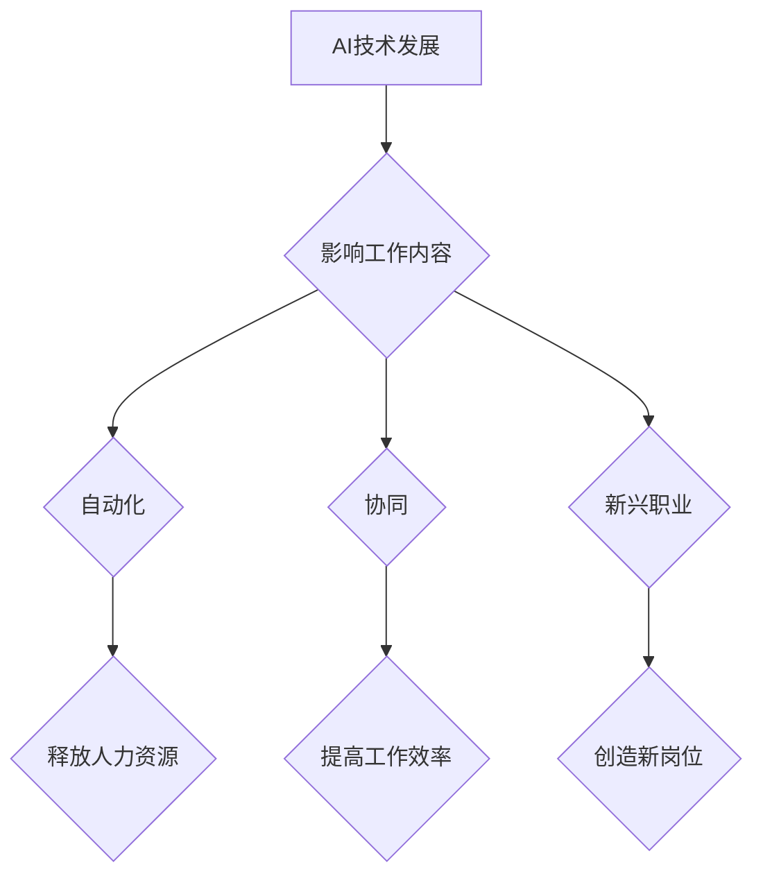

> 人工智能，未来工作，自动化，协同工作，职业转型，数字技能，伦理问题

## 1. 背景介绍

随着人工智能（AI）技术的飞速发展，其在各个领域的应用日益广泛，深刻地改变着人们的生活方式和工作模式。从自动驾驶汽车到智能客服系统，从个性化推荐算法到医疗诊断辅助，AI正在无处不在地改变着我们的世界。

然而，AI的发展也引发了人们对未来工作形态的担忧。一些人担心AI将取代人类工作，导致大量失业。事实上，AI带来的影响是多方面的，既有挑战也有机遇。

## 2. 核心概念与联系

**2.1 人工智能 (AI)**

人工智能是指模拟人类智能行为的计算机系统。它涵盖了多种技术，例如机器学习、深度学习、自然语言处理和计算机视觉等。

**2.2 未来工作形态**

未来工作形态是指在AI技术发展和社会变革的影响下，工作方式、工作内容和工作环境可能出现的变化。

**2.3 AI与未来工作形态的关系**

AI技术将深刻地影响未来工作形态，主要体现在以下几个方面：

* **自动化:** AI可以自动化许多重复性、规则性工作，释放人类劳动力的生产力。
* **协同:** AI可以作为人类的助手，帮助人类完成更复杂、更智能的工作。
* **新兴职业:** AI的发展将催生新的职业和工作岗位，例如AI工程师、数据科学家、AI伦理学家等。

**2.4  AI与未来工作形态的交互关系**



## 3. 核心算法原理 & 具体操作步骤

**3.1 算法原理概述**

深度学习是AI领域的重要分支，其核心算法是多层神经网络。神经网络模仿了人脑的结构和功能，通过层层叠加的神经元，学习数据中的复杂模式和关系。

**3.2 算法步骤详解**

1. **数据预处理:** 将原始数据进行清洗、转换和格式化，使其适合深度学习模型的训练。
2. **模型构建:** 设计多层神经网络结构，包括输入层、隐藏层和输出层。
3. **参数初始化:** 为神经网络中的每个参数赋予初始值。
4. **前向传播:** 将输入数据通过神经网络传递，计算输出结果。
5. **反向传播:** 计算输出结果与真实值的误差，并根据误差调整神经网络的参数。
6. **迭代训练:** 重复前向传播和反向传播的过程，直到模型的性能达到预期的水平。

**3.3 算法优缺点**

**优点:**

* 能够学习复杂的数据模式。
* 具有强大的泛化能力，可以应用于不同的领域。

**缺点:**

* 需要大量的训练数据。
* 训练过程耗时且计算资源消耗大。
* 模型解释性较差，难以理解模型的决策过程。

**3.4 算法应用领域**

* **图像识别:** 人脸识别、物体检测、图像分类等。
* **自然语言处理:** 语义分析、机器翻译、文本生成等。
* **语音识别:** 语音转文本、语音助手等。
* **医疗诊断:** 疾病预测、影像分析等。

## 4. 数学模型和公式 & 详细讲解 & 举例说明

**4.1 数学模型构建**

深度学习模型可以看作是一个复杂的数学函数，其输入是数据，输出是预测结果。

**4.2 公式推导过程**

深度学习模型的训练过程本质上是一个优化问题，目标是找到模型参数，使得模型的预测结果与真实值之间的误差最小。常用的优化算法包括梯度下降法和其变种算法。

**4.3 案例分析与讲解**

例如，在图像分类任务中，深度学习模型的输出是一个概率分布，表示图像属于不同类别 的概率。

假设模型输出的概率分布为：

```latex
P(class1|image) = 0.7, P(class2|image) = 0.2, P(class3|image) = 0.1
```

其中，`class1`、`class2`、`class3`分别代表三种类别。

模型预测图像属于`class1`的概率最高，因此模型将图像分类为`class1`。

## 5. 项目实践：代码实例和详细解释说明

**5.1 开发环境搭建**

使用Python语言和深度学习框架TensorFlow或PyTorch搭建开发环境。

**5.2 源代码详细实现**

```python
import tensorflow as tf

# 定义模型结构
model = tf.keras.models.Sequential([
    tf.keras.layers.Conv2D(32, (3, 3), activation='relu', input_shape=(28, 28, 1)),
    tf.keras.layers.MaxPooling2D((2, 2)),
    tf.keras.layers.Conv2D(64, (3, 3), activation='relu'),
    tf.keras.layers.MaxPooling2D((2, 2)),
    tf.keras.layers.Flatten(),
    tf.keras.layers.Dense(10, activation='softmax')
])

# 编译模型
model.compile(optimizer='adam',
              loss='sparse_categorical_crossentropy',
              metrics=['accuracy'])

# 训练模型
model.fit(x_train, y_train, epochs=10)

# 评估模型
loss, accuracy = model.evaluate(x_test, y_test)
print('Test loss:', loss)
print('Test accuracy:', accuracy)
```

**5.3 代码解读与分析**

这段代码定义了一个简单的卷积神经网络模型，用于手写数字识别任务。

* `tf.keras.models.Sequential` 创建了一个顺序模型，层级结构清晰。
* `tf.keras.layers.Conv2D` 定义卷积层，用于提取图像特征。
* `tf.keras.layers.MaxPooling2D` 定义最大池化层，用于降维和提高模型鲁棒性。
* `tf.keras.layers.Flatten` 将多维特征转换为一维向量。
* `tf.keras.layers.Dense` 定义全连接层，用于分类。
* `model.compile` 编译模型，指定优化器、损失函数和评价指标。
* `model.fit` 训练模型，使用训练数据进行迭代训练。
* `model.evaluate` 评估模型，使用测试数据计算损失和准确率。

**5.4 运行结果展示**

训练完成后，模型可以用于预测新的手写数字图像的类别。

## 6. 实际应用场景

**6.1 自动化办公**

AI可以自动化许多办公任务，例如邮件分类、日程安排、文档处理等，提高工作效率。

**6.2 个性化服务**

AI可以根据用户的喜好和需求提供个性化服务，例如推荐产品、提供定制化内容等。

**6.3 智能制造**

AI可以应用于智能制造领域，例如预测设备故障、优化生产流程等，提高生产效率和产品质量。

**6.4 医疗保健**

AI可以辅助医生进行诊断、治疗方案制定等，提高医疗服务质量。

**6.5 教育培训**

AI可以提供个性化学习方案、智能辅导等，提高教育效率。

**6.6 未来应用展望**

随着AI技术的不断发展，其应用场景将更加广泛，例如自动驾驶、机器人、虚拟现实等领域。

## 7. 工具和资源推荐

**7.1 学习资源推荐**

* **在线课程:** Coursera、edX、Udacity等平台提供丰富的AI课程。
* **书籍:** 《深度学习》、《机器学习实战》等书籍。
* **开源项目:** TensorFlow、PyTorch等开源深度学习框架。

**7.2 开发工具推荐**

* **Python:** AI开发的主要编程语言。
* **TensorFlow:** Google开发的开源深度学习框架。
* **PyTorch:** Facebook开发的开源深度学习框架。

**7.3 相关论文推荐**

* **《ImageNet Classification with Deep Convolutional Neural Networks》**
* **《Attention Is All You Need》**
* **《BERT: Pre-training of Deep Bidirectional Transformers for Language Understanding》**

## 8. 总结：未来发展趋势与挑战

**8.1 研究成果总结**

近年来，AI技术取得了显著进展，在图像识别、自然语言处理、语音识别等领域取得了突破性成果。

**8.2 未来发展趋势**

* **模型规模和能力的提升:** 未来AI模型将更加强大，能够处理更复杂的任务。
* **边缘计算和分布式训练:** AI模型将部署到边缘设备，并利用分布式训练技术提高训练效率。
* **跨模态学习:** AI模型将能够处理多种数据类型，例如文本、图像、音频等。
* **可解释性增强:** 研究人员将致力于提高AI模型的可解释性，使其决策过程更加透明。

**8.3 面临的挑战**

* **数据安全和隐私保护:** AI模型的训练需要大量数据，如何保证数据安全和隐私保护是一个重要挑战。
* **算法偏见和公平性:** AI模型可能存在算法偏见，导致不公平的结果。
* **伦理问题:** AI技术的应用引发了伦理问题，例如人工智能的责任和义务、人工智能的控制等。

**8.4 研究展望**

未来，AI研究将继续朝着更安全、更可靠、更智能的方向发展。

## 9. 附录：常见问题与解答

**9.1 如何学习AI技术？**

可以学习在线课程、阅读书籍、参与开源项目等。

**9.2 如何选择合适的AI工具？**

需要根据具体应用场景和需求选择合适的工具。

**9.3 AI技术会取代人类工作吗？**

AI技术会改变工作方式，但不会完全取代人类工作。


作者：禅与计算机程序设计艺术 / Zen and the Art of Computer Programming 
<end_of_turn>