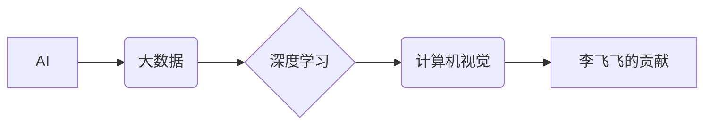

> 李飞飞, AI, 大数据, 图像识别, 深度学习, 计算机视觉,斯坦福大学, AI伦理

## 1. 背景介绍

人工智能（AI）正以惊人的速度发展，深刻地改变着我们生活的方方面面。在这个蓬勃发展的领域中，李飞飞教授作为斯坦福大学计算机科学系教授和人工智能实验室主任，凭借其卓越的学术成就和对AI伦理的深刻思考，成为了AI领域最具影响力的领军人物之一。

李飞飞教授的研究重点集中在计算机视觉和机器学习领域，特别是深度学习的应用。她领导的团队在图像识别、物体检测、场景理解等方面取得了突破性的进展，为推动AI技术的发展做出了巨大贡献。

## 2. 核心概念与联系

### 2.1  AI与大数据

人工智能（AI）是指模拟人类智能行为的计算机系统。而大数据则是指海量、高速、多样化的数据。AI的发展离不开大数据的支撑，大数据为AI算法提供了训练和学习的素材，而AI算法则能够从大数据中挖掘出隐藏的价值。

### 2.2  深度学习与计算机视觉

深度学习是机器学习的一种重要分支，它利用多层神经网络来模拟人类大脑的学习过程。深度学习在图像识别、语音识别、自然语言处理等领域取得了显著的成果。计算机视觉则是利用计算机技术处理和理解图像和视频信息，它与深度学习有着密切的联系。

### 2.3  李飞飞的贡献

李飞飞教授在AI和计算机视觉领域做出了杰出的贡献，她领导的团队开发了多种先进的深度学习算法，并在图像识别、物体检测、场景理解等方面取得了突破性的进展。她的研究成果被广泛应用于自动驾驶、医疗诊断、安防监控等领域。

**核心概念与联系流程图**



## 3. 核心算法原理 & 具体操作步骤

### 3.1  算法原理概述

李飞飞教授的研究团队开发了许多先进的深度学习算法，其中包括卷积神经网络（CNN）、循环神经网络（RNN）和生成对抗网络（GAN）。这些算法能够从图像数据中学习特征，并进行图像识别、物体检测、场景理解等任务。

### 3.2  算法步骤详解

以卷积神经网络（CNN）为例，其基本步骤如下：

1. **数据预处理:** 将图像数据转换为数字格式，并进行归一化处理。
2. **卷积层:** 使用卷积核对图像数据进行卷积运算，提取图像特征。
3. **池化层:** 对卷积层的输出进行池化操作，减少数据维度，提高计算效率。
4. **全连接层:** 将池化层的输出连接到全连接层，进行分类或回归任务。
5. **输出层:** 输出最终的分类结果或预测值。

### 3.3  算法优缺点

**优点:**

* 能够自动学习图像特征，无需人工特征工程。
* 性能优于传统图像识别算法。
* 可应用于多种图像识别任务。

**缺点:**

* 训练数据量大，计算资源消耗高。
* 对数据噪声敏感。
* 可解释性较差。

### 3.4  算法应用领域

CNN算法广泛应用于图像识别、物体检测、场景理解、人脸识别、医疗诊断等领域。

## 4. 数学模型和公式 & 详细讲解 & 举例说明

### 4.1  数学模型构建

深度学习模型通常由多个神经网络层组成，每一层都包含多个神经元。每个神经元接收来自上一层的输入信号，并通过激活函数进行处理，输出到下一层。

**激活函数:** 激活函数是神经网络中一个重要的组成部分，它决定了神经元的输出值。常见的激活函数包括 sigmoid 函数、ReLU 函数、tanh 函数等。

**损失函数:** 损失函数用于衡量模型预测结果与真实值的差异。常用的损失函数包括均方误差（MSE）、交叉熵损失（Cross-Entropy Loss）等。

### 4.2  公式推导过程

深度学习模型的训练过程是一个优化过程，目标是找到最优的模型参数，使得模型的损失函数最小化。常用的优化算法包括梯度下降法、Adam 算法等。

**梯度下降法:** 梯度下降法是一种迭代优化算法，它通过计算损失函数的梯度，不断更新模型参数，使得损失函数逐渐减小。

### 4.3  案例分析与讲解

以图像分类为例，假设我们有一个包含10个类别的图像数据集。训练一个CNN模型，目标是让模型能够准确地识别图像的类别。

训练过程如下：

1. 将图像数据分为训练集和测试集。
2. 将训练集数据输入到CNN模型中，计算模型的损失函数值。
3. 使用梯度下降法计算损失函数的梯度，并根据梯度更新模型参数。
4. 重复步骤2和3，直到模型的损失函数值达到预设的阈值。
5. 使用测试集数据评估模型的性能。

## 5. 项目实践：代码实例和详细解释说明

### 5.1  开发环境搭建

深度学习模型的开发通常需要使用Python语言和相关的深度学习框架，例如TensorFlow、PyTorch等。

### 5.2  源代码详细实现

以下是一个使用TensorFlow框架实现图像分类的简单代码示例：

```python
import tensorflow as tf

# 定义模型结构
model = tf.keras.models.Sequential([
    tf.keras.layers.Conv2D(32, (3, 3), activation='relu', input_shape=(28, 28, 1)),
    tf.keras.layers.MaxPooling2D((2, 2)),
    tf.keras.layers.Conv2D(64, (3, 3), activation='relu'),
    tf.keras.layers.MaxPooling2D((2, 2)),
    tf.keras.layers.Flatten(),
    tf.keras.layers.Dense(10, activation='softmax')
])

# 编译模型
model.compile(optimizer='adam',
              loss='sparse_categorical_crossentropy',
              metrics=['accuracy'])

# 训练模型
model.fit(x_train, y_train, epochs=5)

# 评估模型
loss, accuracy = model.evaluate(x_test, y_test)
print('Test loss:', loss)
print('Test accuracy:', accuracy)
```

### 5.3  代码解读与分析

这段代码定义了一个简单的CNN模型，用于图像分类任务。模型包含两层卷积层、两层池化层、一层全连接层和一层输出层。

### 5.4  运行结果展示

训练完成后，可以使用测试集数据评估模型的性能。模型的准确率通常会达到较高的水平。

## 6. 实际应用场景

### 6.1  自动驾驶

深度学习算法在自动驾驶领域发挥着重要作用，例如：

* **目标检测:** 识别道路上的车辆、行人、交通信号灯等物体。
* **路径规划:** 根据周围环境规划行驶路线。
* **驾驶决策:** 根据传感器数据和环境信息做出驾驶决策。

### 6.2  医疗诊断

深度学习算法在医疗诊断领域也有着广泛的应用，例如：

* **图像分析:** 分析X光片、CT扫描图像等，辅助医生诊断疾病。
* **病理学诊断:** 分析病理切片图像，辅助医生诊断癌症等疾病。
* **药物研发:** 预测药物的疗效和副作用。

### 6.3  安防监控

深度学习算法在安防监控领域可以用于：

* **人脸识别:** 识别和跟踪特定人员。
* **行为分析:** 分析人员的行为模式，识别异常行为。
* **入侵检测:** 检测入侵者并发出警报。

### 6.4  未来应用展望

随着深度学习技术的不断发展，其应用场景将会更加广泛，例如：

* **个性化教育:** 根据学生的学习情况提供个性化的学习方案。
* **智能客服:** 利用自然语言处理技术，提供更加智能的客服服务。
* **金融风险控制:** 利用机器学习算法，识别和控制金融风险。

## 7. 工具和资源推荐

### 7.1  学习资源推荐

* **斯坦福大学CS231n课程:** https://cs231n.stanford.edu/
* **Deep Learning Specialization (Coursera):** https://www.coursera.org/specializations/deep-learning
* **TensorFlow官方文档:** https://www.tensorflow.org/

### 7.2  开发工具推荐

* **TensorFlow:** https://www.tensorflow.org/
* **PyTorch:** https://pytorch.org/
* **Keras:** https://keras.io/

### 7.3  相关论文推荐

* **AlexNet:** http://papers.nips.cc/paper/4824-imagenet-classification-with-deep-convolutional-neural-networks.pdf
* **VGGNet:** http://arxiv.org/abs/1409.1556
* **ResNet:** http://arxiv.org/abs/1512.03385

## 8. 总结：未来发展趋势与挑战

### 8.1  研究成果总结

李飞飞教授的研究成果对AI和计算机视觉领域做出了重大贡献，推动了深度学习技术的进步，并为其在实际应用中的推广提供了理论基础和技术支撑。

### 8.2  未来发展趋势

未来，AI技术将会继续发展，深度学习算法将会更加强大，应用场景将会更加广泛。

### 8.3  面临的挑战

AI技术的发展也面临着一些挑战，例如：

* **数据隐私和安全:** AI算法的训练需要大量数据，如何保护数据隐私和安全是一个重要的挑战。
* **算法可解释性:** 深度学习算法的决策过程往往难以理解，如何提高算法的可解释性是一个重要的研究方向。
* **AI伦理:** AI技术的应用可能会带来一些伦理问题，例如算法偏见、工作岗位替代等，需要认真思考和解决。

### 8.4  研究展望

未来，我们需要继续加强对AI技术的研发和应用，同时也要关注AI技术的伦理问题，确保AI技术能够造福人类。

## 9. 附录：常见问题与解答

### 9.1  Q1: 深度学习算法的训练需要多少数据？

**A1:** 深度学习算法的训练数据量取决于具体的任务和模型复杂度。一般来说，需要大量的训练数据才能达到较好的性能。

### 9.2  Q2: 深度学习算法的训练时间有多长？

**A2:** 深度学习算法的训练时间也取决于具体的任务和模型复杂度，以及硬件资源的配置。训练时间可以从几分钟到几天甚至几周不等。

### 9.3  Q3: 深度学习算法的应用领域有哪些？

**A3:** 深度学习算法的应用领域非常广泛，包括图像识别、语音识别、自然语言处理、自动驾驶、医疗诊断、金融风险控制等。

作者：禅与计算机程序设计艺术 / Zen and the Art of Computer Programming


<end_of_turn>